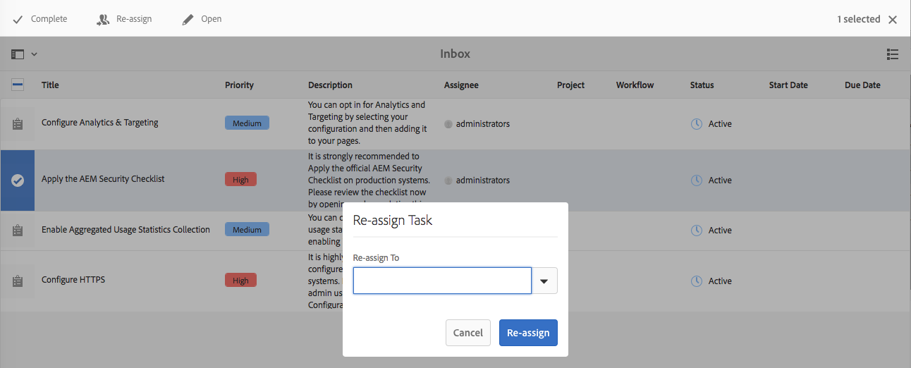

# 您的收件箱{#your-inbox}

您可以接收来自 AEM 各个区域的通知，包括工作流和项目；例如，这些通知与以下各项有关：

* 任务：

   * 这些任务也可以在 AEM UI 的不同位置创建，例如在&#x200B;**项目**&#x200B;下创建；
   * 这些任务可以是&#x200B;**创建任务**&#x200B;工作流或&#x200B;**创建项目任务**&#x200B;步骤的产物。

* 工作流：

   * 表示您需要对页面内容执行的操作的工作项；

      * 这些项目是工作流&#x200B;**参与者**&#x200B;步骤的产物
   * 失败项目，允许管理员重试失败的步骤。

您可以在自己的收件箱中接收这些通知，以便查看并采取相应操作。

>[!NOTE]
>
>AEM 预先加载了一些分配给管理员用户组的现成管理任务。有关详细信息，请参阅[现成的管理任务](#out-of-the-box-administrative-tasks)。

>[!NOTE]
>
>有关这些项目类型的更多信息，另请参阅：
>
>* [项目](/help/sites-authoring/touch-ui-managing-projects.md)
>* [项目 - 处理任务](/help/sites-authoring/task-content.md)
>* [工作流](/help/sites-authoring/workflows.md)
>* [表单](/help/forms/home.md)
>

## 标题中的收件箱 {#inbox-in-the-header}

任何控制台的标题中都会显示收件箱中的当前项目数。还可以打开指示器以快速访问需要执行操作的页面或访问收件箱：

>[!NOTE]
>
>某些操作也将显示在[相应资源的卡片视图](/help/sites-authoring/basic-handling.md#card-view)中。

## 现成的管理任务  {#out-of-the-box-administrative-tasks}

AEM 预先加载了四项分配给管理员用户组的现成任务。

* [配置分析和定位](/help/sites-administering/opt-in.md)
* [应用 AEM 安全核对清单](/help/sites-administering/security-checklist.md)
* 收集汇总的使用情况统计数据
* [配置 HTTPS](/help/sites-administering/ssl-by-default.md)

## 打开收件箱 {#opening-the-inbox}

打开 AEM 通知收件箱：

1. 单击/点按工具栏中的指示器。

1. 选择&#x200B;**查看全部**。此时将打开 **AEM 收件箱**。收件箱会显示工作流、项目和任务中的项目。
1. 默认视图为“列 [表视图](#inbox-list-view)”，但您也可以切换到“日历 [视图”](#inbox-calendar-view)。 这是通过视图选择器（工具栏，右上方）完成的。

   对于这两个视图，您还可以定义[视图设置](#inbox-view-settings)；可用选项取决于当前视图。

   

>[!NOTE]
>
>收件箱作为控制台运行，因此当您完成操作后，可使用[全局导航](/help/sites-authoring/basic-handling.md#global-navigation)或[搜索](/help/sites-authoring/search.md)导航到其他位置。

### 收件箱 - 列表视图 {#inbox-list-view}

该视图可列出所有项目以及重要相关信息：

### 收件箱 - 日历视图 {#inbox-calendar-view}

该视图可根据项目在日历中的位置以及您选择的精确视图来显示这些项目：

您可以：

* 选择一个具体视图：**时间轴**、**列**、**列表**

* 根据&#x200B;**计划**&#x200B;指定要显示的任务：**全部**、**已计划**、**进行中**、**即将到期**、**已过期**

* 向下展开以深入了解项目的更多详细信息
* 选择日期范围以集中显示视图：

### Inbox - Settings {#inbox-view-settings}

对于这两个视图（列表和日历），您可以定义设置：

* **日历视图**

   对于&#x200B;**日历视图**，您可以配置：

   * **分组依据**
   * **计划**&#x200B;或&#x200B;**无**
   * **卡片大小**
   

* **列表视图**

   对于&#x200B;**列表视图**，您可以配置排序机制：

   * **排序字段**
   * **排序顺序**
   

### 收件箱——管理员控制 {#inbox-admin-control}

“管理员控制”选项使管理员能够：

* 自定义标题文本和徽标

* 控制标题中可用导航链接的显示

“管理控制”选项仅对管理员或工作流管理员组的成员可见。

* **品牌化自定义**

   * **自定义标题文本：** 指定要在标题中显示的文本以替换默认 **Adobe Experience Manager文本** 。

   * **自定义徽标：** 指定要在标题中显示为标志的图像。 在数字资产管理(DAM)中上传图像，并在字段中引用该图像。

* **用户导航**
   * **隐藏导航选项：** 选择此选项可隐藏标题中可用的导航选项。 导航选项包括指向其他解决方案的链接、帮助链接以及点击Adobe Experience Manager徽标或文本时可用的创作选项。
* **保存：** 点按／单击此选项以保存设置。

## 对某个项目执行操作 {#taking-action-on-an-item}

1. 要对某个项目执行操作，请选择相应项目的缩略图。工具栏中将显示适用于该项目的操作图标：

   

   这些操作适用于该项目，具体包括：

   * **完成**&#x200B;操作;例如，任务或工作流项。
   * **重新分配**/**委派**&#x200B;项目。
   * **打开**&#x200B;项目；根据项目类型，此操作可以：

      * 显示项目属性
      * 打开相应的功能板或向导以进一步执行操作
      * 打开相关文档
   * **回退**&#x200B;到上一步.
   * 查看工作流的有效负荷.
   * 从该项目创建一个项目.
   >[!NOTE]
   >
   >有关更多信息，请参阅：
   >
   >* 工作流项目 - [参与工作流](/help/sites-authoring/workflows-participating.md)

1. 根据所选项目，将会启动相应的操作；例如：

   * 将打开与操作对应的对话框。
   * 将启动操作向导。
   * 将打开文档页面。
   例如，**重新分配**&#x200B;操作将打开一个对话框：

   

   根据是否已打开对话框、向导和文档页面，您可以：

   * 确认相应的操作；例如重新分配。
   * 取消操作.
   * 返回箭头；例如，如果已打开操作向导或文档页面，您可以返回到收件箱。

## 创建任务 {#creating-a-task}

您可以从收件箱中创建任务：

1. 选择&#x200B;**创建**，然后选择&#x200B;**任务**。
1. 填写&#x200B;**基本**&#x200B;和&#x200B;**高级**&#x200B;选项卡中的必需字段；只有&#x200B;**标题**&#x200B;是必填项，所有其他字段都是可选的：

   * **基本**:

      * **标题**
      * **项目**
      * **被分派人**
      * **内容**；与“有效负荷”类似，这是从任务到存储库中的位置的引用
      * **描述**
      * **任务优先级**
      * **开始日期**
      * **到期日期**
   

   * **高级**

      * **名称**：这将用于组建 URL；如果留空，URL 将会基于&#x200B;**标题**。
   

1. 选择&#x200B;**提交**。

## 创建项目 {#creating-a-project}

对于某些任务，您可以创建一个基于该任务的[项目](/help/sites-authoring/projects.md)：

1. 通过点按/单击缩略图选择相应的任务。

   >[!NOTE]
   >
   >只有使用&#x200B;**收件箱**&#x200B;的&#x200B;**创建**&#x200B;选项创建的任务才能用于创建项目。
   >
   >不能使用工作项（来自工作流）创建项目。

1. 从工 **具栏中选择** “创建项目”以打开向导。
1. 选择相应的模板，然后选择&#x200B;**下一步**。
1. 指定所需属性：

   * **基本**

      * **标题**
      * **描述**
      * **开始日期**
      * **到期日期**
      * **用户**&#x200B;和角色
   * **高级**

      * **名称**
   >[!NOTE]
   >
   >有关完整信息，请参阅[创建项目](/help/sites-authoring/touch-ui-managing-projects.md#creating-a-project)。

1. 选择&#x200B;**创建**&#x200B;以确认操作。

## 筛选“AEM 收件箱”中的项目 {#filtering-items-in-the-aem-inbox}

您可以筛选列出的项目：

1. 打开 **AEM 收件箱**。

1. 打开筛选器选择器：

   

1. 您可以根据一系列条件筛选所列项目，其中许多条件可以进行细化；例如：

   

   >[!NOTE]
   >
   >通过[视图设置](#inbox-view-settings)，您还可以在使用[列表视图](#inbox-list-view)时配置排序顺序。

