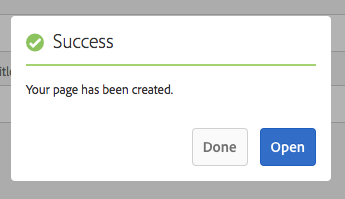

# 创建和组织页面 {#creating-and-organizing-pages}

此部分介绍如何使用 Adobe Experience Manager (AEM) 创建和管理页面，以便您随后能够在这些页面上[创建内容](/help/sites-authoring/editing-content.md)。

>[!NOTE]
>
>要在页面上执行创建、复制、移动、编辑和删除等操作，您的帐户需要拥有[适当的访问权利](/help/sites-administering/security.md)和[权限](/help/sites-administering/security.md#permissions)。
>
>如果您遇到任何问题，我们建议您与系统管理员联系。

>[!NOTE]
>
>可以使用“网站”控制台中的许多[键盘快捷键](/help/sites-authoring/keyboard-shortcuts.md)来更有效地组织页面。

## 组织您的网站 {#organizing-your-website}

作为作者，您需要在 AEM 内组织您的网站。这包括创建和命名您的内容页面，因此：

* 您可以轻松地在创作环境中找到这些页面
* 您站点的访客可以方便地在发布环境中浏览这些页面

您还可以使用[文件夹](#creating-a-new-folder)来帮助组织内容。

网站结构可以被视为包含内容页面的树结构。这些内容页面的名称用于组成 URL，而标题则会在查看页面内容时显示出来。

下面显示了We.Retail网站上的一个示例，在该网站中， `desert-sky-shorts`)已访问：

* 创作环境
   `https://localhost:4502/editor.html/content/we-retail/us/en/products/equipment/hiking/desert-sky-shorts.html`

* 发布环境
   `https://localhost:4503/content/we-retail/us/en/products/equipment/hiking/desert-sky-shorts.html`

根据实例的配置，使用 `/content` 在发布环境中可能是可选的。

```xml
 /content
 /we-retail
  /us
   /en
    /products
     /equipment
      /hiking
       /desert-sky-shorts
       /hiking-poles
       /...
      /running...
      /surfing...
      /...
     /seasonal...
     /...
    /about-us
    /experience
    /...
   /es...
  /de...
  /fr...
  /...
 /...
```

此结构可以从&#x200B;**站点**&#x200B;控制台中查看，您可以在此控制台中[导航浏览网站的各个页面](/help/sites-authoring/basic-handling.md#navigating)，并对页面执行一些操作。您还可以创建新站点和[新页面](#creating-a-new-page)。

无论在什么位置，您都可以在标题栏的痕迹导航中看到上级分支：


### 页面命名惯例 {#page-naming-conventions}

在创建新页面时，需填写以下两个关键字段：

* **[标题](#title)**：

   * 它会在控制台中向用户显示并在编辑中的页面内容顶部显示。
   * 此字段为必填字段。

* **[名称](#name)**：

   * 用于生成 URI。
   * 此字段的用户输入是可选的。如果未指定，名称会从标题派生。请参阅以下部分[页面名称限制和最佳实践](/help/sites-authoring/managing-pages.md#page-name-restrictions-and-best-practices)，以获取详细信息。

#### 页面名称限制和最佳实践 {#page-name-restrictions-and-best-practices}

页面&#x200B;**标题**&#x200B;和&#x200B;**名称**&#x200B;可以单独创建，但相互关联：

* 在创建页面时，只有&#x200B;**标题**&#x200B;字段是必需字段。如果未在创建页面时提供任何&#x200B;**名称**，那么 AEM 将通过标题的前 64 个字符生成名称（观察下面列出的验证）。仅使用前 64 个字符是为了支持短页面名称的最佳实践。

* 如果作者手动指定了页面名称，则 64 字符限制不适用，但有关页面名称长度的其他技术限制可能适用。

>[!NOTE]
>
>在定义页面名称时，一个好的经验法则是保持页面名称简短，但尽可能表达到位且容易记忆，使读者容易理解。请参阅针对 `title` 元素的 [W3C 风格指南](https://www.w3.org/Provider/Style/TITLE.html)，以获取更多信息。
>
>另请注意，某些浏览器（例如旧版本的 IE）只能接受一定长度的 URL，因此还有技术原因需缩短页面名称。

创建新页面时，AEM [将依据 AEM 和 JCR 实行的惯例来验证页面名称](/help/sites-developing/naming-conventions.md)。

允许使用的字符最少包括：

* 从“a”到“z”
* 从“A”到“Z”
* 从“0”到“9”
* `_`（下划线）
* `-`（连字符/减号）

有关允许使用的所有字符的完整详细信息，请参阅[命名惯例](/help/sites-developing/naming-conventions.md)。

>[!NOTE]
>
>如果 AEM 在 [MongoMK 持久性管理器部署](/help/sites-deploying/recommended-deploys.md)上运行，则页面名称限制为 150 个字符。

#### 标题 {#title}

如果您在创建新页面时只提供一个页面&#x200B;**标题**，AEM 将从此字符串派生页面&#x200B;**名称**[，并依据 AEM 和 JCR 实行的惯例验证此名称](/help/sites-developing/naming-conventions.md)。虽然将接受包含无效字符的&#x200B;**标题**&#x200B;字段，但派生的名称会将无效的字符替换掉。例如：

| 标题 | 派生的名称 |
|---|---|
| Schön | schoen.html |
| SC%&amp;&#42;ç+ | sc---c-.html |

#### 名称 {#name}

如果您在创建新页面时提供页面&#x200B;**名称**，AEM 将依据 AEM 和 JCR 实行的惯例验证此名称。[](/help/sites-developing/naming-conventions.md)您在&#x200B;**名称**&#x200B;字段中无法提交无效的字符。AEM 检测到无效字符时，该字段将突出显示，并提供有说明性消息。


>[!NOTE]
>
>应避免使用 ISO-639-1 定义的双字母代码作为页面名称，除非该页面是语言根页面。
>
>请参阅[准备翻译内容](/help/sites-administering/tc-prep.md)以了解更多信息。

### 模板 {#templates}

在 AEM 中，模板可指定特定类型的页面。模板将作为要创建的任何新页面的基础。

模板可定义页面结构，包括缩略图和其他属性。例如，对于产品页面、Sitemap 和联系人信息，您可能有不同的模板。模板由[组件](#components)构成。

AEM 附带了一些现成的模板。可用模板取决于单个网站。关键的字段如下：

* **标题**
在生成的网页上显示的标题。

* **名称**
在命名页面时使用。

* **模板**
可在生成新页面时使用的模板列表。

>[!NOTE]
>
>如果在您的实例中进行配置，[模板作者可以通过模板编辑器创建模板](/help/sites-authoring/templates.md)。

### 组件 {#components}

组件是 AEM 提供的元素，因此您可以添加特定类型的内容。 AEM随附了一系列的 [现成组件](/help/sites-authoring/default-components-console.md) 提供全面的功能。这些功能包括：

* 文本
* 图像
* 幻灯片放映
* 视频
* 及许多其他组件

在创建并打开页面后，您可以[使用组件添加内容](/help/sites-authoring/editing-content.md#insertinganewparagraph)，这些组件可从[组件浏览器](/help/sites-authoring/author-environment-tools.md#componentbrowser)中获取。

>[!NOTE]
>
>[组件控制台](/help/sites-authoring/default-components-console.md)提供了有关实例中相关组件的概述。

## 管理页面 {#managing-pages}

### 创建新页面 {#creating-a-new-page}

除非已提前为您创建所有页面，否则必须先创建页面，然后才能开始创建内容：

1. 打开站点控制台(例如， [https://localhost:4502/sites.html/content](https://localhost:4502/sites.html/content))。
1. 导航到要创建新页面的位置。
1. 使用工具栏中的&#x200B;**创建**&#x200B;打开下拉选择器，然后从列表中选择&#x200B;**页**：

   

1. 在向导的第一步中，您可以执行以下操作之一：

   * 选择要用于创建新页面的模板，然后单击/点按&#x200B;**下一步**&#x200B;以继续。

   * 单击/点按&#x200B;**取消**&#x200B;可中止该过程。

   

1. 在向导的最后一步中，您可以执行以下操作之一：

   * 使用三个选项卡输入您希望对新页面指定的[页面属性](/help/sites-authoring/editing-page-properties.md)，然后单击/点按&#x200B;**创建**&#x200B;以实际创建页面。

   * 使用&#x200B;**返回**&#x200B;以返回到模板选择步骤。

   关键字段为：

   * **标题**：

      * 此字段将显示给用户，是必填字段。
   * **名称**：

      * 用于生成 URI。如果未指定，名称会从标题派生。
      * 如果您在创建新页面时提供页面&#x200B;**名称**[，AEM 将依据 AEM 和 JCR 实行的惯例验证此名称。](/help/sites-developing/naming-conventions.md)

      * 您在&#x200B;**名称**&#x200B;字段中&#x200B;**无法提交无效的字符**。当 AEM 检测到无效字符时，此字段将会突出显示，并出现一条说明性消息以指示需要删除/替换的字符。
   >[!NOTE]
   >
   >请参阅[页面命名惯例](#page-naming-conventions)。

   创建新页面至少需要提供&#x200B;**标题**&#x200B;信息。

   

1. 使用&#x200B;**创建**&#x200B;完成此过程并创建新页面。确认对话框将询问您是要立即&#x200B;**打开**&#x200B;该页面，还是返回控制台（**完成**）：

   

   >[!NOTE]
   >
   >如果您在创建页面时使用的名称在该位置已经存在，则系统将通过附加一个编号来自动生成该名称的变体。例如，如果 `winter` 已经存在，则新页面将变为 `winter0`。

1. 如果返回控制台，则会看到新页面：

   

>[!CAUTION]
>
>创建页面后，无法更改其模板 - 除非[使用新模板创建启动项](/help/sites-authoring/launches-creating.md#create-launch-with-new-template)，不过这样会丢失任何已存在的内容。

### 打开页面进行编辑 {#opening-a-page-for-editing}

创建页面或（在控制台中）导航到现有页面后，可以打开页面以对其进行编辑：

1. 打开&#x200B;**站点**&#x200B;控制台。
1. 导航直到您找到要编辑的页面为止。
1. 通过以下方式选择您的页面：

   * [快速操作](/help/sites-authoring/basic-handling.md#quick-actions)
   * [选择模式](/help/sites-authoring/basic-handling.md#navigatingandselectionmode)和工具栏

   然后，选择&#x200B;**编辑**&#x200B;图标：

   

1. 此时将打开页面，您可以根据需要[编辑页面](/help/sites-authoring/editing-content.md#touchoptimizedui)。

>[!NOTE]
>
>只有在“预览”模式下才能通过页面编辑器导航到其他页面，因为在“编辑”模式下，链接不处于活动状态。

### 复制和粘贴页面 {#copying-and-pasting-a-page}

您可以将页面及其所有子页面复制到一个新位置：

1. 在&#x200B;**站点**&#x200B;控制台中，导航直到您找到要复制的页面为止。
1. 通过以下方式选择您的页面：

   * [快速操作](/help/sites-authoring/basic-handling.md#quick-actions)
   * [选择模式](/help/sites-authoring/basic-handling.md#navigatingandselectionmode)和工具栏

   然后，选择&#x200B;**复制**&#x200B;页面图标：

   

   >[!NOTE]
   >
   >如果您处于选择模式，那么复制完页面后将自动退出。

1. 导航到页面的新副本所在的位置。
1. 通过正右侧的下拉箭头可显示&#x200B;**粘贴**&#x200B;图标：

   

   您可以：
   * 选择&#x200B;**粘贴**&#x200B;页面图标本身：将在此位置创建原始页面和任何子页面的副本。
   * 选择下拉箭头以显示&#x200B;**粘贴（不含子项）**&#x200B;选项。将在此位置创建原始页面的副本；不会复制子页面。

   >[!NOTE]
   >
   >如果您将页面复制到某个位置，而该位置已经存在名称与原始名称相同的页面，则系统将通过附加一个编号来自动生成该名称的变体。例如，如果 `winter` 已存在，则 `winter` 将变为 `winter1`。

### 移动或重命名页面 {#moving-or-renaming-a-page}

>[!NOTE]
>
>重命名页面也需遵循指定新页面名称时用到的[页面命名惯例](#page-naming-conventions)。

>[!NOTE]
>
>页面只能移动到允许使用该页面所基于的模板的位置。请参阅[模板可用性](/help/sites-developing/templates.md#template-availability)以了解更多信息。

移动或重命名页面的过程基本相同，都由同一个向导来处理。通过此向导，您可以：

* 重命名页面而不移动页面.
* 移动页面而不重命名页面.
* 同时移动和重命名页面.

AEM 还有一项功能是允许您对引用被重命名页面或被移动页面的所有内部链接进行更新。此操作非常灵活，可以一个页面一个页面地执行。

1. 导航直到您找到要移动的页面为止。
1. 通过以下方式选择您的页面：

   * [快速操作](/help/sites-authoring/basic-handling.md#quick-actions)
   * [选择模式](/help/sites-authoring/basic-handling.md#navigatingandselectionmode)和工具栏

   然后，选择&#x200B;**移动**&#x200B;页面图标：

   

   此操作将打开移动页面向导。

1. 在向导的&#x200B;**重命名**&#x200B;阶段，您可以执行以下任一操作：

   * 指定移动页面后您希望页面使用的名称，然后单击/点按&#x200B;**下一步**&#x200B;以继续。

   * 单击/点按&#x200B;**取消**&#x200B;可中止该过程。

   

   如果仅移动页面，则页面名称可以保持不变。

   >[!NOTE]
   >
   >如果您将页面移动到某个位置，而该位置已经存在具有相同名称的页面，则系统将通过附加一个编号来自动生成该名称的变体。例如，如果 `winter` 已存在，则 `winter` 将变为 `winter1`。

1. 在向导的&#x200B;**选择目标**&#x200B;阶段，您可以执行以下任一操作：

   * 使用[列视图](/help/sites-authoring/basic-handling.md#column-view)导航到页面的新位置：

      * 通过单击目标的缩略图选择目标。
      * 单击&#x200B;**下一步**&#x200B;以继续。
   * 使用&#x200B;**返回**&#x200B;以返回到页面名称指定步骤。

   >[!NOTE]
   >
   >默认情况下，将选择您正在移动/重命名的页面的父页面作为目标。

   

   >[!NOTE]
   >
   >如果您将页面移动到某个位置，而该位置已经存在具有相同名称的页面，则系统将通过附加一个编号来自动生成该名称的变体。例如，如果 `winter` 已存在，则 `winter` 将变为 `winter1`。

1. 如果页面已链接、已引用或者已发布，则详细信息将列出在&#x200B;**调整/重新发布**&#x200B;步骤中。

   您可以指明哪些页面应当相应地调整和/或重新发布。

   >[!NOTE]
   >
   >如果页面既未链接也未引用，则此步骤将不可用。

   

1. 选择&#x200B;**移动**&#x200B;将完成此过程并相应地移动/重命名页面。

>[!NOTE]
>
>如果页面已发布，则移动页面将自动取消发布。 默认情况下，页面将在移动完成后重新发布，但通过取消选中&#x200B;**调整/重新发布**&#x200B;步骤中的&#x200B;**重新发布**&#x200B;字段，可以更改这一行为。

>[!NOTE]
>
>如果页面未经任何引用，则会跳过&#x200B;**调整/重新发布**&#x200B;步骤。

#### 异步操作 {#asynchronous-actions}

通常，页面移动或重命名操作会立即执行。此过程被视为同步处理，在操作完成之前，会阻止 UI 中的进一步操作。

但是，如果受影响的页数超过定义的限制，将异步处理操作，从而使用户能够不受页面移动或重命名操作的阻碍，在 UI 中继续创作。

* 在上面的最后一步中单击&#x200B;**移动**&#x200B;时，AEM 会检查配置的限制。
* 如果受影响的页数低于限制，将执行同步操作。
* 如果受影响的页数超过限制，将执行异步操作。
   * 用户必须定义何时应执行异步操作
      * **现在**：立即开始执行异步作业。
      * **稍后**：允许用户定义何时开始异步作业。

         

可在&#x200B;[**异步作业状态**&#x200B;功能板](/help/sites-administering/asynchronous-jobs.md#monitor-the-status-of-asynchronous-operations)（位于&#x200B;**全局导航** -> **工具** -> **操作** -> **作业**）中查看异步作业的状态

>[!NOTE]
>
>有关异步作业处理以及如何配置页面移动/重命名操作限制的更多信息，请参阅 [异步作业](/help/sites-administering/asynchronous-jobs.md) 管理用户指南中的文档。

>[!NOTE]
>
>异步页面移动处理需要AEM 6.5.3.0或更高版本。

### 删除页面 {#deleting-a-page}

1. 一直导航到能够看见要删除的页面为止。
1. 使用[选择模式](/help/sites-authoring/basic-handling.md#viewing-and-selecting-resources)选择所需页面，然后使用工具栏中的&#x200B;**删除**。

   

   >[!NOTE]
   >
   >为安全起见，**删除**&#x200B;页面图标不可用作快速操作。

1. 将出现一个对话框要求进行确认，使用：

   * **取消**&#x200B;可中止操作
   * **删除**&#x200B;可确认操作：

      * 如果页面没有引用，则页面将被删除。
      * 如果页面含有引用，则会出现一个消息框，告知您&#x200B;**一个或多个页面被引用**。您可以选择&#x200B;**强制删除**&#x200B;或&#x200B;**取消**。

>[!NOTE]
>
>如果页面已经发布，则在删除前会自动将其取消发布。

### 锁定页面 {#locking-a-page}

您可以在控制台中或者在编辑单个页面时[锁定/解锁页面](/help/sites-authoring/editing-content.md#locking-a-page)。关于页面是否已被锁定的信息也会显示在这两个位置。

 

### 创建新文件夹 {#creating-a-new-folder}

您可以创建文件夹来帮助组织文件和页面。

>[!NOTE]
>
>文件夹也需遵循在指定新文件夹名称时用到的[页面命名惯例](#page-naming-conventions)。

>[!CAUTION]
>
>* 只有在&#x200B;**站点**&#x200B;下或其他文件夹下才能直接创建文件夹。不能在页面下创建文件夹。
>* 可以对文件夹执行移动、复制、粘贴、删除、发布、取消发布和查看/编辑属性等标准操作。
>* 无法在 Live Copy 中选择文件夹。
>


1. 打开&#x200B;**站点**&#x200B;控制台并导航到所需的位置。
1. 要打开选项列表，请从工具栏中选择&#x200B;**创建**
1. 选择&#x200B;**文件夹**&#x200B;以打开对话框。您可在此输入&#x200B;**名称**&#x200B;和&#x200B;**标题**：

   

1. 选择&#x200B;**创建**&#x200B;以创建文件夹。
