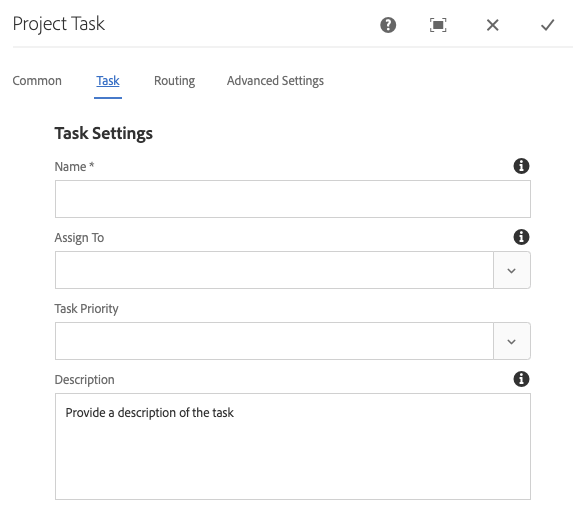

# Creative Project与PIM集成 {#creative-project-and-pim-integration}

如果您是营销人员或创意专业人员，则可以使用Adobe Experience Manager (AEM)中的Creative Project工具来管理与电子商务相关的产品摄影以及组织内的相关创意流程。

您可以使用Creative Project简化照片拍摄工作流中的以下任务：

* 生成照片拍摄请求
* 上传照片拍摄
* 协作拍摄照片
* 打包批准的资产

>[!NOTE]
>
>有关将用户角色和工作流程分配给特定类型用户的信息，请参阅[项目用户角色](/help/sites-authoring/projects.md#user-roles-in-a-project)。

## 产品照片拍摄工作流  {#exploring-product-photo-shoot-workflows}

Creative Project提供各种项目模板以满足各种项目要求。 **产品照片拍摄项目**&#x200B;模板现成可用。 此模板包含照片拍摄工作流，可让您启动和管理产品照片拍摄请求。 它还包含一系列任务，使您能够通过适当的审阅和批准流程获取产品的数字图像。

## 创建产品照片拍摄项目 {#create-a-product-photo-shoot-project}

1. 在&#x200B;**项目**&#x200B;控制台中，单击&#x200B;**创建**，然后从列表中选择&#x200B;**创建项目**。

   

1. 在&#x200B;**创建项目**&#x200B;页面中，选择&#x200B;**产品照片拍摄项目**&#x200B;模板，然后单击&#x200B;**下一步**。

   

1. 输入项目详细信息，包括标题、说明和截止日期。 添加用户并为其分配各种角色。 您还可以添加项目的缩略图。

   

1. 单击&#x200B;**创建**。确认消息会通知项目已创建。
1. 单击&#x200B;**完成**&#x200B;以返回&#x200B;**项目**&#x200B;控制台。 或者，单击&#x200B;**打开**&#x200B;以查看项目中的资源。

## 在产品照片拍摄项目中开始工作 {#starting-work-in-a-product-photo-shoot-project}

要启动照片拍摄请求，请单击某个项目，然后在项目详细信息页面中单击&#x200B;**添加工作**&#x200B;以启动工作流。


**产品照片拍摄项目**&#x200B;包括以下现成的工作流：

* **产品照片拍摄(Commerce集成)工作流**：此工作流使用商业集成与产品信息管理(PIM)系统来自动生成选定产品（层次结构）的拍摄列表。 工作流完成后，您可以将产品数据作为资产元数据的一部分查看。
* **产品照片拍摄工作流**：此工作流允许您提供拍摄列表，而不是依赖商业集成。 它将上传的图像映射到Project Assets文件夹中的CSV文件。

使用&#x200B;**产品照片拍摄(Commerce集成)**&#x200B;工作流将图像资源映射到AEM中的产品。 此工作流使用商务集成将批准的图像链接到位置`/etc/commerce`上的现有产品数据。

**产品照片拍摄(Commerce集成)**&#x200B;工作流包含以下任务：

* 创建拍摄列表
* 上传照片拍摄
* 修饰照片拍摄
* 审阅并批准
* 移至生产任务

如果AEM中没有产品信息，请使用&#x200B;**产品照片拍摄**&#x200B;工作流，根据您在CSV文件中上传的详细信息，将图像资产映射到产品。 CSV文件必须包含基本的产品信息，如产品ID、类别和描述。 工作流会获取产品的已批准资产。

此工作流包含以下任务：

* 上传拍摄列表
* 上传照片拍摄
* 修饰照片拍摄
* 审阅并批准
* 移至生产任务

您可以使用工作流配置选项自定义此工作流。

这两个工作流都包含将产品与其批准的资产关联的步骤。 每个工作流都包含以下步骤：

* 工作流配置：介绍用于自定义工作流的选项
* 启动项目工作流：说明如何启动产品照片拍摄
* 工作流任务详细信息：提供工作流中可用任务的详细信息

## 跟踪项目进度 {#tracking-project-progress}

您可以通过监控项目中的活动/已完成任务来跟踪项目进度。

使用以下内容监控项目的进度：

* 任务信息卡
* 任务列表

任务卡描述项目的整体进度。 仅当项目具有任何相关任务时，它才会显示在项目详细信息页面上。 任务信息卡根据已完成的任务数显示项目的当前完成状态。 它不包括未来的任务。

任务信息卡提供以下详细信息：

* 活动任务的百分比
* 已完成任务的百分比


任务列表提供有关项目当前活动工作流任务的详细信息。 要显示列表，请单击任务卡。 任务列表还会显示元数据，例如任务的开始日期、到期日期、被分派人、优先级和状态。


## 工作流程配置 {#workflow-configuration}

此任务涉及根据用户的角色为其分配工作流步骤。

要配置&#x200B;**产品照片拍摄**&#x200B;工作流，请执行以下操作：

1. 导航到&#x200B;**工具** > **工作流**，然后选择&#x200B;**模型**&#x200B;拼贴以打开&#x200B;**工作流模型**&#x200B;页面。
1. 选择&#x200B;**产品照片拍摄**&#x200B;工作流，然后从工具栏中选择&#x200B;**编辑**&#x200B;图标以在编辑模式下打开它。

   

1. 在&#x200B;**产品照片拍摄工作流**&#x200B;页面中，打开一个项目任务。 例如，打开&#x200B;**上传拍摄列表**&#x200B;任务。

   

1. 单击&#x200B;**任务**&#x200B;选项卡配置以下内容：

   * 任务名称
   * 接收任务的默认用户（角色）
   * 任务的默认优先级，显示在用户的任务列表中
   * 任务接受者打开任务时要显示的任务描述
   * 任务的到期日期，根据任务开始时间计算

1. 单击&#x200B;**确定**&#x200B;保存配置设置。

您可以通过类似方式为&#x200B;**产品照片拍摄**&#x200B;工作流配置其他任务。

执行相同步骤以配置&#x200B;**产品照片拍摄(Commerce集成)工作流**&#x200B;中的任务。

## 启动项目工作流 {#starting-a-project-workflow}

本节介绍如何将产品信息管理与您的创意项目集成。

1. 导航到产品照片拍摄项目，然后单击&#x200B;**工作流**&#x200B;信息卡上的&#x200B;**添加工作**&#x200B;图标。
1. 选择&#x200B;**产品照片拍摄(Commerce集成)**&#x200B;工作流卡以启动&#x200B;**产品照片拍摄(Commerce集成)**&#x200B;工作流。 如果`/etc/commerce`下的产品信息不可用，请选择&#x200B;**产品照片拍摄**&#x200B;工作流并启动&#x200B;**产品照片拍摄**&#x200B;工作流。

   

1. 单击&#x200B;**下一步**&#x200B;启动项目中的工作流。
1. 在下一页输入工作流详细信息。

   

1. 单击&#x200B;**提交**&#x200B;以启动照片拍摄工作流。 此时将显示照片拍摄项目的项目详细信息页面。

   具有新工作流的

### 工作流任务详细信息 {#workflow-tasks-details}

照片拍摄工作流包括多项任务。 根据为任务定义的配置，将每个任务分配给用户组。

#### 创建拍摄列表任务 {#create-shot-list-task}

通过&#x200B;**创建拍摄列表**&#x200B;任务，项目所有者可以选择需要图像的产品。 根据用户选择的选项，生成包含基本产品信息的CSV文件。

1. 在项目文件夹中，单击[任务信息卡](#tracking-project-progress)右下方的省略号按钮以查看工作流中的任务项。

   

1. 选择&#x200B;**创建拍摄列表**&#x200B;任务，然后单击工具栏中的&#x200B;**打开**&#x200B;图标。

   

1. 查看任务详细信息，然后单击&#x200B;**创建拍摄列表**&#x200B;按钮。

   

1. 选择产品数据存在但不关联图像的产品。

   

1. 单击&#x200B;**添加到拍摄列表**&#x200B;按钮可创建包含所有此类产品列表的CSV文件。 将显示一条消息，确认已为所选产品创建拍摄列表。 单击&#x200B;**关闭**&#x200B;以完成工作流。

1. 创建拍摄列表后，将显示&#x200B;**查看拍摄列表**&#x200B;链接。 若要向拍摄列表添加更多产品，请单击&#x200B;**添加到拍摄列表**。 在这种情况下，数据将附加到最初创建的拍摄列表中。

   

1. 单击&#x200B;**查看拍摄列表**&#x200B;查看新的拍摄列表。

   

   要编辑现有数据或添加新数据，请单击工具栏中的&#x200B;**编辑**。 只能编辑&#x200B;**Product**&#x200B;和&#x200B;**Description**&#x200B;字段。

   

   更新文件后，单击工具栏上的&#x200B;**保存**&#x200B;以保存文件。

1. 添加产品后，单击&#x200B;**创建拍摄列表**&#x200B;任务详细信息页面上的&#x200B;**完成**&#x200B;图标以将任务标记为已完成。 您可以添加可选注释。

任务的完成引入了项目中的以下更改：

* 会在与工作流标题同名的文件夹中创建与产品层次结构相对应的Assets。
* 甚至在摄影师提供图像之前，资源的元数据就可以使用Assets控制台进行编辑。
* 创建照片拍摄文件夹，用于存储摄影师提供的图像。 照片拍摄文件夹包含拍摄列表中每个产品条目的子文件夹。

### 上载拍摄列表任务 {#upload-shot-list-task}

此任务是“产品照片拍摄”工作流的一部分。 如果AEM中没有可用的产品信息，则可以执行此任务。 在这种情况下，您可以上传CSV文件中的产品列表，这些产品需要图像资产。 根据CSV文件中的详细信息，可将图像资产映射到产品。 该文件必须是名为`shotlist.csv`的CSV文件。

使用上一个过程中项目卡下的&#x200B;**查看拍摄列表**&#x200B;链接下载示例CSV文件。 查看样例文件以了解CSV文件的常用内容。

产品列表或CSV文件可以包含字段，如&#x200B;**类别、产品、ID、描述**&#x200B;和&#x200B;**路径**。 **Id**&#x200B;字段是必填字段，其中包含产品ID。 其他字段为可选字段。

产品可以属于特定类别。 产品类别可在&#x200B;**类别**&#x200B;列下方的CSV中列出。 **Product**&#x200B;字段包含产品的名称。 在&#x200B;**描述**&#x200B;字段中，输入摄影师的产品描述或说明。

1. 在项目文件夹中，单击[任务信息卡](#tracking-project-progress)右下方的省略号按钮以查看工作流中的任务列表。
1. 选择&#x200B;**上传拍摄列表**&#x200B;任务，然后单击工具栏中的&#x200B;**打开**&#x200B;图标。

   

1. 查看任务详细信息，然后单击&#x200B;**上传拍摄列表**&#x200B;按钮。

   

1. 单击&#x200B;**上传拍摄列表**&#x200B;按钮上传CSV文件。 工作流会将此文件识别为源，以用于提取下一个任务的产品数据。
1. 上传包含适当格式的产品信息的CSV文件。 上传CSV文件后，信息卡下将显示&#x200B;**查看上传的Assets**&#x200B;链接。

   

   单击&#x200B;**完成**&#x200B;图标以完成任务。

1. 单击&#x200B;**完成**&#x200B;图标以完成任务。

### 上传照片拍摄任务 {#upload-photo-shoot-task}

如果您是编辑器，则可以上传在上一个任务中创建或上传的&#x200B;**shotlist.csv**&#x200B;文件中列出的产品的拍摄照片。

要上载的图像的名称必须以`<ProductId_>`开头，其中`ProductId`是从`shotlist.csv`文件中的&#x200B;**Id**&#x200B;字段引用的。 例如，对于拍摄列表中具有&#x200B;**Id** `397122`的产品，您可以上载名称为`397122_highcontrast.jpg`、`397122_lowlight.png`等的文件。

您可以直接上传图像或上传包含图像的ZIP文件。 根据图像名称，图像将放置在照片拍摄文件夹中相应的产品文件夹中。

1. 在项目文件夹下，单击[任务卡片](#tracking-project-progress)右下方的省略号按钮以查看工作流中的任务项。
1. 选择&#x200B;**上传照片拍摄**&#x200B;任务，然后单击工具栏中的&#x200B;**打开**&#x200B;图标。

   

1. 单击&#x200B;**上传照片拍摄**&#x200B;并上传照片拍摄图像。
1. 单击工具栏中的&#x200B;**完成**&#x200B;图标以完成任务。

### 修饰照片拍摄任务 {#retouch-photo-shoot-task}

如果您有编辑权限，请执行&#x200B;**润饰照片拍摄**&#x200B;任务以编辑上载到照片拍摄文件夹的图像。

1. 在项目文件夹下，单击[任务卡](#tracking-project-progress)右下方的省略号按钮以查看工作流中的任务项。
1. 选择&#x200B;**润饰照片拍摄**&#x200B;任务，然后单击工具栏中的&#x200B;**打开**&#x200B;图标。

   

1. 单击&#x200B;**润饰照片拍摄**&#x200B;页面中的&#x200B;**查看上传的Assets**&#x200B;链接，浏览上传的图像。

   

   如有必要，请使用Adobe Creative Cloud应用程序编辑图像。

   

1. 单击工具栏中的&#x200B;**完成**&#x200B;图标以完成任务。

### 审阅和批准任务 {#review-and-approve-task}

在此任务中，您将审核摄影师上传的照片拍摄图像并将图像标记为已批准使用。

1. 在项目文件夹下，单击[任务卡片](#tracking-project-progress)右下方的省略号按钮以查看工作流中的任务项。
1. 选择&#x200B;**审阅和批准**&#x200B;任务，然后单击工具栏中的&#x200B;**打开**&#x200B;图标。

   

1. 在&#x200B;**审核和批准**&#x200B;页面中，将审核任务分配给角色，然后单击&#x200B;**审核**&#x200B;以开始审核上传的产品映像。

   

1. 选择产品图像，然后单击工具栏中的&#x200B;**批准**&#x200B;图标以将其标记为已批准。 批准图像后，该图像上方将显示批准的横幅。

   

1. 单击&#x200B;**完成**。 批准的图像与创建的空资产相链接。

您可以忽略一些没有任何图像的产品。 稍后，您可以重新访问任务，并在完成后将其标记为完成。

您可以使用Assets UI导航到项目资源并验证批准的图像。

单击下一个级别可查看根据产品数据层次结构划分的产品。

创意项目将批准的资产与引用的产品关联。 资源元数据更新了&#x200B;**产品数据**&#x200B;选项卡的资源属性下的产品引用和基本信息，这些属性显示在AEM资源元数据部分中。

>[!NOTE]
>
>在&#x200B;**产品照片拍摄工作流**（没有商业集成）中，批准的图像与产品没有关联。

### 移至生产任务 {#move-to-production-task}

此任务将批准的资产移至生产就绪文件夹，以便使用。

1. 在项目文件夹下，单击[任务卡片](#tracking-project-progress)右下方的省略号按钮以查看工作流中的任务项。
1. 选择&#x200B;**移动到生产**&#x200B;任务，然后单击工具栏中的&#x200B;**打开**&#x200B;图标。

   

1. 要在将照片拍摄的已批准资源移动到生产就绪文件夹之前查看这些资源，请单击&#x200B;**移动到生产**&#x200B;任务页面中项目缩略图下方的&#x200B;**查看已批准的Assets**&#x200B;链接。

   

1. 在&#x200B;**移至**&#x200B;字段中输入生产就绪文件夹的路径。

   

1. 单击&#x200B;**移至生产环境**。 关闭确认消息。资产将移至所述的路径，并根据文件夹层次结构为每个产品的已批准资产自动创建一个旋转集。

1. 单击工具栏中的&#x200B;**完成**&#x200B;图标。 工作流在最后一个步骤标记为完成时完成。

## 查看DAM资源元数据 {#viewing-dam-asset-metadata}

批准后，资产将链接到相应的产品。 已批准资产的[属性页面](/help/assets/manage-assets.md#editing-properties)现在具有额外的&#x200B;**产品数据**（链接的产品信息）选项卡。 此选项卡显示产品详细信息、SKU编号以及链接资产的其他产品相关详细信息。 单击&#x200B;**编辑**&#x200B;图标可更新资产属性。 与产品相关的信息仍保持只读状态。

单击显示的链接可导航到与资产关联的产品控制台中的相应产品详细信息页面。

## 自定义项目照片拍摄工作流 {#customizing-the-project-photo-shoot-workflows}

您可以根据自己的要求自定义&#x200B;**项目照片拍摄**&#x200B;工作流。 这是一个基于角色的可选任务，您可以执行该任务来设置项目中的变量值。 之后，您可以使用配置的值做出决策。

1. 单击AEM徽标，然后导航到&#x200B;**工具** > **工作流** > **模型**，以打开&#x200B;**工作流模型**&#x200B;页面。
1. 选择&#x200B;**产品照片拍摄(Commerce集成)**&#x200B;工作流或&#x200B;**产品照片拍摄**&#x200B;工作流，然后单击工具栏中的&#x200B;**编辑**&#x200B;以在编辑模式下打开该工作流。
1. 打开侧面板并找到&#x200B;**创建基于角色的项目任务**&#x200B;步骤，然后将其拖动到工作流。

   

1. 打开&#x200B;**基于角色的任务**&#x200B;步骤。
1. 在&#x200B;**任务**&#x200B;选项卡上，为将显示在任务列表中的任务提供一个名称。 您还可以将任务分配给角色、设置默认优先级、提供描述以及指定任务到期时间。

   

1. 在&#x200B;**路由**&#x200B;选项卡上，指定任务的操作。 要添加多个操作，请单击&#x200B;**添加项**&#x200B;链接。

   

1. 添加选项后，单击&#x200B;**确定**&#x200B;以将更改添加到该步骤。

1. 返回&#x200B;**工作流模型**&#x200B;窗口，单击&#x200B;**同步**&#x200B;以保存整个工作流的更改。 点击或单击步骤的&#x200B;**确定**&#x200B;不会保存工作流中的更改。 若要保存工作流中的更改，请单击&#x200B;**同步**。

1. 打开侧面板并找到&#x200B;**转到步骤**&#x200B;工作流，然后将其拖动到工作流。

1. 打开&#x200B;**转至**&#x200B;任务并单击&#x200B;**进程**&#x200B;选项卡。

1. 选择要转至的&#x200B;**目标步骤**，并指定&#x200B;**路由表达式**&#x200B;是ECMA脚本。 然后在&#x200B;**脚本**&#x200B;字段中提供以下代码：

   ```javascript
   function check() {
   
   if (workflowData.getMetaDataMap().get("lastTaskAction","") == "Reject All") {
   
   return true
   
   }
   
   // set copywriter user in metadata
   
   var previousId = workflowData.getMetaDataMap().get("lastTaskCompletedBy", "");
   
   workflowData.getMetaDataMap().put("copywriter", previousId);
   
   return false;
   
   }
   ```

   >[!TIP]
   >
   >有关工作流步骤中脚本编写的详细信息，请参阅[为OR拆分定义规则](/help/sites-developing/workflows-models.md)。

   

1. 单击&#x200B;**确定**。

1. 单击&#x200B;**同步**&#x200B;以保存工作流。

完成[移至生产任务](#move-to-production-task)并分配给所有者后，现在有新任务出现。

具有&#x200B;**所有者**&#x200B;角色的用户可以完成该任务并从注释弹出窗口的列表中选择操作（从工作流步骤配置中添加的操作列表中）。

>[!NOTE]
>
>启动服务器时，项目任务列表servlet将缓存任务类型与`/libs/cq/core/content/projects/tasktypes`下定义的URL之间的映射。 然后，您可以执行常规叠加并通过将自定义任务类型放在`/apps/cq/core/content/projects/tasktypes`下来添加它们。
