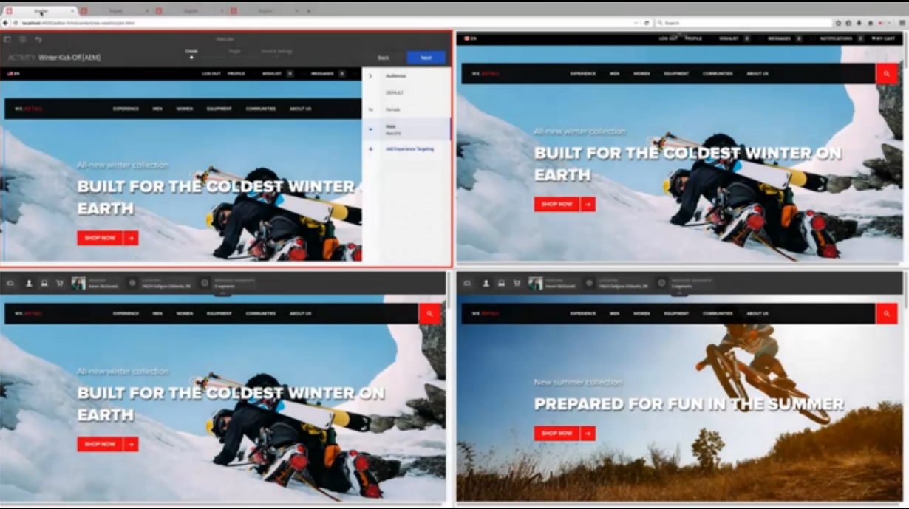

# 在多个站点中使用目标内容{#working-with-targeted-content-in-multisites}

如果您需要管理目标内容（如网站之间的活动、体验和选件），则可以利用AEM针对目标内容的内置多站点支持。

>[!NOTE]
>
>使用多站点支持目标内容是一项高级功能。 要使用此功能，您应该熟悉[多站点管理器](/help/sites-administering/msm.md)以及 [Adobe Target 与 AEM 的集成](/help/sites-administering/target.md)。

本文档描述了以下内容：

* 简要概述目标内容的AEM多站点支持。
* 描述关于如何链接站点（在一个品牌中）的一些可能的使用方案。
* 提供一个示例来演练营销人员如何使用此功能。
* 有关如何为目标内容实施多站点支持的详细说明。

要设置网站如何共享个性化内容，您需要执行以下步骤：

1. [创建新区域](#creating-new-areas) 或 [创建新区域作为Live Copy](#creating-new-areas). 区域包括可用于的所有活动 *区域* 页面上；即，组件在页面上的目标位置。 创建新区域会创建一个空区域，而创建新区域作为Live Copy允许您跨站点结构继承内容。

1. [链接您的网站或页面](#linking-sites-to-an-area) 到某个区域。

您可以随时暂停或恢复继承。 此外，如果您不想暂停继承，还可以创建本地体验。 默认情况下，除非另有指定，否则所有页面都使用“主控区域”。

## 目标内容的多站点支持简介 {#introduction-to-multisite-support-for-targeted-content}

目标内容的多站点支持开箱即用，允许您通过MSM将目标内容从您管理的主控页面推送到本地Live Copy，或者允许您管理此类内容的全局和本地修改。

可以在&#x200B;**区域**&#x200B;中管理目标内容。区域可将在不同站点中使用的目标内容（活动、体验和选件）分隔开来，并提供基于 MSM 的机制，以创建并管理目标内容的继承以及站点继承。这样，您就不必按照6.2之前的AEM中的要求，在继承的站点中重新创建目标内容。

在区域中，只有链接到该区域的活动才会被推送到Live Copies。 默认情况下，“主控区域”处于选中状态。 创建其他区域后，您可以将这些区域链接到您的网站或页面，以指示推送了哪些目标内容。

站点或Live Copy链接到包含需要在该站点或Live Copy上可用的活动的区域。 默认情况下，站点或Live Copy会链接到主控区域，但您也可以链接主控区域以外的其他区域。

>[!NOTE]
>
>当使用多站点支持来获取目标内容时，您应了解以下事项：
>
>* 使用转出或活动副本时，需要MSM许可证。
>* 当您使用与Adobe Target的同步时，需要Adobe Target许可证。
>

## 用例 {#use-cases}

您可以通过多种方式为目标内容设置多站点支持，具体取决于您的用例。 本节将介绍如何在理论上使此功能适用于一个品牌。 此外，在 [示例：基于地理位置定位内容](#example-targeting-content-based-on-geography)，您可以看到在多个站点中定位内容的真实应用程序。

目标内容封装在所谓的区域中，这些区域定义了网站或页面的范围。 这些区域在品牌级别定义。 一个品牌可以包含多个区域。 不同品牌之间的区域可以不同。 一个品牌可能只包含主控区域，因此在所有品牌间共享，而另一个品牌可能包含多个品牌（例如，按地区）。 因此，品牌无需镜像它们之间的区域集。

通过多站点目标内容支持，例如，您可以拥有两个（或更多）站点， **一** 具有以下任一条件的品牌：

* 完全&#x200B;*不同*&#x200B;的目标内容集 – 在一个站点中编辑目标内容不会影响其他站点。链接到不同区域的站点将读取并写入其自身的配置区域。例如：

   * 站点A链接到区域X
   * 站点B链接到区域Y

* *共享*&#x200B;的目标内容集 – 在一个站点中编辑会直接影响两个站点；通过让两个站点引用同一区域，可以实现此设置。链接到同一区域的站点共享该区域内的目标内容。例如：

   * 站点A链接到区域X
   * 站点B链接到区域X

* 通过 MSM 从其他站点&#x200B;*继承*&#x200B;的不同目标内容集 – 内容可从主区域单向转出到 Live Copy。例如：

   * 站点A链接到区域X
   * 站点B链接到区域Y（这是区域X的Live Copy）

您还可以 **多个** 在一个站点中使用的品牌，这可能比此示例更复杂。

>[!NOTE]
>
>要从技术层面更详细地了解此功能，请参阅[如何构建目标内容的多站点管理](/help/sites-authoring/technical-multisite-targeted.md)。

## 示例：根据地理位置定位内容 {#example-targeting-content-based-on-geography}

将多站点用于目标内容允许您共享、转出或隔离个性化内容。 为了更好地说明如何使用此功能，请考虑以下场景，您要根据地理位置控制目标内容的推出方式，如下面的场景所示：

根据地理位置，同一站点有四个版本：

* 此 **美国** 站点位于左上角，是主控站点。 在本例中，它在“定位”模式下打开。
* 此站点的其他三个版本为 **加拿大**， **英国**、和 **澳大利亚**，它们是所有活动副本。 这些网站在预览模式下打开。

每个网站在地理区域中共享个性化内容：

* 加拿大与美国共用主控区。
* 大英国与欧洲地区相连，并继承自主控地区。
* 澳大利亚站点由于位于南半球，季节性产品不适用，因此会有自己的个性化内容。

对于北半球，我们创建了一个冬季活动，不过是针对男性受众创建的，北美的营销人员想要为冬季活动启用一幅新图像，因此他们在美国站点中更改了原有图像。

刷新选项卡后，加拿大网站会变更为新图像，我们无需采取任何操作。 它这样做是因为它与美国共享这个主控区域。 在“大不列颠”和“澳大利亚”网站上，图像不会发生更改。

营销人员希望将这些更改推广到欧洲地区，并且 [转出live copy](/help/sites-administering/msm-livecopy.md) 通过点按或单击 **转出页面**. 在刷新选项卡后，英国站点具有新图像，因为欧洲区域继承自主控区域（转出后）。

澳大利亚网站中的图像保持不变，这是所需的行为，因为澳大利亚是夏天，营销人员不想更改该内容。 澳大利亚的站点不会更改，因为它不与任何其他区域共享区域，也不是其他区域的Live Copy。 营销人员永远不必担心澳大利亚网站的目标内容会被覆盖。

此外，对于其区域是主控区域的Live Copy的英国，您可以通过活动名称旁边的绿色指示器查看继承状态。 如果活动是继承的，则除非暂停或分离Live Copy，否则无法对其进行修改。

您可以随时暂停继承或完全分离继承。 您还可以始终添加仅对该体验可用的本地体验，而无需暂停继承。

>[!NOTE]
>
>要从技术层面更详细地了解此功能，请参阅[如何构建目标内容的多站点管理](/help/sites-authoring/technical-multisite-targeted.md)。

### 创建新区域与创建新区域作为LiveCopy {#creating-a-new-area-versus-creating-a-new-area-as-livecopy}

在AEM中，您可以选择创建新区域或创建新区域作为LiveCopy。 创建新区域会对活动及属于这些活动的任何内容（例如选件、体验等）进行分组。 当您要创建完全不同的目标内容集或共享目标内容集时，可以创建一个新区域。

但是，如果您通过MSM在两个网站之间设置了继承，则您可能需要继承活动。 在这种情况下，您将创建一个新区域作为Live Copy，其中Y是X的Live Copy，因此也将继承所有活动。

>[!NOTE]
>
>当页面是链接到某个区域的 Live Copy，而该区域本身又是链接到页面 Blueprint 的区域的 Live Copy 时，默认转出会触发后续的目标内容转出。

例如，下图中有四个站点，其中两个站点共享主区域（以及该区域中的所有活动）；还有一个站点的区域是其他区域的 Live Copy，因此会在转出后共享活动；最后一个站点完全独立（因此其活动需要一个单独的区域）。

要在AEM中实现此目标，您需要执行以下操作：

* 站点A链接到主控区域 — 无需创建区域。 默认情况下，在AEM中会选中“主控区域”。 网站A和B共享活动，等等。
* 站点B链接到主控区域 — 无需创建区域。 默认情况下，在AEM中会选中“主控区域”。 网站A和B共享活动，等等。
* 站点C链接到继承区域，它是主控区域的Live Copy — 创建区域作为Live Copy，可在其中基于主控区域创建Live Copy。 继承区域在推出时继承主控区域的活动。
* 站点D链接到其自身的隔离区域 — 创建区域，您可以在其中创建尚未定义活动的全新区域。 隔离区不会与任何其他站点共享活动。

## 创建新区域 {#creating-new-areas}

区域可以包含各种活动和选件。 在其中任何一个中创建了区域（例如，活动）后，另一个中也提供了可用区域（例如，选件）。

>[!NOTE]
>
>默认情况下，当您点按或单击品牌名称时，名为“主区域”的默认区域会折叠，直到您创 **建** 其他区域为止。 然后，在“活动”或“选件”控制台中选 **择品牌****时，您会看到“区** 域 **** ”控制台。

要创建新区域，请执行以下操作：

1. 导航到&#x200B;**个性化** > **活动**&#x200B;或&#x200B;**选件**，然后导航到您的品牌。
1. 点按或单击&#x200B;**创建区域**。

   

1. 单击 **面积图** 图标并单击 **下一个**.
1. 在 **标题** 字段中，输入新区域的名称。 （可选）选择标记。
1. 点按或单击&#x200B;**创建**。

   AEM将重定向到品牌窗口，其中列出了创建的任何区域。 如果主控区域之外还有其他区域，则可以直接在Brand Console中创建区域。

   

## 将区域创建为活动副本 {#creating-areas-as-live-copies}

您可以创建一个区域作为Live Copy，以便跨站点结构继承目标内容。

要创建区域作为LiveCopy：

1. 导航到&#x200B;**个性化** > **活动**&#x200B;或&#x200B;**选件**，然后导航到您的品牌。
1. 点按或单击&#x200B;**创建区域作为 Live Copy**。

   

1. 选择要为其创建 Live Copy 的区域，然后单击&#x200B;**下一步**。

   

1. 在“名 **称** ”字段中，输入Live copy的名称。 默认情况下，包含子页面；通过选中“排除子页 **面”复选框** ，排除它们。

   

1. 在 **转出配置** 从下拉菜单中，选择相应的配置。

   参见 [已安装的转出配置](/help/sites-administering/msm-sync.md#installed-rollout-configurations) 以获取每个选项的描述。

   参见 [创建和同步活动副本](/help/sites-administering/msm-livecopy.md) 以了解有关活动副本的更多信息。

   >[!NOTE]
   >
   >如果将页面转出到 Live Copy，并且为 Blueprint 页面配置的区域同时也是为页面 Live Copy 配置的区域的 Blueprint，则 LiveAction **personalizationContentRollout** 会触发同步的 subRollout，它是&#x200B;**标准转出配置**&#x200B;的一部分。

1. 点按或单击&#x200B;**创建**。

   AEM将重定向到品牌窗口，其中列出了创建的任何区域。 如果主控区域之外还有其他区域，则可直接从品牌窗口创建区域。

   

## 将站点链接到区域 {#linking-sites-to-an-area}

您可以将区域链接到页面或网站。 所有子页面都会继承区域，除非子页面上的映射覆盖了这些页面。 不过，通常而言，您需要在站点级别建立链接。

链接时，只有选定区域中的活动、体验和选件可用。 这样可防止单独管理的内容意外混淆。 如果未配置其他区域，则使用每个品牌的主控区域。

>[!NOTE]
>
>引用了同一区域的页面或站点使用的是&#x200B;*相同*&#x200B;的共享活动、体验和选件集。编辑由多个站点共享的活动、体验或选件会影响所有站点。

要将站点链接到区域，请执行以下操作：

1. 导航到要链接到某个区域的站点（或页面）。
1. 选择站点或页面，然后点按或单击 **查看属性**.
1. 点按或单击&#x200B;**个性化**&#x200B;选项卡。
1. 在 **品牌** 菜单上，选择要将区域链接到的品牌。 选择品牌后，中提供了可用区域 **区域引用** 菜单。

   

1. 从&#x200B;**区域引用**&#x200B;下拉菜单中选择相应的区域，然后点按或单击&#x200B;**保存**。

   

## 分离Live Copy或暂停目标内容的继承 {#detaching-live-copy-or-suspending-inheritance-of-targeted-content}

您可能希望暂停或分离目标内容的继承。 暂停或分离Live Copy是按活动完成的。 例如，您可能想要修改活动中的体验，但如果该活动仍链接到继承的副本，则无法修改体验或活动的任何属性。

暂停Live Copy会暂时中断继承，但将来您可以恢复继承。 分离Live Copy将永久中断继承。

要暂停或分离目标内容的继承，需要先在活动中恢复继承。如果页面或站点链接到的区域是 Live Copy，则可以查看活动的继承状态。

从其他网站继承的活动在活动名称旁标记为绿色。 暂停的继承被标记为红色，而本地创建的活动没有图标。

>[!NOTE]
>
>* 您只能在活动中暂停或分离活动副本。
>* 您无需暂停或分离活动副本即可扩展继承的活动。 您可以随时创建 **新** 该活动的本地体验和选件。 如果要修改现有活动，则需要暂停继承。
>

### 暂停继承 {#suspending-inheritance}

要暂停或分离活动中目标内容的继承，请执行以下操作：

1. 导航到要在其中分离或暂停继承的页面，然后点按或单击 **定位** 模式下拉菜单中。
1. 如果页面链接到的区域是Live Copy，您将看到继承状态。 点按或单击&#x200B;**开始定位**。
1. 要在活动中暂停，请执行下列操作之一：

   1. 选择活动的元素，如受众。 AEM会自动显示暂停Live Copy确认框。 （在整个定位过程中，您可以通过点按或单击任何元素来暂停Live Copy。）
   1. 选择 **暂停Live Copy** 工具栏的下拉菜单中。

   

1. 点按或单击&#x200B;**暂停**，以在活动中暂停继承。暂停继承的活动会标记为红色。

   

### 中断继承 {#breaking-inheritance}

要中断活动中目标内容的继承，请执行以下操作：

1. 导航到要从主控分离Live Copy的页面，然后点按或单击 **定位** 模式下拉菜单中。
1. 如果页面链接到的区域是Live Copy，您将看到继承状态。 点按或单击&#x200B;**开始定位**。
1. 从工 **具栏的下拉菜单中选择** “分离Live Copy”。 AEM会确认您是否要分离Live Copy。
1. 点击或单击 **分离** 以将Live Copy从活动分离。 分离后，不再显示有关继承的下拉菜单。 该活动现在为本地活动。

   

## 恢复目标内容的继承 {#restoring-inheritance-of-targeted-content}

如果您已暂停活动中目标内容的继承，则可以随时恢复继承。 但是，如果您已分离Live Copy，则无法恢复继承。

要恢复活动中目标内容的继承，请执行以下操作：

1. 导航到要在其中恢复继承的页面，然后点按或单击“模式”下拉菜单中的&#x200B;**定位**。
1. 点按或单击&#x200B;**开始定位**。
1. 从工具栏的下拉菜单中选择&#x200B;**恢复 Live Copy**。

   

1. 点击或单击 **恢复** 以确认您要恢复Live Copy继承。 如果恢复继承，则对当前活动所做的任何修改都将丢失。

## 删除区域 {#deleting-areas}

删除某个区域时，将删除该区域中的所有活动。 在删除区域之前，AEM会先警告您。 如果您删除了站点链接到的区域，则此品牌的映射会自动重新映射到主区域。

要删除区域，请执行以下操作：

1. 导航到&#x200B;**个性化** > **活动**&#x200B;或&#x200B;**选件**，然后导航到您的品牌。
1. 点按或单击要删除的区域旁边的图标。
1. 点击或单击 **删除** 并确认要删除该区域。
