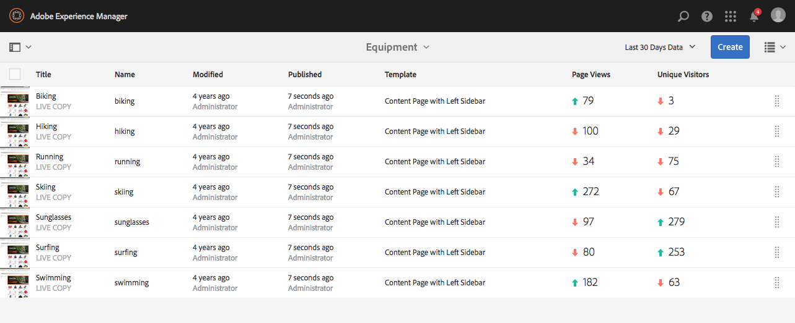
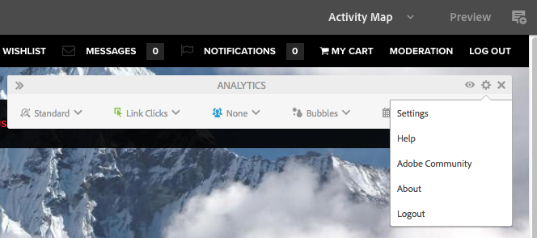

# 查看页面分析数据{#seeing-page-analytics-data}

可使用页面分析数据评估页面内容的有效性。

## 可从控制台中查看分析数据 {#analytics-visible-from-the-console}

页面分析数据显示在站点控制台的[列表视图](/help/sites-authoring/basic-handling.md#list-view)中。当页面以列表格式显示时，默认情况下可使用以下列：

* 页面查看次数
* 独特访客
* 页面停留时间

每列会显示当前报表时间段的值，同时还会显示自上一报表时间段以来该值是增加还是减少。您查看的数据每 12 小时更新一次。

>[!NOTE]
>
>要更改更新周期，请[配置导入时间间隔](/help/sites-administering/adobeanalytics-connect.md#configuring-the-import-interval)。

1. 打开&#x200B;**站点**&#x200B;控制台；例如，[http://localhost:4502/sites.html/content](http://localhost:4502/sites.html/content)
1. 在工具栏的最右侧（右上角），单击或点按相应的图标以选择&#x200B;**列表视图**（显示的图标将取决于[当前视图](/help/sites-authoring/basic-handling.md#viewing-and-selecting-resources)）。

1. 再次在工具栏的最右侧（右上角），单击或点按相应的图标，然后选择&#x200B;**查看设置**。此时将打开&#x200B;**配置列**&#x200B;对话框。执行所需的更改，然后单击&#x200B;**更新**&#x200B;以进行确认。

   

### 选择报表时间段 {#selecting-the-reporting-period}

选择在“站点”控制台上显示的分析数据的报表时间段：

* 过去 30 天的数据
* 过去 90 天的数据
* 本年度的数据

当前报表时间段会显示在“站点”控制台的工具栏上（顶部工具栏右侧）。可使用下拉菜单选择所需的报表时间段。

### 配置可用数据列 {#configuring-available-data-columns}

分析管理员用户组的成员可以配置站点控制台，以使作者能够查看其他分析列。

>[!NOTE]
>
>当页面树包含与不同 Adobe Analytics 云配置关联的子项时，您无法为页面配置可用数据列。

1. In List View, use the view selectors (right of toolbar), select **View Settings** and then **Add Custom Analytics Data**.

   

1. 在站点控制台中选择要向作者公开的量度，然后单击&#x200B;**添加**。

   显示的列从Adobe Analytics检索。

   

### 从站点打开内容分析 {#opening-content-insights-from-sites}

Open [Content Insight](/help/sites-authoring/content-insights.md) from the Sites console to further investigate page effectiveness.

1. 在站点控制台中，选择要查看“内容分析”的页面。
1. 在工具栏上，单击“分析和建议”图标。

   

## 可从页面编辑器 (Activity Map) 中查看分析数据 {#analytics-visible-from-the-page-editor-activity-map}

>[!NOTE]
>
>如果针对您的网站[已配置 Activity Map](/help/sites-administering/adobeanalytics-connect.md#configuring-for-the-activity-map)，那么会显示此信息。

>[!NOTE]
>
>Activity Map 的数据将从 Adobe Analytics 中获取。

当您的网站已[针对 Adobe Analytics 进行了配置](/help/sites-administering/adobeanalytics-connect.md)时，可以通过 [Activity Map](/help/sites-authoring/author-environment-tools.md#page-modes) 模式查看相关数据。例如：

### 访问 Activity Map {#accessing-the-activity-map}

在选择 [Activity Map](/help/sites-authoring/author-environment-tools.md#page-modes) 模式后，将要求您输入 Adobe Analytics 凭证。

将显示 **Analytics** 浮动工具栏；您可以在此处：

* 使用双箭头 (**>>**) 更改工具栏格式
* 切换页面详细信息（眼睛图标）
* 配置 Activity Map 设置（齿轮图标）
* 选择要显示的分析（各种下拉选择器）
* 退出 Activity Map 并关闭工具栏 (x)

### 选择要显示的分析 {#selecting-the-analytics-to-show}

您可以使用各种条件选择要显示的分析数据及其显示方式：

* **标准**/**实时**

* 事件类型
* 用户组
* **气泡**/**渐变**/**获胜方和失败方**/**关闭**

* 要显示的时间段

### 配置 Activity Map {#configuring-the-activity-map}

使用&#x200B;**显示设置**&#x200B;图标打开 **Activity Map 设置**&#x200B;对话框。

**Activity Map 设置**&#x200B;对话框将在三个选项卡上提供一系列选项：

* 常规

   * 报表包
   * 页面名称
   * 语言
   * 为叠加图添加以下标签
   * 标签字体大小
   * 渐变颜色
   * 气泡颜色
   * 颜色渐变依据
   * 渐变透明度

* 标准

   * 显示（链接的类型和数量）
   * 隐藏未获得任何点击量的链接所对应的叠加图。

* 实时

   * 显示顶部（获胜方或失败方）
   * 排除最低值 %
   * 自动更新（数据和时间段）

