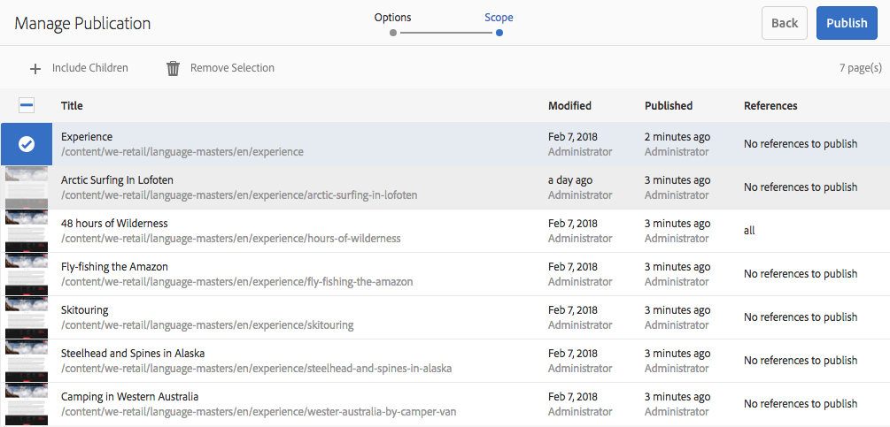

# 发布页面 {#publishing-pages}

在您於作者環境中建立並檢閱您的內容後， [使其可在您的公開網站上使用](/help/sites-authoring/author.md#concept-of-authoring-and-publishing) （您的發佈環境）。

這稱為發佈頁面。 當您想要從發佈環境中移除頁面時，會稱為取消發佈。 發佈和取消發佈頁面時，作者環境仍會提供頁面以供進一步變更，直到您刪除為止。

您也可以立即發佈/取消發佈頁面，或在預先定義的未來日期/時間發佈/取消發佈頁面。

>[!NOTE]
>
>某些與發佈相關的辭彙可能會混淆：
>
>* **发布/取消发布**
   >  这些是在发布环境中公开提供（或不公开提供）您的内容的主要操作术语。
>
>* **激活／取消激活**
   >  这两个术语与发布/取消发布同义。
>
>* **复制**
   >  這些是技術術語，說明資料（例如頁面內容、檔案、程式碼、使用者註解）從一個環境移動到另一個環境，例如發佈或反向複製使用者註解時。
>

>[!NOTE]
>
>如果您沒有發佈特定頁面所需的許可權：
>
>* 系統會觸發工作流程，將您要發佈的請求通知適當人員。
>* 此 [工作流程可能已自訂](/help/sites-developing/workflows-models.md#main-pars-procedure-6fe6) 由您的開發團隊提供。
>* 将显示一条简短的消息，通知您工作流已经触发。
>

## 发布页面 {#publishing-pages-1}

根據您的位置，您可以發佈：

* [从页面编辑器中](/help/sites-authoring/publishing-pages.md#publishing-from-the-editor)
* [从站点控制台中](/help/sites-authoring/publishing-pages.md#publishing-from-the-console)

### 从编辑器中发布 {#publishing-from-the-editor}

如果您在编辑页面，则可以直接从编辑器中发布该页面。

1. 选择&#x200B;**页面信息**&#x200B;图标以打开相应的菜单，然后选择&#x200B;**发布页面**&#x200B;选项。

   

1. 根据页面是否包含需要发布的引用：

   * 如果不包含要发布的引用，则将直接发布页面。
   * 如果页面包含需要发布的引用，则将在&#x200B;**发布**&#x200B;向导中列出该内容，从该向导中可以：

      * 指定要与页面一起发布的资产/标记/等，然后使用&#x200B;**发布**&#x200B;完成该过程。

      * 使用&#x200B;**取消**&#x200B;中止操作。

   

1. 选择&#x200B;**发布**&#x200B;会将页面复制到发布环境。在页面编辑器中，将显示一个确认发布操作的信息横幅。

   

   当在控制台中查看同一页面时，将显示更新的发布状态。

   

>[!NOTE]
>
>從編輯器發佈是淺層發佈，即只會發佈所選頁面/頁面，而不會發佈任何子頁面。

>[!NOTE]
>
>无法发布编辑器中按[别名](/help/sites-authoring/editing-page-properties.md#advanced)处理的页面。编辑器中的发布选项仅适用于通过其实际路径访问的页面。

### 从控制台中发布 {#publishing-from-the-console}

在網站主控台中，有兩個發佈選項：

* [快速发布](/help/sites-authoring/publishing-pages.md#quick-publish)
* [管理发布](/help/sites-authoring/publishing-pages.md#manage-publication)

#### 快速发布 {#quick-publish}

**快速发布**&#x200B;适用于一些简单的情况，可立即发布选定的页面，而无需进行任何进一步的交互。因此，任何未發佈的參考也會自動發佈。

若要使用「快速發佈」功能發佈頁面：

1. 在站点控制台中选择一个或多个页面，然后单击&#x200B;**快速发布**&#x200B;按钮。

   

1. 在「快速發佈」對話方塊中，按一下以確認發佈 **發佈** 或按一下 **取消**. 请记住，任何未发布的引用也将被自动发布。

   

1. 發佈頁面時，畫面會顯示確認發佈的警報。

>[!NOTE]
>
>「快速發佈」是淺層發佈，即只會發佈選取的頁面/頁面，而不會發佈任何子頁面。

#### 管理发布 {#manage-publication}

与“快速发布”相比，**管理发布**&#x200B;提供了更多选项，允许包含子页面、自定义引用和启动任何适用的工作流，并且还提供了在以后的日期发布的选项。

要使用“管理发布”发布或取消发布页面，请执行以下操作：

1. 在站点控制台中选择一个或多个页面，然后单击&#x200B;**管理发布**&#x200B;按钮。

   

1. 此时会启动&#x200B;**管理发布**&#x200B;向导。第一个步骤&#x200B;**选项**&#x200B;允许您：

   * 选择发布或取消发布选定的页面。
   * 選擇現在或稍後採取該動作。

   稍後發佈會啟動工作流程，以在指定時間發佈選取的一個或多個頁面。 反之，稍後取消發佈會啟動工作流程，以在特定時間取消發佈所選的一或多個頁面。

   如果您要稍后撤消发布/取消发布页面，请转到[“工作流”控制台](/help/sites-administering/workflows.md)以终止相应的工作流。

   

   单击&#x200B;**下一步**&#x200B;以继续。

1. 在管理出版物精靈的下一個步驟中， **範圍**，您可以定義發佈/取消發佈的範圍，例如包含以包含子頁面和/或包含參照。

   

   如果您因一时疏忽而忘记在启动“管理发布”向导之前选择某个页面，则可以使用&#x200B;**添加内容**&#x200B;按钮将其他页面添加到要发布的页面列表中。

   单击“添加内容”按钮会启动[路径浏览器](/help/sites-authoring/author-environment-tools.md#path-browser)以供选择内容。

   选择所需的页面，然后单击&#x200B;**选择**&#x200B;以将该内容添加到向导，或单击 **取消** 以取消所做的选择并返回到向导。

   返回精靈，您可以在清單中選取專案以設定其進一步的選項，例如：

   * 包括其子項。
   * 將其從選取範圍中移除。
   * 管理其已發佈的參考。

   

   单击&#x200B;**包括子项**&#x200B;会打开一个对话框，它允许您：

   * 仅包括下级子项.
   * 仅包括已修改的页面.
   * 仅包括已发布的页面.

   单击&#x200B;**添加**&#x200B;可根据选择的选项将子页面添加到要发布或取消发布的页面列表中。单击&#x200B;**取消**&#x200B;可取消所做的选择并返回到向导。

   

   返回到向导后，您将看到根据您在“包括子项”对话框中选择的选项添加的页面。

   您可以通过选择页面，然后单击&#x200B;**已发布引用**&#x200B;按钮，来查看和修改该页面要发布或取消发布的引用。

   

   此 **已發佈引用** 對話方塊會顯示所選內容的參照。 依預設，這些區段會全部選取，且將會發佈/取消發佈，但您可以取消勾選以取消選取，使其不包含在動作中。

   按一下 **完成** 儲存變更或 **取消** 以取消選取並返回精靈。

   返回到向导后，**引用**&#x200B;列将进行相应的更新，以反映您选择的要发布或取消发布的引用。

   

1. 单击&#x200B;**发布**&#x200B;以完成。

   返回到站点控制台后，将显示一条确认发布的通知消息。

1. 如果发布的页面与工作流相关联，则这些工作流可能会显示在发布向导的最后一个步骤&#x200B;**工作流**&#x200B;中。

   >[!NOTE]
   >
   >将根据用户可能拥有也可能没有的权限显示&#x200B;**工作流**&#x200B;步骤。請參閱 [本頁上一個附註](/help/sites-authoring/publishing-pages.md#main-pars-note-0-ejsjqg-refd) 關於發佈許可權以及 [管理工作流程存取許可權](/help/sites-administering/workflows-managing.md) 和 [將工作流程套用至頁面](/help/sites-authoring/workflows-applying.md#main-pars-text-5-bvhbkh-refd) 以取得詳細資訊。

   資源會依觸發的工作流程及每個指定選項分組，以便：

   * 定義工作流程的標題。
   * 保留工作流程封裝，前提是工作流程具有 [多資源支援](/help/sites-developing/workflows-models.md#configuring-a-workflow-for-multi-resource-support).
   * 在选择保留工作流包的选项时，定义工作流包的标题。

   单击&#x200B;**发布**&#x200B;或&#x200B;**稍后发布**&#x200B;以完成发布。

   

## 取消发布页面 {#unpublishing-pages}

取消发布页面将从发布环境中删除该页面，以便不再将其提供给您的读者。

通过[与发布类似的方式](/help/sites-authoring/publishing-pages.md#publishing-pages)，可以取消发布一个或多个页面：

* [从页面编辑器中](/help/sites-authoring/publishing-pages.md#unpublishing-from-the-editor)
* [从站点控制台中](/help/sites-authoring/publishing-pages.md#unpublishing-from-the-console)

### 從編輯器中取消發佈 {#unpublishing-from-the-editor}

編輯頁面時，如果您要取消發佈該頁面，請選取 **取消發佈頁面** 在 **頁面資訊** 功能表，視需要而定 [發佈頁面](/help/sites-authoring/publishing-pages.md#publishing-from-the-editor).

>[!NOTE]
>
>无法取消发布编辑器中按[别名](/help/sites-authoring/editing-page-properties.md#advanced)处理的页面。编辑器中的发布选项仅适用于通过其实际路径访问的页面。

### 從主控台取消發佈 {#unpublishing-from-the-console}

正如[使用“管理发布”选项发布页面](/help/sites-authoring/publishing-pages.md#manage-publication)一样，也可以使用它来取消发布页面。

1. 在站点控制台中选择一个或多个页面，然后单击&#x200B;**管理发布**&#x200B;按钮。
1. 此时会启动&#x200B;**管理发布**&#x200B;向导。在第一个步骤&#x200B;**选项**&#x200B;中，选择&#x200B;**取消发布**，而不是默认选项&#x200B;**发布**。

   

   正如稍后发布会启动一个工作流，以在指定时间发布此版本页面一样，稍后取消激活也会启动一个工作流，以在指定时间取消发布选定的一个或多个页面。

   如果您要稍后撤消发布/取消发布页面，请转到[“工作流”控制台](/help/sites-administering/workflows.md)以终止相应的工作流。

1. 若要完成取消發佈，請依照您想要的方式繼續完成精靈 [發佈頁面](/help/sites-authoring/publishing-pages.md#manage-publication).

## 发布和取消发布树 {#publishing-and-unpublishing-a-tree}

當您輸入或更新了大量內容頁面時 — 所有內容頁面都位於同一個根頁面下 — 可以更輕鬆地在一次動作中發佈整個樹狀結構。

您可以使用 [管理發布](/help/sites-authoring/publishing-pages.md#manage-publication) 選項（位於網站主控台上）來執行此動作。

1. 在網站主控台中，選取您要發佈或取消發佈之樹狀結構的根頁面，然後選取 **管理發布**.
1. 此时会启动&#x200B;**管理发布**&#x200B;向导。選擇發佈或取消發佈的時間及應發生的時間，然後選取 **下一個** 以繼續。
1. 在 **範圍** 步驟，選取根頁面並選取 **包含子項**.

   

1. 在 **包含子項** 對話方塊，取消核取選項：

   * 仅包括下级子项
   * 仅包括已发布的页面

   預設會選取這些選項，因此您必須記得取消選取它們。 按一下 **新增** 以確認並將內容新增至發佈/取消發佈。

   

1. 此 **管理發布** 精靈會列出樹狀結構的內容以供檢閱。 您可以新增其他頁面或移除選取的頁面，進一步自訂選取範圍。

   

   请记住，您还可以通过&#x200B;**已发布引用**&#x200B;选项查看要发布的引用。

1. [照常繼續管理出版物精靈](#manage-publication) 完成發佈或取消發佈樹狀結構。

## 确定发布状态 {#determining-publication-status}

您可以決定頁面的發佈狀態：

* 在[站点控制台上的资源概述信息](/help/sites-authoring/basic-handling.md#viewing-and-selecting-resources)中

   

   站点控制台的[信息卡](/help/sites-authoring/basic-handling.md#card-view)、[列](/help/sites-authoring/basic-handling.md#column-view)和[列表](/help/sites-authoring/basic-handling.md#list-view)视图中将显示发布状态。

* 在[时间线](/help/sites-authoring/basic-handling.md#timeline)中

   

* 在[“页面信息”菜单](/help/sites-authoring/author-environment-tools.md#page-information)中（编辑页面时）

   
