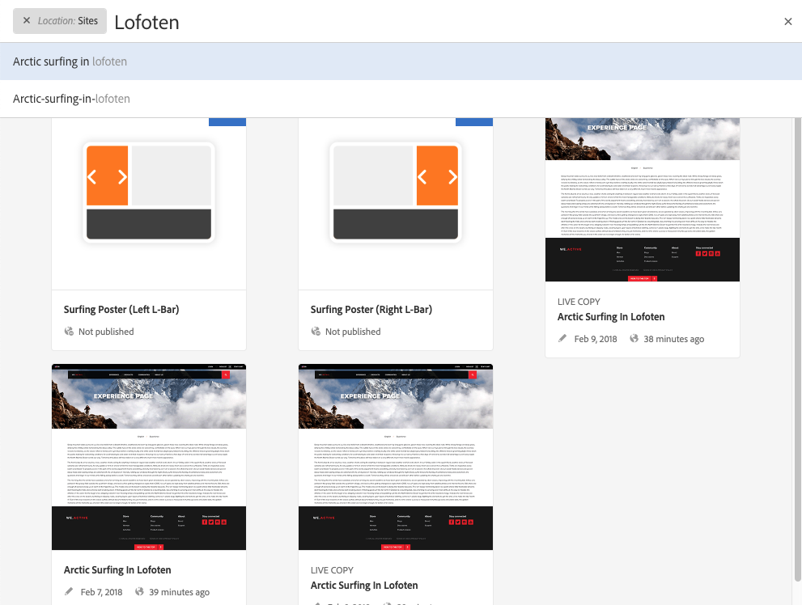
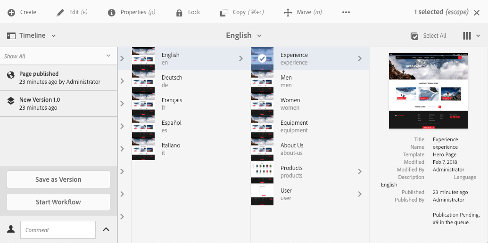

# 製作頁面的快速指南{#quick-guide-to-authoring-pages}

這些程式旨在作為在AEM中編寫頁面內容之關鍵動作的快速指南（高層級）。

他们：

* 不是為了提供完整的涵蓋範圍。
* 提供詳細檔案的連結。

有关使用 AEM 进行创作的完整详细信息，请参阅：

* [作者的首要步驟](/help/sites-authoring/first-steps.md)
* [製作頁面](/help/sites-authoring/page-authoring.md)

## 一些快速提示 {#a-few-quick-hints}

在概略介紹具體內容之前，請先參閱以下小冊子，瞭解一些值得牢記的一般秘訣和提示。

### 站点控制台 {#sites-console}

* **创建**

   * 此按钮在许多控制台中可用 - 出现的选项是上下文相关的，因此在不同的情况下可能有所改变。

* 在資料夾中重新排序頁面

   * 此操作可在[列表视图](/help/sites-authoring/basic-handling.md#list-view)中完成。更改将在其他视图中应用并可见。

#### 页面创作 {#page-authoring}

* 导航链接

   * ***連結無法用於導覽*** 當您在 **編輯** 模式。 若要使用連結導覽，您需要 [預覽頁面](/help/sites-authoring/editing-content.md#previewing-pages) 使用：

      * [预览模式](/help/sites-authoring/editing-content.md#preview-mode)
      * [以发布的形式查看](/help/sites-authoring/editing-content.md#view-as-published)

* 無法從頁面編輯器啟動/建立版本；現在可以從網站主控台完成(透過 **建立** 或 [時間表](/help/sites-authoring/basic-handling.md#timeline) （針對選取的資源）。

>[!NOTE]
>
>有許多鍵盤快速鍵可讓撰寫體驗更輕鬆。
>
>* [編輯頁面時的鍵盤快速鍵](/help/sites-authoring/page-authoring-keyboard-shortcuts.md)
>* [控制台的键盘快捷键](/help/sites-authoring/keyboard-shortcuts.md)
>

### 查找页面 {#finding-your-page}

查找页面时存在很多方面；您可以导航和/或搜索：

1. 打开&#x200B;**站点**&#x200B;控制台（使用&#x200B;**全局导航**&#x200B;中的[站点](/help/sites-authoring/basic-handling.md#global-navigation)选项 - 它将在您选择 Adobe Experience Manager（左上方）时以下拉菜单的形式触发）。

1. 通过点按/单击相应的页面，在树中向下导航。页面资源的显示方式取决于您所使用的视图 - [卡片视图、列表视图或列视图](/help/sites-authoring/basic-handling.md#viewing-and-selecting-resources)：

   

1. 使用[标头中的痕迹导航](/help/sites-authoring/basic-handling.md#theheaderwithbreadcrumbs)对树进行向上导航，这允许您返回到选定的位置：

   

1. 您也可以 [搜尋](/help/sites-authoring/search.md) （頁面）。 您可以從顯示的結果中選取您的頁面。

   

### 创建新页面 {#creating-a-new-page}

要[创建新的页面](/help/sites-authoring/managing-pages.md#creating-a-new-page)，请执行以下操作：

1. [导航到要创建新页面的位置](#finding-your-page)。
1. 使用 **建立** 圖示，然後選取 **頁面** 從清單中：

   

1. 這會開啟精靈，引導您收集以下情況下所需的資訊： [建立您的新頁面](/help/sites-authoring/managing-pages.md#creating-a-new-page). 請依照熒幕上的指示操作。

### 選取您的頁面以採取進一步動作 {#selecting-your-page-for-further-action}

您可以選取頁面，以便對其執行動作。 選取頁面會自動更新工具列，以顯示與該資源相關的動作。

如何選取頁面取決於您在主控台中使用的檢視：

1. 列视图：

   * 点按/单击所需资源的缩略图 - 缩略图上将覆盖一个勾号，表示已选择该页面。

1. 列表视图：

   * 点按/单击所需资源的缩略图 - 缩略图上将覆盖一个勾号，表示已选择该页面。

1. 卡片视图：

   * 進入選擇模式的方式 [選取所需資源](/help/sites-authoring/basic-handling.md#viewingandselectingyourresources) 替換為：

      * 行動裝置：點選並按住
      * 桌上型電腦： [快速動作](/help/sites-authoring/basic-handling.md#quick-actions)  — 勾選圖示：

   

   * 卡片上将覆盖一个勾号，表示已选择该页面。
   >[!NOTE]
   >
   >進入選取模式後 **選取** 圖示（勾號）將變更為 **取消選取** 圖示（十字形）。

### 快速操作（仅限卡片视图/桌面） {#quick-actions-card-view-desktop-only}

[快速操作](/help/sites-authoring/basic-handling.md#quick-actions)可用：

1. [导航](#finding-your-page)到要执行操作的页面。
1. 將滑鼠指標停留在代表所需資源的卡片上；將會顯示快速動作：

   

### 编辑页面内容 {#editing-your-page-content}

要编辑您的页面，请执行以下操作：

1. [导航](#finding-your-page)到要编辑的页面。
1. 使用“编辑”（铅笔）图标[打开要编辑的页面](/help/sites-authoring/managing-pages.md#opening-a-page-for-editing)：

   

   可以从以下位置访问该图标：

   * [快速動作（僅限卡片檢視/案頭）](#quick-actions-card-view-desktop-only) 適當的資源。
   * [选择页面](#selectiingyourpageforfurtheraction)后显示的工具栏。

1. 編輯器開啟時，您可以：

   * [新增元件至您的頁面](/help/sites-authoring/editing-content.md#inserting-a-component) 作者：

      * 開啟側面板
      * 選取「元件」標籤( [元件瀏覽器](/help/sites-authoring/author-environment-tools.md#components-browser))
      * 將所需元件拖曳至您的頁面。

      可以通过以下图标打开（或关闭）侧面板：
   

   * [編輯現有元件的內容](/help/sites-authoring/editing-content.md#edit-configure-copy-cut-delete-paste) 在頁面上：

      * 通过点按或单击打开组件工具栏。使用 **編輯** （鉛筆）圖示以開啟對話方塊。
      * 使用點選並按住或按兩下緩慢的方式開啟元件的就地編輯器。 將顯示可用的動作（對於某些元件，這將是一個有限的選擇）。
      * 若要檢視所有可用動作，請使用以下方法進入全熒幕模式：

   

   * [配置现有组件的属性](/help/sites-authoring/editing-content.md#component-edit-dialog)

      * 通过点按或单击打开组件工具栏。使用 **設定** （扳手）圖示以開啟對話方塊。
   * [移動元件](/help/sites-authoring/editing-content.md#moving-a-component) 可以：

      * 將所需元件拖曳至其新位置。
      * 通过点按或单击打开组件工具栏。根据需要依次使用&#x200B;**剪切**&#x200B;和&#x200B;**粘贴**&#x200B;图标。
   * [複製（和貼上）](/help/sites-authoring/editing-content.md#edit-configure-copy-cut-delete-paste) 元件：

      * 通过点按或单击打开组件工具栏。根据需要依次使用&#x200B;**复制**&#x200B;和&#x200B;**粘贴**&#x200B;图标。
   >[!NOTE]
   >
   >您可以将组件&#x200B;**粘贴**&#x200B;到同一页面或其他页面。如果在剪切/复制操作之前粘贴到已打开的其他页面，则表明该页面需要刷新。

   * [删除](/help/sites-authoring/editing-content.md#edit-configure-copy-cut-delete-paste)组件：

      * 通过点按或单击打开组件工具栏，然后使用&#x200B;**删除**&#x200B;图标。
   * [新增註解](/help/sites-authoring/annotations.md#annotations) 至頁面：

      * 選取 **註釋** 模式（語音泡泡圖示）。 使用新增附註 **新增註解** （加號）圖示。 使用右上方的 X 退出注释模式。

   

   * [預覽頁面](/help/sites-authoring/editing-content.md#preview-mode) （檢視其顯示在發佈環境中的方式）

      * 選取 **預覽** （從工具列）。
   * 使用返回編輯模式（或選取其他模式） **編輯** 下拉式選擇器。

   >[!NOTE]
   >
   >若要使用內容中的連結導覽，您必須使用 [預覽模式](/help/sites-authoring/editing-content.md#preview-mode).

### 編輯頁面屬性 {#editing-the-page-properties}

有兩個（主要）方法 [編輯頁面屬性](/help/sites-authoring/editing-page-properties.md)：

* 从&#x200B;**站点**&#x200B;控制台中：

   1. [導覽至頁面](#finding-your-page) 您要發佈。
   1. 選取 **屬性** 圖示來自：

      * [快速動作（僅限卡片檢視/案頭）](#quick-actions-card-view-desktop-only) 適當的資源。
      * [选择页面](#selectiingyourpageforfurtheraction)后显示的工具栏。

   

   1. 将会显示页面属性。您可以进行需要的更新，然后使用“保存”保留这些更改

* 時間 [編輯您的頁面](#editing-your-page-content)：

   1. 開啟 **頁面資訊** 功能表。
   1. 選取 **開啟屬性** 以開啟對話方塊來編輯屬性。

   

### 发布页面（或取消发布） {#publishing-your-page-or-unpublishing}

有兩種主要方法 [發佈您的頁面](/help/sites-authoring/publishing-pages.md) （以及取消發佈）：

* 从&#x200B;**站点**&#x200B;控制台中：

   1. [導覽至頁面](#finding-your-page) 您要發佈。
   1. 从以下任一位置选择&#x200B;**快速发布**&#x200B;图标：

      * [快速動作（僅限卡片檢視/案頭）](#quick-actions-card-view-desktop-only) 適當的資源。
      * [选择页面](#selectiingyourpageforfurtheraction)后显示的工具栏（还可以访问[稍后发布](/help/sites-authoring/publishing-pages.md#main-pars-title-12)）。

   

* 時間 [編輯您的頁面](#editing-your-page-content)：

   1. 開啟 **頁面資訊** 功能表。
   1. 選取 **發佈頁面**.

   

* 从控制台取消发布页面只能通过&#x200B;**管理发布**&#x200B;选项完成，该选项仅在工具栏上可用（不能通过快速操作）。

   此 **取消發佈頁面** 選項仍可透過 **頁面資訊** 功能表。

   

   另請參閱 [發佈頁面](/help/sites-authoring/publishing-pages.md#unpublishing-pages) 以取得詳細資訊。

### 移動、複製和貼上或刪除您的頁面 {#move-copy-and-paste-or-delete-your-page}

這些動作都可由以下方式觸發：

1. [導覽至頁面](#finding-your-page) 您想要移動、複製並貼上或刪除。
1. 使用以下任一方式根据需要选择复制（然后粘贴）、移动或删除图标：

   * [快速動作（僅限卡片檢視/案頭）](#quick-actions-card-view-desktop-only) 以取得所需資源。
   * [选择页面](#selecting-your-page-for-further-action)后显示的工具栏。

   然后，取决于您的操作：

   * 复制：

      * 复制后，您将需要导航到新位置并进行粘贴。
   * 移动：

      * 将打开相应的向导来收集移动页面时所需的信息。按照屏幕上的说明操作。
   * 删除：

      * 系统将要求您确认该操作。
   >[!NOTE]
   >
   >快速操作中并未提供“删除”操作。

### 锁定页面（然后解锁） {#locking-your-page-then-unlocking}

[锁定页面](/help/sites-authoring/editing-content.md#locking-a-page) ，可阻止其他作者在您处理页面时对其进行处理。 可以找到“锁定”（和“解锁”）图标／按钮：

* [选择页面](#selecting-your-page-for-further-action)后显示的工具栏。
* 编辑页面时显示的[“页面信息”下拉菜单](#editing-the-page-properties)。
* 编辑页面（页面处于锁定状态）时显示的页面工具栏

例如，“锁定”图标如下所示：

### 访问页面引用 {#accessing-page-references}

在“引用”边栏中，可以[快速访问对页面的引用/从页面进行的引用](/help/sites-authoring/author-environment-tools.md#references)。

1. 使用工具栏图标选择&#x200B;**引用**（在[选择您的页面](#selecting-your-page-for-further-action)之前或之后）：

   

   此时会显示引用类型列表：

   

1. 點選/按一下所需的參考型別以顯示更多詳細資訊，並（在適當時）採取進一步動作。

### 建立頁面的版本 {#creating-a-version-of-your-page}

要创建页面的[版本](/help/sites-authoring/working-with-page-versions.md)：

1. 要打开“时间线”边栏，请使用工具栏图标选择&#x200B;**[时间线](/help/sites-authoring/basic-handling.md#timeline)**（在[选择您的页面](#selecting-your-page-for-further-action)之前或之后）：

   

1. 點選/按一下「時間軸」欄右下方的向上箭頭，以顯示其他按鈕，包括 **另存為版本**.

   

1. 选择&#x200B;**另存为版本**，然后再选择&#x200B;**创建**。

### 恢复/比较页面版本 {#restoring-comparing-a-version-of-your-page}

恢复和/或比较页面版本时所使用的机制基本相同：

1. 使用工具栏图标选择&#x200B;**[时间线](/help/sites-authoring/basic-handling.md#timeline)**（在[选择您的页面](#selecting-your-page-for-further-action)之前或之后）：

   

   如果页面的某个版本已经保存，则会在“时间线”中列出该版本。

1. 點選/按一下您要還原的版本 — 這會顯示其他動作按鈕：

   * **恢复到此版本**

      * 将恢复该版本。
   * **显示差异**

      * 開啟頁面時，會醒目提示（兩個版本之間的）差異。
