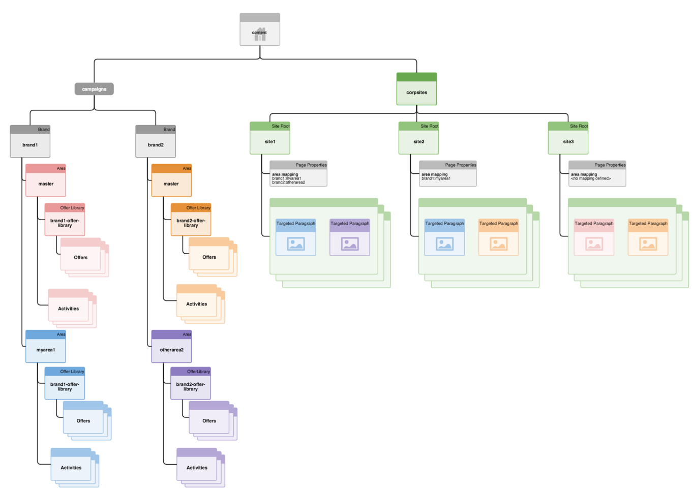

# 如何构建目标内容的多站点管理{#how-multisite-management-for-targeted-content-is-structured}

下图显示了如何构建目标内容的多站点支持。

**/content/campaigns/&lt;brand>** 下方显示了区域，默认情况下，每个品牌都有一个自动创建的主区域。每个区域都包含自身的一组活动、体验和选件。

要查找目标内容，可将页面或站点映射到某个区域。 如果未配置区域，则AEM将回退到此特定品牌的主区域。

下图是该逻辑如何为三个站点（名为 site1、site2 和 site3）工作的示例。

* 网站1基于区域映射查找myarea1以查找brand1，查找otherarea2以查找brand2。
* 站点2查找brand1的myarea1和brand2的主区域，因为只定义了brand1的区域映射。
* 站点3查找brand1和brand2的主区域，因为根本未为此站点定义其他区域映射。
