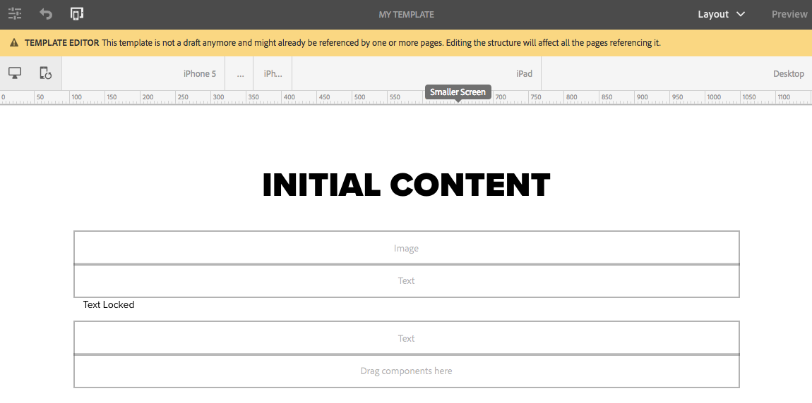
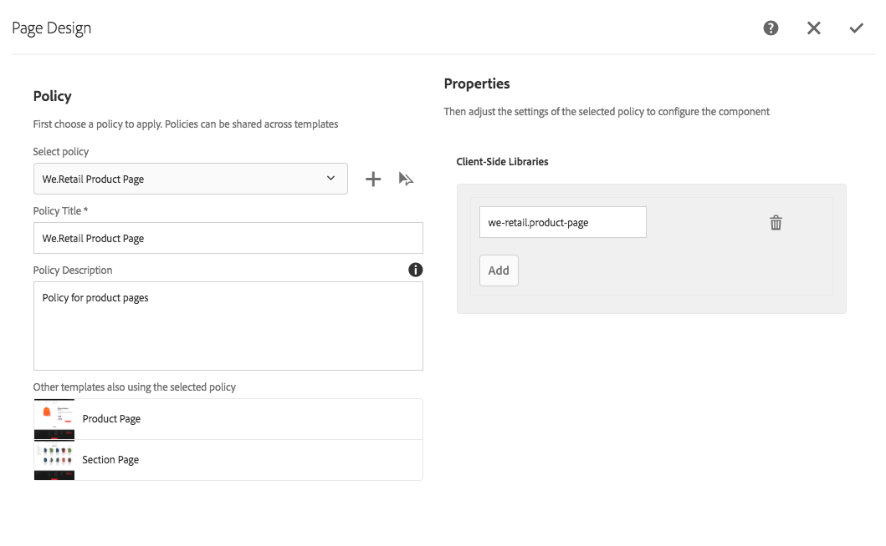

# 建立頁面範本{#creating-page-templates}

建立頁面時，您必須選取範本，作為建立新頁面的基礎。 範本會定義結果頁面的結構、任何初始內容以及可以使用的元件。

使用模 **板编辑器**，创建和维护模板不再只是开发人员的任务。 高级用户(称为模板作者 **)也可能**。 开发人员仍需要设置环境、创建客户端库和创建要使用的组件，但是，在这些基础知识到位后，模板作者就可以灵活地创建和配置模板，而无需开发项目。 ****

此 **範本主控台** 可讓範本作者：

* 创建新模板，或复制现有模板。
* 管理範本的生命週期。

此 **範本編輯器** 可讓範本作者：

* 將元件新增至範本，並將其放置在回應式格線上。
* 预先配置组件。
* 定義在使用範本建立的頁面上可編輯哪些元件。

本檔案說明如何 **範本作者** 可使用範本主控台和編輯器來建立和管理可編輯的範本。

如需技術層面可編輯範本如何運作的詳細資訊，請參閱開發人員檔案 [頁面範本 — 可編輯](/help/sites-developing/page-templates-editable.md) 以取得詳細資訊。

>[!NOTE]
>
>模板 **** 编辑器不支持直接在模板级别进行定位。 可以定位基于可编辑模板创建的页面，但不能定位模板本身。

>[!CAUTION]
>
>使用建立的頁面和範本 **範本主控台** 不應與傳統UI搭配使用，且這類使用不受支援。

## 开始之前 {#before-you-start}

>[!NOTE]
>
>管理员必须在&#x200B;**配置浏览器**&#x200B;中配置一个模板文件夹，并应用适当的权限，之后模板作者才能在该文件夹中创建模板。

開始之前，請務必注意下列幾點：

* 建立新範本需要共同作業。 因此，为每项任务指明了对应的[角色](#roles)。

* 根據您執行個體的設定方式，請注意AEM現在提供的 [兩種基本範本型別](/help/sites-authoring/templates.md#editable-and-static-templates). 這並不會影響您實際操作的方式 [使用範本建立頁面](#using-a-template-to-create-a-page)，但會影響您可以建立的範本型別，以及頁面與其範本的關聯方式。

### 角色 {#roles}

使用&#x200B;**“模板”控制台**&#x200B;和&#x200B;**模板编辑器**&#x200B;创建新模板需要以下角色之间的协作：

* **管理员**:

   * 创建新的模板文件夹需要 `admin` 权限。

   * 這類工作通常也可以由開發人員完成

* **开发人员**:

   * 著重於技術/內部細節
   * 需要具有开发环境方面的经验。
   * 为模板作者提供必要信息。

* **模板作者**：

   * 特定的作者，`template-authors` 组中的一个成员。

      * 可分配所需的权限和许可。
   * 可設定元件和其他高階詳細資訊的使用方式，這些需要執行下列動作：

      * 一些技術知識

         * 例如，定義路徑時使用模式。
      * 由开发人员提供的技术信息。

由於某些工作的性質（例如建立資料夾），需要開發環境，而這需要知識/經驗。

本檔案中詳細列出的任務以及負責執行這些任務的角色。

### 可編輯和靜態範本 {#editable-and-static-templates}

AEM現在提供兩種基本型別的範本：

* [可编辑模板](/help/sites-authoring/templates.md#creatingandmanagingnewtemplates)

   * 可以是 [已建立](#creatinganewtemplate) 和 [已編輯](#editingatemplate) 由範本作者使用 **範本** 主控台和編輯器。 此 **範本** 控制檯可在以下位置存取： **一般** 部分 **工具** 主控台。

   * 建立新頁面後，頁面與範本之間會維持動態連線。 這表示對範本結構和/或鎖定內容的變更將會反映在使用該範本建立的任何頁面上。 解除鎖定（即初始）內容的變更將不會反映出來。
   * 使用內容原則（您可以從範本編輯器定義這些原則）來儲存設計屬性。 頁面編輯器中的設計模式不再用於可編輯的範本。

* 静态模板

   * 靜態範本可用於多個版本的AEM。
   * 它們是 [由您的開發人員提供](/help/sites-developing/page-templates-static.md)，因此作者無法建立或編輯這些變數。
   * 會複製以建立新頁面，但之後不存在動態連線（儘管範本名稱已註冊以供參考）。
   * 使用 [設計模式](/help/sites-authoring/default-components-designmode.md) 以儲存設計屬性。
   * 由於編輯靜態範本是開發人員的專屬工作，請參閱開發人員檔案 [頁面範本 — 靜態](/help/sites-developing/page-templates-static.md) 以取得詳細資訊。

根據定義，範本控制檯和範本編輯器只允許建立和編輯可編輯的範本。 因此，本檔案僅專注於可編輯的範本。

### 使用範本建立頁面 {#using-a-template-to-create-a-page}

使用範本時 [建立新頁面](/help/sites-authoring/managing-pages.md#creating-a-new-page) 靜態範本與可編輯範本之間沒有可見的差異，也沒有任何指示。 對於頁面作者，程式是透明的。

## 创建和管理模板 {#creating-and-managing-templates}

建立新的可編輯範本時，您可以：

* 使用 **範本** 主控台。 這可在以下位置取得： **一般** 部分 **工具** 主控台。

   * 或直接从以下网站进行访问：[https://localhost:4502/libs/wcm/core/content/sites/templates.html/conf](https://localhost:4502/libs/wcm/core/content/sites/templates.html/conf)

* 如有必要，可以[创建模板文件夹](#creating-a-template-folder-admin)
* [创建新模板](#creatinganewtemplateauthor)，新模板最初是空的

* [定義其他屬性](#definingtemplatepropertiesauthor) 範本（如有需要）
* [編輯範本](#editingtemplates) 若要定義：

   * [结构](#editingatemplatestructureauthor) - 不能在使用该模板创建的页面上更改的预定义内容。
   * [初始内容](#editing-a-template-initial-content-author) - 能够在使用该模板创建的页面上更改的预定义内容。
   * [布局](#editingatemplatelayoutauthor) - 针对各种设备。
   * [样式](/help/sites-authoring/style-system.md) - 定义要用于该模板及其组件的样式。

* [啟用範本](#enablingatemplateauthor) 建立頁面時使用
* [允許範本](#allowing-a-template-author) （您的網站必要頁面或分支）
* [發佈範本](#publishingatemplateauthor) 使其可在發佈環境中使用

>[!NOTE]
>
>通常，在最初设置您的网站时便会预定义&#x200B;**允许的模板**。

>[!CAUTION]
>
>切勿輸入任何需要的資訊 [國際化](/help/sites-developing/i18n.md) 放入範本中。 基於內部化的目的， [核心元件的本地化功能](https://experienceleague.adobe.com/docs/experience-manager-core-components/using/get-started/localization.html) 建議使用。

### 创建模板文件夹 – 管理员 {#creating-a-template-folder-admin}

您应该为项目创建模板文件夹，以保存特定于项目的模板。這是一項管理員任務，在檔案中有所說明 [頁面範本 — 可編輯](/help/sites-developing/page-templates-editable.md#template-folders).

### 创建新模板 – 模板作者 {#creating-a-new-template-template-author}

1. 打开&#x200B;**“模板”控制台**（通过&#x200B;**工具** -> **常规**），然后导航到所需的文件夹。

   >[!NOTE]
   >
   >在标准 AEM 实例中，“模板”控制台中已存在&#x200B;**全局**&#x200B;文件夹。此文件夹会保存默认模板，如果在当前文件夹中没有找到策略和/或模板类型，则此文件夹可以充当备用。
   >
   >
   >建議最佳實務使用 [為您的專案建立的範本資料夾](/help/sites-developing/page-templates-editable.md#template-folders).

1. 选择&#x200B;**创建**，然后选择&#x200B;**创建模板**&#x200B;以打开向导。

1. 選取 **範本型別**，然後選取 **下一個**.

   >[!NOTE]
   >
   >範本型別是預先定義的範本配置，可視為範本的範本。 這些是由開發人員或系統管理員預先定義的。 如需詳細資訊，請參閱開發人員檔案 [頁面範本 — 可編輯](/help/sites-developing/page-templates-editable.md#template-type).

1. 完成 **範本詳細資訊**：

   * **模板名称**
   * **描述**

1. 选择&#x200B;**创建**。随即会显示确认对话框，选择&#x200B;**打开**以开始编辑模板，或选择&#x200B;**完成**&#x200B;以返回到“模板”控制台。

   >[!NOTE]
   >
   >创建新模板后，会在控制台中将其标记为&#x200B;**草稿**，这表示页面作者还不能使用此模板。

### 定義範本屬性 — 範本作者 {#defining-template-properties-template-author}

範本可以有下列屬性：

* 图像

   * 要當做影像使用 [範本縮圖](/help/sites-authoring/templates.md#template-thumbnail-image) 以輔助選取，例如「建立頁面」精靈中的選取。

      * 可以上傳
      * 可根據範本內容產生

* 标题

   * 用於識別範本的標題，例如 **建立頁面** 精靈。

* 描述

   * 可选描述，用于提供更多有关模板及其用法的信息，例如&#x200B;**创建页面**&#x200B;向导中显示的描述。

要查看和/或编辑属性，请执行以下操作：

1. 在&#x200B;**模板控制台**&#x200B;中，选择相应的模板。
1. 从工具栏或快速选项中选择&#x200B;**查看属性**&#x200B;以打开对话框。
1. 此时您可以查看或编辑模板属性。

>[!NOTE]
>
>模板是简化页面创建工作流的强大工具。不过，太多的模板会让作者不知所措，并使页面创建变得混乱。一个好的经验法则是将模板的数量保持在 100 个以内。
>
>由于潜在的性能影响，Adobe 建议不要使用超过 1000 个模板。

>[!NOTE]
>
>控制台中会指示模板的状态（“草稿”、“已启用”或“已禁用”）。

#### 模板缩略图图像 {#template-thumbnail-image}

若要定義範本縮圖：

1. 編輯範本屬性。
1. 選擇您要上傳縮圖，還是從範本內容產生縮圖。

   * 如果要上傳縮圖，請按一下或點選 **上傳影像**
   * 如果您想要產生縮圖，請按一下或點選 **產生預覽**

1. 對於這兩種方法，都會顯示縮圖的預覽。

   如果不滿意，請按一下或點選 **清除** 上傳其他影像或重新產生縮圖。

1. 當您滿意縮圖時，請按一下或點選 **儲存並關閉**.

### 啟用和允許範本 — 範本作者 {#enabling-and-allowing-a-template-template-author}

为了能够在创建页面时使用模板，您需要执行以下操作：

* [启用模板](#enablingatemplate)以使其可在创建页面时使用。
* [允许模板](#allowingatemplate)以指定可以使用模板的内容分支。

#### 启用模板 – 模板作者 {#enabling-a-template-template-author}

您可以啟用或停用範本，使其可在以下位置使用或無法使用： **建立頁面** 精靈。

>[!CAUTION]
>
>啟用範本後，當範本作者開始進一步更新範本時，將顯示警告。 這是為了通知使用者可能會參考範本，所以任何變更都可能影響參考範本的頁面。

1. 在&#x200B;**模板控制台**&#x200B;中，选择相应的模板。
1. 从工具栏中选择&#x200B;**启用**&#x200B;或&#x200B;**禁用**，然后在确认对话框中再次选择“启用”或“禁用”。
1. 现在，您便能够在[创建新页面](/help/sites-authoring/managing-pages.md#creating-a-new-page)时使用模板，不过您可能想要根据自己的需求[编辑模板](#editingatemplate)。

>[!NOTE]
>
>控制台中会指示模板的状态（“草稿”、“已启用”或“已禁用”）。

#### 允许模板 – 作者 {#allowing-a-template-author}

可以使模板可用于或不可用于某些页面分支。

1. 对于希望可在其中使用模板的分支，打开其根页面的[页面属性](/help/sites-authoring/editing-page-properties.md)。

1. 打开&#x200B;**高级**&#x200B;选项卡。

1. 在&#x200B;**模板设置**&#x200B;下方，使用&#x200B;**添加字段**&#x200B;指定模板的路径。

   路徑可以是明確的，也可以使用模式。 例如：

   `/conf/<your-folder>/settings/wcm/templates/.*`

   路徑順序無關，所有路徑都將掃描，所有範本都將擷取。

   >[!NOTE]
   >
   >如果 **允許的範本** 清單留空，樹狀結構將遞增，直到找到值/清單為止。
   >
   >
   >请参阅[模板可用性](/help/sites-developing/templates.md#template-availability) – 对允许的模板适用的原则与此相同。

1. 单击&#x200B;**保存**，以保存对页面属性所做的更改。

>[!NOTE]
>
>通常，在设置您的网站时便会为整个网站预定义允许的模板。

### 发布模板 – 模板作者 {#publishing-a-template-template-author}

由于渲染页面时会引用模板，因此模板在完全配置后需要进行发布，才能用于发布环境。

1. 在&#x200B;**模板控制台**&#x200B;中，选择相应的模板。
1. 从工具栏中选择&#x200B;**发布**&#x200B;以打开向导。
1. 选择要一同发布的&#x200B;**内容策略**。

1. 選取 **發佈** ，以完成動作。

## 編輯範本 — 範本作者 {#editing-templates-template-authors}

建立或編輯範本時，您可以定義多個方面。 編輯範本類似於頁面製作。

可以編輯範本的下列方面：

* [结构](#editingatemplatestructure)

   頁面作者無法移動此處新增的元件，或從結果頁面中移除這些元件。 如果您希望頁面作者能夠在產生的頁面中新增和移除元件，則您需要將段落系統新增到範本。

   鎖定元件後，您可以新增頁面作者無法編輯的內容。 您可以解鎖元件，讓您可以定義 [初始內容](#editingatemplateinitialcontent).

   >[!NOTE]
   >
   >在結構模式中，任何作為已解鎖元件之父件的元件都無法移動、剪下或刪除。

* [初始内容](#editingatemplateinitialcontent)

   解锁组件后，您可以定义要复制到生成页面（使用模板创建）的初始内容。可以在生成页面上编辑这些已解锁的组件。

   >[!NOTE]
   >
   >在&#x200B;**初始内容**&#x200B;模式下以及在生成页面上，可以删除任何具有可访问父项的已解锁组件（即，布局容器内的组件）。

* [布局](#editingatemplatelayout)

   您可以在此處預先定義所需裝置格式的範本配置。 模板创作的&#x200B;**布局**&#x200B;模式与&#x200B;[**页面创作的布局**&#x200B;模式](/help/sites-authoring/responsive-layout.md#defining-layouts-layout-mode)具有相同的功能。

* [页面策略](#editingatemplatepagepolicies)

   在頁面原則底下，您可以將預先定義的頁面原則連結至頁面。 这些页面策略可定义各种设计配置。

* [样式](/help/sites-authoring/style-system.md)

   样式系统允许模板作者在组件的内容策略中定义样式类，以便内容作者在页面上编辑组件时能够选择这些类。这些样式可以作为组件的替代可视化变量，从而使组件变得更加灵活。

   有关更多信息，请参阅[样式系统文档](/help/sites-authoring/style-system.md)。

使用工具栏中的&#x200B;**模式**&#x200B;选择器，可以选择并编辑模板的相应方面：

* [结构](#editingatemplatestructure)
* [初始内容](#editingatemplateinitialcontent)
* [布局](#editingatemplatelayout)

而使用&#x200B;**页面信息**&#x200B;菜单中的&#x200B;**页面策略**&#x200B;选项，可以[选择所需的页面策略](#editingatemplatepagepolicies)：

>[!CAUTION]
>
>如果作者開始編輯已啟用的範本，將會顯示警告。 這是為了通知使用者可能會參考範本，所以任何變更都可能影響參考範本的頁面。

### 编辑模板 – 结构 – 模板作者 {#editing-a-template-structure-template-author}

在&#x200B;**结构**&#x200B;模式下，您可以为模板定义组件和内容，并为模板及其组件定义策略。

* 無法在產生的頁面上移動範本結構中所定義的元件，也無法將其從任何產生的頁面中刪除。
* 如果您希望頁面作者能夠新增和移除元件，請將段落系統新增至範本。
* 可以解锁组件，然后再将其锁定，以便定义[初始内容](#editingatemplateinitialcontent)。

* 可为组件和页面定义设计策略。

在 **結構** 範本編輯器的模式：

* **新增元件**

   將元件新增至範本的機制有多種：

   * 從 **元件** 側面板中的瀏覽器。
   * 藉由使用 **插入元件** 選項(**+** 圖示)，位於範本上已有元件的工具列上，或 **將元件拖曳到這裡** 方塊。

   * 透過拖曳資產(從 **資產** （例如側面板中的瀏覽器）直接在範本上產生適當的元件。

   新增後，每個元件都會標示為：

   * 邊框
   * 顯示元件型別的標籤
   * 解鎖元件時顯示的標籤

   >[!NOTE]
   >
   >将现成的&#x200B;**标题**&#x200B;组件添加到模板后，该组件会包含默认的文本&#x200B;**结构**。
   >
   >
   >如果更改此文本，并添加自己的文本，则在使用该模板创建页面时，将会使用更新的文本。
   >
   >
   >如果您保留默认文本（“结构”），则标题会默认使用后续生成页面的名称。

   >[!NOTE]
   >
   >将组件和资产添加到模板的操作与在[页面创作](/help/sites-authoring/editing-content.md)时执行的类似操作虽然并不完全相同，但也存在许多相似之处。

* **组件操作**

   將元件新增至範本後，請對元件執行動作。 每個個別例項都有一個工具列，可讓您存取可用的動作，工具列取決於元件型別。

   

   显示的工具栏还会取决于执行的操作，例如将策略与组件关联后，便会显示设计配置图标。

* **编辑和配置**

   通过这两项操作，您可以在组件中添加内容。

* **表示結構的邊框**

   使用時 **結構** 模式橘色邊框表示目前選取的元件。 虛線也表示父元件。

   例如，在下方的熒幕擷圖中 **文字** 元件已選取，在 **配置容器** （回應式格線）。

   

* **原則與屬性（一般）**

   內容（或設計）原則會定義元件的設計屬性。 例如，可用的元件或最小/最大尺寸。 這些適用於範本（以及使用範本建立的頁面）。

   可为组件创建内容策略或选择现有策略。这允许您定义设计详细信息。

    

   配置窗口分为两个部分。

   * 在对话框左侧的&#x200B;**策略**&#x200B;下方，您能够创建新策略或选择现有策略。
   * 在对话框右侧的&#x200B;**属性**&#x200B;下方，您可以设置特定于组件类型的属性。

   可用的屬性取決於所選的元件。 例如，對於文字元件，屬性會定義複製和貼上選項、格式選項和段落樣式等選項。

   ***策略***

   內容（或設計）原則會定義元件的設計屬性。 例如，可用的元件或最小/最大尺寸。 這些適用於範本（以及使用範本建立的頁面）。

   在&#x200B;**策略**&#x200B;下方，您可以通过下拉列表选择要应用于组件的现有策略。

   

   此外，也可以通过选择&#x200B;**选择策略**&#x200B;下拉列表旁边的“添加”按钮，来添加新策略。然后，应该在&#x200B;**策略标题**&#x200B;字段中输入一个新标题。

   

   使用&#x200B;**选择策略**&#x200B;下拉列表旁边的“复制”按钮，可复制在此下拉列表中选定的现有策略以将其作为新策略。然后，应该在&#x200B;**策略标题**&#x200B;字段中输入一个新标题。默认情况下，复制的策略的标题将为 **X 的副本**，其中 X 是被复制的策略的标题。

   

   **策略说明**&#x200B;字段中的策略说明是可选的。

   在&#x200B;**同时使用该选定策略的其他模板**&#x200B;部分中，您可以轻松地查看同时也使用了&#x200B;**选择策略**&#x200B;下拉列表中的选定策略的其他模板。

   

   >[!NOTE]
   >
   >如果将同一类型的多个组件添加为初始内容，则同一策略适用于所有这些组件。這會映象中的相同限制 [**設計模式** 適用於靜態範本](/help/sites-authoring/default-components-designmode.md).

   ***属性***

   在 **屬性** 標題您可以定義元件的設定。 標題有兩個標籤：

   * 主要
   * 功能

   *主要*

   於 **主要** 標籤中，會定義元件最重要的設定。

   例如，影像元件可定義允許的寬度並啟用延遲載入。

   如果設定允許多個設定，請按一下或點選 **新增** 按鈕以新增其他設定。

   

   要删除配置，请单击或点按位于配置右侧的&#x200B;**删除**&#x200B;按钮。

   若要移除設定，請按一下或點選**刪除**按鈕。

   

   *功能*

   此 **功能** 索引標籤可讓您啟用或停用元件的其他功能。

   例如，對於影像元件，您可以定義裁切比例、允許的影像定向以及是否允許上傳。

   

   >[!CAUTION]
   >
   >请注意，在 AEM 中，裁剪比例被定义为&#x200B;**高宽比**。这与常见的宽高比的定义不同，这样做是出于对旧版兼容性的考虑。只要您清楚地定义&#x200B;**名称**，页面创作用户便不会察觉到任何差异，因为您定义的名称才是 UI 中显示的内容。

   >[!NOTE]
   >
   >只能为 RTE 通过其 UI 设置提供的选项定义用于实施富文本编辑器的组件的内容策略。  

* **原則與屬性（配置容器）**

   版面配置容器的原則和屬性設定類似於一般用途，但有一些差異。

   >[!NOTE]
   >
   >容器元件必須設定原則，因為它可讓您定義容器中可用的元件。

   設定視窗分成兩段，就像視窗的一般使用方式一樣。

   ***策略***

   內容（或設計）原則會定義元件的設計屬性。 例如，可用的元件或最小/最大尺寸。 這些適用於範本（以及使用範本建立的頁面）。

   在&#x200B;**策略**&#x200B;下方，您可以通过下拉列表选择要应用于组件的现有策略。此操作方式与该窗口的常规用法相同。

   ***属性***

   在 **屬性** 標題您可以選擇版面容器可用的元件，並定義其設定。 標題有三個標籤：

   * 允许的组件
   * 默认组件
   * 响应式设置

   *允许的组件*

   於 **允許的元件** 索引標籤中，您可以定義哪些元件可用於配置容器。

   * 元件會依其元件群組分組，可展開和收合這些元件。
   * 透過勾選群組名稱，可以選取整個群組，而取消勾選則可以取消選取所有群組。
   * 減號表示至少選取了一個群組中的專案，但並未選取所有專案。
   * 搜尋可依名稱篩選元件。
   * 无论是否应用了过滤器，组件组名称右侧列出的数字都表示这些组中选定组件的总数。

   

   *默认组件*

   於 **預設元件** 索引標籤上，您可定義哪些元件會自動與指定媒體型別建立關聯，這樣當作者從資產瀏覽器拖曳資產時，AEM就能知道要與哪個元件建立關聯。 請注意，只有具備拖放區域的元件才適用於此設定。

   按一下或點選 **新增對應** 以新增全新的元件和MIME型別對應。

   在列表中选择一个组件，然后单击或点按 **添加类型** ，以向已映射的组件添加其他MIME类型。 单击&#x200B;**删除**&#x200B;图标可删除 MIME 类型。

   

   *响应式设置*

   在&#x200B;**响应式设置**&#x200B;选项卡上，您可以配置布局容器的生成网格中的列数。

* **解鎖/鎖定元件**

   您可以解鎖/鎖定元件，以定義內容是否可用於變更 **初始內容** 模式。

   解鎖元件後：

   * 開啟的掛鎖指示器會顯示在邊框中。
   * 元件工具列將會據此調整。
   * 任何已輸入的內容將不會再顯示於 **結構** 模式。

      * 已输入的内容会被视为初始内容，因此仅在&#x200B;**初始内容**&#x200B;模式下可见。
   * 无法移动、剪切或删除已解锁组件的父组件。

   

   这包括解锁容器组件，以便在初始内容模式或生成的页面 **中添加其他组件** 。 如果在解锁容器之前已将组件／内容添加到容器，则这些组件／内容在结构模式下不再显示，但将以初始内容模式 **显示****** 。 在&#x200B;**“结构”模式**&#x200B;下，只会显示容器组件本身，及其&#x200B;**允许的组件**&#x200B;列表。

   

   为了节省空间，布局容器不会扩大来容纳允许的组件列表。容器會變成可捲動清單。

   可配置的组件会显示一个 **策略图标**，单击或点按该图标可编辑该组件的策略和属性。

   

* **与现有页面的关系**

   如果在基于模板创建页面后更新了模板的结构，则这些页面会反映对模板所做的更改。工具栏中会显示一条警告消息，提醒您这一事实，同时还会显示确认对话框。

   

### 编辑模板 – 初始内容 – 作者 {#editing-a-template-initial-content-author}

**初始內容** 模式用於定義首次根據範本建立頁面時顯示的內容。 然後，頁面作者可以編輯初始內容。

虽然在&#x200B;**结构**&#x200B;模式下创建的所有内容在&#x200B;**初始内容**&#x200B;模式下均可见，但只能选择和编辑已解锁的组件。

>[!NOTE]
>
>可以将&#x200B;**初始内容**&#x200B;模式视为使用模板创建的页面的编辑模式。因此，策略不是在&#x200B;**初始内容**&#x200B;模式下定义的，而是在&#x200B;[**结构**&#x200B;模式](/help/sites-authoring/templates.md#editing-a-template-structure-template-author)下定义的。

* 可編輯的已解除鎖定元件會加上標籤。 選取時，它們具有藍色邊框：

   

* 已解锁组件的工具栏允许您编辑和配置内容：

   

* 如果已将某个容器组件解锁（在&#x200B;**结构**&#x200B;模式下），则您可以将新组件添加到该容器（在&#x200B;**初始内容**&#x200B;模式下）。可以在生成页面上移动或删除在&#x200B;**初始内容**&#x200B;模式下添加的组件。

   您可以通过以下两种方式添加组件：使用&#x200B;**将组件拖动到此处**&#x200B;区域，或使用相应容器工具栏中的&#x200B;**插入新组件**&#x200B;选项。

    

* 如果在基于模板创建页面后更新了模板的初始内容，则对模板的初始内容所做的更改不会影响这些页面。

>[!NOTE]
>
>初始內容旨在準備元件和作為建立內容起點的頁面配置。 此並非意圖讓實際內容維持原狀。 因此，初始內容無法翻譯。
>
>如果需要在模板中包括可翻译文本（如在页眉或页脚中），则可以使用[核心组件的本地化功能](https://experienceleague.adobe.com/docs/experience-manager-core-components/using/get-started/localization.html)。

### 编辑模板 – 布局 – 模板作者 {#editing-a-template-layout-template-author}

您可以为各种设备定义模板布局。模板的[响应式布局](/help/sites-authoring/responsive-layout.md)与页面创作时的响应式布局功能相同。

>[!NOTE]
>
>**初始内容**&#x200B;模式会反映布局更改，而&#x200B;**结构**&#x200B;模式则不会反映任何布局更改。

### 編輯範本 — 頁面設計 — 範本作者/開發人員 {#editing-a-template-page-design-template-author-developer}

页面设计（包括所需的客户端库和页面策略）在“页面信息”菜单的“页 **面设计** ”选项下 **进行维护** 。

若要存取 **頁面設計** 對話方塊：

1. 從 **範本編輯器**，選取 **頁面資訊** 從工具列中，然後 **頁面設計** 以開啟對話方塊。
1. 此 **頁面設計** 對話方塊隨即開啟，並分成兩個區段：

   * 左半部會定義 [頁面原則](/help/sites-authoring/templates.md#page-policies)
   * 右半部分定義 [頁面屬性](/help/sites-authoring/templates.md#page-properties)

   

#### 页面策略 {#page-policies}

您可以将内容策略应用于模板或生成页面。这会为页面上的主要段落系统定义内容策略。

* 您可以从&#x200B;**选择策略**&#x200B;下拉列表中为页面选择现有策略。

   

   此外，也可以通过选择&#x200B;**选择策略**&#x200B;下拉列表旁边的“添加”按钮，来添加新策略。然后，应该在&#x200B;**策略标题**&#x200B;字段中输入一个新标题。

   

   使用&#x200B;**选择策略**&#x200B;下拉列表旁边的“复制”按钮，可复制在此下拉列表中选定的现有策略以将其作为新策略。然后，应该在&#x200B;**策略标题**&#x200B;字段中输入一个新标题。默认情况下，复制的策略的标题将为 **X 的副本**，其中 X 是被复制的策略的标题。

   

* 在&#x200B;**策略标题**&#x200B;字段中定义策略的标题。策略需要具有标题，以便能够轻松地在&#x200B;**选择策略**&#x200B;下拉列表中对其进行选择。

   

* **策略说明**&#x200B;字段中的策略说明是可选的。
* 在&#x200B;**同时使用该选定策略的其他模板**&#x200B;部分中，您可以轻松地查看同时也使用了&#x200B;**选择策略**&#x200B;下拉列表中的选定策略的其他模板。

   

#### 页面属性 {#page-properties}

使用&#x200B;**页面设计**&#x200B;对话框中的页面属性，您可以定义所需的客户端库。这些客户端库包含要与模板以及使用该模板创建的页面一起加载的样式表和 JavaScript。

* 指定您要套用至使用此範本建立之頁面的使用者端程式庫。 在的文字欄位中輸入程式庫名稱 **使用者端資源庫** 區段。

   

* 如果需要多个库，请单击“添加”按钮，以添加更多用于填写库名称的文本字段。

   

   为您的客户端库添加所需数量的文本字段。

   

* 通过使用拖动手柄拖动字段，根据需要定义库的相对位置。

   

>[!NOTE]
>
>虽然模板作者可以在模板上指定页面策略，但是他们需要从开发人员处获取相应客户端库的详细信息。

### 编辑模板 – 初始页面属性 – 作者 {#editing-a-template-initial-page-properties-author}

使用&#x200B;**初始页面属性**&#x200B;选项，您可以定义要在创建生成页面时使用的初始[页面属性](/help/sites-authoring/editing-page-properties.md)。

1. 在模板编辑器中，从工具栏中选择&#x200B;**页面信息**，然后选择&#x200B;**初始页面属性**&#x200B;以打开相应的对话框。

1. 在该对话框中，您可以定义要对使用此模板创建的页面应用的属性。

   

1. 透過確認您的定義 **完成**.

## 最佳实践 {#best-practices}

建立範本時，您應考慮：

1. 從範本建立頁面後，範本變更的影響。

   以下是範本上可能進行的不同操作清單，以及這些操作如何影響根據範本建立的頁面：

   * 結構變更：

      * 這些會立即套用至產生的頁面。
      * 訪客仍需發佈已變更的範本，才能檢視變更。
   * 內容原則和設計設定的變更：

      * 這些會立即套用至產生的頁面。
      * 訪客需要發佈變更才能檢視變更。
   * 初始內容的變更：

      * 這些僅適用於範本變更後建立的頁面。
   * 配置圖變更取決於修改的元件是否屬於下列專案：

      * 僅限結構 — 立即套用
      * 包含初始內容 — 僅在變更後建立的頁面上

   請特別注意：

   * 在啟用的範本上鎖定或解除鎖定元件。
   * 這可能有副作用，因為現有頁面已可使用它。 通常會：

      * 現有頁面上將會遺失解除鎖定元件（已鎖定）。
      * 鎖定元件（可編輯的）會隱藏該內容，使其無法在頁面上顯示。

   >[!NOTE]
   >
   >變更不再是草稿之範本上元件的鎖定狀態時，AEM會發出明確警告。

1. [建立您自己的資料夾](#creatingatemplatefolderdeveloper) 您網站專屬的範本。
1. [發佈您的範本](#publishingatemplateauthor) 從 **範本** 主控台。
