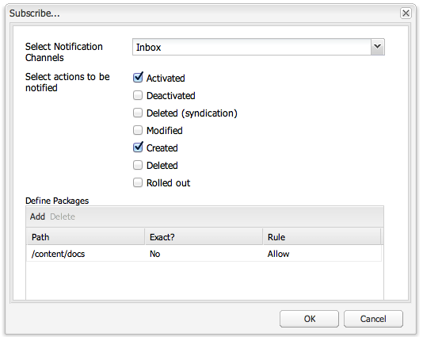

# 您的收件箱{#your-inbox}

您可以从AEM的各个区域接收通知，例如有关工作项或任务的通知，这些任务表示您需要对页面内容执行的操作。

您将在两个收件箱中接收这些通知，它们按通知类型分隔：

* 以下部分介绍了一个收件箱，您可以在该收件箱中查看因订阅而收到的通知。
* 工作流项目的专用收件箱在 [参与工作流](/help/sites-classic-ui-authoring/classic-workflows-participating.md) 文档。

## 查看通知 {#viewing-your-notifications}

要查看通知，请执行以下操作：

1. 打开通知收件箱：在 **网站** 控制台中，单击右上角的用户按钮，然后选择 **通知收件箱**.

   

   >[!NOTE]
   >
   >您也可以直接在浏览器中访问控制台；例如：
   >
   >
   >` https://<host>:<port>/libs/wcm/core/content/inbox.html`

1. 将列出您的通知。 您可以根据需要执行以下操作：

   * [订阅通知](#subscribing-to-notifications)
   * [处理通知](#processing-your-notifications)

   

## 订阅通知 {#subscribing-to-notifications}

要订阅通知，请执行以下操作：

1. 打开通知收件箱：在 **网站** 控制台中，单击右上角的用户按钮，然后选择 **通知收件箱**.

   

   >[!NOTE]
   >
   >您也可以直接在浏览器中访问控制台；例如：
   >
   >
   >`https://<host>:<port>/libs/wcm/core/content/inbox.html`

1. 单击 **配置……** 打开配置对话框。

   

1. 选择通知渠道：

   * **收件箱**:通知将显示在您的AEM收件箱中。
   * **电子邮件**:通知将通过电子邮件发送到您的用户配置文件中定义的电子邮件地址。

   >[!NOTE]
   >
   >需要配置一些设置，才能通过电子邮件通知。 还可以自定义电子邮件模板或为新语言添加电子邮件模板。 请参阅 [配置电子邮件通知](/help/sites-administering/notification.md#configuringemailnotification) 用于在AEM中配置电子邮件通知。

1. 选择要通知的页面操作：

   * 已激活：页面被激活时。
   * 已停用：页面被停用时。
   * 删除（整合）：在页面被重复删除时，即在复制对页面执行的删除操作时。
删除或移动页面后，会自动复制删除操作：在执行删除操作的源实例和复制代理定义的目标实例上，将删除该页面。

   * 已修改：页面被修改时。
   * 已创建：页面创建后。
   * 已删除：通过“页面删除”操作删除页面时。
   * 已推出：页面被推出时。

1. 定义要通知您的页面的路径：

   * 单击 **添加** 向表中添加新行。
   * 单击 **路径** 表格单元格，然后输入路径，例如 `/content/docs`.

   * 要接收属于子树的所有页面的通知，请设置 **准确吗？** to **否**.
要仅接收路径定义的页面上的操作通知，请设置 **准确吗？** to **是**.

   * 要允许该规则，请设置 **规则** to **允许**. 如果设置为 **拒绝**，则拒绝但不会删除该规则，以后可以允许该规则。

   要删除定义，请单击表格单元格以选择行，然后单击 **删除**.

1. 单击 **确定** 以保存配置。

## 处理通知 {#processing-your-notifications}

如果您选择在AEM收件箱中接收通知，则您的收件箱中会填充通知。 您可以 [查看通知](#viewing-your-notifications) 然后，选择所需的通知以：

* 通过单击 **批准**:在 **读取** 列设置为 **true**.

* 通过单击 **删除**.

