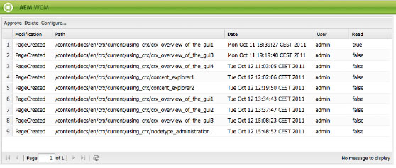

# 您的收件箱{#your-inbox}

您可以从AEM的各个区域接收通知，例如有关工作项或表示您需要对页面内容执行的操作的任务的通知。

您会在两个收件箱中收到这些通知，它们按通知类型进行分隔：

* 下节将介绍一个收件箱，您可以在其中查看因订阅而收到的通知。
* 有关工作流项目的专用收件箱的说明，请参见 [参与工作流](/help/sites-classic-ui-authoring/classic-workflows-participating.md) 文档。

## 查看通知 {#viewing-your-notifications}

要查看您的通知，请执行以下操作：

1. 打开通知收件箱：在 **网站** 控制台，单击右上角的用户按钮并选择 **通知收件箱**.

   

   >[!NOTE]
   >
   >您还可以直接在浏览器中访问该控制台；例如：
   >
   >
   >` https://<host>:<port>/libs/wcm/core/content/inbox.html`

1. 将列出您的通知。 您可以根据需要执行操作：

   * [订阅通知](#subscribing-to-notifications)
   * [处理您的通知](#processing-your-notifications)

   

## 订阅通知 {#subscribing-to-notifications}

要订阅通知，请执行以下操作：

1. 打开通知收件箱：在 **网站** 控制台，单击右上角的用户按钮并选择 **通知收件箱**.

   

   >[!NOTE]
   >
   >您还可以直接在浏览器中访问该控制台；例如：
   >
   >
   >`https://<host>:<port>/libs/wcm/core/content/inbox.html`

1. 单击 **配置……** 打开配置对话框。

   

1. 选择通知渠道：

   * **收件箱**：通知将显示在您的AEM收件箱中。
   * **电子邮件**：通知将通过电子邮件发送到用户配置文件中定义的电子邮件地址。

   >[!NOTE]
   >
   >为了通过电子邮件接收通知，需要配置一些设置。 也可以自定义电子邮件模板或添加新语言的电子邮件模板。 请参阅 [配置电子邮件通知](/help/sites-administering/notification.md#configuringemailnotification) 以在AEM中配置电子邮件通知。

1. 选择要通知的页面操作：

   * 已激活：页面已激活时。
   * 已停用：页面已停用时。
   * 已删除（联合）：已复制删除页面时，即复制对页面执行的删除操作时。
删除或移动页面时，会自动复制删除操作：该页面将在执行删除操作的源实例上以及复制代理定义的目标实例上删除。

   * 修改时间：页面被修改时。
   * 创建时间：创建页面时。
   * 已删除：通过页面删除操作删除页面时。
   * 转出：页面转出时。

1. 定义您将收到通知的页面的路径：

   * 单击 **添加** 以向表中添加新行。
   * 单击 **路径** 表单元格并输入路径，例如 `/content/docs`.

   * 要收到属于子树的所有页面的通知，请设置 **是否准确？** 到 **否**.
要仅收到路径定义的页面上操作的通知，请设置 **是否准确？** 到 **是**.

   * 要允许该规则，请设置 **规则** 到 **允许**. 如果设置为 **拒绝**，规则被拒绝但未删除，以后可以允许。

   要删除定义，请单击表格单元格并选择行，然后单击 **删除**.

1. 单击 **确定** 以保存配置。

## 处理您的通知 {#processing-your-notifications}

如果您已选择在AEM收件箱中接收通知，则收件箱中会填满通知。 您可以 [查看您的通知](#viewing-your-notifications) 然后选择所需的通知，以：

* 通过单击 **批准**：中的值 **读取** 列设置为 **true**.

* 通过单击将其删除 **删除**.

