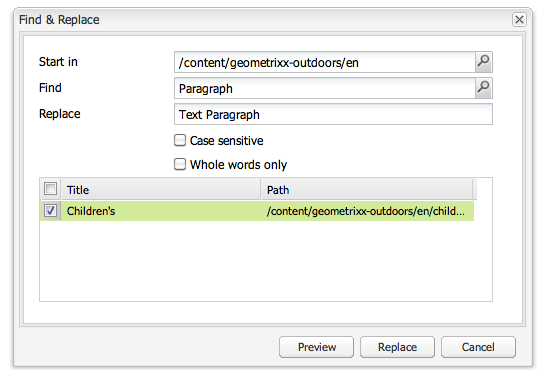

# 搜索{#searching}

AEM 的创作环境提供了多种内容搜索机制，具体取决于资源类型。

>[!NOTE]
>
>在创作环境以外，还有其他机制可用于进行搜索，例如 [Query Builder](/help/sites-developing/querybuilder-api.md) 和 [CRXDE Lite](/help/sites-developing/developing-with-crxde-lite.md)。

## 搜索基础知识 {#search-basics}

要访问搜索面板，请单击相应控制台左侧窗格顶部的&#x200B;**搜索**&#x200B;选项卡。

通过搜索面板，您可以在所有网站页面中进行搜索。它包含用于以下内容的字段和小组件：

* **全文**：搜索指定的文本
* **修改于以下日期之后/之前**：仅搜索在特定日期之间更改过的页面
* **模板**：仅搜索基于指定模板的页面
* **标记**：仅搜索带有指定标记的页面

>[!NOTE]
>
>在您的实例针对 [Lucene 搜索](/help/sites-deploying/queries-and-indexing.md)进行配置后，您可以在&#x200B;**全文**&#x200B;中使用以下内容：
>
>* [通配符](https://lucene.apache.org/core/5_3_1/queryparser/org/apache/lucene/queryparser/classic/package-summary.html#Wildcard_Searches)
>* [布尔运算符](https://lucene.apache.org/core/5_3_1/queryparser/org/apache/lucene/queryparser/classic/package-summary.html#Boolean_operators)
>
>* [正则表达式](https://lucene.apache.org/core/5_3_1/queryparser/org/apache/lucene/queryparser/classic/package-summary.html#Regexp_Searches)
>* [字段分组](https://lucene.apache.org/core/5_3_1/queryparser/org/apache/lucene/queryparser/classic/package-summary.html#Field_Grouping)
>* [Boosting](https://lucene.apache.org/core/5_3_1/queryparser/org/apache/lucene/queryparser/classic/package-summary.html#Boosting_a_Term)
>

通过单击面板底部的&#x200B;**搜索**&#x200B;来执行搜索。单击&#x200B;**重置**&#x200B;来清除搜索条件。

## 过滤器 {#filter}

可在多个位置设置（和清除）筛选器进一步精简您的视图：

## 查找并替换 {#find-and-replace}

在&#x200B;**网站**&#x200B;控制台中，通过&#x200B;**查找并替换**&#x200B;菜单选项，可在网站的某一部分中搜索并替换某一字符串的多个实例。

1. 选择要执行查找并替换操作的根页面或文件夹。
1. 选择&#x200B;**工具**，然后选择&#x200B;**查找并替换**：

   

1. 在&#x200B;**查找并替换**&#x200B;对话框中，可执行以下操作：

   * 确认应开始查找操作的根路径
   * 定义要查找的词
   * 定义应替换该词的词
   * 指示搜索是否应区分大小写
   * 指示是否应仅查找所有词（否则，还将查找子字符串）

   单击 **预览** 列出已找到术语的位置。您可以选择/清除要替换的特定实例：

   

1. 单击&#x200B;**替换**，以实际替换所有实例。系统将要求您确认该操作。

查找并替换 servlet 的默认范围涵盖以下属性：

* `jcr:title`
* `jcr:description`
* `jcr:text`
* `text`

使用Apache Felix Web管理控制台(例如， `https://localhost:4502/system/console/configMgr`)。 选择 `CQ WCM Find Replace Servlet (com.day.cq.wcm.core.impl.servlets.FindReplaceServlet)` 并根据需要配置范围。

>[!NOTE]
>
>在标准 AEM 安装中，“查找并替换”使用 Lucene 执行搜索功能。
>
>Lucene 可对长度不超过 16k 的字符串属性创建索引。不会搜索超过此长度的字符串。
