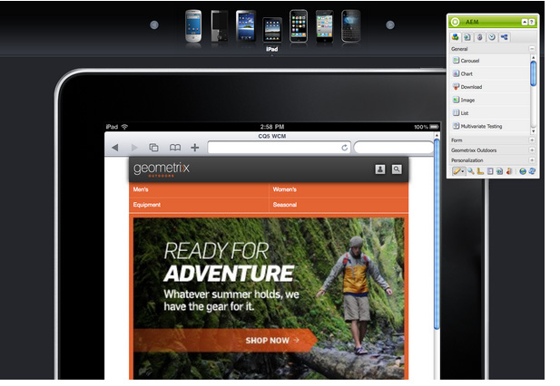

# 创作适用于移动设备的页面{#authoring-a-page-for-mobile-devices}

在创作移动页面时，页面会以模拟移动设备的方式显示。在创作页面时，您可以在多个模拟器之间切换，以查看最终用户在访问页面时看到的内容。

根据设备呈现页面的功能，设备分为功能、智能和触控三个类别。当最终用户访问移动页面时，AEM 会检测设备并发送与其设备组对应的演绎版。

>[!NOTE]
>
>要创建基于现有标准站点的移动站点，请创建标准站点的 Live Copy。（请参阅[为不同的渠道创建Live Copy](/help/sites-administering/msm-livecopy.md)。）
>
>AEM 开发人员可以创建新设备组。（请参阅[创建设备组筛选器。](/help/sites-developing/groupfilters.md)）

请使用以下过程来创作移动页面：

1. 在浏览器中，转到&#x200B;**Siteadmin**&#x200B;控制台。
1. 打开&#x200B;**网站** >> **Geometrixx移动演示站点** >> **英语**&#x200B;下的&#x200B;**产品**&#x200B;页面。

1. 切换到其他模拟器。 为此，您可以：

   * 单击页面顶部的设备图标。
   * 单击&#x200B;**设备**&#x200B;中的&#x200B;**编辑** Sidekick，然后在下拉菜单中选择该设备。

1. 将&#x200B;**文本和图像**&#x200B;组件从Sidekick的“移动设备”选项卡拖放到页面上。
1. 编辑组件并添加一些文本。 单击&#x200B;**确定**&#x200B;以保存更改。

该页面看起来与以下内容相同：

>[!NOTE]
>
>从移动设备请求创作实例上的页面时，将禁用模拟器。 然后，可以使用支持触摸的UI进行创作。
