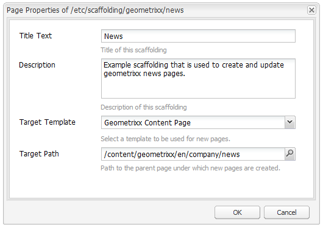
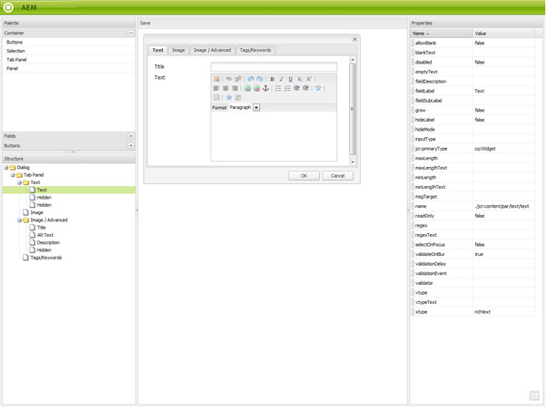
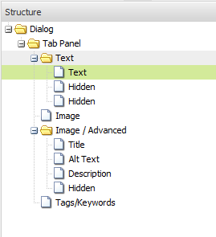

# 基架{#scaffolding}

有时您可能需要创建大量共享结构但内容不同的页面。 通过标准Adobe Experience Manager (AEM)界面，您需要创建每个页面，将相应的组件拖动到页面上，然后单独填充每个组件。

通过基架，您可以创建一个包含字段的表单（基架），这些字段反映您想要用于页面的结构，然后使用此表单轻松地基于此结构创建页面。

>[!NOTE]
>
>基架（在经典UI中）[遵循MSM继承](#scaffolding-with-msm-inheritance)。

## 基架的工作原理 {#how-scaffolding-works}

基架存储在站点管理员的&#x200B;**工具**&#x200B;控制台中。

* 打开&#x200B;**工具**&#x200B;控制台，然后单击&#x200B;**默认页面基架**。
* 在此下，单击&#x200B;**Geometrixx**。
* 在&#x200B;**Geometrixx**&#x200B;下，您找到名为&#x200B;**新闻**&#x200B;的&#x200B;*基架页面*。 双击以打开此页面。

基架包含一个表单，其中针对将构成要创建页面的每个内容都有一个字段，以及通过基架页面的&#x200B;**页面属性**&#x200B;访问的四个重要参数。

基架页面属性包括：

* **标题文本**：这是此基架页面本身的名称。 在本例中，它称为“News”。
* **描述**：这显示在基架页面的标题下方。
* **目标模板**：此基架在创建页面时将使用的模板。 在此示例中，它是&#x200B;*Geometrixx内容页面*&#x200B;模板。
* **目标路径**：这是此基架将在其下创建页面的父页面的路径。 在此示例中，路径为&#x200B;*/content/geometrixx/en/news*。

脚手架的主体就是它的形式。 当用户希望使用基架创建页面时，他填写表单并单击底部的&#x200B;*创建*。 在上面的&#x200B;**新闻**&#x200B;示例中，该表单包含以下字段：

* **标题**：这是要创建的页面的名称。 此字段始终存在于每个基架上。
* **文本**：此字段对应于结果页面上的文本组件。
* **图像**：此字段对应于结果页面上的图像组件。
* **图像/高级**： **标题**：图像的标题。
* **图像/高级**： **替代文本**：图像的替代文本。
* **图像/高级**： **描述**：图像的描述。
* **图像/高级**： **大小**：图像的大小。
* **标记/关键字**：要分配给此页面的元数据。 此字段始终存在于每个基架上。

### 创建基架 {#creating-a-scaffold}

要创建基架，请转到&#x200B;**工具**&#x200B;控制台，然后转到&#x200B;**默认页面基架**&#x200B;并创建页面。 单页模板类型可用，*基架模板。*

转到新页面的&#x200B;**页面属性**&#x200B;并设置&#x200B;*标题文本*、*描述*、*目标模板*&#x200B;和&#x200B;*目标路径*，如上所述。

接下来，您必须定义此基架将创建的页面的结构。 为此，请在基架页面上进入&#x200B;**[设计模式](/help/sites-authoring/page-authoring.md#sidekick)**。 出现一个链接，允许您在&#x200B;**对话框编辑器**&#x200B;中编辑基架。

使用对话框编辑器，您可以指定每次使用此基架创建新页面时将创建的属性。

基架的对话框定义的工作方式与组件的定义类似（请参阅[组件](/help/sites-developing/components.md)）。 但是，这里面有一些重要区别：

* 组件对话框定义呈现为普通对话框（例如，显示在对话框编辑器的中间窗格中），而基架对话框定义（虽然在对话框编辑器中显示为普通对话框）在基架页面上呈现为基架表单（如上面的&#x200B;**新闻**&#x200B;基架中所示）。
* 组件对话框仅提供定义单个特定组件内容所需的值的字段。 基架对话框必须为要创建的页面每个段落中的每个属性提供字段。
* 如果有组件对话框，则用于呈现指定内容的组件是隐式的，因此在创建段落时，会自动填充段落的`sling:resourceType`属性。 使用基架时，定义给定段落的内容和所分配组件的所有信息都必须由对话框本身提供。 在基架对话框中，必须使用&#x200B;*隐藏*&#x200B;字段提供此信息，才能在创建页面时提交此信息。

查看对话框编辑器中的示例&#x200B;**新闻**&#x200B;基架对话框有助于说明其工作方式。 在基架页面上进入设计模式，然后单击对话框编辑器链接。

现在，单击对话框字段&#x200B;**对话框>选项卡面板>文本>文本**，如下所示：

此字段的属性列表显示在对话框编辑器的右侧，如下所示：

请注意此字段的name属性。 它有价值

`./jcr:content/par/text/text`

这是使用基架创建页面时要将此字段内容写入其中的属性的名称。 属性以节点中的相对路径表示，表示要创建的页面。 它指定节点文本下方的属性文本，该文本位于节点par之下，节点本身是页面节点之下jcr：content节点的子节点。

这将为将输入到此字段的文本定义内容存储的位置。 但是，我们还需要为此内容指定两个其他特征：

* 此处存储的字符串必须解释为&#x200B;*富文本*，并且
* 应使用哪个组件将此内容呈现到生成的页面。

在常规组件对话框中，不必指定此信息，因为此信息在对话框已绑定到特定组件的事实中是隐式的。

要指定这两条信息，请使用隐藏字段。 单击第一个隐藏字段&#x200B;**对话框>选项卡面板>文本>隐藏**，如下所示：

此隐藏字段的属性如下：

此隐藏字段的name属性为

`./jcr:content/par/text/textIsRich`

这是一个布尔属性，用于解释存储在`./jcr:content/par/text/text`上的文本字符串。

由于我们知道文本应解释为RTF文本，因此让我们将此字段的`value`属性指定为`true`。

>[!CAUTION]
>
>对话框编辑器允许用户更改对话框定义中&#x200B;*existing*&#x200B;属性的值。 若要添加新属性，用户必须使用[CRXDE Lite](/help/sites-developing/developing-with-crxde-lite.md)。 例如，当使用对话框编辑器向对话框定义中添加新的隐藏字段时，它没有&#x200B;*value*&#x200B;属性（即，名为“value”的属性）。 如果相关隐藏字段要求设置默认值属性，则必须使用某个CRX工具手动添加此属性。 无法用对话框编辑器本身添加值。 但是，属性一旦出现，便可以使用对话框编辑器编辑其值。

第二个隐藏字段可以通过单击它来显示，如下所示：

此隐藏字段的属性如下：

此隐藏字段的name属性为

`./jcr:content/par/text/sling:resourceType`

为此属性指定的固定值为

`foundation/components/textimage`

这指定用于呈现此段落的文本内容的组件是&#x200B;*文本图像*&#x200B;组件。 与其他隐藏字段中指定的`isRichText`布尔值一起使用，组件可以按所需方式呈现存储在`./jcr:content/par/text/text`中的实际文本字符串。

### 使用MSM继承构建基架 {#scaffolding-with-msm-inheritance}

在经典UI中，基架与MSM继承完全集成（如果适用）。

当您在&#x200B;**基架**&#x200B;模式（使用sidekick底部的图标）中打开页面时，任何受继承约束的组件都将由以下内容指示：

* 锁定符号（适用于大多数组件；例如，文本和标题）
* 文本为&#x200B;**的蒙版单击以取消继承**（对于图像组件）

这些图标显示了在取消继承之前，无法编辑组件。

>[!NOTE]
>
>这与编辑页面内容](/help/sites-authoring/editing-content.md#inheritedcomponentsclassicui)时[继承的组件类似。

单击锁定符号或图像图标可中断继承：

* 符号将变为打开的挂锁。
* 解锁后，即可编辑内容。

解锁后，您可以通过单击解锁的挂锁符号恢复继承 — 这将丢失您所做的任何编辑。

>[!NOTE]
>
>如果在页面级别（从“页面属性”的“Livecopy”选项卡）取消继承，则所有组件都可以在&#x200B;**基架**&#x200B;模式下编辑（它们以解锁状态显示）。
