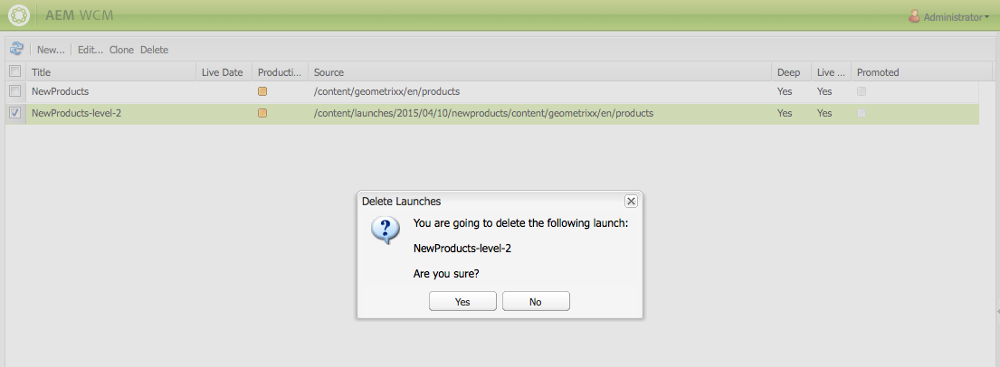

# 创建启动项{#creating-launches}

可创建启动项，以允许更新现有网页的新版本，以便将来激活。在创建启动项时，需要指定标题和源页面：

* 标题显示在 **Sidekick**，作者可以在其中访问这些组件以进行处理。
* 默认情况下，源页面的子页面包含在启动项中。必要时，可只使用源页面。
* 默认情况下，[Live Copy](/help/sites-administering/msm.md) 会在源页面发生更改时自动更新启动页面。您可以指定创建一个静态副本，以防止自动更改。

（可选）您可以指定启 **动日期** （和时间）以定义何时提升和激活启动页面。 但是，启 **动日期仅与生产就绪标** 志结合使用(请 **参阅编辑启动配置**);要使动作实际自动发生，必须同时设置这两个操作。

## 创建启动项 {#creating-a-launch}

以下过程将创建启动项。

1. 打开网站管理页面([http://localhost:4502/siteadmin](http://localhost:4502/siteadmin))。
1. 单击 **新建……** 则 **新建启动项……**.
1. 在 **创建启动项** 对话框，请指定以下属性的值：

   * **启动项标题**：启动项的名称。该名称应当体现出作者的相关信息。
   * **源页面**：要为其创建启动项的页面的路径。 默认情况下，将包含所有子页面。
   * **排除子页面**：选择此选项可仅为源页面创建启动项，而不为子页面创建启动项。 默认情况下，不选中此选项。
   * **保持同步**：选择此选项可在源页面发生更改时自动更新启动页面的内容。 这是通过将启动项设为 [live copy](/help/sites-administering/msm.md).
   * **启动日期**：激活启动副本的日期和时间（取决于&#x200B;**生产就绪**&#x200B;标记；请参阅[启动项 – 事件的顺序](/help/sites-authoring/launches.md#launches-the-order-of-events)）。

   

1. 单击&#x200B;**创建**。

## 删除启动项 {#deleting-a-launch}

您还可以删除启动项。

1. 在 [启动项控制台](/help/sites-classic-ui-authoring/classic-launches.md)，选择所需的启动项。
1. 单击 **删除**  — 需要确认：

   

   >[!CAUTION]
   >
   >删除嵌套启动项时，应先删除较低级别。
