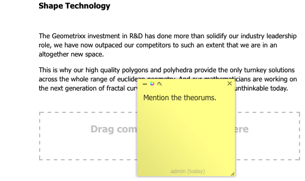

# 编辑页面时的批注{#annotations-when-editing-a-page}

向网站页面添加内容时，在实际发布之前通常会进行讨论。 为此，您可以添加注释，其中许多与内容直接相关的组件（例如，与布局相反）可以让您添加注释。

批注在页面上放置彩色标记/便笺。 您（或其他用户）可以通过注释给其他作者/审阅人留下意见和/或问题。

>[!NOTE]
>
>单个组件类型的定义决定是否可在该组件的实例中添加注释。

>[!NOTE]
>
>在经典UI中创建的批注也将显示在触屏优化UI中。 不过，草图是特定于UI的，并且仅在创建它们的UI中显示。

>[!CAUTION]
>
>删除资源（例如，段落）会删除附加到该资源的所有注释和草图；无论这些注释和草图在整个页面上的位置如何。

>[!NOTE]
>
>根据您的要求，您还可以开发一个工作流，用于在添加、更新或删除注释时发送通知。

## 注释 {#annotations}

根据段落设计，注释可作为上下文菜单上的选项（通常是鼠标右键置于所需段落上）或作为段落编辑栏上的按钮使用。

在任一情况下，选择 **批注**. 彩色便笺批注将应用于段落，您立即处于编辑模式，允许您直接添加文本：

您可以将注释移动到页面上的新位置。 单击顶部边框区域，然后按住并同时将注释拖到新位置。 这可以位于页面上的任何位置，不过以某种方式保持与段落的连接通常很有意义。

注释（包括相关的草图）也包含在对其所附加的段落执行的任何复制、剪切或删除操作中。 对于复制或剪切操作，注释（及相关草图）的位置将保持它们相对于原始段落的位置。

通过拖动右下角，还可以增加或减少注释的大小。

出于跟踪目的，页脚行指示创建注释的用户和日期。 后续作者可以编辑同一注释（更新页脚），或为同一段落创建另一个注释。

当您选择删除注释（删除注释也会删除附加到该注释的所有草图）时，会请求确认。

通过左上方的三个图标，可以最小化注释（以及任何相关的草图）、更改颜色并添加草图。

>[!NOTE]
>
>注释仅在创作环境的编辑模式下可见。
>
>它们在发布环境中不可见，在创作环境中提供的“预览”或“设计”模式中也不可见。

>[!NOTE]
>
>无法将注释添加到其他用户锁定的页面。

## 注释草图 {#annotation-sketches}

>[!NOTE]
>
>草绘在Internet Explorer中不可用，因此：
>
>* 图标未显示。
>* 在其他浏览器中创建的现有草图将不会显示。
>

草绘是注释的一个特征，它允许您在浏览器窗口上的任意位置创建简单的线形图形（可见部分）：

* 当处于草绘模式时，光标将变为十字线。 您可以绘制多条不同的线。
* 草图线反映注释颜色，可以是：

   * 手绘

     默认模式；释放鼠标按钮即可完成。

   * 直：

     按住 `ALT` 然后单击起点和终点；双击即可完成。

* 退出草绘模式后，可单击草绘线以选取该草绘。
* 通过选取草绘，然后将其拖动到所需位置来移动草绘。
* 草图会叠加内容。 这意味着在草绘的四个拐角内，不能单击基础段落。 例如，如果您必须编辑或访问链接。 如果出现此问题（例如，您的草图覆盖了页面的一大部分），请最小化相应的注释，因为这样还可以最小化所有相关草图，从而使您能够访问基础区域。
* 要删除单个草绘 — 选择所需的草绘，然后按 **删除** 键(**fn**-**退格符** (在Mac上)。

* 如果移动或复制段落，则还将移动或复制任何相关的注释及其草图；它们相对于段落的位置将保持不变。
* 如果您删除注释，则所有附加到该注释的草图也会被删除。
