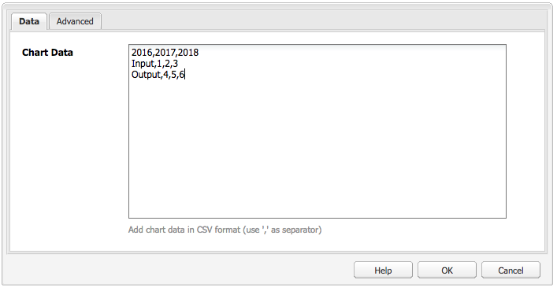
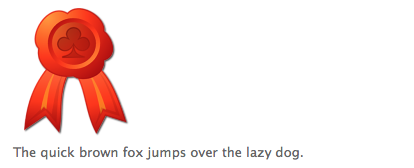

# 用于页面创作的组件{#components-for-page-authoring}

以下组件可在为标准网页创作内容时使用。 这些组件构成了可用于AEM标准安装的现成组件子集。

有些可以通过sidekick立即获取，而其他各种也可通过使用 [设计模式](/help/sites-classic-ui-authoring/classic-page-author-design-mode.md) 以启用/禁用它们。

>[!CAUTION]
>
>此部分仅讨论在标准 AEM 安装中现成可用的组件。
>
>根据您的实例，您可能已针对您的要求明确开发了自定义组件。 这些自定义组件甚至可能具有与此处讨论的某些组件相同的名称。

组件在以下情况下可用 [编辑页面](/help/sites-classic-ui-authoring/classic-page-author-edit-content.md) 从 **组件** 副手和副手的标签 **插入新组件** 选择器(当您双击 **将组件或资源拖动到此处** 区域)。

您可以选择某个组件并将其拖动到页面上的所需位置，然后 [编辑内容和属性](/help/sites-classic-ui-authoring/classic-page-author-edit-content.md#editing-a-component-content-and-properties).

组件根据各种类别（组件组）排序，包括（用于页面创作）：

* [常规](#general)：包括基本组件，如文本、图像、表格、图表等。
* [列](#columns)：包括组织内容布局所需的组件。
* [表单](#formgroup)：包括创建表单所需的所有组件。

## 常规 {#general}

常规组件是用于创建内容的基本组件。

### 帐户项 {#account-item}

您可以定义带有标题和描述的链接。


### 自适应图像 {#adaptive-image}

自适应图像基础组件生成大小适合打开网页的窗口的图像。 要使用该组件，需从文件系统或DAM提供图像资源。 当打开网页时，Web浏览器下载已调整大小的图像的副本，以使其适合当前窗口。

以下特性可确定窗口的大小：

* 设备屏幕：移动设备通常显示网页，以便它们在整个屏幕中扩展。
* Web浏览器窗口大小：便携式计算机和台式计算机的用户可以调整Web浏览器窗口的大小。

例如，当网页在手机上打开时，组件生成小图像，当在平板电脑上打开时，组件生成中等大小的图像。 在笔记本电脑上，组件会在页面在最大化的Web浏览器中打开时创建并传递大图像。 当Web浏览器调整大小以适合屏幕的一部分时，组件通过交付较小的图像来适应并刷新视图。

#### 支持的图像格式 {#supported-image-formats}

您可以将以下文件扩展名的图像文件与自适应图像组件结合使用：

* .jpg
* .jpeg
* .png
* .gif &#42;&#42;

>[!CAUTION]
>
>&#42;&#42; AEM for adaptive renditions不支持动画.gif文件。

#### 图像大小和质量 {#images-sizes-and-quality}

下表列出了为给定视区宽度生成的图像宽度。 计算所生成图像的高度以保持不变的长宽比，并且图像边缘内不会出现空格。 可使用裁剪来避免留空格。

当图像是JPEG图像时，视区大小也会影响JPEG质量。 可以使用以下JPEG特性：

* 低(0.42)
* 中(0.82)
* 高(1.00)

| 视区宽度范围（像素） | 图像宽度（像素） | JPEG 质量 | 目标设备类型 |
|---|---|---|---|
| 宽度&lt;= 319 | 320 | 低 |  |
| 宽度= 320 | 320 | 中 | 手机（纵向） |
| 320 &lt;宽度&lt; 481 | 480 | 中 | 手机（横向） |
| 480 &lt;宽度&lt; 769 | 476 | 高 | 平板电脑（纵向） |
| 768 &lt;宽度&lt; 1025 | 620 | 高 | 平板电脑（横向） |
| 宽度&lt;= 1025 | 完整（原始大小） | 高 | 桌面 |

#### 属性 {#properties}

通过对话框，您可以编辑自适应图像组件实例的属性，其中许多属性与它所基于的图像组件相同。 这些属性位于两个选项卡中：

* **图像**

   * **图像**
从内容查找器中拖动图像，或单击以打开可在其中加载图像的浏览窗口。 加载图像后，您可以裁切、旋转或删除图像。 要放大和缩小图像，请使用图像下方的滑动条（在“确定”和“取消”按钮上方）

   * **裁切**
允许您剪辑图像的各个部分。 拖动边框以裁切图像。

   * **旋转**
反复单击“旋转”，直到根据需要旋转图像为止。

   * **清除**
删除当前图像。

* **高级**

   * **标题**
自适应图像组件不使用此属性。

   * **替换文本**
用于图像的替换文本。

   * **链接到**
自适应图像组件不使用此属性。

   * **描述**
自适应图像组件不使用此属性。

#### 扩展自适应图像组件 {#extending-the-adaptive-image-component}

有关自定义自适应图像组件的信息，请参阅 [了解自适应图像组件](/help/sites-developing/responsive.md#using-adaptive-images).

### 轮盘 {#carousel}

利用轮盘组件，可显示与各个页面关联的图像：

* 一次一个
* 短时间
* 按照您指定的顺序
* 具有您指定的时间延迟

可单击的控件还允许用户根据需要实时循环显示页面。 选择当前可见的页面图像会将您转到该页面。 换句话说，轮播充当导航控件。

#### 属性 {#properties-1}

属性位于两个选项卡中：

* **轮播**
您可以在此处指定轮播的运行方式：

   * 播放速度显示下一张幻灯片之前的时间（以毫秒为单位）。
   * 过渡时间两张幻灯片之间的过渡时间（以毫秒为单位）。
   * 控件样式下拉菜单提供各种选项；例如“上一个/下一个按钮”、“右上切换”。

* **列表**
在此，您可以指定在轮播中包含页面的方式：

   * **使用以下项目生成列表**
可通过多种方法来构建页面列表 — 子页面、固定列表、搜索或高级搜索（均如下所述）。
无论您选择哪种方法，您包含在列表中的页面都应当已经有一个与页面关联的图像。 轮播中显示的就是此图像。 如果页面的页面属性下没有页面的图像，则应在开始之前将图像与页面关联。 否则，轮盘将显示一个空白页。 请参阅 [编辑页面属性](/help/sites-classic-ui-authoring/classic-page-author-edit-page-properties.md).
根据您选择的项目，将显示一个新面板：

      * **子页面选项**

         * **父页面**
手动或使用选择器指定路径。 留空将使用当前页面作为父页面。

      * **固定列表选项**

         * **页面**
选择页面列表。 使用 `+` 添加更多条目，使用向上/向下按钮调整顺序。

      * **搜索选项**

         * **开始位置**
手动或使用选择器输入起始路径。

         * **搜索查询**
您可以输入纯文本搜索查询。

      * **高级搜索选项**

         * **QueryBuilder谓词记号**
您可以使用Querybuilder谓词表示法输入搜索查询。 例如，您可以输入“fulltext=Marketing”，以使其内容中包含“Marketing”的所有页面都显示在轮播中。
请参阅 [QueryBuilder API](/help/sites-developing/querybuilder-api.md) 有关查询表达式的完整讨论和更多示例。

   * **排序方式**
选择 `jcr:title`， `jcr:created`， `cq:lastModified`，或 `cq:template` 下拉菜单中。

   * **限制**
可选。 要在轮播中使用的项目的最大数量。

>[!NOTE]
>
>您可以为Adobe Experience Manager创建一个自定义轮播组件，该组件在AEM DAM中显示数字资源。

### 图表 {#chart}

图表组件允许您添加条形图、折线图或饼图。 AEM会根据您提供的数据创建一个图表。 提供数据的方法是直接在“数据”选项卡中键入内容，或者复制并粘贴电子表格。

* **数据**

   * **图表数据**
使用CSV格式输入图表数据；逗号分隔值格式使用逗号(“，”)作为字段分隔符。

* **高级**

   * **图表类型**
从饼图、折线图和条形图中选择。

   * **替换文本**
显示的文本而非图表。

   * **宽度**
图表的宽度（像素）。

   * **高度**
图表的高度（像素）。

下面显示了一个图表数据示例，其后是生成的条形图：

 


### 内容片段 {#content-fragment}

>[!CAUTION]
>
>内容片段管理的完整功能仅适用于触控优化的UI。
>
>可以在经典UI Sidekick中看到内容片段组件，但无法提供其他功能。

[内容片段](/help/sites-classic-ui-authoring/classic-page-author-content-fragments.md) 创建和管理为独立于页面的资产。 您随后可以在创作内容页面时使用这些片段及其变体。

### 设计导入程序 {#design-importer}

允许您上传包含设计包的zip文件。

### 下载 {#download}

下载组件在选定网页上创建一个链接，用于下载特定文件。 您可以从内容查找器拖动资产或上传文件。

* **下载**

   * **描述**
与下载链接一起显示的简短描述。

   * **文件**
可在生成的网页上下载的文件。 从内容查找器中拖动资产，或选择区域，以便您可以上传要可供下载的文件。

以下示例显示了Geometrixx中的下载组件：


### 外部 {#external}

外部应用程序集成组件(**外部**)使您可以使用iframe将外部应用程序嵌入到AEM页面。

* **外部**

   * **目标应用程序**

     指定要集成的Web应用程序的URL；例如：

     ```
     https://en.wikipedia.org/wiki/Main_Page
     ```

   * **传递参数**

     选中方框，以便在需要时向应用程序传递参数。

   * **宽度和高度**

     定义iframe的大小

外部应用程序集成到AEM页面的段落系统中；例如，当使用的Target应用程序时 `https://en.wikipedia.org/wiki/Main_Page`：


>[!NOTE]
>
>根据您的用例，集成外部应用程序时可使用其他选项，例如 [Portlet的集成](/help/sites-administering/aem-as-portal.md).

### 闪光灯 {#flash}

通过Flash组件，可加载Flash影片。 您可以将Flash资源从内容查找器拖到组件上，也可以使用对话框：

* **闪光灯**

   * **Flash 影片**

     Flash影片文件。 从内容查找器中拖动资产，或单击以打开浏览窗口。

   * **大小**

     以像素为单位的Dimension，显示区域用于保存影片。

* **备用图像**

  要显示的替代图像

* **高级**

   * **上下文菜单**

     指示应显示还是隐藏上下文菜单。

   * **窗口模式**

     窗口的显示方式，例如，不透明、透明或作为不同的（实心）窗口。

   * **背景颜色**

     从提供的颜色图表中选择的背景颜色。

   * **最低版本**

     运行影片所需的AdobeFlash Player的最低版本。 默认值为9.0.0。

   * **属性**

     需要任何其它属性。

### 图像 {#image}

图像组件根据指定的参数显示图像和随附文本。

您可以上传图像，然后对其进行编辑和处理（例如，裁切、旋转、添加链接/标题/文本）。

您可以从以下位置拖放图像 [内容查找器](/help/sites-classic-ui-authoring/classic-page-author-env-tools.md#the-content-finder) 直接转到组件或其“编辑”对话框。 您还可以双击“编辑”对话框的中心区域来浏览本地文件系统并上传图像。 “编辑”对话框的两个选项卡还控制图像的所有定义和操作：


>[!NOTE]
>
>无法使用Internet Explorer监视上载进度。
>
>Internet Explorer用户必须上传图像并单击 **确定**，然后重新打开图像以在预览中查看上传的文件，并能够执行修改（即裁切）。
>
>请参阅 [认证平台](/help/release-notes/release-notes.md#certifiedplatforms) 部分以详细了解AEM使用的HTML5功能。

加载图像时，可以配置以下内容：

* **地图**

  要映射图像，请选择映射。 您可以指定创建图像映射的方式（矩形、多边形等）以及区域应指向的位置。

* **裁剪**

  选择“裁切”，以便裁切掉图像的一部分。 使用鼠标裁切图像。

* **旋转**

  要旋转图像，请选择旋转。 重复使用，直到图像以您想要的方式旋转。

* **清除**

  删除当前图像。

* **缩放栏**

  要放大和缩小图像，请使用图像下方的滑动条（在“确定”和“取消”按钮上方）

* **标题**

  图像的标题。

* **替换文本**

  创建无障碍内容时使用的替换文本。

* **链接到**

  创建指向网站内资产或其他页面的链接。

* **描述**

  图像的描述。

* **大小**

  设置图像的高度和宽度。

最终图像(包含 **标题** 和 **描述**)可以显示为：


### 布局容器 {#layout-container}

>[!CAUTION]
>
>虽然布局容器组件在经典UI中可用，但其完整功能仅在触屏UI中可用。 有关详细信息，请参阅 [响应式布局](/help/sites-classic-ui-authoring/classic-page-author-responsive-layout.md).

### 列表 {#list}

利用列表组件，可配置用于显示列表的搜索条件：

* **列表**

   * **生成列表对象**

     在此，您可以指定列表检索其内容的位置。 有多种方法：

   * 根据您选择的项目，将显示一个新面板：

      * **子页面选项**

         * **子项** （父页面）手动或使用选择器指定路径。 留空将使用当前页面作为父页面。

      * **固定列表选项**

         * **页面**

           选择页面列表。 使用+添加更多条目，使用上/下按钮调整顺序。

      * **搜索选项**

         * **开始**

           手动或使用选择器输入起始路径。

         * **搜索查询**

           您可以输入纯文本搜索查询。

      * **高级搜索选项**

         * **QueryBuilder 谓词记号**

           您可以使用Querybuilder谓词表示法输入搜索查询。 例如，您可以输入“fulltext=Marketing”，以使其内容中包含“Marketing”的所有页面都显示在轮播中。

           请参阅 [QueryBuilder API](/help/sites-developing/querybuilder-api.md) 有关查询表达式的完整讨论和更多示例。

      * **标记**

        指定 **父页面**， **标记/关键字**，以及所需的匹配条件。

   * **显示方式**

     您希望如何列出这些项目；包括链接、Teaser和新闻。

   * **排序依据**

     是否对列表进行排序，如果是，则为排序使用的标准。 您可以输入条件，也可以从提供的下拉列表中选择一个条件。

   * **限制**

     指定要在列表中显示的项目的最大数量。

   * **启用信息源**

     指示是否应为列表激活RSS馈送。

   * **每页显示条目数**

     在此处，您可以指定要一次显示的列表项数量。 具有比指定更多项目的列表使用分页将列表分为多个部分。

以下示例显示了 **列表** 以某种方式显示子页面列表的组件（设计由网站设计的自定义CSS定义控制）。


### 登录 {#login}

提供用户名和密码字段。


您可以配置：

* 登录

   * 区域标签

     输入字段的导入文本。

   * 用户名标签

     用于标记用户名字段的文本。

   * 密码标签

     用于标记密码字段的文本。

   * “登录”按钮标签

     登录按钮的文本。

   * 重定向到

     您可以在网站上指定用户登录后应打开的页面。

* 已登录

   * “继续”按钮标签

     用于指示用户已登录的文本。

### 订单状态 {#order-status}

* **标题**

   * **标题**

     指定要显示的标题文本。

   * **链接**

     指定应显示订单状态的页面（产品）。

   * **类型/大小**

     从提供的选择中选择。


### 引用 {#reference}

此 **引用** 组件允许您引用AEM网站其他页面（在当前实例中）的文本。 然后，引用的段落的内容会像在当前页面上一样显示。 当源段落发生更改（可能需要页面刷新）时，内容会更新。

* **段落引用**

   * **引用**

     指定要引用的页面和段落的路径（包括内容）。

要指定段落的路径，必须在路径（到页面）的后面添加以下内容：

`.../jcr:content/par/<paragraph-ID>`

例如：

`/content/geometrixx-outdoors/en/equipment/biking/cajamara/jcr:content/par/similar-products`

除了引用特定段落之外，还可以修改路径以指定整个段落系统。 使用以下内容为路径添加后缀：

`/jcr:content/par`

例如：

`/content/geometrixx-outdoors/en/equipment/biking/cajamara/jcr:content/par`

配置后，内容将与源页面上完全一致。 只有在打开组件进行编辑时，才会看到它是引用：


### 搜索 {#searching}

搜索组件可为页面添加搜索功能。

您可以配置：

* 搜索

   * **节点类型**

     如果将搜索限制到特定节点类型，请在此处列出它们；例如， `cq:Page`.

   * **搜索路径**

     指定要搜索的分支的根页面。

   * **搜索按钮文本**

     实际搜索按钮上显示的名称。

   * **统计信息文本**

     搜索结果上方显示的文本。

   * **无结果文本**

     如果没有结果，将显示此处输入的文本。

   * **拼写检查文本**

     如果某人输入了类似的词语，则此文本会在该词语之前显示。
例如，如果您键入 `Geometrixxe`，则系统显示“您的意思是？ Geometrixx&quot;.

   * **类似页面文本**

     在类似页面的结果旁边显示的文本。 若要剪去部分图像，请单击此链接。

   * **相关搜索文本**

     旁边显示的文本将搜索相关术语和主题。

   * **搜索趋势文本**

     用户输入的搜索词上方的标题。

   * **结果页面标签**

     此列表底部显示的文本，带有指向其他结果页面的链接。

   * **上一个标签**

     在指向以前的搜索页面的链接上显示的名称。

   * **下一个标签**

     在指向后续搜索页面的链接上显示的名称。

以下示例显示搜索单词后的搜索组件 *`geometrixx`* 从标准安装的根目录中。 它还说明了结果的分页：


以下示例显示了一个拼写错误且不可用的搜索词：


### Sitemap {#sitemap}

自动列出站点地图，该列表（默认设置）列出当前网站中的所有页面（作为活动链接）。 例如，提取显示：


如有必要，您可以配置：

* **Sitemap**

   * **根路径**

     列表开始位置的路径。

### 幻灯片放映 {#slideshow}

通过此组件，您可以加载一系列要在页面上显示为幻灯片放映的图像。 您可以添加或删除图像并为每个图像分配标题。 在“高级”下，还可以指定显示区域的大小。

您可以配置：

* **幻灯片**

   * **新幻灯片**

     您可以使用 **添加** (和 **移除**)按钮。

   * **标题**

     指定标题（如有必要）。 此标题叠加在相应的幻灯片上。

* **高级**

   * **大小**

     以像素为单位指定宽度和高度。

幻灯片放映组件随后会按顺序重复显示每个幻灯片，并在短时间内重复显示，然后淡入下一张幻灯片：


### 表 {#table}

>[!NOTE]
>
>此 **表** 组件基于 [富文本编辑器](/help/sites-classic-ui-authoring/classic-page-author-rich-text-editor.md)，即为 **[文本](#text)** 组件。
>
>Adobe建议您使用 **表** 表组件，尽管它们也可以使用 **文本** 组件。

此 **表** 组件已预配置为允许您构建、填充和格式化表。 使用该对话框，您可以配置表格并从头开始创建内容，或者通过从外部编辑器（如Excel、OpenOffice或记事本）复制并粘贴电子表格或表格来创建内容。


以下屏幕截图显示了表组件的示例；设计由特定于站点的CSS决定：


### 标记云 {#tag-cloud}

标记云以图形方式显示应用于网站内内容的标记选择：


配置标记云组件时，您可以指定：

* **要显示的标记**
从中收集要显示的标记的位置。 从页面、具有所有子项或所有标记的页面中进行选择。

* **页面**
选择要引用的页面。

* **标记上无链接**
显示的标记是否应作为链接。

有关应用标记的详细信息，请访问 [使用标记](/help/sites-classic-ui-authoring/classic-feature-tags.md).

### 文本 {#text}

>[!NOTE]
>
>此 **文本** 组件基于 [富文本编辑器](/help/sites-classic-ui-authoring/classic-page-author-rich-text-editor.md)，即为 **[表](#table)** 组件。
>
>Adobe建议您使用 **表** 表组件，尽管它们也可以使用 **文本** 组件。

文本组件允许您使用WYSIWYG编辑器输入文本块，该编辑器具有下列功能： [富文本编辑器](/help/sites-classic-ui-authoring/classic-page-author-rich-text-editor.md). 通过一系列图标可以设置文本的格式，包括字体特征、对齐方式、链接、列表和缩进。


当您打开 **样式** 选项卡 **编辑** 对话框，您还可以设置以下各项：

* **分隔条**
* **文本样式**

格式化文本随后将显示在页面上。 实际设计取决于站点CSS：


有关文本组件和富文本编辑器提供的功能的更多详细信息，请参阅 [富文本编辑器](/help/sites-classic-ui-authoring/classic-page-author-rich-text-editor.md) 页面。

#### 就地编辑 {#inplace-editing}

除了基于对话框的富文本编辑模式外，AEM还提供 [就地编辑](/help/sites-authoring/editing-content.md)，允许直接编辑显示在页面布局中的文本。

### 文本与图像 {#text-image}

文本和图像组件添加文本块和图像。 您还可以单独添加和编辑文本和图像。 请参阅 [文本](#text) 和 [图像](#image) 组件以了解详细信息。

 

您可以配置：

* **组件样式** (**样式**)

  在此，您可以向左或向右对齐图像。 默认为 **左侧** 对齐，与左侧的图像对齐。

* **图像属性** (**高级图像属性**)

  用于指定以下内容：

   * **图像资源**

     上传所需的图像。

   * **标题**

     块的标题。 这由鼠标悬停显示。

   * **替换文本**

     图像无法显示时要显示的替换文本。 如果留空，则使用标题。

   * **链接到**

     指定目标路径。

   * **描述**

     图像的描述。

   * **大小**

     设置图像的高度和宽度。

以下示例显示了一个文本图像组件，该组件以左对齐方式显示图像：



### 标题 {#title}

标题组件可以：

* 通过将“标题”字段留空来显示当前页面的名称。
* 显示您在“标题”字段中指定的文本。

您可以配置以下内容：

* **标题**

  如果要使用页面标题以外的名称，请在此处输入该名称。

* **链接**

  如果标题要作为链接运行，则为URI。

* **类型/大小**

  从下拉列表中选择小或大。 “小”作为图像生成。 “大”作为文本生成。

以下示例显示了 **标题** 显示的组件；设计由站点特定的CSS决定。


### 视频 {#video}

此 **视频** 组件允许您在页面上放置预定义的、开箱即用的视频元素。

另请参阅 [配置您的视频配置文件](/help/sites-administering/config-video.md#configuringvideoprofiles) 用于HTML5元素。

将组件的实例放置在页面上后，可以配置以下内容：

* 视频

   * **视频资产**

     上传或放置您的视频资产。

   * **大小**

     视频的本机大小（宽度x高度，以像素为单位）将显示在“大小”旁边的框中（请参阅上文）。 如果要覆盖视频的本机尺寸，请在此处手动输入宽度和高度尺寸。 选择 **确定** 关闭对话框。

>[!NOTE]
>
>支持的格式包括：
>
>* `.mp4`
>* `Ogg`
>* `FLV` (Flash视频)
>

## 列 {#columns}

列是一种在AEM中控制内容布局的机制。 在标准安装中，提供了用于创建两列和/或三列的组件。

以下示例显示了正在使用的两列和三列组件。 可以将占位符用于新组件：


### 2 列 {#columns-1}

列控件组件，默认使用两个相等的列。

### 3 列 {#columns-2}

列控件组件，默认为三个相等的列。

### 列控件 {#column-control}

列控件组件允许用户选择要如何将网页主面板中的内容拆分为多个列。 用户可以选择所需的列数（从预定义列表中），然后在每个列中创建、删除或移动内容。

* **列控件**

   * **列布局**

     选择要呈现的列数。 创建后，每个列都有自己的链接，用于在添加内容时拖动组件或资产。

## 表单 {#form}

表单组件用于创建表单，以供访客提交输入。 Forms和表单组件可用于收集包括用户反馈（例如客户满意度调查表）和用户信息（例如用户注册）的信息。

>[!NOTE]
>
>请参阅 [AEM Forms帮助](/help/forms/home.md) 了解有关AEM Forms的信息。

Forms由几个不同的组件组成：

* **表单**

  表单组件定义页面上新表单的开始和结束。 然后，可以将其他组件置于这些元素之间，例如表和下载。

* **表单字段和元素**

  表单字段和元素可以包括文本框、单选按钮和图像。 用户通常会在表单字段中完成一项操作，例如键入文本。 有关更多信息，请参阅各个表单元素。

* **配置文件组件**

  配置文件组件与用于社交协作和其他需要访客个性化的区域的访客配置文件相关。

下面显示了一个示例表单。 它由 **表单** 组件（开始和结束），带有两个 **表单** **文本** 用于输入的字段，a **常规** **文本** 用于引入文本和的字段 **提交** 按钮。


>[!NOTE]
>
>有关开发和自定义表单的信息，请访问 [“开发Forms”页面](/help/sites-developing/developing-forms.md). 此表单自定义包括添加操作、约束、预加载字段以及使用脚本调用服务到操作等。

### （许多）表单组件的通用设置 {#settings-common-to-many-form-components}

虽然每个表单组件的用途各不相同，但许多表单组件由类似的选项和参数组成。

配置任何表单组件时，对话框中提供以下选项卡：

* **标题与文本**

  在此，必须指定基本信息，例如表单的标题和任何随附文本。 在适当时，它还允许您定义其他关键信息，例如字段是否可多选，以及是否可供选择的项。

* **初始值**

  用于指定默认值。

* **约束**

  您可以在此指定是否需要某个字段，并在该字段上放置约束，例如是数字。

* **样式**

  指示字段的大小和样式。

>[!NOTE]
>
>您看到的字段因各个组件而存在显着差异。

这些选项卡为您提供了必要的参数。 这些选项卡取决于单个组件类型，但可包括以下内容：

* **标题与文本**

   * **元素名称**

     表单元素的名称。 它指示数据存储到存储库中的什么位置。
此字段为必填项，应当仅包含以下字符：

      * 字母数字字符
      * `_ . / : -`

   * **标题**

     与字段一起显示的标题。 如果留空，将显示默认标题。

   * **描述**

     允许您根据需要为用户提供其他信息。 在表单上，此描述以比标题小的字体显示在字段下方。

   * **显示/隐藏**

     确定字段何时可见。

* **初始值**

   * **默认值**

     打开表单时显示在字段中的值。 也就是说，在用户输入任何内容之前。

* **约束**

   * **必填**

     此约束取决于表单组件类型，但提供一个或多个单击框以指示该字段是必填的，或该字段的某些部分是必填的。

   * **必需的消息**

     用于通知用户此字段为必填的消息。 必填字段标记有星号。

   * **约束**

     可供选择的约束取决于表单元件类型。

   * **约束消息**

     通知用户所需内容的消息。

* **样式**

   * **大小**

     在行和列中。

   * **宽度**

     按像素。

   * **CSS**

### 表单（组件） {#form-component}

表单组件使用定义表单的开头和结尾 **表单开始** 和 **表单结尾** 元素。 开始元素和结束元素始终是配对的，以确保正确定义表单。


在表单的开头和结尾之间，您可以添加表单组件，以定义用户的实际输入字段。

#### 表单的开头 {#start-of-form}

此所需组件定义页面上新表单的开头。 您可以配置以下内容：

* **表单**

   * **感谢页面**

     要引用以感谢访客提供其输入的页面。 如果留空，表单会在提交后重新显示。

   * **启动工作流**

     确定在提交表单后触发的工作流。

* **高级**

   * **操作类型**

     表单需要操作。 操作定义使用用户提交的数据触发执行的操作(与HTML中的action=类似)。 有些客户需要相应的 **操作配置**.

     标准AEM安装中包含一系列操作类型：

      * **帐户请求**
      * **创建内容**
      * **创建潜在客户**
      * **创建和更新帐户**
      * **电子邮件服务: 创建订阅者并添加到列表**
      * **电子邮件服务: 发送自动回复的电子邮件**
      * **电子邮件服务: 使用户从列表中取消订阅**
      * **编辑社区**
      * **编辑资源**
      * **编辑工作流控制的资源**
      * **邮件**
      * **所下的订单明细**
      * **个人资料更新**
      * **重置密码**
      * **设置密码**
      * **存储内容**

        默认操作类型。

      * **通过上传存储内容**
      * **提交订单**
      * **取消订阅者的订阅**
      * **更新订单**

   * **表单标识符**

     表单标识符唯一标识表单。 如果单个页面上有多个表单，请使用表单标识符；请确保它们具有不同的标识符。

   * **加载路径**

     用于将预定义值加载到表单字段中的节点属性的路径。
此字段是可选的，用于指定存储库中节点的路径。 当此节点具有匹配字段名称的属性时，表单上的相应字段将预加载这些属性的值。 如果不存在匹配项，则字段包含默认值。
使用 **加载路径** 您可以预加载包含必填字段中的值的表单。 请参阅 [预载表单值](/help/sites-developing/developing-forms.md#preloading-form-values).

   * **客户端验证**

     指示此表单是否需要客户端验证（服务器验证） *始终* 发生次数。)。 使用进行验证 **Forms验证码** 组件。

   * **验证资源类型**

     如果要验证整个表单（而不是单个字段），请定义表单验证资源类型。 如果要验证完整的表单，还应包括以下内容之一：

      * 用于客户端验证的脚本：

        `/apps/<myApp>/form/<myValidation>/formclientvalidation.jsp`

      * 用于服务器端验证的脚本：

        `/apps/<myApp>/form/<myValidation>/formservervalidation.jsp`

   * **操作配置**

     中可用的选项 **操作配置** 取决于选定的 **操作类型**：

      * **帐户请求**

         * **创建帐户页**
创建帐户时使用的页面。

      * **创建内容**

         * 内容路径表单转储的任何内容的内容路径。 输入以斜杠结尾的路径 `/`. 斜杠表示对于每个表单端口，将在给定位置创建一个新节点；例如：
           `/forms/feedback/`

         * **类型**

           选择所需的类型。

         * **表单**

           指定表单。

         * **呈现工具**

           从列表中选择所需的选项。

         * **资源类型**

           如果设置，它将被添加到每个注释中，作为 `sling:resourceType`

         * **视图选择器**

      * **创建潜在客户**

         * **潜在客户将添加到此列表**
指定所需的潜在客户列表。

      * **创建和更新帐户**

         * **初始的组**

           要为其分配新用户的组。

         * **起始**

           成功登录后显示的页面。

         * **路径**

           创建和存储新帐户的路径（相对）。

         * **查看数据...**

           选择按钮，以便在批量编辑器中访问有关表单结果的信息。 从此处，您可以将信息导出到 `.tsv` （制表符分隔）文件（例如用于Excel电子表格中）。

      * **邮件**

         * **发件人**

           输入电子邮件应来自的电子邮件地址。

         * **发送到**

           输入表单发送到的一个或多个电子邮件地址。

         * **抄送**

           输入一个或多个抄送电子邮件地址。

         * **BCC**

           输入一个或多个密送电子邮件地址。

         * **主题**

           输入电子邮件的主题。

      * **重置密码**

         * **更改密码页**

           更改密码时使用的页面。

      * **存储内容**

         * **内容路径**

           表单转储的任何内容的内容路径。 输入以斜杠结尾的路径 `/`. 斜杠表示对于每个表单端口，将在给定位置创建一个新节点；例如：
           `/forms/feedback/`

         * **查看数据...**

           选择按钮，以便在批量编辑器中访问有关表单结果的信息。 从此处，您可以将信息导出到.tsv（制表符分隔）文件（例如用于Excel电子表格中）。

      * **通过上传存储内容**

        具有与相同的选项 **存储内容**.

      * **取消订阅者的订阅**

         * **潜在客户将从此列表中删除**

           指定所需的潜在客户列表。

#### 表单结尾 {#end-of-form}

标记表单的结尾。 您可以配置以下内容：

* **表单结尾**

   * **显示提交按钮**

     指示是否应显示提交按钮。

   * **提交名**

     标识符（如果您在表单中使用多个提交按钮）。

   * **提交标题**

     按钮上显示的名称，如“提交”或“发送”。

   * **显示重设按钮**

     选中该复选框可使“重置”按钮可见。

   * **重置标题**

     “重置”按钮上显示的名称。

   * **描述**

     按钮下方显示的信息。

### 帐户名称 {#account-name}

允许用户输入帐户名称：


### 地址 {#address}

允许您添加具有以下格式的国际地址字段：


该组件配置为立即使用，但您可以根据需要更改配置。 例如，可以为地址的单个元素添加约束。 将字段留空表示使用默认设置。

### 验证码 {#captcha}

Captcha组件要求用户键入屏幕上显示的字母数字字符串。 字符串会随着每次刷新而更改。


您可以为此组件配置各种参数，包括验证码字符串无效时要显示的消息。

### 复选框组 {#checkbox-group}

通过复选框，您可以构建一个或多个复选框的列表，同时可以选择多个复选框。


您可以指定各种参数，包括标题、描述和元素名称。 使用+和 — 按钮，您可以添加或删除项目，然后使用向上箭头和向下箭头放置它们。

>[!NOTE]
>
>使用 **项目加载路径** 可以使用值预加载复选框组列表。
>
>请参阅 [预载具有多个值的表单字段](/help/sites-developing/developing-forms.md#preloading-form-fields-with-multiple-values).

### 信用卡详细信息 {#credit-card-details}

允许您提供输入信用卡详细信息所需的字段。 您可以对其进行配置，以指定接受的卡类型以及所需的信息（例如安全代码）。


### 下拉列表 {#dropdown-list}

下拉列表可以配置为为您提供一系列值供您选择：


您可以指定要显示在列表中的标题和项目。 使用+和 — 按钮，您可以添加或删除列表项，然后使用“向上”和“向下”按钮放置它们。 您可以指定是否允许用户从列表中选择多个项目，以及用户首次打开列表时应自动选择的任何项目（初始值）。

>[!NOTE]
>
>使用 **项目加载路径** 您可以使用值预加载下拉列表。
>
>请参阅 [预载具有多个值的表单字段](/help/sites-developing/developing-forms.md#preloading-form-fields-with-multiple-values).

### 文件上传 {#file-upload}

文件上传组件为用户提供了一种选择和上传文件的机制。


### 隐藏字段 {#hidden-field}

利用此组件，可创建隐藏字段。 这些隐藏字段可用于各种用途，例如，在提交表单后必须执行操作时，或者在后处理中需要隐藏数据时。


>[!NOTE]
>
>您还可以自定义表单，以根据表单中其他字段的值显示或隐藏特定表单组件。 仅在特定条件下需要表单字段时，更改该字段的可见性很有用。
>
>请参阅 [显示和隐藏表单组件](/help/sites-developing/developing-forms.md#showing-and-hiding-form-components).

### 图像按钮 {#image-button}

图像按钮允许您创建具有自己的图像和文本的按钮：


### 图像上传 {#image-upload}

图像上传组件为用户提供了一种选择和上传图像文件的机制。


### 链接字段 {#link-field}

链接字段允许用户指定URL：


最常用于日历事件表单，其中用于事件的URL/链接字段。

### 密码字段 {#password-field}

允许用户输入密码：


### 密码重置 {#password-reset}

此组件为用户提供以下两个字段：

* 密码的输入
* 反复输入密码以检查输入是否正确。

在默认设置下，该组件显示如下：


### 单选按钮组 {#radio-group}

单选按钮组为您提供一个或多个单选复选框的列表，在任何特定时间只能选择其中一个复选框。

您可以指定元素名称以及标题和描述。 使用+和 — 按钮，您可以添加或删除项目，使用向上和向下箭头放置它们，并在必要时指定默认值：


>[!NOTE]
>
>使用 **项目加载路径** 可以使用值预加载单选按钮组。
>
>请参阅 [预载具有多个值的表单字段](/help/sites-developing/developing-forms.md#preloading-form-fields-with-multiple-values).

### “提交”按钮 {#submit-button}

利用此组件，可创建包含默认文本的提交按钮：


或者使用您自己的文本：


### 标记字段 {#tags-field}

此字段允许您选择标记：


您可以使用专用选项卡指定各种参数，包括可以使用的命名空间：

* **标记字段**

   * **允许的命名空间**

      * **Geometrixx Outdoors**
      * **工作流**
      * **论坛**
      * **Stock摄影**
      * **Geometrixx Media**
      * **标准标记**
      * **营销**
      * **资产属性**

   * **以像素为单位的宽度**
   * **弹出窗口大小**

### 文本字段 {#text-field}

可以将标准文本字段配置为所需的大小，并在消息中拥有您自己的潜在客户：


### 工作流提交按钮 {#workflow-submit-button-s}

允许创建在工作流中使用的提交按钮。


