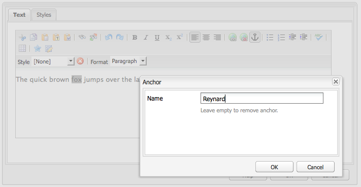

# 富文本编辑器 {#rich-text-editor}

富文本编辑器是向 AEM 输入文本内容的基本构建基块。它是多个组件的基础，包括：

* 文本
* 文本图像
* 表

## 富文本编辑器 {#rich-text-editor-1}

所见即所得的编辑对话框提供丰富的功能：

>[!NOTE]
>
>这些功能可针对各项目进行配置，因此在您的安装中可能会有所不同。

## 就地编辑  {#in-place-editing}

除了基于对话框的富文本编辑模式，AEM 还提供就地编辑模式，可在页面布局中直接编辑文本。

在段落上连续点击两次（稍慢的双击），即可进入就地编辑模式（组件边框会变为橙色）。

此时您可直接在页面上编辑文本，而无需在对话框中操作。完成修改后会自动保存。

>[!NOTE]
>
>若内容查找器已打开，则会在选项卡顶部显示带有 RTE 格式选项的工具栏（如上图）。
>
>若内容查找器未打开，则不会显示该工具栏。

当前，就地编辑模式适用于由&#x200B;**文本**&#x200B;和&#x200B;**标题**&#x200B;组件生成的页面元素。

>[!NOTE]
>
>[!UICONTROL 标题]组件的设计用于存放无换行的简短文本。在就地编辑模式下编辑标题时，如果输入换行，则会在标题下方新建一个&#x200B;**文本**&#x200B;组件。

## 富文本编辑器的功能 {#features-of-the-rich-text-editor}

富文本编辑器提供多种功能，这些功能[取决于各组件的配置](/help/sites-administering/rich-text-editor.md)。这些功能同时适用于触屏优化 UI 和经典 UI。

### 基础字符格式 {#basic-character-formats}

您可以对所选（高亮）字符应用格式，一些选项还支持快捷键：

* 粗体（Ctrl+B）
* 斜体（Ctrl+I）
* 下划线（Ctrl+U）
* 下标
* 上标

所有操作均为切换模式，再次选择即可移除格式。

### 预定义样式与格式 {#predefined-styles-and-formats}

您的安装中可能包含预定义的样式与格式。这些选项可通过&#x200B;**[!UICONTROL 样式]**&#x200B;和&#x200B;**[!UICONTROL 格式]**&#x200B;下拉菜单使用，并可应用于所选文本。

样式可应用于特定字符串（样式与 CSS 对应）：

而格式则应用于整个段落（基于 HTML 的格式）：

特定格式只能被替换（默认格式为&#x200B;**[!UICONTROL 段落]**）。

样式可被移除；将光标置于已应用样式的文本中，然后点击移除图标：

>[!CAUTION]
>
>请勿重选任何已应用样式的文本，否则该图标将变为不可用。

### 剪切、复制、粘贴 {#cut-copy-paste}

标准的&#x200B;**[!UICONTROL 剪切]**&#x200B;与&#x200B;**[!UICONTROL 复制]**&#x200B;功能均可使用。提供多种&#x200B;**[!UICONTROL 粘贴]**&#x200B;方式，以满足不同格式需求。

* 剪切（Ctrl+X）
* 复制（Ctrl+C）
* 粘贴
这是组件的默认粘贴方式（Ctrl+V）；在开箱即用的安装中，此功能会被配置为[!UICONTROL 从 Word 粘贴]。

* 粘贴为文本：移除所有样式与格式，仅粘贴纯文本。

* 从 Word 粘贴：将内容作为 HTML 进行粘贴（并进行必要的重新格式化）。

### 撤消、重做 {#undo-redo}

AEM 会按时间顺序记录您在当前组件中的最近 50 个操作。这些操作可以按照严格的顺序撤销（或重做），以满足需要。

>[!CAUTION]
>
>历史记录仅在当前编辑会话中有效。每次打开组件进行编辑时，历史记录都会重置。

>[!NOTE]
>
>默认记录的任务数为 50。具体数值可能因您的安装而异。

### 对齐方式 {#alignment}

文本可设置为左对齐、居中或右对齐。

### 缩进 {#indentation}

段落缩进可增加或减少。所选段落会缩进，之后输入的新文本将会继承当前缩进级别。

### 列表 {#lists}

文本中可创建项目符号列表与编号列表。可以先选择列表类型再输入文本，也可以选中文本后将其转化为列表。在两种情况下，换行都会生成新的列表项。

通过缩进一个或多个列表项，可以创建嵌套列表。

只需将光标置于列表内并选择其他样式，即可更改列表样式。子列表可采用与父列表不同的样式。在通过缩进创建子列表后即可应用此样式。

### 链接 {#links}

要生成指向 URL（可为网站内部或外部位置）的链接，请先选中所需文本，然后点击超链接图标：

此时会弹出一个对话框，您可以指定目标 URL，并选择是否在新窗口中打开。

您可以：

* 直接输入 URI
* 使用网站地图选择网站内的页面
* 输入 URI 后附加目标锚点；例如：`www.TargetUri.org#AnchorName`
* 仅输入锚点（以引用“当前页面”）；例如：`#anchor`
* 内容查找器中搜索页面，然后将页面图标拖入超链接对话框

>[!NOTE]
>
>URI 可使用您安装中已配置的任意协议作为前缀。标准安装中支持的协议包括 `https://`、`ftp://` 和 `mailto:`。未配置的协议将会遭到拒绝并标记为无效。

如需取消链接，将光标置于链接文本内任意位置，然后点击[!UICONTROL 取消链接]图标：

### 锚点 {#anchors}

您可以在文本任意位置创建锚点：既可直接将光标定位到某处，也可选中一些文本。然后点击&#x200B;**锚点**&#x200B;图标来打开对话框。

输入锚点名称并点击&#x200B;**确定**&#x200B;以保存。

组件处于编辑状态时，锚点会显示出来，并可作为链接目标使用。

### 查找和替换 {#find-and-replace}

AEM 提供&#x200B;**查找**&#x200B;与&#x200B;**替换**&#x200B;功能。

两者都配有&#x200B;**查找下一个**&#x200B;按钮，用于在当前打开的组件中查找指定文本。您还可以指定是否匹配大小写。

搜索始终会从文本中的当前光标位置开始。当搜索到组件末尾时，系统会提示下次搜索将从文本开头继续。

**替换**&#x200B;选项允许您先&#x200B;**查找**，再将某一实例&#x200B;**替换**&#x200B;为指定文本，或在当前的组件中&#x200B;**替换全部**&#x200B;实例。

### 图像 {#images}

可以将图像从内容查找器中拖拽到文本中进行添加。

>[!NOTE]
>
>AEM 还提供专用组件，以支持更详细的图像配置。例如，您可以使用&#x200B;**图像**&#x200B;和&#x200B;**文本图像**&#x200B;组件。

### 拼写检查器 {#spelling-checker}

拼写检查器会检查当前组件中的所有文本。

任何拼写错误都会被高亮标记：

>[!NOTE]
>
>拼写检查器会根据网站语言运行，具体取自子树的语言属性，或从 URL 中解析语言信息。例如，`en` 分支会按英文检查，`de` 分支会按德文检查。

### 表格 {#tables}

表格功能可通过以下两种方式使用：

* 作为独立的&#x200B;**表格**&#x200B;组件

  

* 在&#x200B;**文本**&#x200B;组件中插入表格

  

  >[!NOTE]
  >
  >尽管富文本编辑器中提供表格功能，但建议在创建表格时使用独立的&#x200B;**表格**&#x200B;组件。

在&#x200B;**文本**&#x200B;和&#x200B;**表格**&#x200B;组件中，都可通过表格内的上下文菜单（通常是鼠标右键）使用表格功能，例如：

>[!NOTE]
>
>在&#x200B;**表格**&#x200B;组件中，还提供专用工具栏，其中包含各种标准的富文本编辑功能，以及部分表格专属功能。

表格专属功能包括：

* [表格属性](#table-properties)
* [单元格属性](#cell-properties)
* [添加或删除行](#add-or-delete-rows)
* [添加或删除列](#add-or-delete-columns)
* [选择整行或整列](#selecting-entire-rows-or-columns)
* [合并单元格](#merge-cells)
* [拆分单元格](#split-cells)
* [嵌套表格](#creating-nested-tables)
* [移除表格](#remove-table)

#### 表格属性 {#table-properties}

可配置表格的基本属性，然后点击&#x200B;**确定**&#x200B;以保存：

* **宽度**：表格的总宽度。

* **高度**：表格的总高度。

* **边框**：表格边框的大小。

* **单元格内边距**：定义单元格内容与边框之间的空白。

* **单元格间距**：定义单元格之间的距离。

>[!NOTE]
>
>部分单元格属性（如宽度与高度）可设置为像素或百分比。

>[!CAUTION]
>
>Adobe 建议您为表格定义宽度。

#### 单元格属性 {#cell-properties}

您可以配置某个单元格或一组单元格的属性：

* **宽度**
* **高度**
* **水平对齐**——左对齐、居中或右对齐
* **垂直对齐**——顶端、居中、底端或基线
* **单元格类型**——数据或标头
* **应用范围：**&#x200B;单个单元格、整行或整列

#### 添加或删除行 {#add-or-delete-rows}

可在当前行的上方或下方添加新行。

也可以删除当前行。

#### 添加或删除列 {#add-or-delete-columns}

可在当前列的左侧或右侧添加新列。

也可以删除当前列。

#### 选择整行或整列 {#selecting-entire-rows-or-columns}

选择整行或整列。随后可执行特定操作（例如合并）。

#### 合并单元格 {#merge-cells}

 

* 如果选中一组单元格，可以将其合并为一个。
* 如果仅选中一个单元格，则可以将其与右侧或下方的单元格合并。

#### 拆分单元格 {#split-cells}

选择单个单元格即可拆分：

* 水平拆分会在当前单元格右侧、同一列内生成一个新单元格。
* 垂直拆分会在当前单元格下方、同一行内生成一个新单元格。

#### 创建嵌套表格 {#creating-nested-tables}

在当前单元格内创建嵌套表格，相当于在单元格中嵌入一个独立表格。

>[!NOTE]
>
>部分附加行为依赖于浏览器：
>
>* Windows IE：使用 Ctrl + 主鼠标键（通常是左键）点击以选择多个单元格。
>* Firefox：拖动鼠标指针以选择单元格范围。

#### 移除表格 {#remove-table}

可通过&#x200B;**[!UICONTROL 文本]**&#x200B;组件中的相关选项移除表格。

### 特殊字符 {#special-characters}

您可以在富文本编辑器中启用特殊字符，具体字符集可能因安装情况而异。

将鼠标悬停在字符上可放大预览，点击即可将字符插入到文本的当前位置。

### 源代码编辑模式 {#source-editing-mode}

源代码编辑模式允许您查看并编辑组件的底层 HTML。

因此，文本：

在源代码模式下会显示如下内容（通常源代码更长，因此需要滚动浏览）：

>[!CAUTION]
>
>退出源代码模式时，AEM 会进行一些验证检查（例如确保文本正确嵌套在区块中）。这可能会导致您的编辑发生更改。
