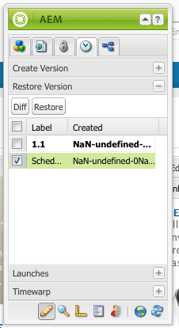

# 处理页面版本{#working-with-page-versions}

版本控制可创建页面在特定时间点的“快照”。使用版本控制，您可以执行下列操作：

* 创建页面的版本。
* 将页面还原到以前的版本，以撤消您对页面所做的更改，例如。
* 将页面的当前版本与突出显示的文本和图像存在差异的先前版本进行比较。

## 创建新版本 {#creating-a-new-version}

要创建页面的新版本，请执行以下操作：

1. 在浏览器中，打开要为其创建新版本的页面。
1. 在Sidekick中，选择 **版本控制** 选项卡，然后 **创建版本** 子选项卡。

   

1. 输入 **注释** （可选）。
1. 要设置版本的标签（可选），请单击 **更多>>** 按钮并设置 **标签** 以命名版本。 如果未设置标签，则版本是一个自动递增的数字。
1. 单击 **创建版本**. 页面上将显示一条灰显的消息；例如：为衬衫创建的版本1.2。

>[!NOTE]
>
>激活页面时会自动创建版本。

## 从Sidekick中恢复页面版本 {#restoring-a-page-version-from-sidekick}

要将页面还原到以前的版本，请执行以下操作：

1. 打开要恢复先前版本的页面。
1. 在副手中，选择 **版本控制** 选项卡，然后 **恢复版本** 子选项卡。

   

1. 选择要还原的版本，然后选择 **恢复**.

## 从控制台恢复页面版本 {#restoring-a-page-version-from-the-console}

此方法可用于还原页面版本。 它也可用于恢复之前已删除的页面：

1. 在 **网站** 控制台，导航到要还原的页面并将其选定。
1. 从顶部菜单中选择 **工具**，则 **恢复**：

   

1. 选择 **恢复版本……** 列出当前文件夹中的文档版本。 即使页面已被删除，也会列出最后一个版本：

   

1. 选择要还原的版本，然后单击 **恢复**. AEM将恢复您选择的版本（或树）。

### 从控制台恢复树 {#restoring-a-tree-from-the-console}

此方法可用于还原页面版本。 它也可用于恢复之前已删除的页面：

1. 在 **网站** 控制台，导航到要还原的文件夹并将其选定。
1. 从顶部菜单中选择 **工具**，则 **恢复**.
1. 选择 **恢复树……** 打开对话框以允许您选择要还原的树：

   

1. 单击 **恢复**. AEM将恢复您选择的树。

## 与上一个版本比较 {#comparing-with-a-previous-version}

要将页面的当前版本与先前版本进行比较，请执行以下操作：

1. 在浏览器中，打开要与先前版本进行比较的页面。
1. 在Sidekick中，选择 **版本控制** 选项卡，然后 **恢复版本** n个子选项卡。

   

1. 选择要比较的版本，然后单击 **差异** 按钮。
1. 当前版本与所选版本之间的差异显示如下：

   * 已删除的文本显示为红色并划过。
   * 添加的文本为绿色并突出显示。
   * 已添加或删除的图像以绿色框显示。

   

1. 在Sidekick中，选择 **恢复版本** 子选项卡，然后单击 **&lt;&lt;back span=&quot;&quot; id=&quot;3&quot; translate=&quot;no&quot; /> 按钮以显示当前版本。**

## 时间扭曲 {#timewarp}

时间扭曲是一项功能，旨在模拟过去特定时间某个页面的&#x200B;***已发布***&#x200B;状态。

其目的是让您能够在选定的时间点跟踪已发布的网站。 这将使用页面激活来确定发布环境的状态。

要执行此操作：

* 系统会查找在选定时间处于活动状态的页面版本。
* 这表示显示的版本是在“时间扭曲”中选择的时间点&#x200B;*之前*&#x200B;创建/激活的。
* 当浏览到已经删除的页面时，也会呈现相应的页面版本 — 只要该页面的旧版本仍然在存储库中即可。
* 如果未找到发布的版本，则时间扭曲会还原到该页面在创作环境中的当前状态（这是为了防止出现错误/404页面，这意味着您无法再浏览）。

>[!NOTE]
>
>如果从存储库中删除了版本，则时间扭曲无法显示正确的视图。 此外，如果呈现网站的元素（如代码、css和图像）发生更改，则视图将与它原来的样子不同，因为这些项目不在存储库中进行版本控制。

### 使用时间扭曲日历 {#using-the-timewarp-calendar}

时间扭曲可从sidekick获得。

如果您要查看特定日期，则使用日历版本：

1. 打开 **版本控制** 选项卡，然后单击 **时间扭曲** （接近侧脚底部）。 将显示以下对话框：

   

1. 使用日期和时间选择器指定所需的日期/时间，然后单击 **开始**.

   时间扭曲将显示在选定日期之前/当天处于已发布状态的页面。

   >[!NOTE]
   >
   >仅当您之前已发布页面时，时间扭曲才会完全正常工作。 如果没有，时间扭曲将在创作环境显示当前页面。

   >[!NOTE]
   >
   >如果浏览到的页面已从存储库删除或删除，则当该页面的旧版本仍然在存储库中时，该页面将正常呈现。

   >[!NOTE]
   >
   >您无法编辑页面的旧版本。 旧版本仅供查看。如果要恢复旧版本，请使用手动恢复 [恢复](/help/sites-classic-ui-authoring/classic-page-author-work-with-versions.md#restoring-a-page-version-from-sidekick).

1. 查看完页面后，单击：

   * **退出时间扭曲** 以退出并返回当前创作页面。
   * [显示时间轴](#using-the-timewarp-timeline) 以查看时间线。

   

### 使用时间扭曲时间轴 {#using-the-timewarp-timeline}

如果您想在页面上查看发布活动的概述，可使用时间轴版本。

如果要查看文档的时间线：

1. 要显示时间轴，请执行下列操作之一：

   1. 打开 **版本控制** 选项卡，然后单击 **时间扭曲** （接近侧脚底部）。

   1. 使用之后显示的sidekick对话框 [使用时间扭曲日历](#using-the-timewarp-calendar).

1. 单击 **显示时间轴**  — 显示文档的时间轴；例如：

   

1. 选择并移动（按住并拖动）时间轴以在文档的时间轴中移动。

   * 所有行都指示已发布的版本。
激活页面后，即开始一个新行。 每次编辑文档时，都会显示新颜色。
在以下示例中，红线表示页面在初始绿色版本的时间范围内进行编辑，黄线表示页面在红色版本期间进行编辑，依此类推。

   

1. 单击:

   1. **开始** 显示已发布页面在选定时间的内容。
   1. 显示该内容时，请使用 **退出时间扭曲** 以退出并返回当前创作页面。

### 时间扭曲限制 {#timewarp-limitations}

时间扭曲会尽量在选定的时刻重现页面。但是，由于在 AEM 中连续创作内容的过程非常复杂，并非总能实现这一点。在使用时间扭曲时，应牢记以下限制。

* **时间扭曲基于已发布的页面工作** – 仅当您之前已发布页面时，时间扭曲才会完全正常工作。如果没有，时间扭曲将在创作环境显示当前页面。
* **时间扭曲使用页面版本** – 当您浏览到的页面已从存储库删除时，如果该页面的旧版本仍然位于存储库中，则该页面将会正常呈现。
* **已删除的版本会影响时间扭曲** – 如果从存储库从删除了版本，那么时间扭曲无法显示正确的视图。

* **时间扭曲为只读** – 您无法编辑页面的旧版本。旧版本仅供查看。如果要恢复旧版本，请使用手动恢复 [恢复](#main-pars-title-1).

* **时间扭曲仅基于页面内容**  — 如果呈现网站的元素（如代码、css和图像资产）发生更改，则视图将与它原来的样子不同，因为这些项目不在存储库中进行版本控制。

>[!CAUTION]
>
>时间扭曲旨在帮助作者理解和创建其内容。 而不是用作审查日志或用于法律目的。
