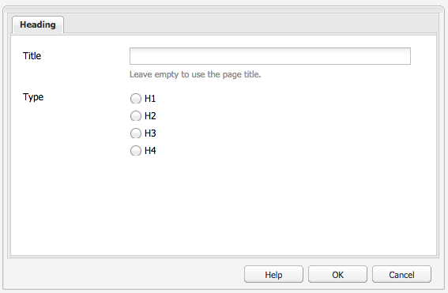

# Adobe Campaign组件{#adobe-campaign-components}

与Adobe Campaign集成时，您拥有的组件可用于处理新闻稿和表单。 本文档中对此进行了说明。

>[!CAUTION]
>
>已弃用AEM电子邮件组件。 由于电子邮件将内容和样式融合在一起，因此由AEM提供的现成可用电子邮件组件对于客户的重用受到限制，因为需要将自定义样式实施到项目所需的任何组件中。
>
>电子邮件组件可以在项目级别实施，已弃用的AEM电子邮件组件说明了如何实现这一点。 但是，请勿在项目中使用这些已弃用的组件。

## Adobe Campaign新闻稿组件 {#adobe-campaign-newsletter-components}

所有Campaign组件都遵循[电子邮件模板最佳实践](/help/sites-administering/best-practices-for-email-templates.md)中概述的最佳实践，并且基于Adobe标记语言[HTL](https://helpx.adobe.com/cn/experience-manager/htl/using/overview.html)。

当您打开配置为与Adobe Campaign集成的新闻稿/电子邮件时，您应会在&#x200B;**Adobe Campaign新闻稿**&#x200B;部分中看到以下组件：

* 标题（营销活动）
* 图像（营销活动）
* 链接 (营销活动)
* Scene7 图像模板（营销活动）
* 目标引用（营销活动）
* 文本与图像（营销活动）
* 文本与个性化（营销活动）

下一节将介绍这些组件。

### 标题（营销活动） {#heading-campaign}

标题组件可以：

* 将&#x200B;**标题**&#x200B;字段留空以显示当前页面的名称。
* 显示您在&#x200B;**标题**&#x200B;字段中指定的文本。

直接编辑&#x200B;**标题（营销活动）**&#x200B;组件。 留空将使用页面标题。

您可以配置以下内容：

* **标题**
如果要使用页面标题以外的名称，请在此处输入该名称。

* **标题级别(1， 2， 3， 4)**
标题级别基于HTML标题大小1-4。

以下示例显示了正在显示的标题（营销活动）组件。

### 图像（营销活动） {#image-campaign}

图像（营销活动）组件根据指定的参数显示图像和随附文本。

您可以上传图像，然后对其进行编辑和处理（例如，裁切、旋转、添加链接/标题/文本）。

您可以上传图像，然后对其进行编辑和处理（例如，裁切、旋转、添加链接/标题/文本）。 您可以从[内容查找器](/help/sites-authoring/author-environment-tools.md#thecontentfinderclassicui)将图像直接拖放到组件或其“编辑”对话框中。 您还可以双击“编辑”对话框的中心区域来浏览本地文件系统并上传图像。 “编辑”对话框的两个选项卡还控制图像的所有定义和操作：

加载图像时，可以配置以下内容：

* **映射**
要映射图像，请选择映射。 您可以指定创建图像映射的方式（矩形、多边形等）以及区域应指向的位置。

* **裁切**
选择裁切以裁切图像。 使用鼠标裁切图像。

* **旋转**
要旋转图像，请选择旋转。 重复使用，直到图像以您想要的方式旋转。

* **清除**
删除当前图像。

* 缩放栏（仅限经典）
要放大和缩小图像，请使用图像下方的滑动条（在“确定”和“取消”按钮上方）
* **标题**
图像的标题。

* **替换文本**
创建无障碍内容时使用的替换文本。

* **链接到**
创建指向网站内资产或其他页面的链接。

* **描述**
图像的描述。

* **大小**
设置图像的高度和宽度。

>[!NOTE]
>
>在&#x200B;**高级**&#x200B;选项卡的&#x200B;**替换文本**&#x200B;字段中输入信息，否则图像无法保存，您会看到以下错误消息：
>
>`Validation failed. Verify the values of the marked fields.`
>

以下示例显示了正在显示的图像（营销活动）组件。

### 链接 (营销活动) {#link-campaign}

链接（营销活动）组件允许您向新闻稿添加链接。 此组件仅在经典用户界面中可用，不过您可以在触控优化用户界面中添加一个组件，并在兼容模式下打开它。

您可以在&#x200B;**显示**、**URL信息**&#x200B;或&#x200B;**高级**&#x200B;选项卡中配置以下内容：

* **链接标题**
链接的描述。 这是用户看到的文本。

* **链接工具提示**
添加了关于如何使用链接的其他信息。

* **LinkType**
在下拉列表中，选择&#x200B;**自定义URL**&#x200B;和&#x200B;**自适应文档**。 此字段为必填字段。 如果您选择自定义URL，则可以提供链接URL。 如果选择“自适应文档”，则可以提供文档路径。

* **其他URL参数**
添加任何其他URL参数。 单击“添加项目”可添加多个项目。

>[!NOTE]
>
>在&#x200B;**URL信息**&#x200B;选项卡的&#x200B;**链接类型**&#x200B;字段中输入信息，否则组件无法保存，您将看到以下错误消息：
>
>`Validation failed. Verify the values of the marked fields.`
>

以下示例显示了正在显示的链接(Campaign)组件。

### 目标引用（营销活动） {#targeted-reference-campaign}

目标引用（营销活动）组件允许您创建对目标段落的引用。

在此组件中，您可以导航到目标段落以将其选定。

单击下拉菜单以导航到要引用的段落。 完成后，单击&#x200B;**确定**。

### 文本与图像（营销活动） {#text-image-campaign}

文本与图像（营销活动）组件添加文本块和图像。

与文本和Personalization (Campaign)及图像(Campaign)组件一样，您可以配置：

* **文本**
输入文本。 使用工具栏修改格式、创建列表和添加链接。

* **图像**
从内容查找器中拖动图像，或单击以浏览到图像。 根据需要裁切或旋转。

* **图像属性** （**高级图像属性**）
用于指定以下内容：

   * **标题**
块的标题；由mouseover显示。

   * **替换文本**
图像无法显示时要显示的替换文本。

   * **链接到**
创建指向网站内资产或其他页面的链接。

   * **描述**
图像的描述。

   * **大小**
设置图像的高度和宽度。

>[!NOTE]
>
>**高级**&#x200B;选项卡中的&#x200B;**替换文本**&#x200B;字段为必填项，或者该组件无法保存，您会看到以下错误消息：
>
>`Validation failed. Verify the values of the marked fields.`
>

以下示例显示了正在显示的文本与图像(Campaign)组件。

### 文本与个性化（营销活动） {#text-personalization-campaign}

文本与Personalization（营销活动）组件允许您使用WYSIWYG编辑器和[富文本编辑器](/help/sites-authoring/rich-text-editor.md)提供的功能输入文本块。 此外，此组件允许您使用Adobe Campaign中可用的上下文字段和个性化块；另请参阅[插入Personalization](/help/sites-classic-ui-authoring/classic-personalization-ac-campaign.md#inserting-personalization)。

图标的选择允许您设置文本格式，包括字体特征、对齐方式、链接、列表和缩进。

添加文本，就像在富文本编辑器中通常所做的那样。 通过选择Adobe Campaign下拉菜单并选择相应的字段来添加个性化。

您可以添加文本和上下文字段或个性化块以创建内容。 接下来，选择Client Context以测试角色配置文件中的数据。 选择角色后，个性化字段将自动被选定用户档案中的数据替换。

>[!NOTE]
>
>只考虑在&#x200B;**nms：seedMember**&#x200B;架构或其扩展中定义的字段。 链接到`nms:seedMember`的表的属性不可用。

## Adobe Campaign表单组件 {#adobe-campaign-form-components}

您可以使用Adobe Campaign组件创建一个用户填写的表单，以订阅新闻稿、取消订阅新闻稿或更新其用户配置文件。 有关详细信息，请参阅[创建Adobe Campaign Forms](/help/sites-classic-ui-authoring/classic-personalization-ac-forms.md)。

每个组件字段都可以链接到Adobe Campaign数据库字段。 可用字段因它们包含的数据类型而异，如[组件和数据类型](#components-and-data-type)部分所述。 如果您在Adobe Campaign中扩展收件人模式，则数据类型匹配的组件中将提供新字段。

当您打开配置为与Adobe Campaign集成的表单时，您会在&#x200B;**Adobe Campaign**&#x200B;部分中看到以下组件：

* 复选框（营销活动）
* 日期字段（营销活动）和日期字段/HTML5（营销活动）
* 已加密的主要密钥（营销活动）
* 错误显示（营销活动）
* 隐藏的协调键（营销活动）
* 数字字段（营销活动）
* 选项字段（营销活动）
* 订阅核对清单（营销活动）
* 文本字段（营销活动）

本节详细介绍了每个组件。

### 组件和数据类型 {#components-and-data-type}

下表介绍了可用于显示和修改Adobe Campaign配置文件数据的组件。 每个组件都可以映射到Adobe Campaign用户档案字段以显示其值，并在提交表单时更新字段。 不同的组件只能与相应数据类型的字段匹配。

<table>
 <tbody>
  <tr>
   <td>
<strong>组件</strong>
 </td>
   <td>
<strong>Adobe Campaign字段的数据类型</strong>
 </td>
   <td>
<strong>示例字段</strong>
 </td>
  </tr>
  <tr>
   <td>
复选框（营销活动）
 </td>
   <td>
布尔型
 </td>
   <td>
不再联系（通过任何渠道）
 </td>
  </tr>
  <tr>
   <td>
日期字段（营销活动）
 
日期字段/HTML 5（营销活动）
 </td>
   <td>
日期
 </td>
   <td>
出生日期
 </td>
  </tr>
  <tr>
   <td>
数字字段（营销活动）
 </td>
   <td>
数值（字节、短、长、双）
 </td>
   <td>
年龄
 </td>
  </tr>
  <tr>
   <td>
选项字段（营销活动）
 </td>
   <td>
具有关联值的字节
 </td>
   <td>
性别
 </td>
  </tr>
  <tr>
   <td>
文本字段（营销活动）
 </td>
   <td>
字符串
 </td>
   <td>
电子邮件
 </td>
  </tr>
 </tbody>
</table>

### 大多数组件通用的设置 {#settings-common-to-most-components}

Adobe Campaign组件具有所有组件中通用的设置（加密的主密钥和隐藏的协调密钥组件除外）。

在大多数组件中，您可以配置以下内容：

#### 标题与文本 {#title-and-text}

* **标题**
如果要使用元素名称以外的名称，请在此处输入该名称。

* **隐藏标题**
如果不想看到标题，请选中此复选框。

* **描述**
向字段添加描述以为用户提供更多信息。

* **仅显示值**
仅显示值（如果有）

#### Adobe Campaign {#adobe-campaign}

您可以配置以下内容：

* **映射**
选择适当的Adobe Campaign个性化字段。

* **协调密钥**
如果此字段是对帐密钥的一部分，则选中此复选框。

#### 约束 {#constraints}

* **必需** — 选中此复选框可使此组件为必需；即，用户必须输入一个值。
* **必需消息** — 或者，添加一条消息，说明该字段为必需字段。

#### 样式 {#styling}

* **CSS**
输入要用于此组件的CSS类。

### 复选框（营销活动） {#checkbox-campaign}

利用复选框（营销活动）组件，用户可修改布尔数据类型的Adobe Campaign配置文件字段。 例如，您可以有一个复选框（营销活动）组件，它允许收件人指定不希望通过任何渠道与其联系。

您可以[在复选框（营销活动）组件中配置大多数Adobe Campaign组件共有的设置](#settings-common-to-most-components)。

以下示例显示了所显示的复选框（营销活动）组件。

### 日期字段（营销活动）和日期字段/HTML5（营销活动） {#date-field-campaign-and-date-field-html-campaign}

使用日期字段可允许收件人输入日期；例如，您可能希望收件人指定其出生日期。 日期格式与Adobe Campaign实例中使用的格式匹配。

除了大多数Adobe Campaign组件通用的[设置](#settings-common-to-most-components)之外，您还可以配置以下设置：

* **约束 — 约束** — 您可以选择 — **无**&#x200B;或&#x200B;**日期**&#x200B;添加日期或无约束的约束。 如果选择日期，则用户在字段中输入的答案必须采用日期格式。

* **约束消息** — 此外，您还可以添加约束消息，以便用户了解如何正确设置其答案的格式。
* **样式 — 宽度** — 通过单击或点按&#x200B;**+**&#x200B;和&#x200B;**-**&#x200B;图标或输入数字来调整字段的宽度。

下方的示例显示了一个已调整宽度的日期字段（营销活动）组件。

### 已加密的主要密钥（营销活动） {#encrypted-primary-key-campaign}

此组件定义URL参数的名称，该参数将包含Adobe Campaign配置文件的标识符(分别为&#x200B;**主资源标识符**&#x200B;或&#x200B;**Adobe Campaign Standard中的Encrypted主密钥**&#x200B;和6.1)。

显示和修改Adobe Campaign配置文件数据&#x200B;**的每个表单都必须**&#x200B;包含加密的主密钥组件。

您可以在加密的主密钥(Campaign)组件中配置以下内容：

* **标题和文本 — 元素名称** — 默认为encryptedPK。 当元素名称与表单上其他元素的名称冲突时，您只需更改元素名称。 任何两个表单字段都不能具有相同的元素名称。
* **Adobe Campaign - URL参数** — 为EPK添加URL参数。 例如，您可以使用值&#x200B;**epk**。

以下示例显示了正在显示的加密主密钥(Campaign)组件。

### 错误显示（营销活动） {#error-display-campaign}

此组件允许您显示后端错误。 需要将表单的错误处理设置为“转发”，组件才能正常工作。

以下示例显示了正在显示的错误显示(Campaign)组件。

### 隐藏的协调键（营销活动） {#hidden-reconciliation-key-campaign}

利用隐藏的对帐密钥（营销活动）组件，您可以将隐藏字段作为对帐密钥的一部分添加到表单。

您可以在隐藏的对帐密钥（营销活动）组件中配置以下内容：

* **标题和文本 — 元素名称** — 默认为reconcilKey。 当元素名称与表单上其他元素的名称冲突时，您只需更改元素名称。 任何两个表单字段都不能具有相同的元素名称。
* **Adobe Campaign — 映射** — 映射到Adobe Campaign个性化字段。

以下示例显示了正在显示的隐藏的对帐密钥（营销活动）组件。

### 数字字段（营销活动） {#numeric-field-campaign}

使用数字字段可允许收件人输入数字，例如年龄。

除了大多数Adobe Campaign组件通用的[设置](#settings-common-to-most-components)之外，您还可以配置以下设置：

* **约束 — 约束**&#x200B;下拉列表
您可以选择 — **无**&#x200B;或&#x200B;**数值 —**&#x200B;来添加数值或无约束的约束。 如果选择数字，则用户在字段中输入的答案必须是数字。

* **约束消息** — 此外，您还可以添加约束消息，以便用户了解如何正确设置其答案的格式。
* **样式 — 宽度** — 通过单击或点按&#x200B;**+**&#x200B;和&#x200B;**-**&#x200B;图标或输入数字来调整字段的宽度。

以下示例显示了一个已配置宽度的数字字段（营销活动）组件。

### 选项字段（营销活动） {#option-field-campaign}

此下拉列表允许您选择一个选项；例如，收件人的性别或状态。

您可以[在选项字段(Campaign)组件中配置大多数Adobe Campaign组件共有的设置](#settings-common-to-most-components)。 要填充下拉列表，请通过单击或点按Adobe Campaign符号并导航到Adobe Campaign个性化字段中选择相应的字段。

以下示例显示了正在显示的选项字段（营销活动）组件。

### 订阅核对清单（营销活动） {#subscriptions-checklist-campaign}

使用&#x200B;**订阅核对清单（营销活动）**&#x200B;组件修改与Adobe Campaign配置文件关联的订阅。

添加到表单时，此组件将所有可用的订阅显示为复选框，并允许用户选择所需的订阅。 当用户提交表单时，此组件根据表单操作类型(**Adobe Campaign：订阅服务**&#x200B;或&#x200B;**Adobe Campaign：取消订阅服务**)，为用户订阅或取消订阅所选服务。

>[!NOTE]
>
>组件不会检查用户已订阅/取消订阅的服务。

您可以[在订阅核对清单(Campaign)组件中](#settings-common-to-most-components)配置大多数Adobe Campaign组件通用的设置。 (此组件没有Adobe Campaign配置可用。)

以下示例显示了正在显示的订阅核对清单（营销活动）组件。

### 文本字段（营销活动） {#text-field-campaign}

文本字段（营销活动）组件，允许您输入字符串类型数据，如名字、姓氏、地址、电子邮件地址等。

除了大多数Adobe Campaign组件通用的[设置](#settings-common-to-most-components)之外，您还可以配置以下设置：

* **约束 — 约束** — 下拉列表 — 您可以选择 — **无**、**电子邮件**、**名称**（无变音）来添加电子邮件地址、名称或无约束的约束。 如果选择电子邮件，则用户在字段中输入的答案必须是电子邮件地址。 如果选择名称，则必须为名称（不允许使用变音）。

* **约束消息** — 此外，您还可以添加约束消息，以便用户了解如何正确设置其答案的格式。
* **样式 — 宽度** — 通过单击或点按&#x200B;**+**&#x200B;和&#x200B;**-**&#x200B;图标或输入数字来调整字段的宽度。

以下示例显示了正在显示的文本字段(Campaign)组件。

