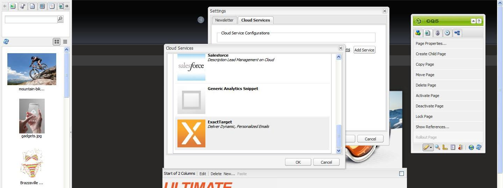

# 将电子邮件发布到电子邮件服务提供商{#publishing-an-email-to-email-service-providers}

您可以将新闻稿发布到电子邮件服务，例如ExactTarget和Silverpop Engage。 本文档介绍如何配置AEM以向这些电子邮件服务发布新闻稿。

>[!NOTE]
>
>您需要先配置服务提供商，然后才能创建和发布电子邮件。 有关详细信息，请参阅[配置ExactTarget](/help/sites-administering/exacttarget.md)和[配置Silverpop Engage](/help/sites-administering/silverpop.md)。

要将电子邮件发布到电子邮件服务提供商，您需要执行以下步骤：

1. 创建电子邮件。
1. 将电子邮件服务配置应用于电子邮件。
1. Publish电子邮件。

>[!NOTE]
>
>如果您更新电子邮件提供商、进行外部测试或发送新闻稿，并且未先将新闻稿发布到Publish实例或者Publish实例不可用，则这些操作将失败。 请务必发布您的新闻稿，并确保Publish实例已启动并正在运行。

## 创建电子邮件 {#creating-an-email}

可以使用&#x200B;**Geometrixx新闻稿**&#x200B;模板在促销活动下创建要发布到电子邮件服务的电子邮件或新闻稿。 您还可以使用&#x200B;**Geometrixx Outdoors电子邮件**&#x200B;模板。 基于&#x200B;**Geometrixx Outdoors电子邮件**&#x200B;模板的电子邮件/新闻稿示例位于`https://<hostname>:<port>/cf#/content/campaigns/geometrixx-outdoors/e-mails.html`。

要创建发布到配置的电子邮件服务的电子邮件，请执行以下操作：

1. 转到&#x200B;**网站**，然后转到&#x200B;**营销活动**。 选择活动。
1. 单击&#x200B;**新建**&#x200B;以打开&#x200B;**创建页面**&#x200B;窗口。
1. 输入标题、名称，然后从可用模板列表中选择&#x200B;**Geometrixx新闻稿**&#x200B;模板。
1. 单击&#x200B;**创建**。
1. 打开创建的电子邮件。
1. 切换到设计模式以选择要在Sidekick中显示的组件。
1. 切换到编辑模式并开始向电子邮件添加内容（文本、图像、[电子邮件工具](#adding-exacttarget-email-tools-to-your-email)、[个性化变量](#adding-text-and-personalization-tool-to-your-e-mail)等）。

### 将ExactTarget电子邮件工具添加到电子邮件 {#adding-exacttarget-email-tools-to-your-email}

>[!NOTE]
>
>此部分特定于ExactTarget服务。

ExactTarget的&#x200B;**电子邮件工具**&#x200B;组件可以为您的电子邮件/新闻稿添加更多电子邮件功能。

1. 打开电子邮件以发布到ExactTarget。
1. 使用sidekick将组件&#x200B;**ET - Email Tools**&#x200B;添加到您的页面。 在编辑模式下打开组件。

   

1. 从&#x200B;**选项**&#x200B;菜单中选择一个选项：

<table>
 <tbody>
  <tr>
   <td>邮寄地址（必填）</td>
   <td>此组件在电子邮件中插入贵组织的实际邮寄地址。</td>
  </tr>
  <tr>
   <td>个人资料中心(必需)</td>
   <td>用户档案中心是一个网页，订阅者可以在其中输入和维护您保留的有关他们的个人信息。</td>
  </tr>
  <tr>
   <td>以网页的形式查看电子邮件</td>
   <td>此组件允许用户以网页的形式查看电子邮件。</td>
  </tr>
  <tr>
   <td>隐私政策</td>
   <td>此组件在电子邮件中插入指向您的隐私策略的链接。  </td>
  </tr>
  <tr>
   <td>取消订阅中心</td>
   <td>为用户提供了取消订阅您的邮件列表的选项。</td>
  </tr>
  <tr>
   <td>订阅中心</td>
   <td>订阅中心是一个网页，订阅者可以在其中控制从您的组织收到的消息。</td>
  </tr>
  <tr>
   <td>跟踪电子邮件打开次数</td>
   <td>允许您使用ExactTarget跟踪功能的隐藏组件。  </td>
  </tr>
 </tbody>
</table>

>[!NOTE]
>
>仅当对电子邮件应用了ExactTarget配置时，才会填充&#x200B;**选项**&#x200B;下拉菜单。 有关详细信息，请参阅[将电子邮件服务配置应用到电子邮件设置](#applying-e-mail-service-configuration-to-e-mail-settings)。

1. 将电子邮件Publish到ExactTarget。

   带有电子邮件工具的电子邮件可在配置的ExactTarget帐户中使用。

>[!NOTE]
>
>* 仅当使用&#x200B;**简单发送**&#x200B;或&#x200B;**引导式发送**&#x200B;而不是&#x200B;**测试发送**&#x200B;发送电子邮件时，电子邮件工具中的URL（在收到的电子邮件中）才会被其实际值替换。
>
>* 需要两个电子邮件工具：**实际邮寄地址（必需）**&#x200B;和&#x200B;**个人资料中心（必需）**。 将电子邮件发布到ExactTarget后，默认情况下会将这两种电子邮件工具添加到每封邮件的底部。
>

### 将文本和Personalization工具添加到电子邮件 {#adding-text-and-personalization-tool-to-your-e-mail}

通过将&#x200B;**文本和Personalization**&#x200B;组件添加到页面，您可以在电子邮件中添加个性化字段：

1. 打开要发布到电子邮件服务的电子邮件。
1. 要从电子邮件服务启用个性化字段，请在配置电子邮件服务时添加框架配置。 有关详细信息，请参阅[配置Silverpop Engage](/help/sites-administering/silverpop.md)和[配置精确的Target](/help/sites-administering/exacttarget.md)。
1. 从Sidekick添加组件&#x200B;**文本和Personalization**。 此组件是新闻稿组的一部分。 在编辑模式下打开此组件。

   

1. 通过从下拉菜单中选择所需的个性化字段并单击&#x200B;**插入**，将该字段添加到文本中。
1. 单击&#x200B;**确定**&#x200B;完成。

## 将电子邮件服务配置应用到电子邮件设置 {#applying-e-mail-service-configuration-to-e-mail-settings}

要将电子邮件服务配置应用到新闻稿，请执行以下操作：

1. 创建电子邮件服务配置。
1. 打开您的电子邮件/新闻稿。
1. 通过单击&#x200B;**设置**&#x200B;或单击sidekick **中的**&#x200B;页面属性打开电子邮件/新闻稿设置。
1. 在&#x200B;**Cloud Service**&#x200B;选项卡中单击&#x200B;**添加服务**。 您会看到服务列表。 从下拉列表中选择所需的配置 — **ExactTarget**&#x200B;或&#x200B;**Silverpop**。

   

1. 单击&#x200B;**确定**。

## 将电子邮件发布到电子邮件服务 {#publishing-emails-to-email-service}

可以通过以下步骤将电子邮件/新闻稿发布到您的电子邮件服务：

1. 打开电子邮件。
1. 在发布电子邮件之前，请确保已将正确的配置应用于电子邮件。
1. 单击&#x200B;**发布**。这将打开&#x200B;**Publish Newsletter To Email Service Provider**&#x200B;窗口。
1. 填写&#x200B;**新闻稿名称**&#x200B;字段。 电子邮件/新闻稿将发布到此名称的电子邮件服务提供商。 如果未提供电子邮件名称，则使用AEM中新闻稿的页面名称发布电子邮件。
1. 单击&#x200B;**发布**。

   

   如果成功，AEM将确认您可以在ExactTarget或Silverpop Engage中查看电子邮件。

   如果存在ExactTarget，则通过单击&#x200B;**查看已发布的电子邮件**，可以查看已发布的电子邮件。 这会将您直接转到ExactTarget ([https://members.exacttarget.com/](https://members.exacttarget.com/).)中已发布的新闻稿。

>[!NOTE]
>
>如果电子邮件/新闻稿的发布名称与电子邮件/新闻稿的发布名称相同，则不会替换之前的电子邮件/新闻稿。 而是使用相同的名称创建新的电子邮件/新闻稿（但两个新闻稿的ID不同）。
>
>将电子邮件/新闻稿发布到电子邮件服务提供商还会将电子邮件/新闻稿发布到AEM发布实例。
>

### 更新已发布的电子邮件 {#updating-a-published-e-mail}

通过Publish对话框中的&#x200B;**更新**&#x200B;按钮，可更新已发布到电子邮件服务提供商的新闻稿。 如果新闻稿尚未发布且单击&#x200B;**更新**&#x200B;按钮，则不会发布&#x200B;**新闻稿**&#x200B;消息。

要更新已发布的电子邮件，请执行以下操作：

1. 打开之前已发布到电子邮件服务提供商的电子邮件/新闻稿，在对电子邮件/新闻稿进行更改后，要重新发布该提供商。
1. 单击&#x200B;**发布**。此时将显示&#x200B;**Publish Newsletter to Email Service Provider**&#x200B;窗口。 单击&#x200B;**更新**。

   要检查电子邮件/新闻稿是否已在ExactTarget上更新，请单击&#x200B;**查看发布的电子邮件**。 这会将您转到ExactTarget中发布的电子邮件。

   要检查Silverpop电子邮件服务上是否更新了电子邮件/新闻稿，请访问Silverpop Engage网站。
