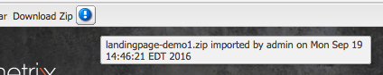

# 登陆页面{#landing-pages}

利用登陆页面功能，可以快速轻松地直接将设计和内容导入AEM页面。 Web开发人员可以准备HTML和其他资源，这些资源可以导入为完整页面或仅页面的一部分。 功能对于创建仅在有限的时间内处于活动状态且需要快速创建的营销登陆页面非常有用。

本页介绍以下内容：

* AEM中的登录页面（包括可用组件）的外观
* 如何创建登陆页面以及如何导入设计包
* 如何在AEM中使用登陆页面
* 如何设置移动设备登陆页面

准备要导入的设计包将在[扩展和配置设计导入程序](/help/sites-administering/extending-the-design-importer-for-landingpages.md)中介绍。 [将登陆页面与Adobe Analytics集成](/help/sites-administering/integrating-landing-pages-with-adobe-analytics.md)中介绍了与Adobe Analytics的集成。

>[!CAUTION]
>
>AEM 6.5[&#128279;](/help/release-notes/deprecated-removed-features.md#deprecated-features)已弃用用于导入登陆页面的设计导入程序。

>[!CAUTION]
>
>由于设计导入程序需要访问`/apps`，因此它在容器化云环境中将不起作用，因为`/apps`不可更改。

## 什么是登陆页面？ {#what-are-landing-pages}

登陆页面是作为营销活动“端点”的单页面或多页面网站 — 例如，电子邮件、广告词/横幅、社交媒体。 登陆页面有多种用途，但都有一个共同点 — 访客应完成一项任务，并定义登陆页面成功与否。

AEM中的登陆页面功能允许营销人员与机构或内部创意团队的Web设计人员合作，创建页面设计，这些页面设计可以轻松导入AEM中，并且仍可由营销人员编辑并在与其他AEM支持的网站相同的治理下发布。

在AEM中，可通过执行以下步骤来创建登陆页面：

1. 在AEM中创建一个包含登陆页面画布的页面。 AEM附带了一个名为&#x200B;**导入程序页面**&#x200B;的示例。

1. [准备HTML和资源。](/help/sites-administering/extending-the-design-importer-for-landingpages.md)
1. 将资源打包到ZIP文件中，这里称为设计包。
1. 在导入程序页面上导入设计包。
1. 修改并发布页面。

### 桌面登陆页面 {#desktop-landing-pages}

AEM中的示例登陆页面如下所示：

### 移动设备登陆页面 {#mobile-landing-pages}

登陆页面也可以具有页面的移动设备版本。 若要使登陆页面具有单独的移动设备版本，导入设计必须具有两个html文件： *index.htm(l)*&#x200B;和&#x200B;*mobile.index.htm(l)*。

登陆页面的导入过程与普通登陆页面的导入过程相同，登陆页面设计具有一个与移动设备登陆页面对应的附加html文件。 此html文件也必须具有具有`id=cqcanvas`的画布`div`，就像桌面登陆页面html一样，并且它支持针对桌面登陆页面描述的所有可编辑组件。

移动设备登陆页面将创建为桌面登陆页面的子页面。 要打开它，请导航到网站中的登陆页面，然后打开子页面。

>[!NOTE]
>
>如果删除或停用桌面登陆页面，则移动设备登陆页面将会与桌面登陆页面一起被删除/停用。

## 登陆页面组件 {#landing-page-components}

要使导入的HTML部分在AEM中可编辑，您可以将“登陆页面”HTML中的内容直接映射到AEM组件。 设计导入程序默认了解以下组件：

* 文本，适用于任何文本
* 标题，用于H1-6标记中的内容
* 图像，用于应当可替换的图像
* 行动号召：

   * 点进链接
   * 图形链接

* CTA潜在客户表单，用于捕获用户信息
* 段落系统(Parsys)，允许添加任何组件，或转换上述组件

此外，还可以扩展此功能并支持自定义组件。 本节详细介绍了这些组件。

### 文本 {#text}

文本组件允许您使用WYSIWYG编辑器输入文本块。 有关详细信息，请参阅[文本组件](/help/sites-authoring/default-components.md#text)。

以下是登陆页面上的文本组件示例：

#### 标题 {#title}

利用标题组件，可显示标题并配置大小(h1-6)。 有关详细信息，请参阅[标题组件](/help/sites-authoring/default-components.md#title)。

以下是登陆页面上的标题组件示例：

#### 图像 {#image}

图像组件显示一个图像，您可以从内容查找器拖放或单击该图像以上传。 有关详细信息，请参阅[图像组件](/help/sites-authoring/default-components.md)。

以下是登陆页面上图像组件的示例：

#### 行动号召(CTA) {#call-to-action-cta}

登陆页面设计可能具有多个链接 — 其中一些链接可能旨在作为“行动要求”。

行动号召(CTA)用于让访客在登陆页面上立即采取行动，如“立即订阅”、“查看此视频”、“仅限定时间”等。

* 点进链接 — 允许您添加文本链接，在单击该链接时，会将访客导向到目标URL。
* 图形链接 — 允许您添加图像，单击该图像可将访客转到目标URL。

两个CTA组件具有类似的选项。 点进链接具有其他富文本选项。 以下段落详细介绍了这些组件。

#### 点进链接 {#click-through-link}

此CTA组件可用于在登陆页面上添加文本链接。 可以单击该链接以将用户转至组件属性中指定的目标URL。 它是“行动号召”小组的一部分。

**标签**&#x200B;用户看到的文本。 您可以使用富文本编辑器修改格式。

**目标URL**&#x200B;输入用户单击文本时要访问的URI。

**渲染选项**&#x200B;描述了渲染选项。 您可以从以下选项中进行选择：

* 在新浏览器窗口中加载页面
* 在当前窗口中加载页面
* 在父框架中加载页面
* 取消所有框架，并在整个浏览器窗口中加载页面

**CSS**&#x200B;在“样式”选项卡上，输入CSS样式表的路径。

**ID**&#x200B;在“样式”选项卡上，输入组件的ID以对其进行唯一标识。

以下是点进链接的示例：

#### 图形链接 {#graphical-link}

此CTA组件可用于添加登陆页面上带有链接的任何图形图像。 图像可以是简单的按钮，也可以是作为背景的任何图形图像。 单击图像时，用户将被带入组件属性中指定的目标URL。 它是&#x200B;**行动号召**&#x200B;组的一部分。

**标签**&#x200B;用户在图形中看到的文本。 您可以使用富文本编辑器修改格式。

**目标URL**&#x200B;输入用户单击图像时要访问的URI。

**渲染选项**&#x200B;描述了渲染选项。 您可以从以下选项中进行选择：

* 在新浏览器窗口中加载页面
* 在当前窗口中加载页面
* 在父框架中加载页面
* 取消所有框架，并在整个浏览器窗口中加载页面

**CSS**&#x200B;在“样式”选项卡上，输入CSS样式表的路径。

**ID**&#x200B;在“样式”选项卡上，输入组件的ID以对其进行唯一标识。

以下是示例图形链接：

### 行动号召(CTA)潜在客户表单 {#call-to-action-cta-lead-form}

商机表单是用于收集访客/商机的配置文件信息的表单。 此信息可以存储并用于以后根据此信息执行有效的营销。 此信息通常包括标题、姓名、电子邮件、出生日期、地址、兴趣等。 它是&#x200B;**CTA潜在客户表单**&#x200B;组的一部分。

CTA潜在客户表单的示例如下所示：

CTA潜在客户表单由多个不同的组件组成：

* **潜在客户表单**
潜在客户表单组件定义页面上新潜在客户表单的开始和结束。 然后，可以将其他组件（例如电子邮件ID、名字等）置于这些元素之间。

* **表单字段和元素**
表单字段和元素可以包括文本框、单选按钮、图像等。 用户通常会在表单字段中完成一项操作，例如键入文本。 有关更多信息，请参阅各个表单元素。

* **配置文件组件**
配置文件组件与用于社交协作和其他需要访客个性化的区域的访客配置文件相关。

前文显示了一个示例表单；它由&#x200B;**潜在客户表单**&#x200B;组件（开始和结束）组成，其中有&#x200B;**名字**&#x200B;和&#x200B;**电子邮件ID**&#x200B;字段用于输入，还有&#x200B;**提交**&#x200B;字段

在sidekick中，以下组件可用于CTA潜在客户表单：

#### 许多潜在客户表单组件的通用设置 {#settings-common-to-many-lead-form-components}

虽然每个潜在客户表单组件的用途各不相同，但许多组件由类似的选项和参数组成。

配置任何表单组件时，对话框中提供以下选项卡：

* **标题和文本**
在此，您需要指定基本信息，例如组件标题和任何随附文本。 在适当时，它还允许您定义其他关键信息，例如字段是否可多选以及是否可供选择的项。

* **初始值**
用于指定默认值。

* **约束**
您可以在此指定是否需要某个字段，并将约束放置在该字段上（例如，必须为数字等）。

* **样式**
指示字段的大小和样式。

>[!NOTE]
>
>您看到的字段因各个组件而异。
>
>并非所有选项都可用于所有潜在客户表单组件。 有关这些[常用设置](/help/sites-authoring/default-components.md#formsgroup)的详细信息，请参阅Forms。

#### 潜在客户表单组件 {#lead-form-components}

以下部分介绍了可用于行动号召潜在客户表单的组件。

**关于**&#x200B;允许用户添加关于信息。

**地址字段**&#x200B;允许用户输入地址信息。 配置此组件时，必须在对话框中输入元素名称。 元素名称是表单元素的名称。 这指示数据存储到存储库中的什么位置。

**出生日期**&#x200B;用户可以输入出生日期信息。

**电子邮件ID**&#x200B;允许用户输入电子邮件地址（标识）。

**名字**&#x200B;为用户提供一个输入名字的字段。

**性别**&#x200B;用户可以从下拉列表中选择其性别。

**姓氏**&#x200B;用户可以输入姓氏信息。

**潜在客户表单**&#x200B;添加此组件以将潜在客户表单添加到您的登陆页面。 销售线索表单自动包含“销售线索表单起始”和“销售线索表单终止”字段。 在中，添加本节中介绍的Lead Form组件。

潜在客户表单组件使用&#x200B;**表单开始**&#x200B;和&#x200B;**表单结束**&#x200B;元素定义表单的开始和结束。 它们始终是成对的，以确保正确定义表单。

添加潜在客户表单后，您可以通过单击相应栏中的&#x200B;**编辑**&#x200B;来配置表单的开头或结尾。

**潜在客户表单的开头**

有两个选项卡可用于配置&#x200B;**表单**&#x200B;和&#x200B;**高级**：

**感谢页面**&#x200B;要引用的页面，用于感谢访客的输入。 如果留空，表单会在提交后重新显示。

**启动工作流**&#x200B;确定在提交潜在客户表单后触发哪个工作流。

**Post选项**&#x200B;以下帖子选项可用：

* 创建潜在客户
* 电子邮件服务：创建订阅者并添加到列表 — 如果您使用的是ExactTarget等电子邮件服务提供程序，则使用此服务。
* 电子邮件服务：发送自动回复电子邮件 — 在您使用电子邮件服务提供程序（如ExactTarget）时使用。
* 电子邮件服务：从列表中取消订阅用户 — 如果您使用的是ExactTarget等电子邮件服务提供程序，则使用此服务。
* 取消订阅用户

**表单标识符**&#x200B;表单标识符唯一标识潜在客户表单。 如果单个页面上有多个表单，请使用表单标识符；请确保它们具有不同的标识符。

**加载路径**&#x200B;是用于将预定义值加载到潜在客户表单字段的节点属性的路径。

这是一个可选字段，用于指定存储库中节点的路径。 当此节点具有匹配字段名称的属性时，表单上的相应字段将预加载这些属性的值。 如果不存在匹配项，则字段包含默认值。

**客户端验证**&#x200B;指示此表单是否需要客户端验证（始终进行服务器验证）。 这可以与Forms Captcha组件一起实现。

**验证资源类型**&#x200B;如果要验证整个潜在客户表单（而不是单个字段），请定义表单验证资源类型。

如果要验证完整的表单，还应包括以下内容之一：

* 用于客户端验证的脚本：
  ` /apps/<myApp>/form/<myValidation>/formclientvalidation.jsp`

* 用于服务器端验证的脚本：
  ` /apps/<myApp>/form/<myValidation>/formservervalidation.jsp`

**操作配置**&#x200B;操作配置将根据Post选项中的选择进行更改。 例如，当您选择“创建潜在客户”时，您可以配置要将潜在客户添加到哪个列表中。

* **显示提交按钮**
指示是否应显示提交按钮。

* **提交名称**
标识符（如果您在表单中使用多个提交按钮）。

* **提交标题**
按钮上显示的名称，如“提交”或“发送”。

* **显示重置按钮**
选中复选框可使“重置”按钮可见。

* **重置标题**
“重置”按钮上显示的名称。

* **描述**
按钮下方显示的信息。

## 创建登陆页面 {#creating-a-landing-page}

创建登陆页面时，您需要执行三个步骤：

1. 创建导入程序页面。
1. [准备HTML以进行导入。](/help/sites-administering/extending-the-design-importer-for-landingpages.md)
1. 导入设计包。

### 使用设计导入程序 {#use-of-the-design-importer}

由于页面导入涉及页面的HTML准备、验证和测试，因此登陆页面的导入是一项管理员任务。 作为管理员，执行导入的用户需要对`/apps`的读、写、创建和删除权限。 如果用户没有这些权限，导入将失败。

>[!NOTE]
>
>由于设计导入程序旨在作为需要对`/apps`具有读取、写入、创建和删除权限的管理工具，因此Adobe建议不要在生产中使用设计导入程序。

Adobe建议在暂存实例上使用设计导入程序。 在暂存实例上，可以由开发人员测试和验证导入，然后开发人员负责将代码部署到生产实例。

### 创建导入程序页面 {#creating-an-importer-page}

在导入登陆页面设计之前，您需要先创建导入程序页面，例如在营销策划下。 通过“导入者页面”模板，您可以导入完整的HTML登录页面。 该页面包含一个拖放框，可在其中使用拖放功能导入登陆页面设计包。

>[!NOTE]
>
>默认情况下，导入程序页面只能在营销活动下创建，但您也可以叠加此模板以在`/content/mysite`下创建登陆页面。

要创建登陆页面，请执行以下操作：

1. 转到&#x200B;**网站**&#x200B;控制台。
1. 在左窗格中选择您的营销策划。
1. 单击&#x200B;**新建**&#x200B;以打开&#x200B;**创建页面**&#x200B;窗口。
1. 选择&#x200B;**导入程序页面**&#x200B;模板并添加标题和名称（可选），然后单击&#x200B;**创建**。

   

   此时会显示您的新导入程序页面。

### 准备HTML以进行导入 {#preparing-the-html-for-import}

在导入设计包之前，需要准备HTML。 有关详细信息，请参阅[扩展和配置设计导入](/help/sites-administering/extending-the-design-importer-for-landingpages.md)。

### 导入设计包 {#importing-the-design-package}

创建导入程序页面后，您可以在其上导入设计包。 有关创建设计包及其建议结构的详细信息，请参阅[扩展和配置设计导入](/help/sites-administering/extending-the-design-importer-for-landingpages.md)。

假定设计包已准备就绪，则以下步骤介绍如何将设计包导入到导入程序页面。

1. 打开您[之前创建的](#creatingablankcanvaspage)导入程序页面。

   

1. 将设计包拖放到收存箱上。 请注意，当软件包被拖动到上面时，箭头会改变方向。
1. 执行拖放操作后，您将看到登陆页面来代替导入器页面。 您的HTML登录页面已成功导入。

   

>[!NOTE]
>
>导入时，出于安全原因并为了避免导入和发布无效标记，将清理标记。 这假定仅HTML标记以及所有其他形式的元素(例如内联SVG或Web组件)将被过滤掉。

>[!NOTE]
>
>如果导入设计包时遇到问题，请参阅[疑难解答](/help/sites-administering/extending-the-design-importer-for-landingpages.md#troubleshooting)。

## 使用登陆页面 {#working-with-landing-pages}

登陆页面的设计和资产通常由设计人员创建，他们可能在代理商使用的一些工具(如Adobe Photoshop或Adobe Dreamweaver)中进行创建。 设计完成后，设计人员会向营销人员发送一个包含所有资产的zip文件。 接下来，营销联系人负责将zip文件放入AEM并发布内容。

此外，设计者可能需要在导入登陆页面后对其进行修改，方法是编辑或删除内容并配置行动号召组件。 最后，营销人员将需要预览登陆页面，然后激活营销活动以确保登陆页面已发布。

本节介绍如何执行以下操作：

* 删除登陆页面
* 下载设计包
* 查看导入信息
* 重置登陆页面
* [配置CTA组件并将内容添加到页面](#call-to-action-cta)
* 预览登陆页面
* 激活/发布登陆页面

导入设计包时，**清除设计**&#x200B;和&#x200B;**下载导入的Zip**&#x200B;在页面的设置菜单中可用：

### 下载导入的设计包 {#downloading-the-imported-design-package}

通过下载zip文件，您可以记录随特定登陆页面导入的zip文件。 对页面所做的更改不会添加到zip文件中。

要下载导入的设计包，请单击“登陆页面”工具栏中的&#x200B;**下载Zip**。

### 查看导入信息 {#viewing-import-information}

您可以随时查看有关上次导入的信息，方法是单击经典用户界面中登录页面顶部的蓝色感叹号。

如果导入的设计包存在一些问题，例如，如果它引用的图像/脚本在包中不存在等等，则设计导入程序会以列表的形式显示此类问题。 要查看问题列表，请在经典的用户界面中，单击登陆页面工具栏中的问题链接。 在下图中，单击&#x200B;**问题**&#x200B;链接会打开“导入问题”窗口。

### 重置登陆页面 {#resetting-a-landing-page}

如果您想在对登陆页面设计包进行某些更改后重新导入该登陆页面设计包，则可以在经典用户界面中单击登陆页面顶部的&#x200B;**清除**，或者在触控优化用户界面中单击设置菜单中的“清除”，以“清除”登陆页面。 这样做会删除导入的登陆页面并创建一个空白的导入程序页面。

清除登陆页面时，您可以删除内容更改。 如果单击&#x200B;**否**，则会保留内容更改，即保留`jcr:content/importer`下的结构，并且只删除`etc/design`中的导入程序页面组件及资源。 但是，如果您单击&#x200B;**是**，则`jcr:content/importer`也会被删除。

>[!NOTE]
>
>如果决定删除内容更改，则单击“**清除**”后，在导入的登陆页面和所有页面属性中所做的所有更改都将丢失。

### 在登陆页面上修改和添加组件 {#modifying-and-adding-components-on-a-landing-page}

要在登陆页面上修改组件，请双击组件以将其打开并编辑，就像编辑任何其他组件一样。

要在登陆页面上添加组件，请将组件从经典用户界面的sidekick或触控优化用户界面的“组件”窗格拖放到登陆页面，然后进行相应编辑。

>[!NOTE]
>
>如果登录页上的组件无法编辑，则需要在修改HTML文件[后重新导入zip文件。](/help/sites-administering/extending-the-design-importer-for-landingpages.md)这表示在导入期间，不可编辑的部件未转换为AEM组件。

### 删除登陆页面 {#deleting-a-landing-page}

删除登陆页面与删除普通AEM页面类似。

唯一的例外是，当您删除桌面登陆页面时，它也会删除相应的移动设备登陆页面（如果存在），但不会发生相反情况。

### 发布登陆页面 {#publishing-a-landing-page}

您可以发布登陆页面及其所有依赖项，就像发布普通页面一样。

>[!NOTE]
>
>发布桌面登陆页面时，还会发布其对应的移动设备版本（如果有）。 但是，发布移动设备登陆页面不会发布桌面版本。
