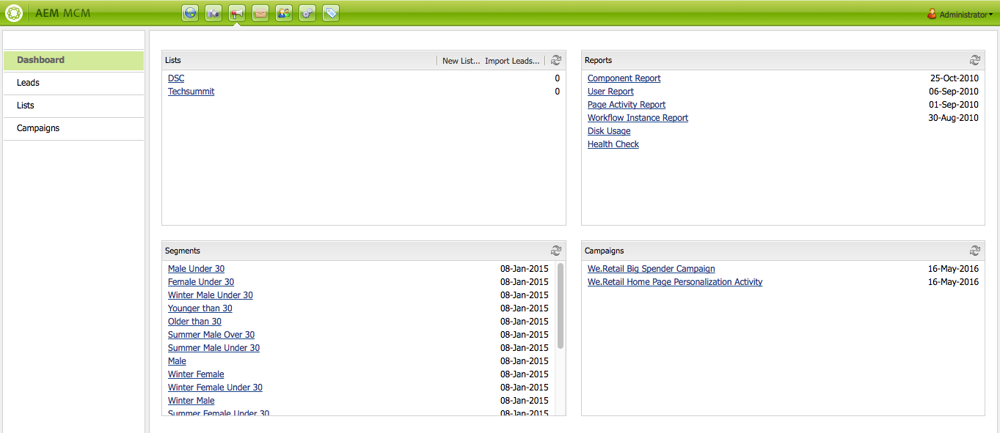

# 使用营销活动经理{#working-with-the-marketing-campaign-manager}

在AEM中，营销活动管理器(MCM)是一个控制台，可帮助您管理多渠道营销活动。 借助此营销自动化软件，您可以管理所有品牌、活动和体验以及相关区段、列表、商机和报表。

可以从AEM中的各种位置访问MCM；例如，欢迎屏幕，使用促销活动图标或通过URL访问：

`https://<hostname>:<port>/libs/mcm/content/admin.html`

例如：

`https://localhost:4502/libs/mcm/content/admin.html`

从MCM可以访问：

* **[仪表板](#dashboard)**
该视图分为四个窗格：

   * [列表](#lists)
此窗格显示您已创建的列表以及该列表中的销售线索数。 在此窗格中，您可以直接创建列表或导入潜在客户以创建列表。
选择特定列表将带您进入[列表](#lists)部分，其中显示列表的详细信息。

   * [区段](/help/sites-classic-ui-authoring/classic-personalization-campaigns.md#anoverviewofsegmentation)
此窗格显示已定义的区段。 通过区段，可表示共享某些特征的访客集合的特征。
选择特定区段会打开区段定义页面。

   * [报告](/help/sites-administering/reporting.md)
AEM提供了各种报告来帮助您分析和监控实例的状态。 此MCM窗格列出了报告。
选择报告将打开报告页面。

   * [营销活动](#campaigns)
此窗格列出了您的营销活动体验，如[新闻稿](/help/sites-classic-ui-authoring/classic-personalization-campaigns.md#newsletters)和[Teasers](/help/sites-classic-ui-authoring/classic-personalization-campaigns.md#teasers)。

* **[潜在客户](#leads)**
在这里，您可以管理您的潜在客户。 您可以创建或导入潜在客户，编辑各个潜在客户的特定详细信息，或在不再需要时删除。 您还可以将潜在客户放入不同的组（称为“列表”）。 **注意：**Adobe不打算进一步增强此功能。
建议使用[Adobe Campaign以及与AEM](/help/sites-administering/campaign.md)的集成。

* **[列表](#lists)**
您可以在此处管理（潜在客户）列表。**注意：**Adobe不打算进一步增强此功能。
建议使用[Adobe Campaign以及与AEM](/help/sites-administering/campaign.md)的集成。

* **[营销活动](#campaigns)**
您可以在此处管理品牌、营销活动和体验。

## 仪表板 {#dashboard}

仪表板会显示四个窗格，为您提供列表（潜在客户）、区段、报表和促销活动的概览。 此处还提供了这些应用程序的基本功能。

### 潜在客户 {#leads}

>[!NOTE]
>
>Adobe不打算进一步增强此功能（管理潜在客户）。
>建议使用[Adobe Campaign以及与AEM](/help/sites-administering/campaign.md)的集成。

在AEM MCM中，您可以通过手动输入潜在客户或导入逗号分隔的列表（例如邮件列表）来整理和添加潜在客户。 生成潜在客户的其他方法是新闻稿注册或社区注册（如果配置，这些可能会触发填充潜在客户的工作流）。 商机通常会分类并放入列表中，以便您以后可以对整个列表执行操作；例如，向特定列表发送自定义电子邮件。

在左窗格中的&#x200B;**潜在客户**&#x200B;下，您可以创建、导入、编辑和删除您的潜在客户，然后根据需要激活或停用。 您可以将潜在客户添加到列表中，或查看它已经属于哪些列表。

>[!NOTE]
>
>有关特定任务的详细信息，请参阅[使用潜在客户](/help/sites-classic-ui-authoring/classic-personalization-campaigns.md#workingwithleads)。

### 列表 {#lists}

>[!NOTE]
>
>Adobe不打算进一步增强此功能（管理列表）。
>建议使用[Adobe Campaign以及与AEM](/help/sites-administering/campaign.md)的集成。

列表可让您将潜在客户组织到组中。 通过列表，您可以将营销活动定位到选定的用户组；例如，可以将定向的新闻稿发送到列表。

在&#x200B;**列表**&#x200B;下，您可以通过创建、导入、编辑、合并和删除列表来管理列表，然后根据需要激活或取消激活这些列表。 您还可以查看该列表中的潜在客户，查看该列表是否是另一个列表的成员，或查看说明。

>[!NOTE]
>
>有关特定任务的详细信息，请参阅[使用列表](/help/sites-classic-ui-authoring/classic-personalization-campaigns.md#workingwithlists)。

### 营销活动 {#campaigns}

>[!NOTE]
>
>有关特定任务的详细信息，请参阅[Teasers和策略](/help/sites-classic-ui-authoring/classic-personalization-campaigns.md#workingwithlists)、[设置您的营销活动](/help/sites-classic-ui-authoring/classic-personalization-campaigns.md#settingupyourcampaign)和[新闻稿](/help/sites-classic-ui-authoring/classic-personalization-campaigns.md#newsletters)。

要访问现有营销活动，请在MCM中单击&#x200B;**营销活动**。

* **在左窗格**：
此处列出了所有品牌和促销活动。
单击品牌将展开列表，以在左侧窗格中显示所有相关营销活动；此列表还会显示每个营销活动存在的体验数量。 它还会打开右侧窗格中的品牌概述。

* **在右窗格**：
此时会显示每个品牌的图标（不会显示历史促销活动）。
您可以双击这些项目以打开品牌概述。

#### 品牌概述 {#brand-overview}

从此处，您可以：

* 查看此品牌存在的营销活动和体验的数量（左侧窗格中显示的数量）。
* 为此品牌创建一个&#x200B;**新……**&#x200B;营销活动。

* 更改正在查看的时间段；选择&#x200B;**周**、**月**&#x200B;或&#x200B;**季度**，使用箭头选择特定期间或返回到&#x200B;**今天**。

* 选择营销策划（在右窗格中）以：

   * 编辑&#x200B;**属性……**
   * **删除**&#x200B;营销活动。

* 打开营销活动概述（在右窗格中双击某个营销活动，或在左窗格中单击）。

#### Campaign概述 {#campaign-overview}

对于各个营销活动，提供了两个视图：

1. **日历视图**

   使用图标：

   

   这会显示所有接触点（灰色）的列表，并带有连接到该接触点的体验的水平时间范围（绿色）：

   

   从此处，您可以：

   * 使用箭头更改您查看的时间跨度，或返回到&#x200B;**今天**。

   * 使用&#x200B;**添加接触点……**&#x200B;为现有体验添加新接触点。

   * 单击Teaser（在右窗格中）以设置&#x200B;**开启时间**&#x200B;和&#x200B;**关闭时间**。

1. **列表视图**

   使用图标：

   

   这将列出选定营销活动的所有体验（例如，Teaser和新闻稿）：

   

   从此处，您可以：

   * 创建&#x200B;**新……**&#x200B;体验；例如，Adobe Target优惠、Teaser和新闻稿。
   * **编辑**&#x200B;特定Teaser页面或新闻稿的详细信息（也可以使用双击）。
   * 为特定的Teaser页面或新闻稿定义&#x200B;**属性……**。
   * **模拟**体验（Teaser页面或新闻稿）的外观。
当模拟页面打开时，您可以打开Sidekick以切换到该页面的编辑模式。

   * **分析……**&#x200B;为页面生成的展示次数。

   * **删除**&#x200B;不再需要的项目。
   * **搜索**&#x200B;您的文本（将搜索体验的标题字段）。
   * 使用&#x200B;**高级**&#x200B;搜索将筛选器应用到搜索。

### 模拟您的活动体验 {#simulating-your-campaign-experiences}

在MCM中，单击&#x200B;**促销活动**。 确保列表视图处于活动状态，然后选择所需的营销活动体验并单击&#x200B;**模拟**。 将会打开接触点（Teaser或新闻稿页面），以显示您选择的体验 — 访客将看到该体验。

在此处，您还可以打开sidekick（单击向下小箭头）以更改为编辑模式来更新页面。

### 分析您的活动体验 {#analyzing-your-campaign-experiences}

在MCM中，单击&#x200B;**促销活动**。 请确保列表视图处于活动状态，然后选择所需的营销活动体验并选择&#x200B;**分析……**。 此时会显示一段时间内的页面展示次数图表。

