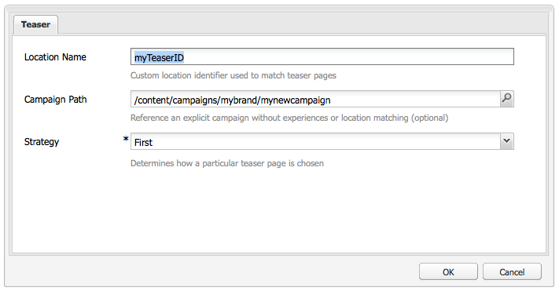

# Teaser 和战略{#teasers-and-strategies}

营销活动通常使用 Teaser 作为吸引特定区段的访客群体访问其关注的内容的机制。可以对特定营销活动定义一个或多个 Teaser。

>[!NOTE]
>
>AEM 6.2 中已弃用 Teaser 组件。请改为使用 [Target 组件](/help/sites-authoring/content-targeting-touch.md)。

* **品牌页面** 存储在网站的“营销活动”部分中。 品牌包含多个单独的营销活动。
* **促销活动页面** 存储在网站的“营销活动”部分中。 每个营销活动都有单独的页面，该页面包含 Teaser 定义。容器或概述页面也包含有关单独的 Teaser 页面的特定信息和统计数据。

AEM 中的 Teaser 由若干部分组成：

* **Teaser页面** 存储在相应的营销活动页面下，并保存每个特定营销活动可用的teaser段落定义。 在显示 Teaser 段落时，需使用这些定义；包括内容变体，以及要用于选择变体和提升因子的区段。
* **Teaser 组件**&#x200B;开箱即用，使用它可以在内容页面中创建特定 Teaser 段落的实例。您可以从 Sidekick 拖动 Teaser 组件，然后指定 Teaser 定义，以便创建自己的 Teaser 段落。**注意：** AEM 6.2中已弃用Teaser组件。请使用 [目标组件](/help/sites-authoring/content-targeting-touch.md) 中。
* **Teaser 段落**&#x200B;是内容页面中的实际 Teaser 实例。这些段落用于吸引特定访客区段访问其关注的内容。
* 包含针对特定访客区段的营销活动内容的页面。通常，Teaser 段落将引导访客访问此类页面。

## 战略 {#strategies}

在向页面添加Teaser段落时，您需要定义 **策略**.

这适用于以下情况：由于几个 Teaser 的分配区段都成功解析，这几个 Teaser 都可供选择。**战略**&#x200B;随后指定用于选择显示的 Teaser 的额外标准：

* **Clickstream 得分**，基于访客的 ClientContext 中包含的标记和相关标记点击量（显示包含各个标记的页面上的访客点击频率）。将比较 Teaser 页面上定义的标记的点击率。
* **随机**，用于“随机”选择；使用为页面生成的随机因子，可通过 [客户端上下文](/help/sites-administering/client-context.md).
* **第一个** 在已解析的区段列表中。 该顺序即为营销活动容器页面中 Teaser 的顺序。

的 [提升因子](/help/sites-administering/campaign-segmentation.md#boost-factor) 区段对选择也有影响。 该因子是添加到区段定义中的加权因子，用以提升/降低被选中的相对可能性。

各种选择条件的作用和相互关系可通过举例（这种方法还可用于确保所需受众看到 Teaser）得到最佳阐释。

如果已经创建以下段，并为其分配了各自的提升因子：

| 区段 | 提升因子 |
|---|---|
| S1 | 0 |
| S2 | 0 |
| S3 | 10 |
| S4 | 30 |
| S5 | 0 |
| S6 | 100 |

并且我们使用以下 Teaser 定义：

<table>
 <tbody>
  <tr>
   <td>营销活动</td>
   <td>Teaser</td>
   <td>分配的区段</td>
   <td>分配的标记 </td>
  </tr>
  <tr>
   <td>C1</td>
   <td>T1</td>
   <td>S1、S2</td>
   <td>企业、营销</td>
  </tr>
  <tr>
   <td>C1</td>
   <td>T2 </td>
   <td>S1</td>
   <td>  </td>
  </tr>
  <tr>
   <td>C1 </td>
   <td>T3</td>
   <td>S3、S4</td>
   <td>  </td>
  </tr>
  <tr>
   <td>C1 </td>
   <td>T4</td>
   <td>S2、S5</td>
   <td>  </td>
  </tr>
  <tr>
   <td>C1 </td>
   <td>T5</td>
   <td>S1、S2、S6</td>
   <td>营销</td>
  </tr>
  <tr>
   <td>C1 </td>
   <td>T6</td>
   <td>S6</td>
   <td>企业  </td>
  </tr>
 </tbody>
</table>

那么，如果我们对访客应用此类内容，其中：

* **S1**, **S2** 和 **S6** 已成功解析

* **营销**&#x200B;标记具有 3 次点击量
* **企业**&#x200B;标记具有 6 次点击量

我们可以看到以下结果：

* 匹配成功 - 对于当前访客，分配给 Teaser 的所有区段是否解析成功？
* 提升因子 - 所有适用区段的最高提升因子
* Clickstream 得分 - 所有适用标记点击量的累积值，

这些值需在应用相应战略之前进行计算：

<table>
 <tbody>
  <tr>
   <td>营销活动</td>
   <td>Teaser</td>
   <td>分配的区段</td>
   <td>标记 </td>
   <td>成功匹配？</td>
   <td>结果提升因子</td>
   <td>生成的点击流得分 </td>
  </tr>
  <tr>
   <td>C1</td>
   <td>T1</td>
   <td>S1、S2</td>
   <td>企业、营销</td>
   <td>是</td>
   <td>0</td>
   <td>9</td>
  </tr>
  <tr>
   <td>C1</td>
   <td>T2 </td>
   <td>S1</td>
   <td>  </td>
   <td>是</td>
   <td>0</td>
   <td>  </td>
  </tr>
  <tr>
   <td>C1 </td>
   <td>T3</td>
   <td>S3、S4</td>
   <td>  </td>
   <td>否</td>
   <td>  </td>
   <td>  </td>
  </tr>
  <tr>
   <td>C1 </td>
   <td>T4</td>
   <td>S2、S5</td>
   <td>  </td>
   <td>是  </td>
   <td>0  </td>
   <td>  </td>
  </tr>
  <tr>
   <td>C1 </td>
   <td>T5</td>
   <td>S1、S2、S6</td>
   <td>营销</td>
   <td>是</td>
   <td>100</td>
   <td>3</td>
  </tr>
  <tr>
   <td>C1 </td>
   <td>T6</td>
   <td>S6</td>
   <td>企业</td>
   <td>是</td>
   <td>100</td>
   <td>6 </td>
  </tr>
 </tbody>
</table>

这些值用于确定访客将看到的 Teaser，具体取决于应用于 Teaser 段落的&#x200B;**战略**：

<table>
 <tbody>
  <tr>
   <td>战略</td>
   <td>结果 Teaser</td>
   <td>评论</td>
  </tr>
  <tr>
   <td>首次</td>
   <td>T5</td>
   <td>仅 T5 和 T6 被视为其段全部解析，<i>并且</i> 它们具有最高提升因子。返回的列表采用 T5、T6 顺序；因此已选择并显示 T5。</td>
  </tr>
  <tr>
   <td>随机</td>
   <td>T5 或 T6</td>
   <td>两个 Teaser 都具有全部解析的段和同一提升因子。因此，将等比例显示这两个 Teaser。</td>
  </tr>
  <tr>
   <td>Clickstream 得分</td>
   <td>T6</td>
   <td>
对于该访客，T1、T4、T5 和 T6 的段全部解析。T5 和 T6 的提升因子较高，因而排除 T1 和 T4。最终，T6 的 Clickstream 得分较高，因而选择该值。
 </td>
  </tr>
 </tbody>
</table>

>[!NOTE]
>
>如果在使用以上解析方法后，仍有多个 Teaser 可供选择，则通过内部选择（随机）来选择一个要显示的 Teaser。
>
>例如，如果战略为 Clickstream 得分，而 T5 与 T6 具有相同的 Clickstream 得分（即 6，而非 3），则采用内部选择（随机）在这二者之间选择一个。

Teaser 页面/段落用于将特定访客区段定向到他们感兴趣的内容。它们可能显示各种选项以供访客选择，或者可能只显示一个 Teaser 段落，具体取决于特定的访客区段；例如，显示的 Teaser 段落可能取决于访客的年龄。

通常，Teaser 页面是一个临时操作，它将持续特定时间段，直到由下一个 Teaser 页面取代。

在创建您的品牌和营销活动之后，您可以创建并设置自己的 Teaser 体验。

### 为您的 Teaser 创建触点 {#creating-a-touchpoint-for-your-teaser}

>[!NOTE]
>
>AEM 6.2 中已弃用 Teaser 组件。请改为使用 [Target 组件](/help/sites-authoring/content-targeting-touch.md)。

1. 导航到要放置 Teaser 段落（通往营销活动页面）的内容页面。
1. 在所需位置添加 **Teaser** 组件（Sidekick 的&#x200B;**个人信息**&#x200B;部分中提供）。当第一次创建时，它会显示营销活动路径尚未配置：

   

1. 编辑 Teaser 组件以添加：

   * **营销活动路径**&#x200B;保存单个 Teaser 页面的市场活动页面的路径；段准确确定显示哪个 Teaser。

   * **[战略](/help/sites-classic-ui-authoring/classic-personalization-campaigns.md#strategies)** 用于在多个区段成功解析时进行选择的方法。
   

1. 单击&#x200B;**确定**&#x200B;进行保存。根据您在 Teaser 上设置的区段和您当前登录的用户身份的个人资料，将会显示合适的内容：

   

1. 将鼠标悬停在 Teaser 段落上可以显示问号图标（组件的右下角）。单击此图标可以查看适用的区段以及目前是否已解析区段。

   

### Teaser 概述 {#teaser-overview}

除了 MCM 中的营销活动视图，营销活动页面还提供了与之相关的 teaser 的信息：

1. 从&#x200B;**网站**&#x200B;控制台中，打开营销活动页面；例如：

   `https://localhost:4502/content/campaigns/geometrixx-outdoors/storefront/summer.html`

   这显示了 teaser 定义和查看统计信息的概述：

   
