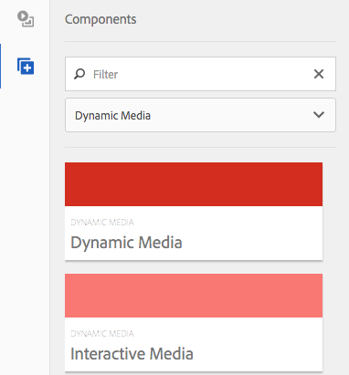

# 将 Dynamic Media 资源添加到页面{#adding-dynamic-media-assets-to-pages}

要将Dynamic Media功能添加到您在网站上使用的资源中，您可以直接在页面上添加&#x200B;**[!UICONTROL Dynamic Media]**&#x200B;或&#x200B;**[!UICONTROL Interactive Media]**&#x200B;组件。 进入&#x200B;**[!UICONTROL 设计]**&#x200B;模式并启用Dynamic Media组件。 然后，您可以将这些组件添加到页面，并将资产添加到该组件。 Dynamic Media和交互式媒体组件是智能的，它们知道您添加的是图像还是视频，可用的选项会相应地发生更改。

如果您使用Dynamic Media作为WCM，则可以直接将Adobe Experience Manager资源添加到页面。

>[!NOTE]
>
>图像映射可开箱即用于传送横幅。

## 将Dynamic Media组件添加到页面 {#adding-a-dynamic-media-component-to-a-page}

将[!UICONTROL Dynamic Media]或[!UICONTROL Interactive Media]组件添加到页面与将组件添加到任何页面相同。 以下各节详细介绍了[!UICONTROL Dynamic Media]和[!UICONTROL Interactive Media]组件。

要将Dynamic Media组件/查看器添加到页面，请执行以下操作：

1. 在Experience Manager中，打开要添加Dynamic Media组件的页面。
1. 如果没有可用的Dynamic Media组件，请选择[!UICONTROL Sidekick]中的标尺以进入&#x200B;**[!UICONTROL 设计]**&#x200B;模式。
1. 选择&#x200B;**[!UICONTROL 编辑]** parsys。
1. 选择&#x200B;**[!UICONTROL Dynamic Media]**，以便您可以使Dynamic Media组件可用。

   >[!NOTE]
   >
   >有关详细信息，请参阅[在设计模式下配置组件](/help/sites-authoring/default-components-designmode.md)。

1. 通过单击[!UICONTROL Sidekick]中的铅笔图标返回到&#x200B;**[!UICONTROL 编辑]**&#x200B;模式。
1. 将Sidekick中&#x200B;**[!UICONTROL Other]**&#x200B;组的&#x200B;**[!UICONTROL Dynamic Media]**&#x200B;或&#x200B;**[!UICONTROL Interactive Media]**&#x200B;组件拖动到所需位置的页面上。
1. 选择&#x200B;**[!UICONTROL 编辑]**&#x200B;以打开该组件。
1. [根据需要编辑组件](#dynamic-media-component)。
1. 选择&#x200B;**[!UICONTROL 确定]**，以便保存您的更改。

## Dynamic Media组件 {#dynamic-media-components}

[!UICONTROL Dynamic Media]和[!UICONTROL Interactive Media]在&#x200B;**[!UICONTROL Dynamic Media]**&#x200B;下的[!UICONTROL Sidekick]中可用。 您将&#x200B;**[!UICONTROL 交互式媒体]**&#x200B;组件用于任何交互式资产，例如交互式视频、交互式图像或轮播集。 对于所有其他Dynamic Media组件，请使用&#x200B;**[!UICONTROL Dynamic Media]**&#x200B;组件。

>[!NOTE]
>
>默认情况下，这些组件不可用，必须在使用之前在设计模式中进行选择。 [在设计模式下使用这些组件后](/help/sites-authoring/default-components-designmode.md)，您可以像添加任何其他Experience Manager组件一样将这些组件添加到您的页面。

### Dynamic Media组件 {#dynamic-media-component}

Dynamic Media组件是智能的 — 根据您添加的是图像还是视频，您拥有各种选项。 该组件支持图像预设、基于图像的查看器（例如图像集、旋转集、混合媒体集和视频）。 此外，查看器会做出响应。 也就是说，屏幕大小会根据屏幕大小自动更改。 所有查看器都是基于HTML5的查看器。

>[!NOTE]
>
>添加[!UICONTROL Dynamic Media]组件，**[!UICONTROL Dynamic Media设置]**&#x200B;为空或无法正确添加资源时，请检查以下内容：
>
>* 您已启用[Dynamic Media](/help/assets/config-dynamic.md)。 默认情况下，Dynamic Media处于禁用状态。
>* 图像具有金字塔tiff文件。 在启用Dynamic Media之前导入的图像没有金字塔tiff文件。
>

#### 使用图像时 {#when-working-with-images}

通过[!UICONTROL Dynamic Media]组件，您可以添加动态图像，包括图像集、旋转集和混合媒体集。 您可以放大、缩小旋转集中的图像或从其他类型的旋转集中选择图像（如果适用）。

还可直接在组件中配置查看器预设、图像预设或图像格式。 要使图像具有响应性，您可以设置断点或应用响应式图像预设。

您可以通过单击组件中的&#x200B;**[!UICONTROL 编辑]**，然后单击&#x200B;**[!UICONTROL Dynamic Media设置]**&#x200B;选项卡来编辑以下Dynamic Media设置。

>[!NOTE]
>
>默认情况下，Dynamic media图像组件是自适应的。 如果要使其变为固定大小，请在&#x200B;**[!UICONTROL 高级]**&#x200B;选项卡的组件中设置它，并使用&#x200B;**[!UICONTROL 宽度]**&#x200B;和&#x200B;**[!UICONTROL 高度]**&#x200B;属性。

**[!UICONTROL 查看器预设]** — 从下拉菜单中选择现有的查看器预设。 如果您要查找的查看器预设不可见，则必须使其可见。 请参阅[管理查看器预设](/help/assets/managing-viewer-presets.md)。 如果您使用的是图像预设，则无法选择查看器预设，反之亦然。

仅当查看图像集、旋转集或混合媒体集时，此选项才可用。 显示的查看器预设是智能的。 也就是说，只显示相关的查看器预设。

**[!UICONTROL 图像预设]** — 从下拉菜单中选择现有的图像预设。 如果您要查找的图像预设不可见，则必须使其可见。 请参阅[管理图像预设](/help/assets/managing-image-presets.md)。 如果您使用的是图像预设，则无法选择查看器预设，反之亦然。

如果要查看图像集、旋转集或混合媒体集，则此选项不可用。

**[!UICONTROL 图像修饰符]** — 您可以通过提供其他图像命令来更改图像效果。 这些命令在[管理图像预设](/help/assets/managing-viewer-presets.md)和[命令引用](https://experienceleague.adobe.com/docs/dynamic-media-developer-resources/image-serving-api/image-serving-api/http-protocol-reference/command-reference/c-command-reference.html?lang=zh-Hans)中进行了说明。

如果要查看图像集、旋转集或混合媒体集，则此选项不可用。

**[!UICONTROL 断点]** — 如果您在响应式网站上使用此资源，则必须添加页面断点。 图像断点由逗号(，)分隔。 当图像预设中未定义高度或宽度时，此选项有效。

如果要查看图像集、旋转集或混合媒体集，则此选项不可用。

您可以通过单击组件中的&#x200B;**[!UICONTROL 编辑]**&#x200B;来编辑以下[!UICONTROL 高级设置]。

**[!UICONTROL 标题]** — 更改图像的标题。

**[!UICONTROL 替换文本]** — 为已关闭图形的用户在图像中添加标题。

如果要查看图像集、旋转集或混合媒体集，则此选项不可用。

**[!UICONTROL URL，在]**&#x200B;中打开 — 您可以从中设置资产以打开链接。 设置&#x200B;**[!UICONTROL URL]**&#x200B;和&#x200B;**[!UICONTROL 在]**&#x200B;中打开，以指示您希望它是在同一窗口中打开还是在新窗口中打开。

如果要查看图像集、旋转集或混合媒体集，则此选项不可用。

**[!UICONTROL 宽度和高度]** — 如果希望图像为固定大小，请输入像素值。 将这些值保留为空可使资源具有自适应性。

#### 使用视频时 {#when-working-with-video}

使用&#x200B;**[!UICONTROL Dynamic Media]**&#x200B;组件向网页添加动态视频。 编辑组件时，您可以选择使用预定义的视频查看器预设来播放页面上的视频。

您可以通过单击组件中的&#x200B;**[!UICONTROL 编辑]**&#x200B;来编辑以下[!UICONTROL Dynamic Media设置]。

>[!NOTE]
>
>默认情况下，Dynamic Media视频组件是自适应的。 如果要使其变为固定大小，请在&#x200B;**[!UICONTROL 高级]**&#x200B;选项卡中具有&#x200B;**[!UICONTROL 宽度]**&#x200B;和&#x200B;**[!UICONTROL 高度]**&#x200B;的组件中设置它。

**[!UICONTROL 查看器预设]** — 从下拉菜单中选择现有的视频查看器预设。 如果您要查找的查看器预设不可见，则必须使其可见。 请参阅[管理查看器预设](/help/assets/managing-viewer-presets.md)。

您可以通过单击组件中的&#x200B;**[!UICONTROL 编辑]**&#x200B;来编辑以下[!UICONTROL 高级]设置。

**[!UICONTROL 标题]** — 更改视频的标题。

**[!UICONTROL 宽度和高度]** — 如果要使视频大小固定，请输入像素值。 将这些值留空可使其具有自适应性。

#### 传送安全视频 {#how-to-delivery-secure-video}

在Experience Manager6.2中，当您安装[FP-13480](https://experience.adobe.com/#/downloads/content/software-distribution/en/aem.html?package=/content/software-distribution/en/details.html/content/dam/aem/public/adobe/packages/cq620/featurepack/cq-6.2.0-featurepack-13480)时，您可以控制是通过安全SSL连接(HTTPS)还是不安全连接(HTTP)来传送视频。 默认情况下，视频交付协议自动继承自嵌入网页的协议。 如果网页是通过HTTPS加载的，则视频也通过HTTPS交付。 反过来，如果网页位于HTTP上，则视频将通过HTTP投放。 通常，此默认行为是正常的，无需进行任何配置更改。 但是，您可以覆盖此默认行为。 将`VideoPlayer.ssl=on`附加到URL路径的末尾或嵌入代码片段中其他查看器配置参数的列表。 这两个操作都会强制安全视频交付。

有关安全视频交付以及在URL路径中使用`VideoPlayer.ssl`配置属性的更多信息，请参阅查看器参考指南中的[安全视频交付](https://experienceleague.adobe.com/docs/dynamic-media-developer-resources/library/viewers-aem-assets-dmc/video/c-html5-video-viewer-20-securevideodelivery.html?lang=zh-Hans)。 除了视频查看器之外，安全视频交付还可用于混合媒体查看器和交互式视频查看器。

### 交互式媒体组件 {#interactive-media-component}

交互式媒体组件适用于在其上具有交互性的资源，例如热点或图像映射。 如果您有交互式图像、交互式视频或传送横幅，请使用&#x200B;**[!UICONTROL 交互式媒体]**&#x200B;组件。

[!UICONTROL Interactive Media]组件是智能的 — 根据您添加的是图像还是视频，您有各种选项。 此外，查看器会做出响应。 也就是说，屏幕大小会根据屏幕大小自动更改。 所有查看器都是基于HTML5的查看器。

您可以通过单击组件中的&#x200B;**[!UICONTROL 编辑]**&#x200B;来编辑以下&#x200B;**[!UICONTROL 常规]**&#x200B;设置。

**[!UICONTROL 查看器预设]** — 从下拉菜单中选择现有的查看器预设。 如果您要查找的查看器预设不可见，则必须使其可见。 必须先发布查看器预设，然后才能使用它们。 请参阅[管理查看器预设](/help/assets/managing-viewer-presets.md)。

**[!UICONTROL 标题]** — 更改视频的标题。

**[!UICONTROL 宽度和高度]** — 如果要使视频大小固定，请输入像素值。 将这些值留空可使其具有自适应性。

您可以通过单击组件中的&#x200B;**[!UICONTROL 编辑]**&#x200B;来编辑以下&#x200B;**[!UICONTROL 添加到购物车]**&#x200B;设置。

**[!UICONTROL 显示产品资产]** — 默认情况下选中此值。 产品资产会显示在Commerce模块中定义的产品图像。 清除复选标记将不显示产品资产。

**[!UICONTROL 显示产品价格]** — 默认选择此值。 产品价格显示Commerce模块中定义的项目价格。 清除复选标记将不显示产品价格。

**[!UICONTROL 显示产品表单]** — 默认情况下，未选择此值。 产品表单包括任何产品变体，如大小和颜色。 清除复选标记将不显示产品变型。
