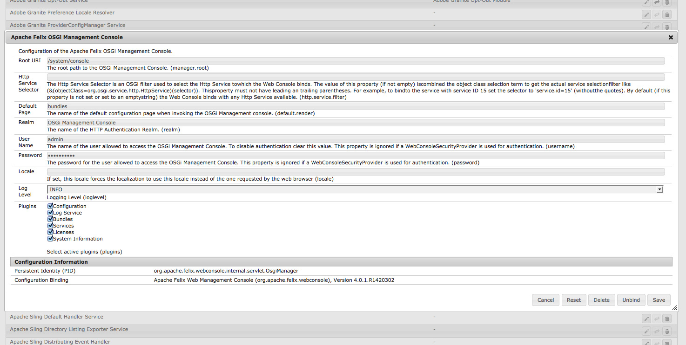

# 配置OSGi{#configuring-osgi}

[OSGi](https://www.osgi.org/)是Adobe Experience Manager (AEM)技术栈栈中的基本元素。 它用于控制AEM的复合捆绑包及其配置。

OSGi“*”提供了标准化基元，允许使用小型、可重用的协作组件构建应用程序。 这些组件可以组合到应用程序中并部署*。

这样可以轻松地管理捆绑包，因为它们可以单独停止、安装和启动。 系统会自动处理相互依赖关系。 每个OSGi组件（请参阅[OSGi规范](https://docs.osgi.org/specification/)）都包含在多个捆绑包中的一个捆绑包中。

您可以通过以下任一方式管理此类捆绑包的配置设置：

* 使用[Adobe CQ Web控制台](#osgi-configuration-with-the-web-console)
* 使用[配置文件](#osgi-configuration-with-configuration-files)
* 在存储库[&#128279;](#osgi-configuration-in-the-repository)中配置内容节点(`sling:OsgiConfig`)

虽然存在细微差异（主要与[运行模式](/help/sites-deploying/configure-runmodes.md)有关），但可以使用任一方法：

* [Adobe CQ Web控制台](#osgi-configuration-with-the-web-console)

   * Web控制台是OSGi配置的标准界面。 它提供了一个用于编辑各种属性的UI，在其中可以从预定义列表中选择可能的值。

     因此，这是最简单的方法。

   * 使用Web控制台所做的任何配置都将立即应用并适用于当前实例，不论当前运行模式如何，也不论后续是否对运行模式进行了任何更改。

* [配置文件](#osgi-configuration-with-configuration-files)

   * 包含在Web控制台中定义的设置。
   * 可以包含在内容包中，以供在其他实例中使用。

* [存储库中的content-nodes (sling：osgiConfig)](#osgi-configuration-in-the-repository)

   * 需要使用CRXDE Lite进行手动配置。
   * 由于`sling:OsgiConfig`节点的命名约定，您可以将配置绑定到特定的[运行模式](/help/sites-deploying/configure-runmodes.md)。 您甚至可以在同一存储库中保存多个运行模式的配置。
   * 任何适当的配置都会立即应用（取决于运行模式）。

无论您使用哪种方法，所有这些配置方法都可以：

* 确保复制或复制存储库内容会重新创建相同的配置。
* 允许您将配置签出到FileVault或Subversion；用于安全或进一步更新。
* 可以保存在包中，以便在设置其他实例时使用。
* 允许您使用脚本执行配置转出以传播配置详细信息。

>[!NOTE]
>
>某些重要设置的详细信息列在[OSGi配置设置下。](/help/sites-deploying/osgi-configuration-settings.md)

## 使用Web控制台进行OSGi配置 {#osgi-configuration-with-the-web-console}

AEM中的[Web控制台](/help/sites-deploying/web-console.md)提供了用于配置捆绑包的标准化界面。 **Configuration**&#x200B;选项卡用于配置OSGi捆绑包，因此是配置AEM系统参数的基础机制。

所做的任何更改将立即应用于相关的OSGi配置，无需重新启动。

>[!NOTE]
>
>在Web控制台中所做的更改将作为[配置文件](#osgi-configuration-with-configuration-files)保存在存储库中。 这些文件可以包含在内容包中，以供在后续安装中重复使用。

>[!NOTE]
>
>在Web控制台上，任何提及默认设置的描述都与Sling默认设置相关。
>
>Adobe Experience Manager有自己的默认值，因此设置的默认值可能与控制台中记录的默认值不同。

要使用Web控制台更新配置，请执行以下操作：

1. 通过以下任一方式访问Web控制台的&#x200B;**配置**&#x200B;选项卡：

   * 从&#x200B;**工具>操作**&#x200B;菜单上的链接打开Web控制台。 登录到控制台后，您可以使用以下下拉菜单：

     **OSGi >**

   * 直接URL；例如：

     `http://localhost:4502/system/console/configMgr`

   此时将显示一个列表。

1. 选择要通过以下任一方式配置的包：

   * 单击该包的&#x200B;**编辑**&#x200B;图标
   * 单击包的&#x200B;**名称**

1. 随即会打开一个对话框。 您可以在此根据需要进行编辑。 例如，将&#x200B;**日志级别**&#x200B;设置为`INFO`：

   

   >[!NOTE]
   >
   >更新将作为[配置文件](#osgi-configuration-with-configuration-files)保存在存储库中。 若要在以后查找这些文件以包含在内容包中以供另一实例使用，例如，记下永久标识(`PID`)。

1. 单击&#x200B;**保存**。

   您的更改将立即应用于正在运行的系统的相关OSGi配置，无需重新启动。

   >[!NOTE]
   >
   >您现在可以找到相关的[配置文件](#osgi-configuration-with-configuration-files)。 例如，包含在内容包中以供在另一个实例上使用。

## 包含配置文件的OSGi配置 {#osgi-configuration-with-configuration-files}

使用Web控制台所做的配置更改作为配置文件( `.config`)保留在存储库中，位于：

`/apps`

这些文件可以包含在内容包中并在其他实例上重用。

>[!NOTE]
>
>配置文件的格式是特定的 — 请参阅Sling Apache文档以了解以下内容：
>* [Apache Sling配置模型和Apache SlingStart](https://sling.apache.org/documentation/development/slingstart.html#default-configuration-format)的完整详细信息。
>* [在Sling](https://sling.apache.org/documentation/tutorials-how-tos/getting-resources-and-properties-in-sling.html)中获取资源和属性的教程和示例。
>
>因此，建议通过在Web控制台中进行实际更改来创建和维护配置文件。

Web控制台不显示存储库中已保存更改的位置，但可以轻松地找到它们：

1. 通过[在Web控制台](#osgi-configuration-with-the-web-console)中进行初始更改来创建配置文件。
1. 打开 CRXDE Lite。
1. 在&#x200B;**工具**&#x200B;菜单中，选择&#x200B;**查询……** 。
1. 要搜索已更新配置的PID，请提交&#x200B;**类型** `SQL`的查询。

   例如，**Apache Felix OSGi管理控制台**&#x200B;的永久标识(PID)为：

   `org.apache.felix.webconsole.internal.servlet.OsgiManager`

   因此，SQL查询可以是：

   ```shell
   select * from nt:base where jcr:path like '/apps/%' and contains(*, 'org.apache.felix.webconsole.internal.servlet.OsgiManager')
   ```

1. 此时将显示配置文件节点。

   对于以上示例：

   `/apps/system/config/org.apache.felix.webconsole.internal.servlet.OsgiManager.config`

   >[!CAUTION]
   >
   >您可以打开此文件以查看更改，但为避免键入错误，建议使用控制台进行实际更改。

1. 您现在可以生成包含此节点的内容包，并根据需要在其他实例中使用。

## 存储库中的OSGi配置 {#osgi-configuration-in-the-repository}

除了使用Web控制台之外，您还可以在存储库中定义配置详细信息。 这样，您就可以轻松配置不同的运行模式。

这些配置是通过在存储库中创建`sling:OsgiConfig`节点以供系统引用来完成的。 这些节点镜像了OSGi配置，并为它们形成了用户界面。 要更新配置数据，请更新节点属性。

如果修改存储库中的配置数据，更改将立即应用于相关的OSGi配置。 就好像更改是使用Web控制台进行的，进行了适当的验证和一致性检查。 此工作流还适用于将配置从`/libs/`复制到`/apps/`的操作。

由于同一个配置参数位于多个位置，因此系统：

* 搜索`sling:OsgiConfig`类型的所有节点
* 根据服务名称过滤
* 根据运行模式进行筛选

>[!NOTE]
>
>另请参阅[如何为特定实例定义基于存储库的配置](https://experienceleague.adobe.com/docs/experience-cloud-kcs/kbarticles/KA-17500.html?lang=zh-Hans)。

### 向存储库添加新配置 {#adding-a-new-configuration-to-the-repository}

#### 您需要了解的信息 {#what-you-need-to-know}

要将配置添加到存储库，您必须知道以下内容：

1. 服务的&#x200B;**永久标识** (PID)。

   引用Web控制台中的&#x200B;**配置**&#x200B;字段。 该名称显示在包名称后面的括号中（或显示在页面底部的&#x200B;**配置信息**&#x200B;中）。

   例如，创建节点`com.day.cq.wcm.core.impl.VersionManagerImpl.`以配置&#x200B;**AEM WCM版本管理器**。

   

1. 是否需要特定的[运行模式](/help/sites-deploying/configure-runmodes.md)？ 创建文件夹：

   * `config` — 适用于所有运行模式
   * `config.author` — 用于创作环境
   * `config.publish` — 用于发布环境
   * `config.<run-mode>` — 根据需要

1. 是否需要&#x200B;**配置**&#x200B;或&#x200B;**工厂配置**？
1. 要配置的单个参数，包括必须重新创建的任何现有参数定义。

   引用Web控制台中的各个参数字段。 每个参数的名称都显示在括号中。

   例如，创建一个资产
   `versionmanager.createVersionOnActivation`配置&#x200B;**激活时创建版本**。

   

1. `/libs`中是否存在配置？ 要列出实例中的所有配置，请使用CRXDE Lite中的&#x200B;**查询**&#x200B;工具提交以下SQL查询：

   `select * from sling:OsgiConfig`

   如果是这样，可将此配置复制到` /apps/<yourProject>/`，然后在新位置对其进行自定义。

#### 在存储库中创建配置 {#creating-the-configuration-in-the-repository}

要向存储库中实际添加新配置，请执行以下操作：

1. 使用CRXDE Lite可导航至：

   ` /apps/<yourProject>`

1. 如果不存在，请创建`config`文件夹( `sling:Folder`)：

   * `config` — 适用于所有运行模式
   * `config.<run-mode>` — 特定于特定运行模式

1. 在此文件夹下创建节点：

   * 类型：`sling:OsgiConfig`
   * 名称：永久标识(PID)；

     例如，对于AEM WCM版本管理器，使用`com.day.cq.wcm.core.impl.VersionManagerImpl`

   >[!NOTE]
   >
   >当进行工厂配置时，将`-<identifier>`附加到名称。
   >
   >作为： `org.apache.sling.commons.log.LogManager.factory.config-<identifier>`
   >
   >其中`<identifier>`被替换成您（必须）输入以标识实例的自由文本（不能忽略此信息）；例如：
   >
   >`org.apache.sling.commons.log.LogManager.factory.config-MINE`

1. 对于要配置的每个参数，在此节点上创建一个属性：

   * 名称：在Web控制台中显示的参数名称；该名称显示在字段描述末尾的括号中。 例如，对于`Create Version on Activation`，使用`versionmanager.createVersionOnActivation`
   * 类型：根据需要。
   * 值：根据需要。

   您只能为要配置的参数创建属性，而其他参数仍采用AEM设置的默认值。

1. 保存所有更改。

   当通过重新启动服务来更新节点时，将应用更改（与Web控制台中所做的更改一样）。

>[!CAUTION]
>
>请勿更改`/libs`路径中的任何内容。

>[!CAUTION]
>
>配置的完整路径必须正确，才能在启动时读取。

## 配置详细信息 {#configuration-details}

### 启动时的解决顺序 {#resolution-order-at-startup}

使用以下优先顺序：

1. `/apps/*/config...`下的存储库节点。类型为`sling:OsgiConfig`或属性文件。

1. `/libs/*/config...`下类型为`sling:OsgiConfig`的存储库节点。 （开箱即用的定义）。

1. 来自`<*cq-installation-dir*>/crx-quickstart/launchpad/config/...`的任何`.config`文件。 在本地文件系统上。

`/libs`中的通用配置可以被`/apps`中的项目特定配置掩盖。

### 运行时解决顺序 {#resolution-order-at-runtime}

系统运行时所做的配置更改会触发使用修改后的配置重新加载。

则以下优先级顺序适用：

1. 在Web控制台中修改配置会立即生效，因为它在运行时具有优先权。
1. 在`/apps`中修改配置会立即生效。
1. 在`/libs`中修改配置会立即生效，除非该配置被`/apps`中的配置掩盖。

### 多种运行模式的分辨率 {#resolution-of-multiple-run-modes}

对于特定于运行模式的配置，可以组合多个运行模式。 例如，您可以按照以下样式创建配置文件夹：

`/apps/*/config.<runmode1>.<runmode2>/`

如果所有运行模式与启动时定义的运行模式匹配，则应用此类文件夹中的配置。

例如，如果使用运行模式`author,dev,emea`启动实例，则应用`/apps/*/config.emea`、`/apps/*/config.author.dev/`和`/apps/*/config.author.emea.dev/`中的配置节点，而不应用`/apps/*/config.author.asean/`和`/config/author.dev.emea.noldap/`中的配置节点。

如果同一PID有多个配置适用，则应用匹配运行模式数最多的配置。

例如，如果实例是以运行模式`author,dev,emea`启动的，且`/apps/*/config.author/`和`/apps/*/config.emea.author/`都定义了配置
`com.day.cq.wcm.core.impl.VersionManagerImpl`，已应用`/apps/*/config.emea.author/`中的配置。

此规则的粒度处于PID级别。
您不能在`/apps/*/config.author/`中为同一PID定义某些属性，也不能在`/apps/*/config.emea.author/`中为同一PID定义更具体的属性。
匹配运行模式数最高的配置对整个PID有效。

### 标准配置 {#standard-configurations}

以下列表显示了存储库中可用配置的一小部分（在标准安装中）：

* 作者 — AEM WCM过滤器：

  `libs/wcm/core/config.author/com.day.cq.wcm.core.WCMRequestFilter`

* Publish - AEM WCM过滤器：

  `libs/wcm/core/config.publish/com.day.cq.wcm.core.WCMRequestFilter`

* Publish - AEM WCM页面统计信息：

  `libs/wcm/core/config.publish/com.day.cq.wcm.core.stats.PageViewStatistics`

>[!NOTE]
>
>由于这些配置位于`/libs`中，因此不能直接编辑它们，而是在自定义之前将其复制到您的应用程序区域(`/apps`)。

要列出实例中的所有配置节点，请使用CRXDE Lite中的&#x200B;**查询**&#x200B;功能提交以下SQL查询：

`select * from sling:OsgiConfig`

### 配置持久性 {#configuration-persistence}

* 如果通过Web控制台更改配置，则它（通常）会写入存储库的以下位置：

  `/apps/{somewhere}`

   * 默认情况下，`{somewhere}`为`system/config`，因此该配置将写入

     `/apps/system/config`

   * 但是，如果您编辑的配置最初来自存储库中的其他位置，例如：

     /libs/foo/config/someconfig

     然后将更新的配置写入原始位置下；例如：

     `/apps/foo/config/someconfig`

* 由`admin`更改的设置保存在下面的`*.config`文件中：

  ```
     /crx-quickstart/launchpad/config
  ```

   * 此区域是OSGi配置管理员的专用数据，包含`admin`指定的所有配置详细信息，无论他们如何进入系统。
   * 此区域是一个实施详细信息，您绝不能直接编辑此目录。
   * 但是，知道这些配置文件的位置很有用，这样就可以获取副本进行备份，或者执行多个安装，或者同时执行两者：

      * Apache Felix OSGi管理控制台

        `../crx/org/apache/felix/webconsole/internal/servlet/OsgiManager.config`

      * CRX Sling客户端存储库

        `../com/day/crx/sling/client/impl/CRXSlingClientRepository/<pid-nr>.config`

>[!CAUTION]
>
>切勿编辑以下文件夹或文件：
>
>`/crx-quickstart/launchpad/config`
