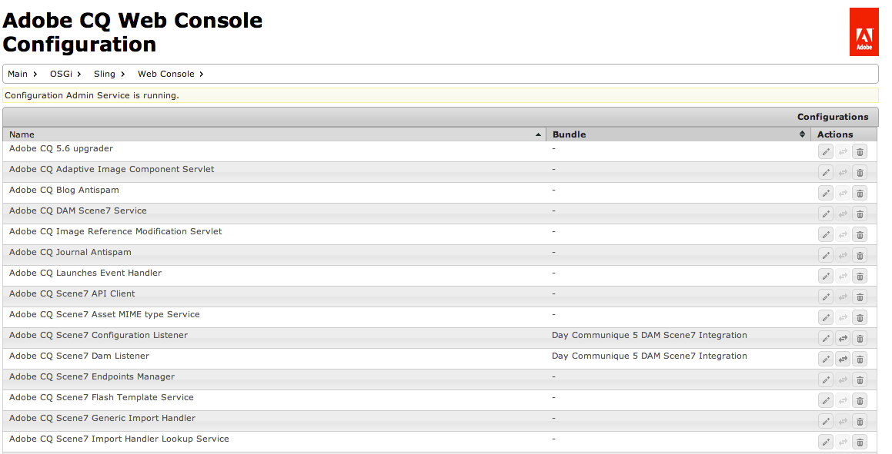

# Web 控制台{#web-console}

AEM (Adobe Experience Manager)中的Web控制台基于 [Apache Felix Web管理控制台](https://felix.apache.org/documentation/subprojects/apache-felix-web-console.html). Apache Felix是社区努力实施OSGi R4服务平台，其中包括OSGi框架和标准服务。

>[!NOTE]
>
>在Web控制台上，任何提及默认设置的描述都与Sling默认设置相关。
>
>AEM有自己的默认值，因此默认设置可能与控制台上记录的那些值不同。

Web控制台提供了一系列用于维护OSGi捆绑包的选项卡，包括：

* [配置](#configuration)：用于配置OSGi包，因此是配置AEM系统参数的底层机制
* [包](#bundles)：用于安装包
* [组件](#components)：用于控制AEM所需组件的状态

所做的任何更改都将立即应用于正在运行的系统。 无需重新启动。

可以从以下位置访问该控制台： `../system/console`；例如：

`http://localhost:4502/system/console/components`

## 配置 {#configuration}

此 **配置** tab用于配置OSGi捆绑包，因此是用于配置AEM系统参数的底层机制。

>[!NOTE]
>
>请参阅 [使用Web控制台进行OSGi配置](/help/sites-deploying/configuring-osgi.md#osgi-configuration-with-the-web-console) 以了解更多详细信息。

此 **配置** 选项卡可通过以下任一方式访问：

* 下拉菜单：

  **OSGi >**

* URL；例如：

  `http://localhost:4502/system/console/configMgr`

将显示配置列表：

此屏幕上的下拉列表中提供了两种类型的配置：

* **配置**

  允许您更新现有配置。 它们具有永久标识(PID)，可以是：

   * 标准ID和AEM的组成部分；如果删除，这些值将返回到默认设置。
   * 从“工厂配置”创建的实例；这些实例由用户创建，删除操作将删除该实例。

* **工厂配置**

  允许您创建所需功能对象的实例。

  这将分配一个永久标识，然后列在Configurations下拉列表中。

从列表中选择任何条目将显示与该配置相关的参数：

然后，您可以根据需要更新参数并：

* **保存**

  保存所做的更改。

  对于工厂配置，这将创建一个具有永久标识的新实例。 然后，新实例将列在Configurations下。

* **重置**

  将屏幕上显示的参数重置为上次保存的参数。

* **删除**

  删除当前配置。 如果为standard，则参数将返回到默认设置。 如果是从工厂配置创建的，则会删除特定的实例。

* **取消绑定**

  从捆绑包中取消当前配置的绑定。

* **取消**

  取消任何当前更改。

## 包 {#bundles}

此 **包** tab是用于安装AEM所需的OSGi捆绑包的机制。 可通过以下任一方法访问选项卡：

* 下拉菜单：

  **OSGi >**

* URL；例如：

  `http://localhost:4502/system/console/bundles`

将显示包列表：

使用此选项卡，您可以：

* **安装或更新**

  您可以 **浏览** 查找包含捆绑包的文件，并指定它是否应 **开始** 立即且 **开始级别**.

* **重新加载**

  刷新显示的列表。

* **刷新包**

  这将检查所有包的引用，并根据需要进行刷新。

  例如，在更新后，由于以前的引用，旧版本和新版本可能仍在运行。 此选项将检查并移动对新版本的所有引用，从而允许旧版本停止。

* **启动**

  根据指定的开始级别启动捆绑包。

* **停止**

  停止包。

* **卸载**

  从系统中卸载该捆绑包。

* **查看状态**

  该列表指定包的当前状态；单击带有显示进一步信息的特定包的名称。

>[!NOTE]
>
>之后 **更新** 建议执行 **刷新包**.

## 组件 {#components}

此 **组件** 选项卡可让您启用和/或禁用各种组件。 可以通过以下任一方式访问该区域：

* 下拉菜单：

  **主要 >**

* URL；例如：

  `http://localhost:4502/system/console/components`

此时将显示组件列表。 您可以使用各种图标来启用、禁用或（在适当时）打开特定组件的配置详细信息。

单击特定组件的名称将显示有关其状态的更多信息。 在此处，您还可以启用、禁用或重新加载组件。

>[!NOTE]
>
>启用或禁用组件仅在重新启动AEM/CRX后才适用。
>
>开始状态在组件描述符中定义，组件描述符在开发期间生成，并在包创建时存储在包中。
