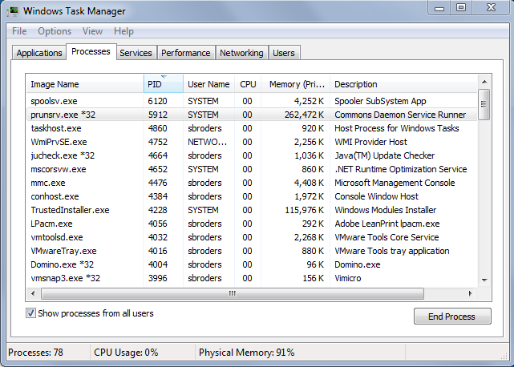

# 自定义独立安装{#custom-standalone-install}

本节介绍安装独立AEM实例时可用的选项。 有关全新安装AEM 6后选择后端存储类型的详细信息，您还可以阅读[存储元素](/help/sites-deploying/storage-elements-in-aem-6.md)。

## 通过重命名文件更改端口号 {#changing-the-port-number-by-renaming-the-file}

AEM的默认端口为4502。 如果该端口不可用或已在使用中，Quickstart会自动将其自身配置为使用第一个可用的端口号，如下所示：4502、8080、8081、8082、8083、8084、8085、8888、9362、`<*random*>`。

您还可以通过重命名快速入门jar文件来设置端口号，以便文件名包含端口号；例如，`cq5-publish-p4503.jar`或`cq5-author-p6754.jar`。

重命名快速入门jar文件时，将遵循各种规则：

* 重命名文件时，必须以`cq;`开头，如`cq5-publish-p4503.jar`所示。

* 建议您&#x200B;*始终*&#x200B;在端口号前面加上 — p；如cq5-publish-p4503.jar或cq5-author-p6754.jar中所示。

>[!NOTE]
>
>这是为了确保您无需担心要执行用于提取端口号的规则：
>
>* 端口号必须为4或5位数
>* 这些数字必须位于短划线之后
>* 如果文件名中有任何其他数字，则端口号必须以`-p`为前缀
>* 文件名开头的“cq5”前缀将被忽略
>

>[!NOTE]
>
>您还可以使用start命令中的`-port`选项更改端口号。

### Java 11注意事项 {#java-considerations}

如果您正在运行Oracle Java 11（或者Java的常规版本高于8），则在启动AEM时，必须在命令行中添加其他开关。

* 需要添加以下 — `-add-opens`开关以防止在`stdout.log`中出现相关的反射访问警告消息

```shell
--add-opens=java.desktop/com.sun.imageio.plugins.jpeg=ALL-UNNAMED --add-opens=java.base/sun.net.www.protocol.jrt=ALL-UNNAMED --add-opens=java.naming/javax.naming.spi=ALL-UNNAMED --add-opens=java.xml/com.sun.org.apache.xerces.internal.dom=ALL-UNNAMED --add-opens=java.base/java.lang=ALL-UNNAMED --add-opens=java.base/jdk.internal.loader=ALL-UNNAMED --add-opens=java.base/java.net=ALL-UNNAMED -Dnashorn.args=--no-deprecation-warning
```

* 此外，您需要使用`-XX:+UseParallelGC`开关来缓解任何潜在的性能问题。

下面是在Java 11上启动AEM时其他JVM参数的外观示例：

```shell
-XX:+UseParallelGC --add-opens=java.desktop/com.sun.imageio.plugins.jpeg=ALL-UNNAMED --add-opens=java.base/sun.net.www.protocol.jrt=ALL-UNNAMED --add-opens=java.naming/javax.naming.spi=ALL-UNNAMED --add-opens=java.xml/com.sun.org.apache.xerces.internal.dom=ALL-UNNAMED --add-opens=java.base/java.lang=ALL-UNNAMED --add-opens=java.base/jdk.internal.loader=ALL-UNNAMED --add-opens=java.base/java.net=ALL-UNNAMED -Dnashorn.args=--no-deprecation-warning
```

最后，如果您正在运行从AEM 6.3升级的实例，请确保在`sling.properties`下将以下属性设置为&#x200B;**true**：

* `felix.bootdelegation.implicit`

## 运行模式 {#run-modes}

**运行模式**&#x200B;允许您针对特定目的调整AEM实例；例如，创作或发布、测试、开发、Intranet等。 这些模式还允许您控制示例内容的使用。 此示例内容是在构建快速入门之前定义的，可以包含包、配置等。 如果您希望保持安装精简并且没有示例内容，这对于生产就绪型安装尤其有用。 有关更多信息，请参阅：

* [运行模式](/help/sites-deploying/configure-runmodes.md)

## 添加文件安装提供程序 {#adding-a-file-install-provider}

默认情况下，将监视文件夹`crx-quickstart/install`中的文件。
此文件夹不存在，但只能在运行时创建。

如果将捆绑包、配置包或内容包放入此目录中，则会自动选取并安装该捆绑包。 如果将其删除，则将其卸载。
这是一种将捆绑包、内容包或配置放入存储库的另一种方式。

这在多个用例中特别有趣：

* 在开发过程中，将某些内容放入文件系统中可能会更容易。
* 如果出现问题，将无法访问Web控制台和存储库。 这样，您可以将其他捆绑包放入此目录中，并且应该安装这些捆绑包。
* 可以在快速入门开始之前创建`crx-quickstart/install`文件夹，还可以将其他包放在该文件夹中。

## 安装和启动Adobe Experience Manager as a Windows Service {#installing-and-starting-adobe-experience-manager-as-a-windows-service}

>[!NOTE]
>
>确保在以管理员身份登录时执行以下过程，或者使用&#x200B;**以管理员身份运行**&#x200B;上下文菜单选择启动/运行这些步骤。
>
>以具有管理员权限的用户登录&#x200B;**不足**。 如果您在完成这些步骤时未以管理员身份登录，则会收到&#x200B;**访问被拒绝**&#x200B;错误。

要安装和启动AEM即Windows服务，请执行以下操作：

1. 在文本编辑器中打开crx-quickstart\opt\helpers\instsrv.bat文件。
1. 如果要配置64位Windows服务器，请根据您的操作系统，使用以下命令之一替换prunsrv的所有实例：

   * prunsrv_amd64
   * prunsrv_ia64

   此命令调用相应的脚本，该脚本在64位Java而不是32位Java中启动Windows服务守护程序。

1. 要防止进程分叉到多个进程中，请增加PermGen JVM参数。 找到`set jvm_options`命令并设置值，如下所示：

   `set jvm_options=-Xmx1792m`

1. 打开命令提示符，将当前目录更改为AEM安装的crx-quickstart/opt/helpers文件夹，然后输入以下命令以创建服务：

   `instsrv.bat cq5`

   要验证是否已创建该服务，请在“管理工具”控制面板中打开“服务”，或在命令提示符下键入`start services.msc`。 cq5服务将显示在列表中。

1. 通过执行以下操作之一启动服务：

   * 在“服务”控制面板中，单击cq5 ，然后单击“启动”。

   

   * 在命令行中，键入net start cq5。

   

1. Windows指示服务正在运行。 AEM将启动，并且prunsrv可执行文件会显示在任务管理器中。 在Web浏览器中，导航到AEM，例如`https://localhost:4502`，以开始使用AEM。

   

>[!NOTE]
>
>创建Windows服务时，将使用instsrv.bat文件中的属性值。 如果您在instsrv.bat中编辑属性值，则必须卸载并重新安装该服务。

>[!NOTE]
>
>安装AEM即服务时，必须从Configuration Manager为`com.adobe.xmp.worker.files.ncomm.XMPFilesNComm`中的日志目录提供绝对路径。

要卸载该服务，请在&#x200B;**服务**&#x200B;控制面板中单击&#x200B;**停止**，或在命令行中导航到文件夹并键入`instsrv.bat -uninstall cq5`。 该服务将从&#x200B;**服务**&#x200B;控制面板的列表中删除，或者在您键入`net start`时从命令行中的列表中删除。

## 重新定义临时工作目录的位置 {#redefining-the-location-of-the-temporary-work-directory}

Java计算机的临时文件夹的默认位置为`/tmp`。 例如，在构建包时，AEM也使用此文件夹。

如果要更改临时文件夹的位置（例如，需要具有更多可用空间的目录），请通过添加JVM参数来定义* `<new-tmp-path>`*：

`-Djava.io.tmpdir="/<*new-tmp-path*>"`

更改为：

* 服务器启动命令行
* serverctl或启动脚本中的CQ_JVM_OPTS环境参数

## 快速入门文件中提供的更多选项 {#further-options-available-from-the-quickstart-file}

快速入门帮助文件中介绍了其他选项和重命名约定，该文件可通过 — help选项获得。 要访问帮助，请键入：

* `java -jar cq-quickstart-6.5.0.jar -help`

>[!CAUTION]
>
>这些选项自AEM 6.5 (6.5.0.0)的原始版本起有效。 在以后的SP版本中可能会进行更改。

```shell
Loading quickstart properties: default
Loading quickstart properties: instance
Setting properties from filename '/Users/Desktop/AEM/cq-quickstart-6.5.0.jar'
--------------------------------------------------------------------------------
Adobe Experience Manager Quickstart (build 20190328)                            
--------------------------------------------------------------------------------
Usage:                                                                          
 Use these options on the Quickstart command line.                              
--------------------------------------------------------------------------------

-help (--help,-h)
         Show this help message                                                 
-quickstart.server.port (-p,-port) <port>
         Set server port number                                                 
-contextpath (-c,-org.apache.felix.http.context_path) <contextpath>
         Set context path                                                       
-debug <port>
         Enable Java Debugging on port number; forces forking                   
-gui 
         Show GUI if running on a terminal                                      
-nobrowser (-quickstart.nobrowser)
         Do not open browser at startup                                         
-unpack
         Unpack installation files only, do not start the server (implies       
         -verbose)                                                              
-v (-verbose)
         Do not redirect stdout/stderr to files and do not close stdin          
-nofork
         Do not fork the JVM, even if not running on a console                  
-fork
         Force forking the JVM if running on a console, using recommended       
         default memory settings for the forked JVM.                            
-forkargs <args> [<args> ...]
         Additional arguments for the forked JVM, defaults to '-Xmx1024m        
         -XX:MaxPermSize=256m '.  Use -- to specify values starting with -,     
         example: '-forkargs -- -server'                                        
-a (--interface) <interface>
         Optional IP address (interface) to bind to                             
-pt <string>
         Process type (main/fork) - do not use directly, used when forking a    
         process                                                                
-r <string> [<string> [<string> [<string> [<string> [<string> [<string> [<string> [<string> [<string>]]]]]]]]]
         Runmode(s) - Use this to define the run mode(s)                        
-b <string>
         Base folder - defines the path under which the quickstart work folder  
         is created                                                             
-low-mem-action <string>
         Low memory action - what to do if memory is insufficient at startup    
-use-control-port
         Start a control port                                                   
-nointeractive
         Start with no interactivity                                            
-ll <level>
         Define launchpad log level (1 = error...4 = debug)                     
-n   
         Do not install shutdown hook                                           
-D<property>=<value>
         Additional framework properties.                                       
-listener-port <listener-port>
         Set listener port number                                               
-x <string>
         Run a Quickstart extension.                                            
  Options for executing Quickstart extensions:
                                                                                
    -xargs <arg> [<arg> ...]
         Construct an arguments list for a Quickstart extension (for example, -xargs -- 
         -arg1 val1 -arg2 val2).                                                
--------------------------------------------------------------------------------
Quickstart filename options                                                     
--------------------------------------------------------------------------------
Usage:                                                                          
 Rename the jar file, including one of the patterns shown below, to set the     
corresponding option. Command-line options have priority on these filename      
patterns.                                                                       
--------------------------------------------------------------------------------

-NNNN
         Include -NNNN.jar or -pNNNN in the renamed jar filename to run on port 
         NNNN, for example: quickstart-8085.jar                                 
-nobrowser
         Include -nobrowser in the renamed jar filename to avoid opening the    
         browser at startup, example: quickstart-nobrowser-8085.jar             
-publish
         Include -publish in the renamed jar filename to run in "publish" mode, 
         example: cq-publish-7502.jar                                           
-dynamicmedia
         Include -dynamicmedia in the renamed jar filename to run in            
         "dynamicmedia" mode, example: quickstart-dynamicmedia-4502.jar         
-dynamicmedia_scene7
         Include -dynamicmedia_scene7 in the renamed jar filename to run in     
         "dynamicmedia_scene7" mode, example:                                   
         quickstart-dynamicmedia_scene7-p4502.jar                               
--------------------------------------------------------------------------------
The license.properties file
--------------------------------------------------------------------------------
  The license.properties file stores licensing information, created from the    
  licensing form displayed on first startup and stored in the folder from where 
  Quickstart is run.                                                            
--------------------------------------------------------------------------------
Log files
--------------------------------------------------------------------------------
  Once Quickstart has been unpacked and started, log files can be found under   
  /Users/aemdocs/CQInstallationKits/AEM-65150-L8/crx-quickstart/logs.           
--------------------------------------------------------------------------------
```

## 在Amazon EC2环境中安装AEM {#installing-aem-in-the-amazon-ec-environment}

在Amazon Elastic Compute Cloud (EC2)实例上安装AEM时，如果同时在EC2实例上安装author和publish，则会按照[安装AEM Manager实例](#installinginstancesofaemmanager)中的过程正确安装Author实例；但是，Publish实例会变为Author。

在EC2环境中安装发布实例之前，请执行以下操作：

1. 在首次启动实例之前，解压缩发布实例的jar文件。 要解压缩文件，请使用以下命令：

   ```xml
   java -jar quickstart.jar -unpack
   ```

   >[!NOTE]
   >
   >如果在首次启动实例后&#x200B;**更改模式**，则无法更改运行模式。

1. 通过运行以下命令启动实例：

   ```xml
   java -jar quickstart.jar -r publish
   ```

   >[!CAUTION]
   >
   >请确保先运行实例，然后再通过运行上面的命令将其解包。 否则，将不会生成quickstart.properties填充。 如果没有此文件，任何未来的AEM升级都将失败。

1. 在&#x200B;**bin**&#x200B;文件夹中，打开&#x200B;**start**&#x200B;脚本并检查以下部分：

   ```xml
   # runmode(s)
   if [ -z "$CQ_RUNMODE" ]; then
    CQ_RUNMODE='author'
   fi
   ```

1. 将运行模式更改为&#x200B;**发布**&#x200B;并保存文件。

   ```xml
   # runmode(s)
   if [ -z "$CQ_RUNMODE" ]; then
    CQ_RUNMODE='publish'
   fi
   ```

1. 通过运行&#x200B;**start**&#x200B;脚本停止实例并重新启动它。

## 验证安装 {#verifying-the-installation}

以下链接可用于验证您的安装是否可正常运行(所有示例都基于实例在本地主机的端口8080上运行，CRX安装在/crx下，而Launchpad安装在/下)：

* `https://localhost:8080/crx/de`
CRXDE Lite控制台。

* `https://localhost:8080/system/console`
Web控制台。

## 安装后的操作 {#actions-after-installation}

尽管配置AEM WCM有很多可能性，但应该执行某些操作，或至少在安装后立即检查：

* 有关确保系统安全所需的任务，请参阅[安全核对清单](/help/sites-administering/security-checklist.md)。
* 查看随AEM WCM一起安装的默认用户和组的列表。 检查您是否想对任何其他帐户执行操作 — 有关更多详细信息，请参阅[安全和用户管理](/help/sites-administering/security.md)。

## 访问CRXDE Lite和Web控制台 {#accessing-crxde-lite-and-the-web-console}

AEM WCM启动后，您还可以访问：

* [CRXDE Lite](#accessing-crxde-lite) — 用于访问和管理存储库
* [Web控制台](#accessing-the-web-console) — 用于管理或配置OSGi包（也称为OSGi控制台）

### 访问CRXDE Lite {#accessing-crxde-lite}

要打开CRXDE Lite，您可以从欢迎屏幕中选择&#x200B;**CRXDE Lite**&#x200B;或使用浏览器导航到

```
 https://<<i>host</i>>:<<i>port</i>>/crx/de/index.jsp
```

例如：
`https://localhost:4502/crx/de/index.jsp`


#### 访问Web控制台 {#accessing-the-web-console}

要访问Adobe CQ Web控制台，您可以从欢迎屏幕中选择&#x200B;**OSGi控制台**，或者使用浏览器导航到

```
 https://<host>:<port>/system/console
```

例如：
`https://localhost:4502/system/console`
或“包”页面
`https://localhost:4502/system/console/bundles`


有关更多详细信息，请参阅使用Web控制台[OSGi配置](/help/sites-deploying/configuring-osgi.md#osgi-configuration-with-the-web-console)。

## 疑难解答 {#troubleshooting}

有关处理安装过程中可能出现的问题信息，请参阅：

* [疑难解答](/help/sites-deploying/troubleshooting.md)

## 卸载Adobe Experience Manager {#uninstalling-adobe-experience-manager}

由于AEM安装在单个目录中，因此无需卸载实用程序。 虽然卸载AEM的方法取决于要实现的目标以及使用何种永久存储，但卸载过程可能只包括删除整个安装目录。

如果永久存储嵌入在安装目录中（例如，在默认的TarPM安装中），则删除文件夹也会删除数据。

>[!NOTE]
>
>Adobe强烈建议您在删除AEM之前备份存储库。 如果删除整个&lt;cq-installation-directory>，则将删除存储库。 要在删除之前保留存储库数据，请在删除其他文件夹之前将&lt;cq-installation-directory>/crx-quickstart/repository文件夹移动或复制到其他位置。

如果您安装的AEM使用外部存储（例如，数据库服务器），则删除文件夹不会自动删除数据，但会删除存储配置，这会使恢复JCR内容变得困难。
