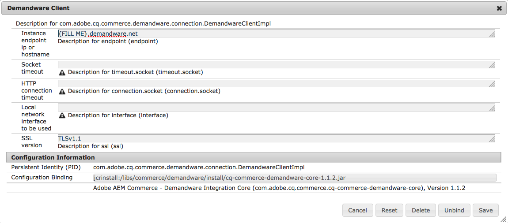

# SalesforceCommerce Cloud{#salesforce-commerce-cloud}

部署必要的电子商务包将提供电子商务框架的完整功能，以及与SalesforceCommerce Cloud/Demandware实施（包括演示目录）一起提供的电子商务功能的参考实施。

## 电子商务需要的包，SalesforceCommerce Cloud{#packages-needed-for-ecommerce-with-salesforce-commerce-cloud}

要安装电子商务功能，您需要：

* AEM eCommerce framework:

   * 这是标准AEM安装的一部分

* AEM Demandware Commerce内容包

   * cq-6.4.0-featurepack-10262

>[!NOTE]
>
>此集成支持配置为使用OCAPI 17.6版或更高版本的SalesforceCommerce Cloud/ Demandware实例。

### 使用SalesforceCommerce Cloud{#installation-of-ecommerce-with-salesforce-commerce-cloud}安装电子商务

要安装AEM和Demandware Commerce集成配置(使用演示目录、Geometrixx Outdoors)，基本步骤为：

1. [安装AEM](/help/sites-deploying/deploy.md)。
1. 使用[包管理器](/help/sites-administering/package-manager.md)安装内容包：
1. [在AEM](/help/sites-authoring/page-authoring.md) 中创作您需要的任何补充页面。

>[!NOTE]
>
>要下载包，请导航到[包共享](/help/sites-administering/package-manager.md#package-share)。

需要配置AEM和Demandware沙箱之间的服务器连接。 大多数配置都已预配置为使用默认路径、库等与提供的SiteGenis演示内容包一起使用。 如果该连接器用于其他站点和库，则需要更新此配置。

1. 导航到[https://localhost:4502/system/console/configMgr](https://localhost:4502/system/console/configMgr)。
1. 单击&#x200B;**Demandware Client**。
1. 根据需要输入&#x200B;**实例endpoint ip或hostname**。

   

1. 单击&#x200B;**保存**。
1. 单击&#x200B;**Demandware TransportHandler Plugin for WebDAV**。
1. 设置&#x200B;**WebDAV用户**&#x200B;和&#x200B;**WebDAV用户密码**。

   

1. 单击&#x200B;**保存**。

#### 复制 {#replication}

在安装包后应启用复制，您可以在此验证：[https://localhost:4502/etc/replication/agents.author/demandware.html](https://localhost:4502/etc/replication/agents.author/demandware.html)

>[!NOTE]
>
>默认情况下，复制代理配置为信息日志级别。 如果您想要获得更多信息，可以切换日志级别进行调试。

#### OAuth {#oauth}

OAuth客户端配置为与Demandware沙箱实例一起使用。 出于测试目的，无需进行任何更改。

对于暂存和生产系统，需要使用适当的客户端ID和密码配置OAuth客户端。

1. 导航到[https://localhost:4502/system/console/configMgr](https://localhost:4502/system/console/configMgr)。
1. 单击&#x200B;**Demandware访问令牌提供商**。

   

1. 根据需要修改值，然后单击“保存”**。**

### SalesforceCommerce Cloud沙箱{#salesforce-commerce-cloud-sandbox}

必须将Demandware沙箱配置为运行新的Velocity模板引擎。

>[!NOTE]
>
>以下向导不是AEM Demandware连接器的一部分。 它按原样提供，作为演示内容包的一部分，以帮助快速设置SiteGenesis演示页面。

1. 导航到[https://localhost:4502/etc/demandware/init.html](https://localhost:4502/etc/demandware/init.html)。
1. 单击&#x200B;**编辑。**
1. 验证值，然后单击&#x200B;**确定**。
1. 单击&#x200B;**初始化**。
1. 转到WebDAV文件夹并检查已发布的模板文件，例如`adobe01-tech-prtnr-na01-dw.demandware.net/on/demandware.servlet/webdav/Sites/Dynamic/SiteGenesis`下。

   >[!NOTE]
   >
   >扩展名为`.vs`。

1. 还检查导出的JS和CSS文件，例如`adobe01-tech-prtnr-na01-dw.demandware.net/on/demandware.servlet/webdav/Sites/Libraries/SiteGenesisSharedLibrary`下。

