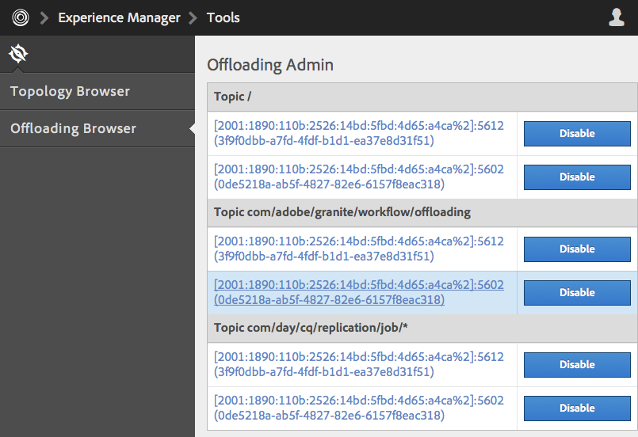

# 卸载作业{#offloading-jobs}

## 简介 {#introduction}

卸载会在拓扑中的Experience Manager实例之间分发处理任务。 通过卸载，您可以使用特定的Experience Manager实例来执行特定类型的处理。 专业化的处理使您能够最大限度地利用可用的服务器资源。

卸载基于[Apache Sling Discovery](https://sling.apache.org/documentation/bundles/discovery-api-and-impl.html)和Sling JobManager功能。 要使用卸载，可以将Experience Manager集群添加到拓扑中，并确定集群处理的作业主题。 集群由一个或多个Experience Manager实例组成，因此单个实例被视为集群。

有关向拓扑添加实例的信息，请参阅[管理拓扑](/help/sites-deploying/offloading.md#administering-topologies)。

### 作业分发 {#job-distribution}

Sling JobManager和JobConsumer允许创建拓扑中处理的作业：

* JobManager：为特定主题创建作业的服务。
* JobConsumer：执行一个或多个主题作业的服务。 可以为同一主题注册多个JobConsumer服务。

当JobManager创建作业时，卸载框架选择拓扑中的一个Experience Manager集群来执行作业：

* 集群必须包括一个或多个正在运行为作业主题注册的JobConsumer的实例。
* 必须至少为集群中的一个实例启用该主题。

有关优化作业分布的信息，请参阅[配置主题消耗](/help/sites-deploying/offloading.md#configuring-topic-consumption)。

当卸载框架选择集群来执行作业，并且该集群由多个实例组成时，Sling Distribution将确定集群中的哪个实例执行作业。

### 作业负载 {#job-payloads}

卸载框架支持将作业与存储库中的资源关联的作业负载。 在为处理资源创建作业并将该作业卸载到另一台计算机时，作业负载非常有用。

在创建作业时，有效负载仅保证位于创建作业的实例上。 在卸载job时，复制代理会确保在最终使用job的实例上创建有效负载。 作业执行完成后，反向复制会导致有效负载被复制回创建该作业的实例。

## 管理拓扑 {#administering-topologies}

拓扑是参与卸载的松散耦合的Experience Manager群集。 集群由一个或多个Experience Manager服务器实例组成（单个实例被视为集群）。

每个Experience Manager实例都运行以下与卸载相关的服务：

* 发现服务：向拓扑连接器发送加入拓扑的请求。
* 拓扑连接器：接收加入请求并接受或拒绝每个请求。

拓扑的所有成员的“发现服务”指向其中一个成员上的“拓扑连接器”。 在接下来的部分中，此成员称为根成员。

拓扑中的每个群集都包含一个被识别为引导的实例。 簇头代表簇的其他成员与拓扑交互。 当引线离开群集时，将自动为群集选择新的引线。

### 查看拓扑 {#viewing-the-topology}

使用“拓扑浏览器”可浏览Experience Manager实例所参与的拓扑的状态。 拓扑浏览器显示拓扑的群集和实例。

对于每个集群，您会看到一个集群成员列表，该列表指示每个成员加入集群的顺序以及哪个成员是领导者。 Current属性指明您当前正在管理的实例。

对于群集中的每个实例，您可以看到几个与拓扑相关的属性：

* 实例作业使用者的主题允许列表。
* 用于连接拓扑的公开端点。
* 为其注册了实例以进行卸载的作业主题。
* 实例处理的作业主题。

1. 使用Touch UI，单击“工具”选项卡。 ([http://localhost:4502/tools.html](http://localhost:4502/tools.html))
1. 在“Granite操作”区域中，单击“卸载浏览器”。
1. 在导航面板中，单击拓扑浏览器。

   此时将显示参与拓扑的群集。

   

1. 单击集群可查看集群中实例的列表及其ID、当前状态和领导者状态。
1. 单击实例ID可查看更详细的属性。

还可以使用Web控制台查看拓扑信息。 控制台提供了有关拓扑群集的详细信息：

* 哪个实例是本地实例。
* 此实例用于连接到拓扑（传出）的拓扑连接器服务，以及连接到此实例的服务（传入）。
* 更改拓扑和实例属性的历史记录。

请按下列步骤打开Web控制台的“拓扑管理”页：

1. 在浏览器中打开Web控制台。 ([http://localhost:4502/system/console](http://localhost:4502/system/console))
1. 单击“Main（主）”>“Topology Management（拓扑管理）”。

   

### 配置拓扑成员资格 {#configuring-topology-membership}

Apache Sling基于资源的发现服务在每个实例上运行，以控制Experience Manager实例与拓扑的交互方式。

发现服务向拓扑连接器服务发送定期POST请求（心率），以建立和维护与拓扑的连接。 Topology Connector服务维护允许加入拓扑的IP地址或主机名允许列表：

* 要将实例加入拓扑，请指定根成员的Topology Connector服务的URL。
* 要启用实例以加入拓扑，请将该实例添加到根成员的拓扑连接器服务的允许列表中。

使用Web控制台或sling：OsgiConfig节点配置org.apache.sling.discovery.impt.Config服务的以下属性：

<table>
 <tbody>
  <tr>
   <th>属性名称</th>
   <th>OSGi名称</th>
   <th>描述</th>
   <th>默认值</th>
  </tr>
  <tr>
   <td>心跳超时（秒）</td>
   <td>heartbeatTimeout</td>
   <td>在目标实例被视为不可用之前等待心跳响应的时间（以秒为单位）。 </td>
   <td>20</td>
  </tr>
  <tr>
   <td>心率间隔（秒）</td>
   <td>heartbeatinterval</td>
   <td>心率之间的间隔时间（以秒为单位）。</td>
   <td>15</td>
  </tr>
  <tr>
   <td>最小事件延迟（秒）</td>
   <td>minEventDelay</td>
   <td>
当拓扑发生更改时，延迟状态从TOPOLOGY_CHANGING更改为TOPOLOGY_CHANGED的时间。 当状态为TOPOLOGY_CHANGING时，发生的每次更改都会将延迟增加此时间。
 
这种延迟可防止侦听器被事件淹没。 
 
若要使用无延迟，请指定0或负数。
 </td>
   <td>3</td>
  </tr>
  <tr>
   <td>拓扑连接器URL</td>
   <td>topologyConnectorUrls</td>
   <td>用于发送心跳消息的Topology Connector服务的URL。</td>
   <td>http://localhost:4502/libs/sling/topology/connector</td>
  </tr>
  <tr>
   <td>拓扑连接器允许列表</td>
   <td>topologyConnectWhitelist</td>
   <td>拓扑中本地Topology Connector服务允许的IP地址或主机名的列表。 </td>
   <td>
localhost
 
127.0.0.1
 </td>
  </tr>
  <tr>
   <td>存储库描述符名称</td>
   <td>leaderElectionRepositoryDescriptor</td>
   <td> </td>
   <td>&lt;无值&gt;</td>
  </tr>
 </tbody>
</table>

使用以下过程将CQ实例连接到拓扑的根成员。 此过程将实例指向根拓扑成员的拓扑连接器URL。 对拓扑的所有成员执行此过程。

1. 在浏览器中打开Web控制台。 ([http://localhost:4502/system/console](http://localhost:4502/system/console))
1. 单击“Main（主）”>“Topology Management（拓扑管理）”。
1. 单击配置发现服务。
1. 向Topology Connector URLs属性中添加项，并指定根拓扑成员的Topology Connector服务的URL。 URL的格式为https://rootservername:4502/libs/sling/topology/connector。

对拓扑的根成员执行以下过程。 此过程会将其它拓扑成员的名称添加到其“发现服务”允许列表中。

1. 在浏览器中打开Web控制台。 ([http://localhost:4502/system/console](http://localhost:4502/system/console))
1. 单击“Main（主）”>“Topology Management（拓扑管理）”。
1. 单击配置发现服务。
1. 对于拓扑的每个成员，向Topology Connector的允许列表属性中添加一个项，并指定拓扑成员的主机名或IP地址。

## 配置主题使用 {#configuring-topic-consumption}

使用卸载浏览器配置拓扑中Experience Manager实例的主题消耗。 对于每个实例，您可以指定它使用的主题。 例如，要配置拓扑以便只有一个实例使用特定类型的主题，请在除一个实例之外的所有实例上禁用该主题。

作业在启用了相关主题的实例之间使用循环调度逻辑进行分配。

1. 使用Touch UI，单击“工具”选项卡。 ([http://localhost:4502/tools.html](http://localhost:4502/tools.html))
1. 在“Granite操作”区域中，单击“卸载浏览器”。
1. 在导航面板中，单击卸载浏览器。

   此时会显示卸载主题和可使用该主题的服务器实例。

   

1. 要禁用某个实例的主题使用，请在主题名称下方单击该实例旁边的禁用。
1. 要配置实例的所有主题使用，请单击任意主题下方的实例标识符。

   

1. 单击主题旁边的以下按钮之一可配置实例的消费行为，然后单击保存：

   * 已启用：此实例使用此主题的作业。
   * 已禁用：此实例不使用此主题的作业。
   * 独占：此实例仅使用此主题的作业。

   **注意：**&#x200B;当您为某个主题选择“独占”时，所有其他主题将自动设置为“已禁用”。

### 已安装的作业使用者 {#installed-job-consumers}

Experience Manager中安装了多个JobConsumer实施。 为其注册这些JobConsumers的主题显示在卸载浏览器中。 出现的其他主题是自定义JobConsumers注册的主题。 下表描述了默认的JobConsumers。

| 作业主题 | 服务 PID | 描述 |
|---|---|---|
| / | org.apache.sling.event.impl.jobs.deprecated.EventAdminBridge | 随Apache Sling一起安装。 处理OSGi事件管理员生成的作业以实现向后兼容性。 |
| com/day/cq/replication/job/&amp;amp；ast； | com.day.cq.replication.impl.AgentManagerImpl | 复制作业负载的复制代理。 |

<!--
| com/adobe/granite/workflow/offloading |com.adobe.granite.workflow.core.offloading.WorkflowOffloadingJobConsumer |Processes jobs that the DAM Update Asset Offloader workflow generates. |
-->

### 禁用和启用实例的主题 {#disabling-and-enabling-topics-for-an-instance}

Apache Sling作业使用者管理器服务提供主题允许列表和阻止列表属性。 配置这些属性以启用或禁用对Experience Manager实例上特定主题的处理。

**注意：**&#x200B;如果实例属于拓扑，则还可以在拓扑中的任何计算机上使用“卸载浏览器”来启用或禁用主题。

创建已启用主题列表的逻辑首先允许允许列表中的所有主题，然后删除阻止列表上的主题。 默认情况下，将启用所有主题(允许列表值为`*`)，并且不会禁用任何主题(阻止列表没有值)。

使用Web控制台或`sling:OsgiConfig`节点配置以下属性。 对于`sling:OsgiConfig`节点，作业使用者管理器服务的PID为org.apache.sling.event.impl.jobs.JobConsumerManager。

| Web控制台中的属性名称 | osgi ID | 描述 |
|---|---|---|
| 主题允许列表 | job.consumermanager.whitelist | 本地JobManager服务处理的主题列表。 默认值&amp;amp；ast；会导致将所有主题发送到注册的TopicConsumer服务。 |
| 主题阻止列表 | job.consumermanager.blacklist | 本地JobManager服务不处理的主题列表。 |

## 创建用于卸载的复制代理 {#creating-replication-agents-for-offloading}

卸载框架使用复制在创作和工作者之间传输资源。 当实例加入拓扑时，卸载框架会自动创建复制代理。 将使用默认值创建代理。 手动更改代理用于验证的密码。

>[!CAUTION]
>
>自动生成的复制代理的一个已知问题要求您手动创建新的复制代理。

创建用于在实例之间传输作业负载以进行卸载的复制代理。 下图显示了从创作实例卸载到工作实例所需的代理。 作者的Sling ID为1，而工作实例的Sling ID为2：

此安装程序需要以下三个代理：

1. 创作实例上复制到工作实例的传出代理。
1. 作者实例上从工作实例上的发件箱中提取的反向代理。
1. 工作实例上的发件箱代理。

此复制方案类似于创作实例和发布实例之间使用的复制方案。 但是，对于卸载情况，所有相关的实例都是创作实例。

>[!NOTE]
>
>卸载框架使用拓扑获取卸载实例的IP地址。 然后，该框架会根据这些IP地址自动创建复制代理。 如果卸载实例的IP地址以后发生更改，则该更改将在实例重新启动后自动传播到拓扑上。 但是，卸载框架不会自动更新复制代理以反映新的IP地址。 要避免出现这种情况，请为拓扑中的所有实例使用固定IP地址。

### 命名要卸载的复制代理 {#naming-the-replication-agents-for-offloading}

为复制代理的&#x200B;***Name***&#x200B;属性使用特定格式，以便卸载框架自动为特定工作进程实例使用正确的代理。

**为创作实例上的传出代理命名：**

`offloading_<slingid>`，其中`<slingid>`是辅助进程实例的Sling ID。

示例： `offloading_f5c8494a-4220-49b8-b079-360a72f71559`

**在创作实例上命名反向代理：**

`offloading_reverse_<slingid>`，其中`<slingid>`是辅助进程实例的Sling ID。

示例： `offloading_reverse_f5c8494a-4220-49b8-b079-360a72f71559`

**为辅助进程实例上的发件箱命名：**

`offloading_outbox`

### 创建传出代理 {#creating-the-outgoing-agent}

1. 在作者上创建&#x200B;**复制代理**。 （请参阅有关复制代理的[文档](/help/sites-deploying/replication.md)）。 指定任何&#x200B;**标题**。 **名称**&#x200B;必须遵循命名约定。
1. 使用以下属性创建代理：

   | 属性 | 价值 |
   |---|---|
   | “设置”>“序列化类型” | 默认 |
   | 传输>传输URI | https://*`<ip of target instance>`*：*`<port>`*`/bin/receive?sling:authRequestLogin=1` |
   | 传输>传输用户 | 目标实例上的复制用户 |
   | 传输>传输密码 | 目标实例上的复制用户密码 |
   | 扩展> HTTP方法 | POST |
   | 触发器>忽略默认值 | 真 |

### 创建反向代理 {#creating-the-reverse-agent}

1. 在作者上创建&#x200B;**反向复制代理**。 （请参阅有关复制代理](/help/sites-deploying/replication.md)的[文档。） 指定任何&#x200B;**标题**。 **名称**&#x200B;必须遵循命名约定。
1. 使用以下属性创建代理：

   | 属性 | 价值 |
   |---|---|
   | “设置”>“序列化类型” | 默认 |
   | 传输>传输URI | https://*`<ip of target instance>`*：*`<port>`*`/bin/receive?sling:authRequestLogin=1` |
   | 传输>传输用户 | 目标实例上的复制用户 |
   | 传输>传输密码 | 目标实例上的复制用户密码 |
   | 扩展> HTTP方法 | GET |

### 创建发件箱代理 {#creating-the-outbox-agent}

1. 在辅助进程实例上创建&#x200B;**复制代理**。 （请参阅有关复制代理](/help/sites-deploying/replication.md)的[文档。） 指定任何&#x200B;**标题**。 **名称**&#x200B;必须为`offloading_outbox`。
1. 使用以下属性创建代理。

   | 属性 | 价值 |
   |---|---|
   | “设置”>“序列化类型” | 默认 |
   | 传输>传输URI | repo://var/replication/outbox |
   | 触发器>忽略默认值 | 真 |

### 查找Sling ID {#finding-the-sling-id}

使用以下任一方法获取Experience Manager实例的Sling ID：

* 打开Web控制台，然后在Sling设置中找到Sling ID属性的值([http://localhost:4502/system/console/status-slingsettings](http://localhost:4502/system/console/status-slingsettings))。 如果实例尚未成为拓扑的一部分，此方法将很有用。
* 如果实例已经是拓扑的一部分，请使用拓扑浏览器。

<!--
## Offloading the Processing of DAM Assets {#offloading-the-processing-of-dam-assets}

Configure the instances of a topology so that specific instances perform the background processing of assets that are added or updated in DAM.

By default, Experience Manager executes the [!UICONTROL DAM Update Asset] workflow when a DAM asset changes or one is added to DAM. Change the default behavior so that Experience Manager instead executes the [!UICONTROL DAM Update Asset Offloader] workflow. This workflow generates a JobManager job that has a topic of `com/adobe/granite/workflow/offloading`. Then, configure the topology so that the job is offloaded to a dedicated worker.

>[!CAUTION]
>
>No workflow should be transient when used with workflow offloading. For example, the [!UICONTROL DAM Update Asset] workflow must not be transient when used for asset offloading. To set/unset the transient flag on a workflow, see [Transient Workflows](/help/assets/performance-tuning-guidelines.md#workflows).

The following procedure assumes the following characteristics for the offloading topology:

* One or more Experience Manager instance are authoring instances that users interact with for adding or updating DAM assets.
* Users to do not directly interact with one or more Experience Manager instances that process the DAM assets. These instances are dedicated to the background processing of DAM assets.

1. On each Experience Manager instance, configure the Discovery Service so that it points to the root Topography Connector. (See [Configuring Topology Membership](#title4).)
1. Configure the root Topography Connector so that the connecting instances are on the allow list.
1. Open Offloading Browser and disable the `com/adobe/granite/workflow/offloading` topic on the instances with which users interact to upload or change DAM assets.

   

1. On each instance that users interact with to upload or change DAM assets, configure workflow launchers to use the [!UICONTROL DAM Update Asset Offloading] workflow:

    1. Open the Workflow console.
    1. Click the Launcher tab.
    1. Locate the two Launcher configurations that execute the [!UICONTROL DAM Update Asset] workflow. One launcher configuration event type is Node Created, and the other type is Node Modified.
    1. Change both event types so that they execute the [!UICONTROL DAM Update Asset Offloading] workflow. (For information about launcher configurations, see [Starting Workflows When Nodes Change](/help/sites-administering/workflows-starting.md).)

1. On the instances that perform the background processing of DAM assets, disable the workflow launchers that execute the [!UICONTROL DAM Update Asset] workflow.
-->

## 深入阅读 {#further-reading}

除了此页面上显示的详细信息外，您还可以阅读以下内容：

* 有关使用Java API创建作业和作业使用者的信息，请参阅[创建和使用卸载作业](/help/sites-developing/dev-offloading.md)。
