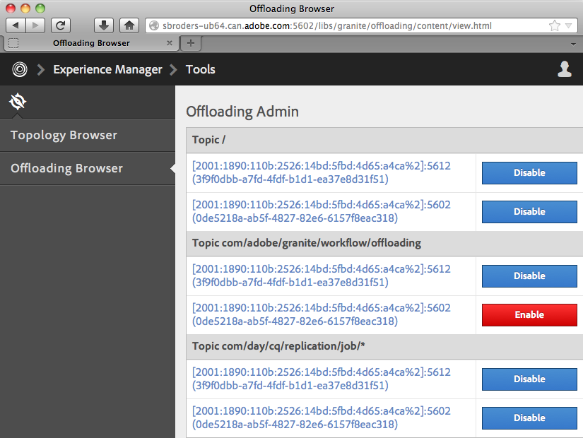

# 卸载作业{#offloading-jobs}

## 简介 {#introduction}

卸载在拓扑中的Experience Manager实例之间分布处理任务。 通过卸载，您可以使用特定的Experience Manager实例执行特定类型的处理。 专用处理使您能够最大限度地利用可用的服务器资源。

卸载基于[Apache Sling Discovery](https://sling.apache.org/documentation/bundles/discovery-api-and-impl.html)和Sling JobManager功能。 要使用卸载，可向拓扑中添加Experience Manager群集并标识群集处理的作业主题。 群集由一个或多个Experience Manager实例组成，因此单个实例被视为群集。

有关将实例添加到拓扑的信息，请参阅[管理拓扑](/help/sites-deploying/offloading.md#administering-topologies)。

### 作业分配{#job-distribution}

Sling JobManager和JobConsumer支持创建在拓扑中处理的作业：

* JobManager:为特定主题创建作业的服务。
* JobConsumer:执行一个或多个主题的作业的服务。 可以为同一主题注册多个JobConsumer服务。

当JobManager创建作业时，卸载框架会选择拓扑中的Experience Manager群集来执行该作业：

* 群集必须包括一个或多个运行为作业主题注册的JobConsumer的实例。
* 必须为群集中的至少一个实例启用主题。

有关优化作业分配的信息，请参阅[配置主题消耗](/help/sites-deploying/offloading.md#configuring-topic-consumption)。

当卸载框架选择群集以执行作业，且该群集由多个实例组成时，Sling Distribution将确定群集中的哪个实例执行该作业。

### 作业负载{#job-payloads}

卸载框架支持将作业与存储库中的资源关联的作业负载。 当为处理资源创建作业并且作业被卸载到另一台计算机时，作业负载很有用。

在创建作业时，仅保证有效负荷位于创建作业的实例上。 卸载作业时，复制代理确保在最终读取作业的实例上创建负载。 当作业执行完成时，反向复制会导致负载被复制回创建作业的实例。

## 管理拓扑{#administering-topologies}

拓扑是参与卸载的松耦合Experience Manager群集。 群集由一个或多个Experience Manager服务器实例（单个实例被视为群集）组成。

每个Experience Manager实例都运行以下卸载相关服务：

* 发现服务：向拓扑连接器发送请求以加入拓扑。
* 拓扑连接器：接收加入请求，并接受或拒绝每个请求。

拓扑的所有成员的发现服务指向其中一个成员上的拓扑连接器。 在后面几节中，此成员称为根成员。

拓扑中的每个群集都包含一个被识别为引线的实例。 群集领导者代表群集的其他成员与拓扑交互。 当引线离开群集时，会自动选择群集的新引线。

### 查看拓扑{#viewing-the-topology}

使用拓扑浏览器来浏览Experience Manager实例所参与的拓扑的状态。 拓扑浏览器显示拓扑的群集和实例。

对于每个群集，您会看到一个群集成员列表，它指示每个成员加入群集的顺序以及哪个成员是Leader。 “当前”属性指示您当前管理的实例。

对于群集中的每个实例，您可以看到几个与拓扑相关的属性：

* 实例的作业使用者主题允许列表。
* 为与拓扑连接而公开的端点。
* 已注册实例以卸载的作业主题。
* 实例处理的作业主题。

1. 使用触控UI，单击工具选项卡。 ([http://localhost:4502/tools.html](http://localhost:4502/tools.html))
1. 在“Granite操作”区域，单击“卸载浏览器”。
1. 在导航面板中，单击拓扑浏览器。

   将显示参与拓扑的群集。

   

1. 单击群集可查看群集中实例的列表及其ID、当前状态和领导者状态。
1. 单击实例ID以查看更详细的属性。

您还可以使用Web控制台来视图拓扑信息。 控制台提供了有关拓扑群集的更多信息：

* 哪个实例是本地实例。
* 此实例用来连接到拓扑（传出）的拓扑连接器服务，以及连接到此实例（传入）的服务。
* 更改拓扑和实例属性的历史记录。

请按照以下过程打开Web控制台的“拓扑管理”页：

1. 在浏览器中打开Web控制台。 ([http://localhost:4502/system/console](http://localhost:4502/system/console))
1. 单击“主”>“拓扑管理”。

   

### 配置拓扑成员{#configuring-topology-membership}

Apache Sling基于资源的发现服务在每个实例上运行，以控制Experience Manager实例与拓扑交互的方式。

Discovery服务会定期向拓扑连接器服务发送POST请求（心跳），以建立和维护与拓扑的连接。 拓扑连接器服务保留允许加入拓扑的IP地址或主机名允许列表:

* 要将实例连接到拓扑，请指定根成员的拓扑连接器服务的URL。
* 要启用实例加入拓扑，请将实例添加到根成员的拓扑连接器服务的允许列表中。

使用Web控制台或sling:OsgiConfig节点配置org.apache.sling.discovery.impt.Config服务的以下属性：

<table>
 <tbody>
  <tr>
   <th>属性名称</th>
   <th>OSGi名称</th>
   <th>描述</th>
   <th>默认值</th>
  </tr>
  <tr>
   <td>心跳超时（秒）</td>
   <td>heartbeatTimeout</td>
   <td>在目标实例被认为不可用之前等待心跳响应的时间（以秒为单位）。 </td>
   <td>20</td>
  </tr>
  <tr>
   <td>心跳间隔（秒）</td>
   <td>heartbeatInterval</td>
   <td>心率之间的秒数。</td>
   <td>15</td>
  </tr>
  <tr>
   <td>最小事件延迟（秒）</td>
   <td>minEventDelay</td>
   <td>
当拓扑发生更改时，将状态从TOPOLOGY_CHANGING延迟到TOPOLOGY_CHANGED的时间。 当状态为TOPOLOGY_CHANGING时发生的每次更改都会将延迟增加此时间量。
 
这种延迟防止听众被事件淹没。 
 
要不使用延迟，请指定0或负数。
 </td>
   <td>3</td>
  </tr>
  <tr>
   <td>拓扑连接器URL</td>
   <td>topologyConnectorUrl</td>
   <td>用于发送心跳消息的拓扑连接器服务的URL。</td>
   <td>http://localhost:4502/libs/sling/topology/connector</td>
  </tr>
  <tr>
   <td>拓扑连接器允许列表</td>
   <td>topologyConnectorWhitelist</td>
   <td>列表本地拓扑连接器服务在拓扑中允许的IP地址或主机名。 </td>
   <td>
lochhost
 
127.0.0.1
 </td>
  </tr>
  <tr>
   <td>存储库描述符名称</td>
   <td>leaderElectionRepositoryDescriptor</td>
   <td> </td>
   <td>&lt;无值&gt;</td>
  </tr>
 </tbody>
</table>

请按照以下过程将CQ实例连接到拓扑的根成员。 此过程将实例指向根拓扑成员的拓扑连接器URL。 对拓扑的所有成员执行此过程。

1. 在浏览器中打开Web控制台。 ([http://localhost:4502/system/console](http://localhost:4502/system/console))
1. 单击“主”>“拓扑管理”。
1. 单击配置发现服务。
1. 向“拓扑连接器URL”属性添加一个项，并指定根拓扑成员的“拓扑连接器”服务的URL。 URL的格式为https://rootservername:4502/libs/sling/topology/connector。

对拓扑的根成员执行以下过程。 该过程将其他拓扑成员的名称添加到其“发现服务”允许列表。

1. 在浏览器中打开Web控制台。 ([http://localhost:4502/system/console](http://localhost:4502/system/console))
1. 单击“主”>“拓扑管理”。
1. 单击配置发现服务。
1. 对于拓扑的每个成员，向“拓扑连接器允许列表”属性添加一个项，并指定拓扑成员的主机名或IP地址。

## 配置主题消耗{#configuring-topic-consumption}

使用卸载浏览器为拓扑中的Experience Manager实例配置主题消耗。 对于每个实例，您可以指定它使用的主题。 例如，要配置拓扑以便只有一个实例读取特定类型的主题，请禁用除一个实例外的所有实例上的主题。

作业在使用循环逻辑启用相关主题的实例之间分配。

1. 使用触控UI，单击工具选项卡。 ([http://localhost:4502/tools.html](http://localhost:4502/tools.html))
1. 在“Granite操作”区域，单击“卸载浏览器”。
1. 在导航面板中，单击“卸载浏览器”。

   将显示卸载主题以及可使用主题的服务器实例。

   

1. 要禁用实例主题的使用，请在主题名称下单击实例旁边的禁用。
1. 要配置实例的所有主题消耗，请单击任意主题下的实例标识符。

   

1. 单击主题旁边的以下按钮之一以配置实例的使用行为，然后单击保存：

   * 已启用：此实例读取此主题的作业。
   * 已禁用：此实例不使用本主题的作业。
   * 独家：此实例仅读取此主题的作业。

   **注意：** 当您为某个主题选择“独占”时，所有其他主题将自动设置为“已禁用”。

### 已安装的作业使用者{#installed-job-consumers}

JobConsumer实现随Experience Manager一起安装。 注册这些JobConsumer的主题显示在卸载浏览器中。 显示的其他主题是自定义JobConsumer已注册的主题。 下表描述了默认的JobConsumer。

| 作业主题 | 服务PID | 描述 |
|---|---|---|
| / | org.apache.sling.event.impl.jobs.deprecated.EventAdminBridge | 已与Apache Sling一起安装。 处理OSGi事件管理员生成的作业，以实现向后兼容性。 |
| com/day/cq/replication/job/&amp;ast; | com.day.cq.replication.impl.AgentManagerImpl | 复制作业负载的复制代理。 |

<!--
| com/adobe/granite/workflow/offloading |com.adobe.granite.workflow.core.offloading.WorkflowOffloadingJobConsumer |Processes jobs that the DAM Update Asset Offloader workflow generates. |
-->

### 为实例{#disabling-and-enabling-topics-for-an-instance}禁用和启用主题

Apache Sling Job Consumer Manager服务提供主题允许列表和阻止列表属性。 配置这些属性以启用或禁用对Experience Manager实例上特定主题的处理。

**注意：** 如果实例属于拓扑，您还可以在拓扑中的任何计算机上使用卸载浏览器来启用或禁用主题。

创建已启用主题列表的逻辑首先允许允许列表中的所有主题，然后删除阻止列表上的主题。 默认情况下，所有主题均处于启用状态(允许列表值为`*`)，并且不禁用任何主题(阻止列表没有值)。

使用Web控制台或`sling:OsgiConfig`节点配置以下属性。 对于`sling:OsgiConfig`节点，作业消费者管理器服务的PID为org.apache.sling.事件.impl.jobs.JobConsumerManager。

| Web控制台中的属性名称 | OSGi ID | 描述 |
|---|---|---|
| 主题允许列表 | job.consumermanager.whitelist | 本地JobManager服务处理的主题列表。 &amp;ast；的默认值使所有主题都发送到已注册的TopicConsumer服务。 |
| 主题阻止列表 | job.consumermanager.blacklist | 本地JobManager服务未处理的主题列表。 |

## 创建用于卸载{#creating-replication-agents-for-offloading}的复制代理

卸载框架使用复制在作者和工作者之间传输资源。 卸载框架在实例加入拓扑时自动创建复制代理。 代理是使用默认值创建的。 您必须手动更改代理用于身份验证的密码。

>[!CAUTION]
>
>自动生成的复制代理存在一个已知问题，需要您手动创建新的复制代理。 在创建要卸载的代理之前，请按照[使用自动生成的复制代理时遇到的问题](/help/sites-deploying/offloading.md#problems-using-the-automatically-generated-replication-agents)中的步骤操作。

创建在实例之间传输作业负载以进行卸载的复制代理。 下图显示了从作者卸载到工作实例所需的代理。 作者的Sling ID为1，而工作实例的Sling ID为2:

此设置需要以下三个代理：

1. 创作实例上复制到工作实例的传出代理。
1. 创作实例上的反向代理，它从worker实例的发件箱中提取。
1. 工作器实例上的发件箱代理。

此复制方案与创作实例和发布实例之间使用的复制方案类似。 但是，对于卸载情况，涉及的所有实例都是创作实例。

>[!NOTE]
>
>卸载框架使用拓扑获取卸载实例的IP地址。 然后，框架会根据这些IP地址自动创建复制代理。 如果卸载实例的IP地址稍后发生更改，则在实例重新启动后，更改会自动传播到拓扑上。 但是，卸载框架不会自动更新复制代理以反映新的IP地址。 要避免这种情况，请对拓扑中的所有实例使用固定的IP地址。

### 命名复制代理以卸载{#naming-the-replication-agents-for-offloading}

为复制代理的&#x200B;***Name***&#x200B;属性使用特定格式，以便卸载框架自动为特定工作实例使用正确的代理。

**在创作实例上命名传出代理：**

`offloading_<slingid>`，其 `<slingid>` 中是worker实例的Sling ID。

示例: `offloading_f5c8494a-4220-49b8-b079-360a72f71559`

**在创作实例上命名反向代理：**

`offloading_reverse_<slingid>`，其 `<slingid>` 中是worker实例的Sling ID。

示例: `offloading_reverse_f5c8494a-4220-49b8-b079-360a72f71559`

**在worker实例上命名输出框：**

`offloading_outbox`

### 创建传出代理{#creating-the-outgoing-agent}

1. 创建作者的&#x200B;**复制代理**。 （请参见[复制代理文档](/help/sites-deploying/replication.md)）。 指定任何&#x200B;**Title**。 **名称**&#x200B;必须遵循命名约定。
1. 使用以下属性创建代理：

   | 属性 | 值 |
   |---|---|
   | “设置”>“序列化类型” | 默认 |
   | 传输>传输URI | https://*`<ip of target instance>`*:*`<port>`*`/bin/receive?sling:authRequestLogin=1` |
   | 传输>传输用户 | 目标实例上的复制用户 |
   | 传输>传输密码 | 目标实例上的复制用户密码 |
   | “扩展”>“HTTP方法” | POST |
   | “触发器”>“忽略默认值” | True |

### 创建反向代理{#creating-the-reverse-agent}

1. 创建作者的&#x200B;**反向复制代理**。 （有关复制代理](/help/sites-deploying/replication.md)，请参阅[文档。） 指定任何&#x200B;**Title**。 **名称**&#x200B;必须遵循命名约定。
1. 使用以下属性创建代理：

   | 属性 | 值 |
   |---|---|
   | “设置”>“序列化类型” | 默认 |
   | 传输>传输URI | https://*`<ip of target instance>`*:*`<port>`*`/bin/receive?sling:authRequestLogin=1` |
   | 传输>传输用户 | 目标实例上的复制用户 |
   | 传输>传输密码 | 目标实例上的复制用户密码 |
   | “扩展”>“HTTP方法” | GET |

### 创建发件箱代理{#creating-the-outbox-agent}

1. 在worker实例上创建&#x200B;**复制代理**。 （有关复制代理](/help/sites-deploying/replication.md)，请参阅[文档。） 指定任何&#x200B;**Title**。 **名称**&#x200B;必须为`offloading_outbox`。
1. 使用以下属性创建代理。

   | 属性 | 值 |
   |---|---|
   | “设置”>“序列化类型” | 默认 |
   | 传输>传输URI | repo://var/replication/outbox |
   | “触发器”>“忽略默认值” | True |

### 查找Sling ID {#finding-the-sling-id}

使用以下任一方法获取Experience Manager实例的Sling ID:

* 打开Web控制台，在“Sling设置”中，找到Sling ID属性的值([http://localhost:4502/system/console/status-slingsettings](http://localhost:4502/system/console/status-slingsettings))。 如果实例尚不是拓扑的一部分，则此方法很有用。
* 如果实例已是拓扑的一部分，请使用拓扑浏览器。

<!--
## Offloading the Processing of DAM Assets {#offloading-the-processing-of-dam-assets}

Configure the instances of a topology so that specific instances perform the background processing of assets that are added or updated in DAM.

By default, Experience Manager executes the [!UICONTROL DAM Update Asset] workflow when a DAM asset changes or one is added to DAM. Change the default behavior so that Experience Manager instead executes the [!UICONTROL DAM Update Asset Offloader] workflow. This workflow generates a JobManager job that has a topic of `com/adobe/granite/workflow/offloading`. Then, configure the topology so that the job is offloaded to a dedicated worker.

>[!CAUTION]
>
>No workflow should be transient when used with workflow offloading. For example, the [!UICONTROL DAM Update Asset] workflow must not be transient when used for asset offloading. To set/unset the transient flag on a workflow, see [Transient Workflows](/help/assets/performance-tuning-guidelines.md#workflows).

The following procedure assumes the following characteristics for the offloading topology:

* One or more Experience Manager instance are authoring instances that users interact with for adding or updating DAM assets.
* Users to do not directly interact with one or more Experience Manager instances that process the DAM assets. These instances are dedicated to the background processing of DAM assets.

1. On each Experience Manager instance, configure the Discovery Service so that it points to the root Topography Connector. (See [Configuring Topology Membership](#title4).)
1. Configure the root Topography Connector so that the connecting instances are on the allow list.
1. Open Offloading Browser and disable the `com/adobe/granite/workflow/offloading` topic on the instances with which users interact to upload or change DAM assets.

   

1. On each instance that users interact with to upload or change DAM assets, configure workflow launchers to use the [!UICONTROL DAM Update Asset Offloading] workflow:

    1. Open the Workflow console.
    1. Click the Launcher tab.
    1. Locate the two Launcher configurations that execute the [!UICONTROL DAM Update Asset] workflow. One launcher configuration event type is Node Created, and the other type is Node Modified.
    1. Change both event types so that they execute the [!UICONTROL DAM Update Asset Offloading] workflow. (For information about launcher configurations, see [Starting Workflows When Nodes Change](/help/sites-administering/workflows-starting.md).)

1. On the instances that perform the background processing of DAM assets, disable the workflow launchers that execute the [!UICONTROL DAM Update Asset] workflow.
-->

## 进一步阅读{#further-reading}

除了本页中介绍的详细信息之外，您还可以阅读以下内容：

* 有关使用Java API创建作业和作业使用者的信息，请参阅[创建和使用卸载的作业](/help/sites-developing/dev-offloading.md)。
