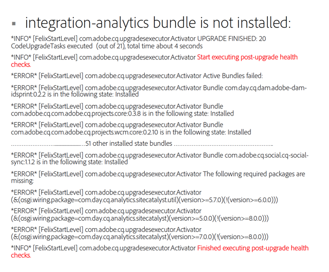

# 升级后检查和故障排除{#post-upgrade-checks-and-troubleshooting}

## 升级后检查 {#post-upgrade-checks}

在[就地升级](/help/sites-deploying/in-place-upgrade.md)后，应执行以下活动以完成升级。 我们假定AEM已使用6.5 jar启动，并且已部署升级的代码库。

* [验证日志以确认升级成功](#main-pars-header-290365562)

* [验证OSGi包](#main-pars-header-1637350649)

* [验证Oak版本](#main-pars-header-1293049773)

* [Inspect PreUpgradeBackup文件夹](#main-pars-header-988995987)

* [页面初始验证](#main-pars-header-20827371)
* [应用AEM Service Pack](#main-pars-header-215142387)

* [迁移AEM功能](#main-pars-header-1434457709)

* [验证计划的维护配置](#main-pars-header-1552730183)

* [启用复制代理](#main-pars-header-823243751)

* [启用自定义计划作业](#main-pars-header-244535083)

* [执行测试计划](#main-pars-header-1167972233)

### 验证升级成功的日志 {#verify-logs-for-upgrade-success}

**upgrade.log**

过去，检查实例的升级后状态需要仔细检查各种日志文件、存储库部分和启动板。 生成升级后报告有助于在升级启动前检测有缺陷的升级。

此功能的主要目的在于减少手动解释或跨越多个端点复杂解析逻辑的需要，这些逻辑是确保升级成功所必需的。 该解决方案旨在为外部自动化系统提供明确的信息以在更新的成功或识别失败时做出反应。

更具体地说，它确保：

* 升级框架检测到的升级故障集中在一个升级报告中；
* 升级报告包含有关必要手动干预的指标。

为了适应这种情况，已在`upgrade.log`文件中更改生成日志的方式。

以下是一个示例报表，该报表在升级期间未显示任何错误：


以下是一个示例报告，其中显示了升级过程中未安装的捆绑包：



**error.log**

在使用目标版本jar启动AEM期间和之后，应该仔细查看error.log。 应审查任何警告或错误。 通常，最好在日志的开头查找问题。 日志中稍后发生的错误实际上可能是文件早期调出的根本原因的副作用。 如果出现重复错误和警告，请参阅下面的[分析升级问题](/help/sites-deploying/post-upgrade-checks-and-troubleshooting.md#analyzing-issues-with-the-upgrade)。

### 验证OSGi包 {#verify-osgi-bundles}

导航到OSGi控制台`/system/console/bundles`，并查看是否有任何捆绑包未启动。 如果有任何捆绑包处于已安装状态，请查阅`error.log`以确定根问题。

### 验证Oak版本 {#verify-oak-version}

升级后，您应会看到Oak版本已更新为&#x200B;**1.10.2**。 要验证Oak版本，请导航到OSGi控制台，并查看与Oak捆绑包关联的版本：Oak Core、Oak Commons、Oak Segment Tar。

### Inspect PreUpgradeBackup文件夹 {#inspect-preupgradebackup-folder}

在升级期间，AEM会尝试备份自定义项并将其存储在`/var/upgrade/PreUpgradeBackup/<time-stamp-of-upgrade>`下。 若要在CRXDE Lite中查看此文件夹，您可能需要[临时启用CRXDE Lite](/help/sites-administering/enabling-crxde-lite.md)。

具有时间戳的文件夹应具有名为`mergeStatus`的属性，其值为`COMPLETED`。 **to-process**&#x200B;文件夹应为空，**覆盖**&#x200B;节点指示在升级期间覆盖哪些节点。 Leftovers节点下的内容表示在升级期间无法安全合并的内容。 如果您的实施依赖于任何子节点（并且尚未由升级后的代码包安装），则需要手动合并这些子节点。

如果在暂存或生产环境中，则禁用本练习后的CRXDE Lite。

### 页面初始验证 {#initial-validation-of-pages}

对AEM中的多个页面执行初始验证。 如果升级创作环境，请打开起始页和欢迎页( `/aem/start.html`， `/libs/cq/core/content/welcome.html`)。 在“创作”和“Publish”环境中，打开几个应用程序页面，并进行烟雾测试，以正确呈现这些页面。 如果发生任何问题，请查阅`error.log`以进行故障排除。

### 应用AEM Service Pack {#apply-aem-service-packs}

应用任何相关的AEM 6.5 Service Pack（如果已发布）。

### 迁移AEM功能 {#migrate-aem-features}

升级后，AEM中的多项功能需要执行其他步骤。 在AEM 6.5中迁移这些功能和步骤的完整列表可在[升级代码和自定义项](/help/sites-deploying/upgrading-code-and-customizations.md)页面上找到。

### 验证计划的维护配置 {#verify-scheduled-maintenance-configurations}

#### 启用数据存储垃圾收集 {#enable-data-store-garbage-collection}

如果使用文件数据存储，请确保已启用数据存储垃圾收集任务并将其添加到每周维护列表。 说明概述在[修订清理](/help/sites-administering/data-store-garbage-collection.md)下。

>[!NOTE]
>
>对于S3自定义数据存储安装或使用共享数据存储时，不建议这样做。

#### 启用联机修订清理 {#enable-online-revision-cleanup}

如果使用MongoMK或新的TarMK区段格式，请确保已启用“修订版清理”任务并将其添加到“每日维护”列表中。 说明概述在[修订清理](/help/sites-deploying/revision-cleanup.md)下。

### 执行测试计划 {#execute-test-plan}

在&#x200B;**测试过程**&#x200B;部分下，针对定义的[升级代码和自定义项](/help/sites-deploying/upgrading-code-and-customizations.md)执行详细的测试计划。

### 启用复制代理 {#enable-replication-agents}

完全升级并验证发布环境后，在创作环境中启用复制代理。 验证代理是否能够连接到相应的Publish实例。 有关事件顺序的更多详细信息，请参阅[升级过程](/help/sites-deploying/upgrade-procedure.md)。

### 启用自定义计划作业 {#enable-custom-scheduled-jobs}

此时可以启用任何作为代码库一部分的计划作业。

## 分析升级问题 {#analyzing-issues-with-upgrade}

此部分包含升级到AEM 6.3的过程中可能会遇到的一些问题场景。

这些场景应该有助于找到与升级相关问题的根本原因，并且应该有助于确定项目或产品特定的问题。

### 存储库迁移失败  {#repository-migration-failing-}

从基于CQ 5.4的CRX实例开始的任何场景，都应该适合从Source2到Oak的数据迁移。请确保完全按照本文档中的升级说明进行操作，包括准备`repository.xml`，并确保未通过JAAS启动自定义身份验证器，并且在开始迁移之前已检查实例是否不一致。

如果迁移仍然失败，您可以通过检查`upgrade.log`找出根本原因。 如果问题尚不清楚，请向客户支持部门报告。

### 升级未运行 {#the-upgrade-did-not-run}

在开始准备步骤之前，请确保先运行&#x200B;**source**&#x200B;实例，方法是使用Java™ -jar aem-quickstart.jar命令执行该实例。 这是确保正确生成quickstart.properties文件所必需的。 如果缺少该参数，升级将无法工作。 或者，您可以通过查看源实例安装文件夹中的`crx-quickstart/conf`来检查文件是否存在。 此外，在启动AEM以开始升级时，必须使用Java™ -jar aem-quickstart.jar命令执行该升级。 从启动脚本启动不会以升级模式启动AEM。

### 包和捆绑包无法更新  {#packages-and-bundles-fail-to-update-}

如果在升级期间无法安装包，则也不会更新包中包含的包。 此类问题是由数据存储配置错误导致的。 它们还将在error.log中显示为&#x200B;**ERROR**&#x200B;和&#x200B;**WARN**&#x200B;消息。 由于大多数情况下，默认登录可能无法工作，因此您可以直接使用CRXDE检查并查找配置问题。

### 某些AEM捆绑包未切换到活动状态 {#some-aem-bundles-are-not-switching-to-the-active-state}

如果存在未启动的包，请检查是否存在任何未满足的依赖项。

如果出现此问题，但此问题基于失败的软件包安装，从而导致捆绑包无法升级，则系统将认为它们与新版本不兼容。 有关如何解决此问题的更多信息，请参阅上面的&#x200B;**无法更新的包和包**。

此外，还建议将新的AEM 6.5实例的捆绑包列表与已升级的实例进行比较，以检测未升级的捆绑包。 这将提供在`error.log`中搜索内容的更近范围。

### 自定义捆绑包未切换到活动状态 {#custom-bundles-not-switching-to-the-active-state}

如果您的自定义捆绑包未切换到活动状态，则很可能是因为存在未导入更改API的代码。 这通常会导致依赖关系得不到满足。

以前发行的版本中，已删除的API应标记为已弃用。 您可以在此弃用通知中找到有关直接迁移代码的说明。 Adobe旨在尽可能进行语义版本控制，以便版本能够指示重大更改。

另外，最好检查是否有必要执行导致问题的更改，如果没有，则恢复原状态。 此外，在严格的语义版本控制后，检查资源包导出的版本增加是否超过需要。

### 平台UI故障 {#malfunctioning-platform-ui}

如果某些UI功能在升级后无法正常工作，则应该首先检查界面的自定义叠加图。 某些结构可能已更改，并且叠加可能需要更新或已过时。

接下来，检查是否存在任何可向下跟踪到与客户端库关联的自定义添加扩展的JavaScript错误。 这同样适用于可能导致AEM布局问题的自定义CSS。

最后，检查JavaScript可能无法处理的配置错误。 如果扩展未正确停用，则通常会出现这种情况。

### 不正常的自定义组件、模板或UI扩展 {#malfunctioning-custom-components-templates-or-ui-extensions}

通常，这些问题的根本原因与未启动的捆绑包或未安装的捆绑包相同，只是首次使用组件时问题开始发生。

处理错误自定义代码的方法是首先执行烟雾测试以识别原因。 找到建议后，请查看文章的此[链接]部分中的建议以了解修复方法。

### /etc下缺少自定义项 {#missing-customizations-under-etc}

升级处理得当`/apps`和`/libs`，但在升级后可能需要从`/var/upgrade/PreUpgradeBackup`手动还原`/etc`下的更改。 请确保检查此位置，以查看是否有任何需要手动合并的内容。

### 正在分析error.log和upgrade.log {#analyzing-the-error.log-and-upgrade.log}

在大多数情况下，需要查阅日志来查找错误原因。 但是，在升级时，由于旧捆绑包可能无法正确升级，因此还需要监视依赖项问题。

最好的方法是删除error.log ，方法是删除所有可能与您遇到的问题无关的消息。 您可以使用以下代码通过grep等工具执行此操作：

```shell
grep -v UnrelatedErrorString
```

某些错误消息可能不会立即说明问题。 在这种情况下，查看发生错误的上下文也有助于了解错误是在何处创建的。 您可以使用以下内容分隔错误：

* 用于在错误之前添加行的`grep -B`；

或

* `grep -A`在之后添加行。

在少数情况下，还可以找到错误WARN消息，因为可能存在导致此状态的有效案例，并且应用程序并不总是能够确定这是否是实际错误。 请务必查阅这些信息。

### 联系 Adobe 支持 {#contacting-adobe-support}

如果您已经查看了此页面上的建议但仍遇到问题，请与Adobe支持部门联系。 要向处理您的案例的支持工程师提供尽可能多的信息，请确保升级中包含upgrade.log文件。
