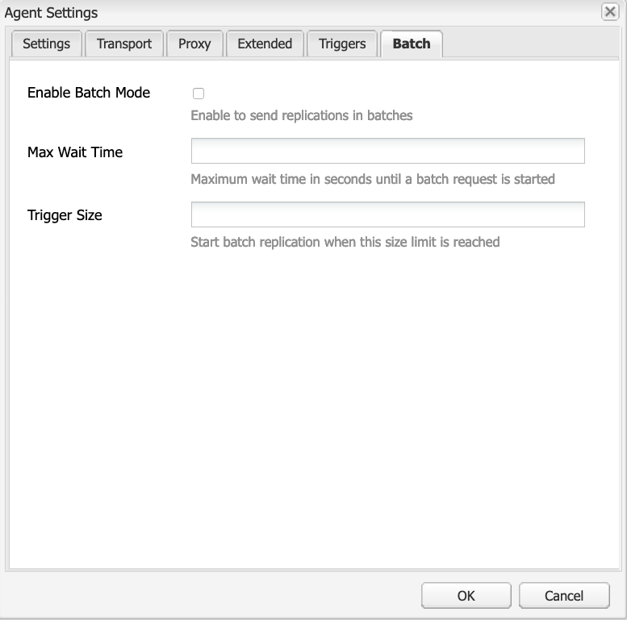

# 复制{#replication}

复制代理是Adobe Experience Manager(AEM)的中心，作为用于：

* [将内容从作](/help/sites-authoring/publishing-pages.md#activatingcontent) 者发布（激活）到发布环境。
* 显式刷新Dispatcher缓存中的内容。
* 将用户输入（例如，表单输入）从发布环境返回到作者环境(在作者环境的控制下)。

请求将[排队](/help/sites-deploying/osgi-configuration-settings.md#apacheslingjobeventhandler)到相应的代理进行处理。

>[!NOTE]
>
>用户数据(用户、用户组和用户用户档案)不会在创作和发布实例之间复制。
>
>对于多个发布实例，启用[用户同步](/help/sites-administering/sync.md)时，用户数据是Sling分布。

## 正在从作者复制到发布{#replicating-from-author-to-publish}

复制到发布实例或调度程序需执行以下几个步骤：

* 作者要求发布（激活）某些内容；可以通过手动请求或预先配置的自动触发器来启动。
* 请求将传递给相应的默认复制代理；环境可以具有多个默认代理，这些代理将始终为此类操作选择。
* 复制代理将“打包”内容并将其置于复制队列中。
* 在“网站”选项卡中，为各个页面设置了[彩色状态指示符](/help/sites-authoring/publishing-pages.md#determiningpagepublicationstatus)。
* 内容会从队列中提取，并使用配置的协议传输到发布环境;通常为HTTP。
* 发布环境的servlet接收请求并发布接收的内容；默认servlet为`https://localhost:4503/bin/receive`。

* 可以配置多个创作和发布环境。

### 从发布复制到作者{#replicating-from-publish-to-author}

某些功能允许用户在发布实例上输入数据。

在某些情况下，需要一种称为反向复制的复制类型来将此环境返回到创作环境，从此数据将重新分发到其他发布。 出于安全考虑，必须严格控制发布到作者环境的任何通信。

反向复制使用发布环境中引用作者环境的代理。 此代理将数据放入发件箱。 此发件箱与创作环境中的复制侦听器匹配。 监听器会轮询发件箱以收集输入的任何数据，然后根据需要分发数据。 这可确保作者环境控制所有流量。

在其他情况下，例如对于“社区”功能（例如论坛、博客、评论和评论），使用复制很难在发布环境中输入用户生成的内容(UGC)的数量跨AEM实例高效同步。

AEM [ Communities](/help/communities/overview.md)从不对UGC使用复制。 相反，Communities的部署需要UGC的公用存储(请参阅[社区内容存储](/help/communities/working-with-srp.md))。

### 复制 — 开箱即用{#replication-out-of-the-box}

包含在AEM标准安装中的we-retail网站可用于说明复制。

要遵循此示例并使用默认复制代理，您需要[安装AEM](/help/sites-deploying/deploy.md)，具有：

* `4502`端口上的作者环境
* 端口`4503`上的发布环境

>[!NOTE]
>
>默认为已启用 :
>
>* 作者代理：默认代理（发布）
>
>
默认情况下(自AEM 6.1起)有效禁用：
>
>* 作者代理：反向复制代理(publish_reverse)
>* 发布时的代理：反向复制（发件箱）

>
>
要检查代理或队列的状态，请使用&#x200B;**工具**控制台。
>请参阅[监视复制代理](#monitoring-your-replication-agents)。

#### 复制（创作到发布）{#replication-author-to-publish}

1. 导航到创作环境上的支持页面。
   **https://localhost:4502/content/we-retail/us/en/experience.html** `<pi>`
1. 编辑页面以添加新文本。
1. **激活** 页面以发布更改。
1. 打开发布环境上的支持页：
   **https://localhost:4503/content/we-retail/us/en/experience.html**
1. 您现在可以看到在作者中输入的更改。

此复制操作由创作环境执行：

* **默认代理（发布）此**
代理将内容复制到默认发布实例。有关此（配置和日志）的详细信息，可从作者环境的“工具”控制台访问；或：

   `https://localhost:4502/etc/replication/agents.author/publish.html`。

#### 复制代理 — 开箱即用{#replication-agents-out-of-the-box}

标准AEM安装中提供以下代理：

* [默认](#replication-author-to-publish)
代理用于从作者复制到发布。

* 调度程序刷新
这用于管理调度程序缓存。 有关详细信息，请参阅“创作”环境](https://helpx.adobe.com/experience-manager/dispatcher/using/page-invalidate.html#invalidating-dispatcher-cache-from-the-authoring-environment)中的[ Invalidating Dispatcher Cache和Publishing Instance中的[ Invalidating Dispatcher Cache。](https://helpx.adobe.com/experience-manager/dispatcher/using/page-invalidate.html#invalidating-dispatcher-cache-from-a-publishing-instance)

* [反向复](#reverse-replication-publish-to-author)
制用于从发布复制到作者。反向复制不用于社区功能，如论坛、博客和评论。 由于未启用发件箱，因此会有效禁用它。 使用反向复制需要自定义配置。

* 静态代理
这是“将节点的静态表示存储到文件系统中的代理”。
例如，使用默认设置时，内容页面和dam资产会以HTML或相应资产格式存储在`/tmp`下。 有关配置，请参阅`Settings`和`Rules`选项卡。
请求它，以便直接从应用程序服务器请求页面时，可以看到内容。 这是一个专用代理，大多数情况下（可能）不需要此代理。

## 复制代理 — 配置参数{#replication-agents-configuration-parameters}

从“工具”控制台配置复制代理时，对话框中有四个选项卡可用：

### 设置 {#settings}

* **名称**

   复制代理的唯一名称。

* **描述**

   此复制代理将服务的用途的说明。

* **启用**

   指示复制代理当前是否已启用。

   当代理&#x200B;**enabled**&#x200B;时，队列将显示为：

   * **处** 理项目时处于活动状态。
   * **当** 队列为空时。
   * **当项** 目在队列中但无法处理时阻止；例如，当接收队列被禁用时。

* **序列化类型**

   序列化类型：

   * **默认**:设置是否自动选择代理。
   * **调度程序刷新**:如果要使用代理刷新调度程序缓存，请选择此选项。

* **重试延迟**

   如果遇到问题，则两个重试之间的延迟（以毫秒为单位）。

   默认: `60000`

* **代理用户 ID**

   根据环境，代理将使用此用户帐户执行以下操作：

   * 从作者环境收集和打包内容
   * 在发布环境上创建和写入内容

   此字段留空可使用系统用户帐户(sling中定义的帐户为管理员用户；默认情况下，此值为`admin`)。

   >[!CAUTION]
   >
   >对于创作环境上的代理，此帐户&#x200B;*必须*&#x200B;具有对要复制的所有路径的读取访问权限。

   >[!CAUTION]
   >
   >对于发布环境上的代理，此帐户&#x200B;*必须*&#x200B;具有复制内容所需的创建/写访问权限。

   >[!NOTE]
   >
   >这可用作选择特定内容进行复制的机制。

* **日志级别**

   指定用于日志消息的详细级别。

   * `Error`:将只记录错误
   * `Info`:将记录错误、警告和其他信息性消息
   * `Debug`:消息中将使用高级详细信息，主要用于调试目的

   默认: `Info`

* **使用反转复制**

   指示此代理是否将用于反向复制；从发布到作者环境返回用户输入。

* **别名更新**

   选择此选项将启用对Dispatcher的别名或虚路径失效请求。 另请参阅[配置调度程序刷新代理](/help/sites-deploying/replication.md#configuring-a-dispatcher-flush-agent)。

#### 传输 {#transport}

* **URI**

   它指定目标位置的接收servlet。 特别是，您可以在此处指定目标实例的主机名（或别名）和上下文路径。

   例如：

   * 默认代理可以复制到`https://localhost:4503/bin/receive`
   * 调度程序刷新代理可以复制到`https://localhost:8000/dispatcher/invalidate.cache`

   此处指定的协议（HTTP或HTTPS）将决定传输方法。

   对于调度程序刷新代理，仅当使用基于路径的虚拟主机条目来区分场时，才使用URI属性，您使用此字段来目标场以使其失效。 例如，场#1的虚拟主机为`www.mysite.com/path1/*`，场#2的虚拟主机为`www.mysite.com/path2/*`。 可以使用`/path1/invalidate.cache`的URL目标第一个场，使用`/path2/invalidate.cache`目标第二个场。

* **用户**

   要用于访问目标的帐户的用户名。

* **密码**

   要用于访问目标的帐户的口令。

* **NTLM 域**

   NTML身份验证的域。

* **NTLM 主机**

   用于NTML身份验证的主机。

* **启用宽松 SSL**

   如果希望接受自认证SSL证书，请启用。

* **允许过期的证书**

   如果希望接受过期的SSL证书，请启用。

#### 代理 {#proxy}

仅当需要代理时才需要以下设置：

* **代理主机**

   用于传输的代理的主机名。

* **代理端口**

   代理的端口。

* **代理用户**

   要使用的帐户的用户名。

* **代理密码**

   要使用的帐户的口令。

* **代理 NTLM 域**

   代理NTLM域。

* **代理·NTLM 主机**

   代理NTLM域。

#### 扩展 {#extended}

* **接口**

   您可以在此处定义要绑定到的套接字接口。

   这将设置创建连接时使用的本地地址。 如果未设置，则使用默认地址。 这对于指定要在多宿主或群集系统上使用的接口很有用。

* **HTTP 方法**

   要使用的HTTP方法。

   对于调度程序刷新代理，这几乎总是GET，不应更改(POST是另一个可能的值)。

* **HTTP 头**

   这些组件用于调度程序刷新代理，并指定必须刷新的元素。

   对于调度程序刷新代理，三个标准条目不应更改：

   * `CQ-Action:{action}`
   * `CQ-Handle:{path}`
   * `CQ-Path:{path}`

   这些按钮（视情况而定）用于指示刷新手柄或路径时要使用的操作。 子参数是动态的：

   * `{action}` 指示复制操作

   * `{path}` 指示路径

   它们被与请求相关的路径/操作所取代，因此不需要“硬编码”：

   >[!NOTE]
   >
   >如果您在建议的默认上下文之外的上下文中安装了AEM，则需要在HTTP头中注册该上下文。 例如：
   >`CQ-Handle:/<*yourContext*>{path}`

* **关闭连接**

   启用后，可在每次请求后关闭连接。

* **连接超时**

   尝试建立连接时应用的超时（以毫秒为单位）。

* **套接字超时**

   在建立连接后等待通信时应用的超时（以毫秒为单位）。

* **协议版本**

   议定书版本；例如，`1.0`用于HTTP/1.0。

#### 触发器 {#triggers}

这些设置用于定义自动复制的触发器：

* **忽略默认值**

   如果选中，则从默认复制中排除代理；这意味着，如果内容作者发出复制操作，则不会使用它。

* **修改**

   此处，修改页面时将自动触发此代理的复制。 这主要用于调度程序刷新代理，也用于反向复制。

* **在分发时**

   如果选中此项，代理将在修改时自动复制标记为要分发的任何内容。

* **到达开/关时间**

   这将在发生为页面定义的开始或结束时间时触发自动复制（以根据需要激活或取消激活页面）。 这主要用于调度程序刷新代理。

* **接收时**

   如果选中此项，代理将在每次收到复制事件时链式复制。

* **无状态更新**

   选中后，代理将不强制更新复制状态。

* **无版本控制**

   选中后，代理将不强制激活页面的版本化。

## 配置复制代理{#configuring-your-replication-agents}

有关使用MSSL将复制代理连接到发布实例的信息，请参阅[使用相互SSL复制](/help/sites-deploying/mssl-replication.md)。

### 从创作环境{#configuring-your-replication-agents-from-the-author-environment}配置复制代理

在创作环境的“工具”选项卡中，您可以配置驻留在创作环境（**作者**&#x200B;上的代理）或发布环境（**发布**&#x200B;上的代理）中的复制代理。 以下过程说明了作者环境的代理配置，但可用于两者。

>[!NOTE]
>
>当调度程序处理创作或发布实例的HTTP请求时，来自复制代理的HTTP请求必须包含PATH头。 除了以下过程之外，还必须将PATH头添加到客户端头的调度程序列表。 (请参阅[/clientheaders（客户端标头）](https://helpx.adobe.com/experience-manager/dispatcher/using/dispatcher-configuration.html#specifying-the-http-headers-to-pass-through-clientheaders)。 

1. 访问AEM中的&#x200B;**工具**&#x200B;选项卡。
1. 单击&#x200B;**复制**（左窗格可打开文件夹）。
1. 多次单击作者&#x200B;**上的**&#x200B;代理（左窗格或右窗格）。
1. 单击相应的代理名称（即链接）以显示有关该代理的详细信息。
1. 单击&#x200B;**编辑**&#x200B;打开配置对话框：

   

1. 提供的值应足以用于默认安装。 如果进行更改，请单击&#x200B;**确定**&#x200B;以保存它们（有关各个参数的详细信息，请参阅[复制代理 — 配置参数](#replication-agents-configuration-parameters)）。

>[!NOTE]
>
>AEM的标准安装将`admin`指定为默认复制代理内传输凭据的用户。
>
>此帐户应更改为具有复制所需路径的权限的站点特定复制用户帐户。

### 配置反向复制{#configuring-reverse-replication}

反向复制用于将发布实例上生成的用户内容返回到创作实例。 这通常用于调查和注册表单等功能。

出于安全原因，大多数网络拓扑不允许&#x200B;*从*“非军事区”（一种子网络，将外部服务公开给不受信任的网络，如Internet）连接。

由于发布环境通常位于DMZ中，要将内容返回到作者环境，必须从作者实例启动连接。 这可通过以下方式完成：

* 放置内容的发布环境中的&#x200B;*outbox*。
* 创作环境中的代理（发布），它定期轮询发布框以查找新内容。

>[!NOTE]
>
>对于AEM [Communities](/help/communities/overview.md)，复制不用于发布实例上用户生成的内容。 请参阅[社区内容存储](/help/communities/working-with-srp.md)。

为此，您需要：

**创作环境中的反向复制代** 理此组件用作活动组件，用于从发布环境的发件箱中收集信息：

如果要使用反向复制，请确保激活此代理。

**发布环境（输出框）中的反向复制代理** 这是被动元素，因为它充当“输出框”。用户输入将放在此处，作者环境中的代理从中收集用户输入。

### 为多个发布实例{#configuring-replication-for-multiple-publish-instances}配置复制

>[!NOTE]
>
>仅复制内容 — 不复制用户数据(用户、用户组和用户用户档案)。
>
>要在多个发布实例间同步用户数据，请启用[用户同步](/help/sites-administering/sync.md)。

安装后，已配置默认代理，以将内容复制到运行于localhost端口4503上的发布实例。

要为其他发布实例配置内容复制，您需要创建并配置一个新的复制代理：

1. 打开AEM中的&#x200B;**工具**&#x200B;选项卡。
1. 在左面板中选择&#x200B;**复制**，然后选择&#x200B;**作者**&#x200B;上的代理。
1. 选择&#x200B;**新建……**。
1. 设置&#x200B;**标题**&#x200B;和&#x200B;**名称**，然后选择&#x200B;**复制代理**。
1. 单击&#x200B;**创建**&#x200B;以创建新代理。
1. 多次单击新代理项以打开配置面板。
1. 单击&#x200B;**编辑** — 将打开&#x200B;**代理设置**&#x200B;对话框 — **序列化类型**&#x200B;已定义为默认值，必须保持此状态。

   * 在&#x200B;**设置**&#x200B;选项卡中：

      * 激活&#x200B;**已启用**。
      * 输入&#x200B;**说明**.
      * 将&#x200B;**重试延迟**&#x200B;设置为`60000`。

      * 将&#x200B;**序列化类型**&#x200B;保留为`Default`。
   * 在&#x200B;**传输**&#x200B;选项卡中：

      * 输入新发布实例所需的URI;例如，
         `https://localhost:4504/bin/receive`。

      * 输入用于复制的站点特定用户帐户。
      * 您可以根据需要配置其他参数。

1. 单击&#x200B;**确定**&#x200B;以保存设置。

然后，可以通过在创作环境中更新并发布页面来测试操作。

所有已配置为上述内容的发布实例上都将显示更新。

如果您遇到任何问题，可以检查创作实例上的日志。 根据所需的详细程度，您还可以使用上述的&#x200B;**代理设置**&#x200B;对话框将&#x200B;**日志级别**&#x200B;设置为`Debug`。

>[!NOTE]
>
>这可以与使用[代理用户ID](#agentuserid)来选择不同内容以复制到单个发布环境结合使用。 对于每个发布环境:
>
>1. 配置复制代理以复制到该发布环境。
>1. 配置用户帐户；具有读取将复制到该特定发布环境的内容所需的访问权限。
>1. 将用户帐户分配为复制代理的&#x200B;**代理用户ID**。

>

### 配置调度程序刷新代理{#configuring-a-dispatcher-flush-agent}

安装中包含默认代理。 但是，如果要定义新代理，则仍需要某些配置，这同样适用：

1. 打开AEM中的&#x200B;**工具**&#x200B;选项卡。
1. 单击&#x200B;**部署**。
1. 选择&#x200B;**复制**，然后选择&#x200B;**发布**&#x200B;上的代理。
1. 多次单击&#x200B;**调度程序刷新**&#x200B;项以打开概述。
1. 单击&#x200B;**编辑** — 将打开&#x200B;**代理设置**&#x200B;对话框：

   * 在&#x200B;**设置**&#x200B;选项卡中：

      * 激活&#x200B;**已启用**。
      * 输入&#x200B;**说明**.
      * 将&#x200B;**序列化类型**&#x200B;保留为`Dispatcher Flush`，或在创建新代理时将其设置为。

      * （可选）选择&#x200B;**别名更新**&#x200B;以启用对Dispatcher的别名或虚路径失效请求。
   * 在&#x200B;**传输**&#x200B;选项卡中：

      * 输入新发布实例所需的URI;例如，
         `https://localhost:80/dispatcher/invalidate.cache`。

      * 输入用于复制的站点特定用户帐户。
      * 您可以根据需要配置其他参数。

   对于调度程序刷新代理，仅当使用基于路径的虚拟主机条目来区分场时，才使用URI属性，您使用此字段来目标场以使其失效。 例如，场#1的虚拟主机为`www.mysite.com/path1/*`，场#2的虚拟主机为`www.mysite.com/path2/*`。 可以使用`/path1/invalidate.cache`的URL目标第一个场，使用`/path2/invalidate.cache`目标第二个场。

   >[!NOTE]
   >
   >如果您在建议的默认上下文之外的上下文中安装了AEM，则需要在&#x200B;**Extended**&#x200B;选项卡中配置[HTTP Headers](#extended)。

1. 单击&#x200B;**确定**&#x200B;以保存更改。
1. 返回至&#x200B;**工具**&#x200B;选项卡，从此处可以&#x200B;**激活**&#x200B;调度程序Flush **代理（**&#x200B;发布时的代理）**。**

**调度程序Flush**&#x200B;复制代理在创作时不活动。 您可以使用等效的URI在发布环境中访问同一页面；例如，`https://localhost:4503/etc/replication/agents.publish/flush.html`。

### 控制对复制代理{#controlling-access-to-replication-agents}的访问

对用于配置复制代理的页面的访问可以通过在`etc/replication`节点上使用用户和/或组页面权限来控制。

>[!NOTE]
>
>设置此类权限不会影响复制内容的用户（例如，从“网站”控制台或Sidekick选项）。 复制框架在复制页面时不使用当前用户的“用户会话”访问复制代理。

### 从CRXDE Lite{#configuring-your-replication-agents-from-crxde-lite}配置复制代理

>[!NOTE]
>
>仅`/etc/replication`存储库位置支持创建复制代理。 为了正确处理关联的ACL，需要这样做。 在树的其他位置创建复制代理可能会导致未经授权的访问。

可以使用CRXDE Lite配置复制代理的各种参数。

如果导航到`/etc/replication`，您可以看到以下三个节点：

* `agents.author`
* `agents.publish`
* `treeactivation`

两个`agents`保存有关相应环境的配置信息，并且仅当该环境运行时才处于活动状态。 例如，`agents.publish`将仅用于发布环境。 以下屏幕截图显示了AEM WCM附带的创作环境中的发布代理：

## 监视复制代理{#monitoring-your-replication-agents}

要监视复制代理，请执行以下操作：

1. 访问AEM中的&#x200B;**工具**&#x200B;选项卡。
1. 单击&#x200B;**复制**。
1. 多次单击指向代理的链接，以查看相应的环境（左窗格或右窗格）；例如，作者&#x200B;**上的代理。**

   生成的窗口显示了创作环境的所有复制代理的概述，包括其目标和状态。

1. 单击相应的代理名称（即链接）以显示有关该代理的详细信息：

   

   在此对话框中，您可以：

   * 查看是否启用了代理。
   * 查看任何复制的目标。
   * 查看复制队列当前是否处于活动状态（已启用）。
   * 查看队列中是否有任何项目。
   * **** 刷新或 **** 清除，更新队列条目的显示；这有助于您查看进入和离开队列的项目。

   * **视图** 登录以访问复制代理执行的任何操作的日志。
   * **测试** 与目标实例的连接。
   * **根据** 需要强制重试任何队列项。

   >[!CAUTION]
   >
   >请勿对发布实例上的“反向复制输出”框使用“测试连接”链接。
   >
   >
   >如果对发件箱队列执行复制测试，则所有早于测试复制的项目都将通过每个反向复制进行重新处理。
   >
   >
   >如果队列中已存在此类项，则可以使用以下XPath JCR查询找到它们，并应删除它们。
   >
   >
   >`/jcr:root/var/replication/outbox//*[@cq:repActionType='TEST']`

## 批处理复制{#batch-replication}

批处理复制不会复制单个页面或资产，而是等待触发这两个页面或资产的第一个阈值（基于时间或大小）。

然后，它将所有复制项打包到一个包中，然后将该包作为单个文件复制到发布者。

出版商将解压缩所有物品，保存它们并向作者报告。

### 配置批处理复制{#configuring-batch-replication}

1. 转到 `http://serveraddress:serverport/siteadmin`
1. 按屏幕上方的&#x200B;**[!UICONTROL 工具]**&#x200B;图标
1. 从左侧导航边栏中，转到&#x200B;**[!UICONTROL 复制 — 作者]**&#x200B;上的代理，然后多次单击&#x200B;**[!UICONTROL 默认代理]**。
   * 您还可以通过直接转到`http://serveraddress:serverport/etc/replication/agents.author/publish.html`来访问默认的发布复制代理
1. 按复制队列上方的&#x200B;**[!UICONTROL 编辑]**&#x200B;按钮。
1. 在以下窗口中，转到&#x200B;**[!UICONTROL 批]**选项卡：
   
1. 配置代理。

### 参数 {#parameters}

* `[!UICONTROL Enable Batch Mode]`  — 启用或禁用批处理复制模式
* `[!UICONTROL Max Wait Time]`  — 在启动批处理请求之前的最长等待时间（以秒为单位）。默认为2秒。
* `[!UICONTROL Trigger Size]`  — 在此大小限制下开始批量复制

## 其他资源 {#additional-resources}

有关疑难解答的详细信息，请阅读[复制疑难解答](/help/sites-deploying/troubleshoot-rep.md)页。