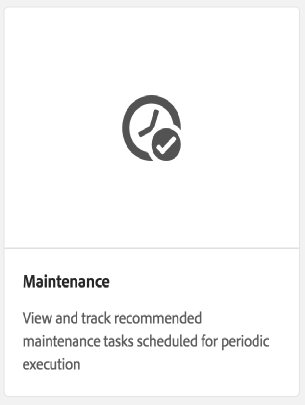
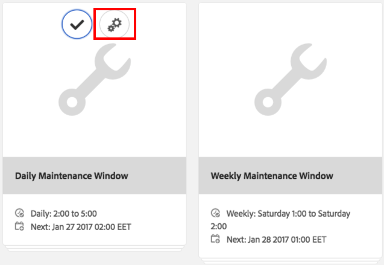
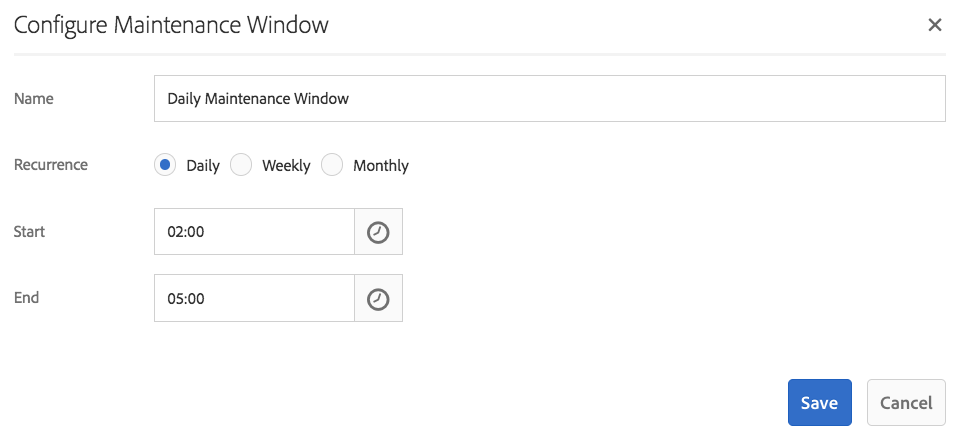
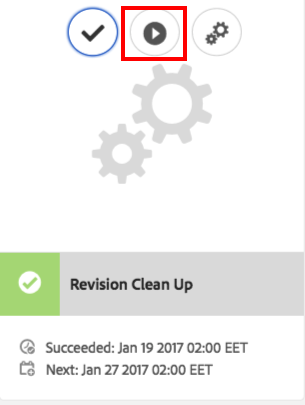
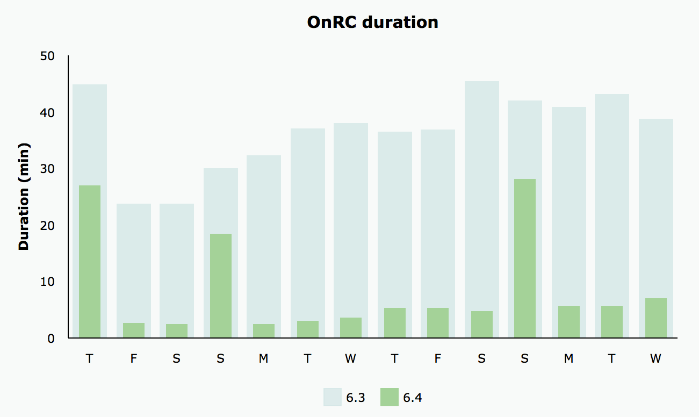
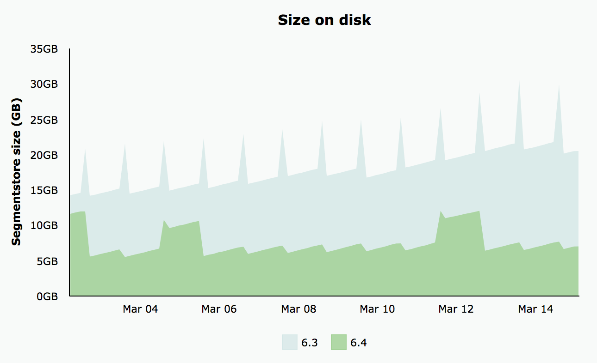

# 修订版清理{#revision-cleanup}

## 简介 {#introduction}

存储库的每次更新都会创建一个内容修订版本。 因此，每次更新后，存储库的大小都会增大。 必须清理旧修订版本以释放磁盘资源 — 这对于避免不受控制的存储库增长非常重要。 此维护功能称为修订版清理。 自Adobe Experience Manager (AEM) 6.0起，此功能已作为离线例程提供。

在AEM 6.3及更高版本中，引入了此功能的在线版本，称为“在线修订清理”。 与必须关闭AEM实例的脱机修订清理相比，在AEM实例处于联机状态时，可以运行联机修订清理。 默认情况下，“联机修订清理”处于打开状态，建议使用此方式执行修订清理。

**注意**： [观看视频](https://experienceleague.adobe.com/docs/experience-manager-learn/foundation/administration/use-online-revision-clean-up.html?lang=zh-Hans)，了解如何使用联机修订清理。

修订清理过程包括三个阶段：**估计**、**压缩**&#x200B;和&#x200B;**清理**。 估算根据可能收集到的垃圾量来确定是否运行下一阶段（压缩）。 在压缩阶段，区段和tar文件被重写，而没有任何未使用的内容。 然后，清理阶段将删除旧区段，包括这些区段可能包含的任何垃圾。 离线模式通常可以回收更多空间，因为在线模式必须考虑AEM的工作集，该工作集保留着不可收集的额外区段。

有关修订版清理的更多详细信息，请参阅以下链接：

* [如何运行联机修订清理](/help/sites-deploying/revision-cleanup.md#how-to-run-online-revision-cleanup)
* [联机修订清理常见问题解答](/help/sites-deploying/revision-cleanup.md#online-revision-cleanup-frequently-asked-questions)
* [如何运行脱机修订版清理](/help/sites-deploying/revision-cleanup.md#how-to-run-offline-revision-cleanup)

此外，您还可以阅读[Oak官方文档](https://jackrabbit.apache.org/oak/docs/nodestore/segment/overview.html)。

### 何时使用联机修订版清理，而不是脱机修订版清理？ {#when-to-use-online-revision-cleanup-as-opposed-to-offline-revision-cleanup}

**建议使用“联机修订清理”来执行修订清理。** Offline Revision cleanup should be used only on an exceptional basis - for example, before migrating to the new storage format or if you are requested by Adobe Customer Care to do so.

## 如何运行联机修订清理 {#how-to-run-online-revision-cleanup}

Online Revision Cleanup is configured by default to automatically run once a day on both AEM Author and Publish instances. All you need to do is define the maintenance window during a period with the least user activity. You can configure the Online Revision Cleanup task as follows:

1. In the main AEM window, go to **Tools - Operations - Dashboard - Maintenance** or point your browser to: `https://serveraddress:serverport/libs/granite/operations/content/maintenance.html`

   

1. Hover over **Daily Maintenance Window** and click the **Settings** icon.

   

1. Enter the desired values (recurrence, start time, end time) and click **Save**.

   

Alternatively, if you want to run the revision cleanup task manually, you can:

1. Go to **Tools - Operations - Dashboard - Maintenance** or browse directly to `https://serveraddress:serverport/libs/granite/operations/content/maintenance.html`
1. Click the **Daily Maintenance Window**.
1. Hover over the **Revision Cleanup** icon.
1. 单击&#x200B;**运行**。

   

### Running Online Revision Cleanup After Offline Revision Cleanup {#running-online-revision-cleanup-after-offline-revision-cleanup}

The revision cleanup process reclaims old revisions by generations. This means that each time you run revision cleanup a new generation is created and kept on the disk. There is a difference however between the two types of revision cleanup: offline revision cleanup keeps one generation while online revision cleanup keeps two generations. So, when you run online revision cleanup **after** offline revision cleanup the following happens:

1. After the first online revision cleanup run, the repository size doubles. This happens because there are now two generations that are kept on disk.
1. During the subsequent runs, the repository will temporarily grow while the new generation is created and then stabilize back to the size it had after the first run, as the online revision cleanup process reclaims the previous generation.

Also, keep in mind that depending on the type and number of commits, each generation can vary in size compared to the previous one, so the final size can vary from one run to the other.

Due to this fact, it is recommended to size the disk at least two or three times larger than the initially estimated repository size.

## Full And Tail Compaction Modes  {#full-and-tail-compaction-modes}

**AEM 6.5** introduces **two new modes** for the **compaction** phase of the Online Revision Cleanup process:

* **完全压缩**&#x200B;模式重写整个存储库中的所有区段和tar文件。 因此，后续清理阶段可以清除整个存储库中的最大垃圾量。 由于完全压缩会影响整个存储库，因此它需要大量系统资源和时间才能完成。 完全压缩对应于AEM 6.3中的压缩阶段。
* **尾部压缩**&#x200B;模式仅重写存储库中最近的区段和tar文件。 最新的区段和tar文件是自上次运行完全或尾部压缩以来添加的区段。 因此，随后的清理阶段只能清除存储库最近部分中包含的垃圾。 由于尾部压缩仅影响存储库的一部分，因此它比完全压缩需要更少的系统资源和完成时间。

这些压实方式构成了效率与资源消耗之间的权衡：尾压实效果较差，对系统正常运行的影响也较小。 相比之下，完全压实更有效，但对系统正常运行的影响更大。

AEM 6.5还在压缩期间引入了更高效的内容重复数据删除机制，从而进一步减少存储库在磁盘上的占用空间。

下面的两张图表展示了内部实验室测试的结果，这些结果说明了与AEM 6.3相比，AEM 6.5减少了平均执行时间以及磁盘上的平均占用空间：

 

### 如何配置完全压缩和尾压缩 {#how-to-configure-full-and-tail-compaction}

默认配置在工作日运行尾压缩，在星期日运行完全压缩。 可以使用`RevisionCleanupTask` [维护任务](/help/sites-deploying/revision-cleanup.md#how-to-run-online-revision-cleanup)的新配置值`full.gc.days`更改默认配置。

在配置`full.gc.days`值时，在值中定义的天数内运行完全压缩，在值中未定义的天数内运行尾压缩。 例如，如果将完全压缩配置为在星期日运行，则尾压缩从星期一到星期六运行。 例如，如果将完全压缩配置为一周的每天运行，则尾部压缩根本不会运行。

此外，请考虑：

* **尾压缩**&#x200B;的效果较差，对正常系统操作的影响较小。 因此，它打算在工作日运行。
* **完全压缩**&#x200B;更有效，但对正常系统操作的影响也更大。 因此打算在工作日使用。
* 尾部压缩和完全压缩都应安排在非高峰时段运行。

### 疑难解答 {#troubleshooting}

使用新的压缩模式时，请牢记以下事项：

* 您可以监视输入/输出(I/O)活动，例如：I/O操作、CPU等待IO、提交队列大小。 这有助于确定系统是否正在进行I/O绑定并需要升级。
* `RevisionCleanupTaskHealthCheck`指示联机修订清理的整体运行状况状态。 它的工作方式与AEM 6.3中的相同，并且不区分完全压缩和尾压缩。
* 日志消息包含有关压缩模式的相关信息。 例如，当“联机修订清理”启动时，相应的日志消息将指示压缩模式。 此外，在某些角落情况下，当计划运行尾压缩时，系统恢复为完全压缩，并且日志消息指示此更改。 以下日志示例指示压缩模式以及从尾到完全压缩的更改：

```
TarMK GC: running tail compaction
TarMK GC: no base state available, running full compaction instead
```

### 已知限制 {#known-limitations}

有时候，在尾部模式和完全压实模式之间切换会延迟清理过程。 更准确地说，存储库在完全压缩（其大小翻了一番）后将会增长。 当存储库低于完全压缩前的大小时，在后续的尾压缩中回收额外的空间。 还应避免执行并行维护任务。

**建议磁盘大小至少比最初估计的存储库大小大两到三倍。**

## 联机修订清理常见问题解答 {#online-revision-cleanup-frequently-asked-questions}

### AEM 6.5升级注意事项 {#aem-upgrade-considerations}

<table style="table-layout:auto">
 <tbody>
  <tr>
   <td>问题 </td>
   <td>答案</td>
  </tr>
  <tr>
   <td>升级到AEM 6.5时应该了解什么？</td>
   <td><p>TarMK的持久性格式随AEM 6.5而变化。 这些更改不需要主动迁移步骤。 现有存储库会经历滚动迁移，这对于用户是透明的。 首次访问AEM 6.5（或相关工具）存储库时，将启动迁移过程。</p> <p><strong>迁移到AEM 6.5持久性格式后，存储库无法恢复为之前的AEM 6.3持久性格式。</strong></p> </td>
  </tr>
 </tbody>
</table>

### 迁移到Oak Segment Tar {#migrating-to-oak-segment-tar}

<table style="table-layout:auto">
 <tbody>
  <tr>
   <td><strong>问题</strong></td>
   <td><strong>答案</strong></td>
   <td> </td>
  </tr>
  <tr>
   <td><strong>为什么需要迁移存储库？</strong></td>
   <td><p>在AEM 6.3中，需要对存储格式进行更改，尤其是为了提高在线修订清理的性能和效率。 这些更改无法向后兼容，必须迁移使用旧的Oak区段（AEM 6.2及更低版本）创建的存储库。</p> <p>更改存储格式的其他好处：</p>
    <ul>
     <li>更好的可扩展性（优化的区段大小）。</li>
     <li>更快的<a href="/help/sites-administering/data-store-garbage-collection.md" target="_blank">数据存储垃圾收集</a>.<br /> </li>
     <li>为未来的增强功能做基础工作。</li>
    </ul> </td>
   <td> </td>
  </tr>
  <tr>
   <td><strong>是否仍支持以前的Tar格式？</strong></td>
   <td>AEM 6.3或更高版本仅支持新的Oak区段Tar。</td>
   <td> </td>
  </tr>
  <tr>
   <td><strong>内容迁移是否始终是强制性的？</strong></td>
   <td>是。 除非从新的实例开始，否则将始终需要迁移内容。</td>
   <td> </td>
  </tr>
  <tr>
   <td><strong>我是否可以升级到6.3或更高版本，并稍后进行迁移（例如，使用其他维护时段）？</strong></td>
   <td>否，如上所述，内容迁移是强制性的。</td>
   <td> </td>
  </tr>
  <tr>
   <td><strong>迁移时能否避免停机？</strong></td>
   <td>不行。 这是一次性工作，无法在正在运行的实例上完成。</td>
   <td> </td>
  </tr>
  <tr>
   <td><strong>如果意外地针对错误的存储库格式运行，会发生什么情况？</strong></td>
   <td>如果您尝试对oak-segment-tar存储库运行oak-segment模块（或反之），启动将失败，并出现<em>IllegalStateException</em>消息和“区段格式无效”。 没有发生数据损坏。</td>
   <td> </td>
  </tr>
  <tr>
   <td><strong>是否需要重新索引搜索索引？</strong></td>
   <td>不行。 从oak-segment迁移到oak-segment-tar会引入容器格式的更改。 包含的数据不受影响，也不会被修改。</td>
   <td> </td>
  </tr>
  <tr>
   <td><strong>如何最好地计算迁移期间和迁移后所需的预期磁盘空间？</strong></td>
   <td>迁移等同于以新格式重新创建区段存储。 这可用于估计迁移期间所需的额外磁盘空间。 迁移后，可以删除旧区段存储以回收空间。</td>
   <td> </td>
  </tr>
  <tr>
   <td><strong>如何最好地估计迁移的持续时间？</strong></td>
   <td>Migration performance can be greatly improved if <a href="/help/sites-deploying/revision-cleanup.md#how-to-run-offline-revision-cleanup">offline revision cleanup</a> is executed prior to the migration. All customers are advised to execute it as a pre-requisite of the upgrade process. In general, the duration of the migration should be similar to the duration of the offline revision cleanup task, assuming that the offline revision cleanup task has been executed before the migration.</td>
   <td> </td>
  </tr>
 </tbody>
</table>

### Running Online Revision Cleanup {#running-online-revision-cleanup}

<table style="table-layout:auto">
 <tbody>
  <tr>
   <td><strong>问题</strong></td>
   <td><strong>答案</strong></td>
   <td> </td>
  </tr>
  <tr>
   <td><strong>How frequently should Online Revision Cleanup be executed?</strong></td>
   <td>Once per day. This is the default configuration in the Operations Dashboard.</td>
   <td> </td>
  </tr>
  <tr>
   <td><strong>How can I configure the start time of the Online Revision Cleanup maintenance task ?</strong></td>
   <td>See the <a href="/help/sites-deploying/revision-cleanup.md#how-to-run-online-revision-cleanup">How to run Online Revision Cleanup</a> section. </td>
   <td> </td>
  </tr>
  <tr>
   <td><strong>Is there a maximum frequency that should not be exceeded for Online Revision Cleanup?</strong></td>
   <td>It is recommended to run Online Revision Cleanup once per day, as configured by default.<br /> </td>
   <td> </td>
  </tr>
  <tr>
   <td><strong>What are the key indicators that determine the frequency at which Online Revision Cleanup should be ran?</strong></td>
   <td>There is no need to determine the frequency as Online Revision Cleanup is configured as a maintenance task and it automatically runs each day.</td>
   <td> </td>
  </tr>
  <tr>
   <td><strong>Why does Online Revision Cleanup not reclaim any space when run for the first time?</strong></td>
   <td>Online Revision Cleanup reclaims old revisions by generations. A fresh generation is generated every time revision cleanup runs. Only the content that is at least two generations old will be reclaimed, which means that on a first run there is nothing to reclaim.</td>
   <td> </td>
  </tr>
  <tr>
   <td><strong>Why does the first Online Revision Cleanup not reclaim any space when run after the Offline Revision Cleanup ?</strong></td>
   <td><p>Offline Revision Cleanup is reclaiming everything but the latest generation compared to latest two generations for Online Revision Cleanup. If there is a fresh repository, Online Revision Cleanup will not reclaim any space when executed for the first time after the Offline Revision Cleanup because there is no generation old enough to be reclaimed.</p> <p>Also, read the "Running Online Revision Cleanup after Offline Revision Cleanup" section of <a href="/help/sites-deploying/revision-cleanup.md#how-to-run-online-revision-cleanup">this chapter</a>.</p> </td>
   <td> </td>
  </tr>
  <tr>
   <td><strong>Would Author and Publish typically have different Online Revision Cleanup windows?</strong></td>
   <td>This depends on office hours and the traffic patterns of the customer online presence. The maintenance windows should be configured outside of the main production times to allow for the best cleanup efficacy. For multiple AEM Publish instances (TarMK Farm), maintenance windows for Online Revision Cleanup should be staggered.</td>
   <td> </td>
  </tr>
  <tr>
   <td><strong>Are there any prerequisites before running Online Revision Cleanup?</strong></td>
   <td><p>Online Revision Cleanup is available only with AEM 6.3 and higher releases. Also, if you are using an older version of AEM, you must migrate to the new <a href="/help/sites-deploying/revision-cleanup.md#migrating-to-oak-segment-tar">Oak Segment Tar</a>.</p> </td>
   <td> </td>
  </tr>
  <tr>
   <td><strong>What are the factors that determine the duration of the Online Revision Cleanup?</strong></td>
   <td>The factors are:<br />
    <ul>
     <li>Repository size</li>
     <li>Load on the system (requests per minute, specifically write operations)</li>
     <li>Activity pattern (reads versus writes)</li>
     <li>Hardware specifications (CPU performance, Memory, IOPS)</li>
    </ul> </td>
   <td> </td>
  </tr>
  <tr>
   <td><strong>Can authors still work while Online Revision Cleanup is running?</strong></td>
   <td>Yes, Online Revision Cleanup can cope with concurrent writes. However, Online Revision Cleanup works faster and more efficiently without concurrent write transactions. Adobe recommends scheduling the Online Revision Cleanup maintenance task to a relatively quiet time without a lot traffic.</td>
   <td> </td>
  </tr>
  <tr>
   <td><strong>What are the minimum requirements for disk space and heap memory when running Online Revision Cleanup?</strong></td>
   <td><p>Disk space is continuously monitored during Online Revision Cleanup. 如果可用磁盘空间低于临界值，整理过程将被取消。 临界值为存储库当前磁盘占用量的 25%，且不可配置。</p> <p><strong>Adobe recommends you size the disk at least two or three times larger than the initially estimated repository size.</strong></p> <p>Free heap space is continuously monitored during the cleanup process. Should the free heap space drop below a critical value, the process is canceled. The critical value is configured through org.apache.jackrabbit.oak.segment.SegmentNodeStoreService#MEMORY_THRESHOLD. The default value is 15%.</p> <p>Recommendations for minimum compaction heap sizing are not separated from the AEM memory sizing recommendations. Generally: <strong>If an AEM instance is sized enough to cope with the use cases and expected payload thereon, the cleanup process obtains enough memory.</strong></p> </td>
   <td> </td>
  </tr>
  <tr>
   <td><strong>What is the expected performance impact while running Online Revision Cleanup?</strong></td>
   <td>Online Revision Cleanup is a background process that reads from and writes to the repository concurrently to normal system operations. In particular, it might need to acquire exclusive access to the repository for a short time period, preventing other threads from writing into the repository.</td>
   <td> </td>
  </tr>
  <tr>
   <td><strong>预计联机修订清理运行多长时间？</strong></td>
   <td>根据Adobe内部执行的最新性能测试，运行时间不应超过两个小时。</td>
   <td> </td>
  </tr>
  <tr>
   <td><strong>如果在线修订清理需要较长时间，应该怎么做？</strong></td>
   <td>
    <ul>
     <li>确保每天执行该操作。<br /> </li>
     <li>通过相应地配置操作仪表板中的维护窗口，确保在最小的存储库活动期间执行该操作。</li>
     <li>扩展系统资源（CPU、内存、I/O）。</li>
    </ul> </td>
   <td> </td>
  </tr>
  <tr>
   <td><strong>如果联机修订清理超出配置的维护窗口，会发生什么情况？</strong></td>
   <td>确保其他维护任务不会延迟执行。 如果在同一维护窗口中执行比“联机修订清理”更多的维护任务，则可能会出现这种情况。 维护任务按顺序运行，没有可配置的顺序。</td>
   <td> </td>
  </tr>
  <tr>
   <td><strong>为何跳过修订垃圾收集？</strong></td>
   <td><p>修订清理依赖估计阶段来确定是否有足够的垃圾要清理。 估算器将当前大小与上次压缩后的存储库大小进行比较。 如果大小超过配置的增量，则运行清理。 大小增量设置为1 GB。 这实际上意味着，如果自上次清理运行以来，存储库大小没有增加1 GB，则会跳过新的修订版清理迭代。 </p> <p>以下为估计阶段的相关日志条目：</p>
    <ul>
     <li>修订GC运行： <em>大小增量为N%或N/N （N/N字节），因此正在运行压缩</em></li>
     <li>修订GC <strong>未</strong>运行： <em>大小增量为N%或N/N （N/N字节），因此现在将跳过压缩</em></li>
    </ul> </td>
   <td> </td>
  </tr>
  <tr>
   <td><strong>如果性能影响太大，是否可以安全地中止自动压缩？</strong></td>
   <td>是。 自AEM 6.3起，可通过“操作功能板”中的“维护任务窗口”或通过JMX安全地停止它。</td>
   <td> </td>
  </tr>
  <tr>
   <td><strong>如果AEM实例在计划的清理任务期间关闭，进程是否安全中止，或者是否在压缩完成之前阻止关闭？</strong></td>
   <td>修订清理被中断，存储库将安全关闭。</td>
   <td> </td>
  </tr>
  <tr>
   <td><strong>在联机修订版清理期间系统崩溃时会发生什么情况？</strong></td>
   <td>在这种情况下，不存在数据损坏的风险。 Garbage leftovers are cleaned up by a subsequent run.</td>
   <td> </td>
  </tr>
  <tr>
   <td><strong>What is the impact of not running Online Revision Cleanup?</strong></td>
   <td>Performance degradation over time.</td>
   <td> </td>
  </tr>
  <tr>
   <td><strong>Which revisions are being collected ?</strong></td>
   <td>By default, the Online Revision Cleanup only collects revisions that are at least 24 hours old.</td>
   <td> </td>
  </tr>
  <tr>
   <td><strong>What happens if there is too much interference from concurrent writes to the repository?</strong></td>
   <td><p>If there's write concurrency on the system, online revision cleanup might require exclusive write access to be able to commit the changes at the end of a compaction cycle. The system goes into <strong>forceCompact mode</strong>, as explained in more detail in the <a href="https://jackrabbit.apache.org/oak/docs/nodestore/segment/overview.html" target="_blank">Oak documentation</a>. During force compact, an exclusive write lock is acquired to finally commit the changes without any concurrent writes interfering. To limit the impact on response times, a time-out value can be defined. This value is set to one minute by default, which means that if force compact does not complete within one minute, the compaction process is aborted in favor of concurrent commits.</p> <p>The duration of force compact depends on the following factors:</p>
    <ul>
     <li>hardware: specifically IOPS. The duration decreases with more IOPS.</li>
     <li>segment store size: duration increases with the size of the segment store.</li>
    </ul> </td>
   <td> </td>
  </tr>
  <tr>
   <td><p><strong>How is Online Revision Cleanup executed on a standby instance?</strong></p> </td>
   <td><p>In a cold standby setup, only the primary instance must be configured to run Online Revision Cleanup. On the standby instance, Online Revision Cleanup does not need to be scheduled specifically.</p> <p>The corresponding operation on a standby instance is the Automatic Cleanup - this corresponds to the cleanup phase of the Online Revision Cleanup. The Automatic Cleanup is run on the standby instance after the execution of the Online Revision Cleanup on the primary instance.</p> <p>Estimation and compaction phases will not be run on a standby instance.</p> </td>
   <td> </td>
  </tr>
  <tr>
   <td><strong>Is Offline Revision Cleanup able to free more disk space than Online Revision Cleanup?</strong></td>
   <td><p>Offline Revision Cleanup can immediately remove old revisions while Online Revision Cleanup must account for old revisions still being referenced by the application stack. The former can thus remove garbage more aggressively than the latter where the effect is amortized over the course of a few garbage collection cycles.</p> <p>Also, read the "Running Online Revision Cleanup after Offline Revision Cleanup" section of <a href="/help/sites-deploying/revision-cleanup.md#how-to-run-online-revision-cleanup">this chapter</a>.</p> </td>
   <td> </td>
  </tr>
  <tr>
   <td>Any considerations about memory mapped file operations?</td>
   <td>
    <ul>
     <li><strong>On Windows environments</strong>, regular file access is always enforced so memory mapped access is not used. As a general advice, all the available RAM should be allocated to the heap and the segmentCache size should be increased. You increase the segmentCache by adding the segmentCache.size option to the org.apache.jackrabbit.oak.segment.SegmentNodeStoreService.config (for example, segmentCache.size=20480). Remember to leave out some RAM for the operating system and other processes.</li>
     <li><strong>On non-Windows environments</strong>, increase the size of the physical memory to improve the memory mapping of the repository.</li>
    </ul> </td>
   <td>
    <ul>
     <li> </li>
    </ul> </td>
  </tr>
 </tbody>
</table>

### Monitoring Online Revision Cleanup {#monitoring-online-revision-cleanup}

<table style="table-layout:auto">
 <tbody>
  <tr>
   <td><strong>What must be monitored during Online Revision Cleanup?</strong></td>
   <td>
    <ul>
     <li>Disk space should be monitored when Online Revision Cleanup is enabled. The cleanup does not run or it terminates preemptively when there is insufficient disk space.</li>
     <li>Check the logs for the completion time of the Online Revision Cleanup. It should not take longer than 2 hours.</li>
     <li>Number of checkpoints. If there are more than 3 checkpoints when compaction runs it is recommended to clean up the checkpoints.</li>
    </ul> </td>
   <td> </td>
  </tr>
  <tr>
   <td><strong>How to check if the Online Revision Cleanup has completed successfully?</strong></td>
   <td><p>You can check if the Online Revision Cleanup has completed successfully by checking the logs.</p> <p>For example, "<code>TarMK GC #{}: compaction completed in {} ({} ms), after {} cycles</code>" means the compaction step completed successfully unless preceded by the message "<code>TarMK GC #{}: compaction gave up compacting concurrent commits after {} cycles</code>", which means there was too much concurrent load.</p> <p>Correspondingly there is a message "<code>TarMK GC #{}: cleanup completed in {} ({} ms</code>" for the successful completion of the cleanup step.</p> </td>
   <td><p> </p> </td>
  </tr>
  <tr>
   <td><strong>Where can we find the statistics of the last Online Revision Cleanup executions?</strong></td>
   <td><p>Status, progress, and statistics are exposed via JMX (<code>SegmentRevisionGarbageCollection</code> MBean). For more details about the <code>SegmentRevisionGarbageCollection</code> MBean, read the <a href="https://jackrabbit.apache.org/oak/docs/nodestore/segment/overview.html#monitoring-via-jmx" target="_blank">following paragraph</a>.</p> <p>Progress can be tracked via the <code>EstimatedRevisionGCCompletion</code> attribute of the <code>SegmentRevisionGarbageCollection MBean.</code></p> <p>You can obtain a reference of the MBean using the <code>ObjectName org.apache.jackrabbit.oak:name="Segment node store revision garbage collection",type="SegmentRevisionGarbageCollection"</code>.</p> <p>统计信息仅在上次系统启动后可用。 <a href="/help/sites-administering/operations-dashboard.md#monitoring-with-external-services" target="_blank">外部监视工具可用于将数据保留在AEM正常运行时间之外</a>。</p> </td>
   <td> </td>
  </tr>
  <tr>
   <td><strong>哪些是相关的日志条目？</strong></td>
   <td>
    <ul>
     <li>联机修订清理已启动/停止
      <ul>
       <li>在线修订清理由三个阶段组成：估算、压缩和清理。 如果存储库未包含足够的垃圾，则估算可能会强制跳过压缩和清理。 在最新版本的AEM中，消息“<code>TarMK GC #{}: estimation started</code>”标记估算的开头，“<code>TarMK GC #{}: compaction started, strategy={}</code>”标记压缩的开头，“T<code>arMK GC #{}: cleanup started. Current repository size is {} ({} bytes</code>”标记清理的开头。</li>
      </ul> </li>
     <li>通过修订清理获得的磁盘空间
      <ul>
       <li>仅在清理阶段完成时才回收空间。 清理阶段的结束用日志消息“T<code>arMK GC #{}: cleanup completed in {} ({} ms</code>”标记。 后清理大小为{} （{}字节），已回收空间{} （{}字节）。 压缩映射权重/深度为{}/{} （{}字节/{}）。</li>
      </ul> </li>
     <li>修订清理期间出现问题
      <ul>
       <li>有许多故障情况，它们都标有WARN或ERROR日志消息，以“TarMK GC”开头。</li>
      </ul> </li>
    </ul> <p>另请参阅下面的<a href="/help/sites-deploying/revision-cleanup.md#troubleshooting-based-on-error-messages">基于错误消息的故障排除</a>部分。</p> </td>
   <td> </td>
  </tr>
  <tr>
   <td><strong>如何检查联机修订清理完成后回收了多少空间？</strong></td>
   <td>清理周期结束时的日志中有一条消息：“<code>TarMK GC #3: cleanup completed</code>”，其中包含存储库的大小和回收的垃圾量。</td>
   <td> </td>
  </tr>
  <tr>
   <td><strong>在线修订清理完成后，如何检查存储库的完整性？</strong></td>
   <td><p>联机修订清理后不需要存储库完整性检查。 </p> <p>但是，您可以执行以下操作来检查清理后的存储库状态：</p>
    <ul>
     <li>存储库<a href="/help/sites-deploying/consistency-check.md" target="_blank">遍历检查</a></li>
     <li>在清理过程完成后使用oak-run工具检查是否存在不一致。 有关如何执行此操作的更多信息，请查看<a href="https://github.com/apache/jackrabbit-oak/blob/trunk/oak-doc/src/site/markdown/nodestore/segment/overview.md#check" target="_blank">Apache文档。</a> 您无需关闭AEM即可运行该工具。</li>
    </ul> </td>
   <td> </td>
  </tr>
  <tr>
   <td><strong>如何检测联机修订清理是否失败，以及要恢复的步骤是什么？</strong></td>
   <td>故障情况由以“TarMK GC”开头的WARN或ERROR日志消息标记。 另请参阅下面的<a href="/help/sites-deploying/revision-cleanup.md#troubleshooting-based-on-error-messages">基于错误消息的故障排除</a>部分。</td>
   <td> </td>
  </tr>
  <tr>
   <td><strong>修订清理运行状况检查中会公开哪些信息？ 它们如何以及何时对颜色编码状态级别作出贡献？ </strong></td>
   <td><p>修订清理运行状况检查是<a href="/help/sites-administering/operations-dashboard.md#health-reports" target="_blank">操作仪表板</a>.<br />的一部分 </p> <p>如果联机修订清理维护任务的最后一次执行已成功完成，则状态为<strong>绿色</strong>。</p> <p>如果联机修订清理维护任务被取消一次，则为<strong>黄色</strong>。<br /> </p> <p>如果连续三次取消联机修订清理维护任务，则为<strong>红色</strong>。 <strong>在这种情况下，需要手动交互</strong>，否则联机修订清理可能会再次失败。 有关详细信息，请阅读下面的<a href="/help/sites-deploying/revision-cleanup.md#troubleshooting-online-revision-cleanup">疑难解答</a>部分。<br /> </p> <p>此外，系统重新启动后，运行状况检查状态也会重置。 因此，新重新启动的实例在修订清理运行状况检查中显示绿色状态。  <a href="/help/sites-administering/operations-dashboard.md#monitoring-with-external-services" target="_blank">外部监视工具可用于将数据保留在AEM正常运行时间之外</a>。</p> </td>
   <td> </td>
  </tr>
  <tr>
   <td><p><strong>如何在备用实例上监视自动清理？</strong></p> </td>
   <td><p>使用<code>SegmentRevisionGarbageCollection</code> MBean通过JMX公开状态、进度和统计信息。 另请参阅以下<a href="https://jackrabbit.apache.org/oak/docs/nodestore/segment/overview.html#monitoring-via-jmx" target="_blank">Oak文档</a>。 </p> <p>您可以使用<code>ObjectName org.apache.jackrabbit.oak:name="Segment node store revision garbage collection",type="SegmentRevisionGarbageCollection"</code>获取MBean的引用。</p> <p>统计信息仅自上次系统启动后可用。  <a href="/help/sites-administering/operations-dashboard.md#monitoring-with-external-services" target="_blank">外部监视工具可用于将数据保留在AEM正常运行时间之外</a>。</p> <p>日志文件还可用于检查自动清理的状态、进度和统计信息。</p> </td>
   <td> </td>
  </tr>
  <tr>
   <td><p><strong>在自动清理待机实例期间必须监视哪些内容？</strong></p> </td>
   <td>
    <ul>
     <li>运行自动清理时应监视磁盘空间。</li>
     <li>完成时间（通过日志）以确保不超过2小时。</li>
     <li>运行自动清理后的区段存储大小。 备用实例上的段存储大小应该与主实例上的段存储大小大致相同。</li>
    </ul> </td>
   <td> </td>
  </tr>
 </tbody>
</table>

### 联机修订版清理疑难解答 {#troubleshooting-online-revision-cleanup}

<table style="table-layout:auto">
 <tbody>
  <tr>
   <td><strong>如果不运行联机修订清理，会出现什么最坏的情况？</strong></td>
   <td>AEM实例的磁盘空间不足，这将导致生产中断。</td>
   <td> </td>
  </tr>
  <tr>
   <td><strong>在发布实例上运行在线修订清理时，高用户流量是否会造成问题？</strong></td>
   <td>用户流量过高会影响压缩阶段是否能够成功完成。<br /> </td>
   <td> </td>
  </tr>
  <tr>
   <td><strong>根据运行状况检查和日志条目，联机修订清理连续三次未成功完成。 成功完成联机修订清理需要什么条件？</strong></td>
   <td>您可以采取几个步骤来查找并修复问题：<br />
    <ul>
     <li>首先，检查日志条目<br /> </li>
     <li>根据日志中的信息，采取适当措施：
      <ul>
       <li>如果日志显示错过了五个压缩周期并在<code>forceCompact</code>周期超时，请将维护时段安排在存储库写入量较少时的安静时间。 您可以在<em>https://serveraddress:serverport/libs/granite/operations/content/monitoring/page.html</em>上的存储库量度监视工具中检查存储库写入</li>
       <li>如果清理在维护时段结束时停止，请确保维护任务用户界面中维护时段的配置足够大</li>
       <li>如果可用的栈内存不足，请确保实例有足够的内存。</li>
       <li>如果反应较晚，则区段存储可能会增长太多，以致于线上修订清理无法在较长的维护时段内完成。 例如，如果上周未成功完成在线修订清理，则建议计划离线维护，并运行离线修订清理，以将区段存储恢复到可管理的大小。</li>
      </ul> </li>
    </ul> </td>
   <td> </td>
  </tr>
  <tr>
   <td><strong>启用Healthcheck警报时必须执行哪些操作？</strong></td>
   <td>请参阅上一点。</td>
   <td> </td>
  </tr>
  <tr>
   <td><strong>如果在线修订清理在计划的维护时段内超时，会发生什么情况？</strong></td>
   <td>在线修订版清理已取消，剩余的修订版将被删除。 下次安排维护时段时，它将再次启动。</td>
   <td> </td>
  </tr>
  <tr>
   <td><strong>导致<code>SegmentNotFoundException</code>实例在<code>error.log</code>中登录的原因是什么？如何恢复？</strong></td>
   <td><p>TarMK在尝试访问其无法找到的存储单元（区段）时记录<code>SegmentNotFoundException</code>。 There are three scenarios that could cause this issue:</p>
    <ol>
     <li>An application that circumvents the recommended access mechanisms (like Sling and the JCR API) and uses a lower-level API/SPI to access the repository and then exceeds the retention time of a segment. That is, it keeps a reference to an entity longer than the retention time allowed by the Online Revision Cleanup (24 hours by default). This case is transient and does not lead to data corruption. To recover, the oak-run tool should be used to confirm the transient nature of the exception (the oak-run check should not report any errors). To do this, the instance must be taken offline and restarted afterwards.</li>
     <li>An external event caused the corruption of the data on the disk. This can be a disk failure, out of disk space or an accidental modification of the required data files. In this case, the instance must be taken offline and repaired using the oak-run check. For more details on how to perform the oak-run check, read the following <a href="https://github.com/apache/jackrabbit-oak/blob/trunk/oak-doc/src/site/markdown/nodestore/segment/overview.md#check" target="_blank">Apache documentation</a>.</li>
     <li>Address all other occurrences through the <a href="https://experienceleague.adobe.com/zh-hans?support-solution=General&support-tab=home#support" target="_blank">Adobe Customer Care</a>.</li>
    </ol> </td>
   <td> </td>
  </tr>
 </tbody>
</table>

### Troubleshooting Based On Error Messages {#troubleshooting-based-on-error-messages}

The error.log is verbose if there are incidents during the online revision cleanup process. The following matrix aims to explain the most common messages and to provide possible solutions:

<!--
| **Phase** |**Log Messages** |**Explanation** |**Next Steps** |
|---|---|---|---|
|   |  |  |  |
| Estimation |TarMK GC #2: estimation skipped because compaction is paused |The estimation phase is skipped when compaction is disabled on the system by configuration. |Enable Online Revision Cleanup. |
|   |TarMK GC #2: estimation interrupted: ${REASON}. Skipping compaction. |The estimation phase terminated prematurely. Some examples of events that could interrupt the estimation phase: not enough memory or disk space on the host system. |Depends on the given reason. |
| Compaction |TarMK GC #2: compaction paused |As long as the compaction phase is paused by configuration, neither the estimation phase nor the compaction phase will be executed. |Enable online revision cleanup. |
|   |TarMK GC #2: compaction cancelled: ${REASON}. |The compaction phase terminated prematurely. Some examples of events that could interrupt the compaction phase: not enough memory or disk space on the host system. Moreover, compaction can also be cancelled by shutting down the system or by explicitly cancelling it via administrative interfaces such as the Maintenance Window within the Operations Dashobard. |Depends on the given reason. |
|   |TarMK GC #2: compaction failed in 32.902 min (1974140 ms), after 5 cycles |This message does not mean that there was an unrecoverable error, but only that compaction was terminated after a certain amount of attempts. Also, read the [following paragraph](https://jackrabbit.apache.org/oak/docs/nodestore/segment/overview.html#how-does-compaction-works-with-concurrent-writes). |Read the following [Oak documentation](https://jackrabbit.apache.org/oak/docs/nodestore/segment/overview.html#how-does-compaction-works-with-concurrent-writes), and the last question of the [Running Online Revision Cleanup](/help/sites-deploying/revision-cleanup.md#running-online-revision-cleanup) section. |
| Cleanup |TarMK GC #2: cleanup interrupted |Cleanup has been cancelled by shutting down the repository. No impact on consistency is expected. Also, disk space is most likely not reclaimed to full extent. It will be reclaimed during next revision cleanup cycle. |Investigate why repository has been shut down and going forward try to avoid shutting down the repository during maintenance windows. |
-->

<table style="table-layout:auto">
 <tbody>
  <tr>
    <th>阶段</th>
    <th>日志消息</th>
    <th>解释</th>
    <th>后续步骤</th>
  </tr>  
  <tr>
    <td>Estimation</td>
    <td>TarMK GC #2: estimation skipped because compaction is paused.</td>
    <td>The estimation phase is skipped when compaction is disabled on the system by configuration.</td>
    <td>Enable Online Revision Cleanup.</td>
  </td>
  </tr>
  <tr>
    <td>不适用</td>
    <td>TarMK GC #2: estimation interrupted: ${REASON}. Skipping compaction.</td>
    <td>The estimation phase terminated prematurely. Some examples of events that could interrupt the estimation phase: not enough memory or disk space on the host system.</td>
    <td>Depends on the given reason.</td>
  </td>
  </tr>
  <tr>
    <td>Compaction</td>
    <td>TarMK GC #2：压缩已暂停。</td>
    <td>只要压实阶段被配置暂停，估计阶段和压实阶段都不会运行。</td>
    <td>启用联机修订清理。</td>
  </td>
  </tr>
   <tr>
    <td>不适用</td>
    <td>TarMK GC #2：压缩已取消：${REASON}。</td>
    <td>压缩阶段提前结束。 可能中断压缩阶段的一些事件示例：主机系统上的内存或磁盘空间不足。 此外，还可以通过关闭系统或通过管理界面（如操作仪表板中的维护窗口）显式取消系统来取消压缩。</td>
    <td>这取决于具体的原因。</td>
  </td>
  </tr>
  <tr>
    <td>不适用</td>
    <td>TarMK GC #2：经过5次循环，压实时间为32.902 min(1974140 ms)。</td>
    <td>此消息并不表示存在不可恢复的错误，但仅表示压缩在尝试后终止。 另请阅读以下段落<a href="https://jackrabbit.apache.org/oak/docs/nodestore/segment/overview.html#how-does-compaction-works-with-concurrent-writes">。</a></td>
    <td>阅读以下<a href="https://jackrabbit.apache.org/oak/docs/nodestore/segment/overview.html#how-does-compaction-works-with-concurrent-writes">Oak文档</a>，以及“运行联机修订清理”部分的最后一个问题。</a></td>
  </td>
  </tr>
  <tr>
    <td>清理</td>
    <td>TarMK GC #2：清理已中断。</td>
    <td>通过关闭存储库已取消清理。 预计一致性不会受到影响。 此外，磁盘空间很可能无法完全回收。 它将在下一个修订版清理周期中被回收。</td>
    <td>调查存储库被关闭的原因，并在以后尝试避免在维护时段关闭存储库。</td>
  </td>
  </tr>
  </tbody>
</table>

## 如何运行脱机修订版清理 {#how-to-run-offline-revision-cleanup}

>[!CAUTION]
>
>使用与Oak安装的Oak核心版本匹配的版本号（主要和次要）的AEM运行工具版本。 例如，如果您的AEM实例具有Oak核心版本1.22.x ，则您应当使用最新版本的Oak运行工具1.22.x 。

Adobe提供了一个名为&#x200B;**Oak-run**&#x200B;的工具来执行修订清理。 可在以下位置下载它：

[https://repo1.maven.org/maven2/org/apache/jackrabbit/oak-run/](https://repo1.maven.org/maven2/org/apache/jackrabbit/oak-run/)

该工具是一个可运行的jar，可以手动运行以压缩存储库。 此过程称为脱机修订版清理，因为必须关闭存储库才能正确运行该工具。 请确保根据您的维护时段计划清理。

有关如何提高清除过程性能的提示，请参阅[提高脱机修订清除的性能](/help/sites-deploying/revision-cleanup.md#increasing-the-performance-of-offline-revision-cleanup)。

>[!NOTE]
>
>您还可以在进行维护之前清除旧检查点（以下过程中的步骤2和3）。 建议仅对具有100个以上检查点的实例执行此操作。

1. 始终确保您有AEM实例的最新备份。

   关闭AEM。

1. （可选）使用该工具查找旧检查点：

   ```xml
   java -jar oak-run.jar checkpoints install-folder/crx-quickstart/repository/segmentstore
   ```

1. （可选）然后，删除未引用的检查点：

   ```xml
   java -jar oak-run.jar checkpoints install-folder/crx-quickstart/repository/segmentstore rm-unreferenced
   ```

1. 运行压缩并等待其完成：

   ```xml
   java -jar -Dsun.arch.data.model=32 oak-run.jar compact install-folder/crx-quickstart/repository/segmentstore
   ```

### 提高脱机修订清理的性能 {#increasing-the-performance-of-offline-revision-cleanup}

oak-run工具引入了多种功能，旨在提高修订清理过程的性能，并尽可能减少维护窗口。

该列表包括几个命令行参数，如下所述：

* **-mmap.** 您可以将此参数设置为true或false。 如果设置为true，则使用内存映射访问。 如果设置为false，则使用文件访问权限。 如果未指定，则在64位系统上使用内存映射访问，在32位系统上使用文件访问。 在Windows上，始终强制定期访问文件，并且此选项被忽略。 **此参数已替换 — Dtar.memoryMapped参数。**

* **-Dupdate.limit**。 定义将临时事务刷新到磁盘的阈值。 默认值为 10000。

* **— 压缩间隔**。 在压缩当前映射之前要保留的压缩映射条目数。 默认值为1000000。 如果有足够的栈内存可用，则应该将此值增加到更高的数值，以便提高吞吐量。 **此参数已在Oak版本1.6中删除，没有任何效果。**

* **-Dcompaction-progress-log**。 记录的压缩节点数。 默认值为150000，这意味着在操作期间记录前150000个压缩节点。 将此参数和下面记录的下一个参数一起使用。

* **-Dtar.PersistCompactionMap.** 将此参数设置为true可使用磁盘空间而不是栈内存来保持压缩映射持久性。 需要Oak-run工具&#x200B;**版本1.4**&#x200B;及更高版本。 有关详细信息，请参阅[脱机修订清理常见问题](/help/sites-deploying/revision-cleanup.md#offline-revision-cleanup-frequently-asked-questions)部分中的问题3。 **此参数已在Oak版本1.6中删除，没有任何效果。**

* **— 强制** 强制压缩并忽略不匹配的区段存储版本。

>[!CAUTION]
>
>使用`--force`参数可将区段存储升级到最新版本，此版本与旧版Oak不兼容。 此外，请考虑一下，降级是不可能的。 通常，您应该谨慎使用这些参数，并且仅在您了解如何使用它们时才使用。

正在使用的参数示例：

```xml
java -Dupdate.limit=10000 -Dcompaction-progress-log=150000 -Dlogback.configurationFile=logback.xml -Xmx8g -jar oak-run-*.jar checkpoints <repository>
```

### 触发修订清理的其他方法 {#additional-methods-of-triggering-revision-cleanup}

除了上述方法之外，您还可以使用JMX控制台触发修订清除机制，如下所示：

1. 转到[http://localhost:4502/system/console/jmx](http://localhost:4502/system/console/jmx)打开JMX控制台
1. 单击&#x200B;**RevisionGarbageCollection** MBean。
1. 在下一个窗口中，单击&#x200B;**startRevisionGC()**，然后单击&#x200B;**Invoke**&#x200B;以启动修订垃圾收集作业。

### 脱机修订版清理常见问题解答 {#offline-revision-cleanup-frequently-asked-questions}

<table style="table-layout:auto">
 <tbody>
  <tr>
   <td><strong>决定离线修订版清理持续时间的因素是什么？</strong></td>
   <td><p>存储库大小和必须清理的修订版本数决定了清理的持续时间。</p> </td>
  </tr>
  <tr>
   <td><strong>修订版本和页面版本之间有何区别？</strong></td>
   <td>
    <ul>
     <li><strong>Oak修订版：</strong> Oak在包含节点和属性的大型树层次结构中组织所有内容。 此内容树的每个快照或修订版本都是不可变的，对树所做的更改以一系列新修订版本表示。 通常，每次内容修改都会触发新的修订。 另请参阅<a href="https://jackrabbit.apache.org/dev/ngp.html" target="_blank">关注链接</a>。</li>
     <li><strong>页面版本：</strong>版本控制可在特定时间点创建页面的“快照”。 通常，在激活页面时会创建新版本。 有关详细信息，请参阅<a href="/help/sites-authoring/working-with-page-versions.md" target="_blank">使用页面版本</a>。</li>
    </ul> </td>
  </tr>
  <tr>
   <td><strong>如果“离线修订清理”任务未在8小时内完成，如何加快该任务的速度？</strong></td>
   <td>如果修订任务未在8小时内完成，并且<a href="/help/sites-administering/operations-dashboard.md#diagnosis-tools" target="_blank">线程转储</a>显示主热点为<code>InMemoryCompactionMap.findEntry</code>，请将oak-run工具<strong>版本1.4 </strong>或更高版本使用以下参数： <code>-Dtar.PersistCompactionMap=true</code>。 <code>-Dtar.PersistCompactionMap</code>参数已在Oak版本1.6中删除。</td>
  </tr>
 </tbody>
</table>
