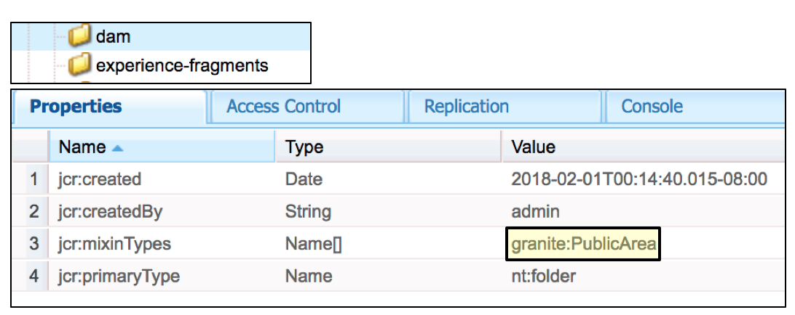

# 可持续升级{#sustainable-upgrades}

## 自定义框架 {#customization-framework}

### 架构（功能/基础架构/内容/应用程序）  {#architecture-functional-infrastructure-content-application}

自定义框架功能旨在帮助减少不友好升级的代码（如API）或内容（如叠加图）的不可扩展区域中的违规。

自定义框架有两个组件：the **API Surface** 和 **内容分类**.

#### API Surface {#api-surface}

在以前的AEM版本中，许多API都通过Uber Jar公开。 其中一些API并不打算由客户使用，但已公布到各种包中支持AEM功能。 今后，Java API将标记为公共或专用，以向客户指示哪些API在升级环境中是安全的。 其他具体细节包括：

* 标记为 `Public` 可供自定义实施包使用和引用。

* 公共API将向后兼容安装的兼容包。
* 兼容包将包含一个兼容性Uber JAR，以确保向后兼容
* 标记为 `Private` 仅供AEM内部包使用，不应供自定义包使用。

>[!NOTE]
>
>的概念 `Private` 和 `Public` 在这方面，不应与Java关于公共和私人阶级的概念混淆。

#### 内容分类 {#content-classifications}

AEM长期以来一直使用叠加和Sling资源合并器的原理，以允许客户扩展和自定义AEM功能。 支持AEM控制台和UI的预定义功能存储在 **/libs**. 客户永远不能修改下面的任何内容 **/libs** 但可以在 **/apps** 以叠加和扩展 **/libs** （有关更多信息，请参阅使用叠加进行开发）。 在将AEM升级为 **/libs** 可能会发生更改，从而导致叠加功能以意外的方式中断。 客户还可以通过继承来扩展AEM组件 `sling:resourceSuperType`，或只是在中引用组件 **/libs** 直接通过sling:resourceType。 使用引用和覆盖用例可能会出现类似的升级问题。

为了让客户更安全、更轻松地了解 **/libs** 可以安全地在中使用和叠加内容 **/libs** 已通过以下混合进行了分类：

* **公共(granite:PublicArea)**  — 将节点定义为公共节点，以便它可以覆盖、继承( `sling:resourceSuperType`)或直接使用( `sling:resourceType`)。 添加兼容包后，/libs下标记为“Public”的节点将安全升级。 通常，客户应仅利用标记为“Public”的节点。

* **摘要(granite:AbstractArea)**  — 将节点定义为抽象。 节点可以叠加或继承( `sling:resourceSupertype`)，但不得直接使用( `sling:resourceType`)。

* **最终(granite:FinalArea)**  — 将节点定义为最终节点。 分类为最终理想状态的节点不应被叠加或继承。 最终节点可直接通过 `sling:resourceType`. 默认情况下，最终节点下的子节点被视为内部节点。

* ***内部(granite:InternalArea)*** *- *将节点定义为内部节点。 分类为内部理想状态的节点不应被覆盖、继承或直接使用。 这些节点仅用于AEM的内部功能

* **无注释**  — 节点根据树层次结构继承分类。 默认情况下，/ root为Public。 **父项被分类为“内部”或“最终”的节点也将被视为“内部”。**

>[!NOTE]
>
>这些策略仅针对基于Sling搜索路径的机制强制实施。 其他领域 **/libs** 类似于客户端库可能标记为 `Internal`，但仍可以与标准clientlib包含一起使用。 在这些情况下，客户必须继续遵守内部分类。

#### CRXDE Lite内容类型指示器 {#crxde-lite-content-type-indicators}

在CRXDE Lite中应用的混合将显示标记为的内容节点和树 `INTERNAL` 灰显。 对于 `FINAL` 只有图标呈灰显状态。 这些节点的子项也将显示为灰色。 在这两种情况下，覆盖节点功能都处于禁用状态。

**公共**

**最终**

**内部**

**内容运行状况检查**

>[!NOTE]
>
>自AEM 6.5起，Adobe建议使用模式检测器来检测内容访问违规。 模式检测器报告更详细，检测更多问题，降低误报的概率。
>
>有关更多信息，请参阅 [利用模式检测器评估升级复杂度](/help/sites-deploying/pattern-detector.md).

AEM 6.5附带一个运行状况检查，如果覆盖或引用的内容的使用方式与内容分类不一致，则会向客户发出警报。

** Sling/Granite内容访问检查**是一项新的运行状况检查，可监视存储库以查看客户代码是否错误地访问AEM中的受保护节点。

这将扫描 **/apps** 并且通常需要几秒钟才能完成。

要访问此新的运行状况检查，您需要执行以下操作：

1. 从AEM主屏幕中，导航到 **工具>操作>运行状况报告**
1. 单击 **Sling/Granite内容访问检查** 如下所示：

   

扫描完成后，将显示警告列表，通知受保护节点的最终用户未正确引用该节点：

修复违规后，将返回绿色状态：

运行状况检查显示由后台服务收集的信息，当在所有Sling搜索路径中使用叠加或资源类型时，后台服务会异步检查这些信息。 如果内容混合使用不正确，它会报告违规。
