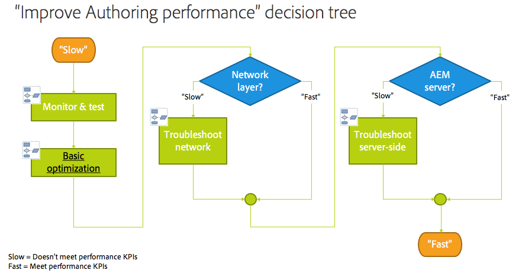

# AEM安装问题疑难解答{#troubleshooting}

此部分包含有关有助于进行故障排除的日志的详细信息，还包含有关您在AEM中可能遇到的某些问题的信息。

## 作者性能疑难解答 {#troubleshoot-author-performance}

在创作实例上分析较慢的性能可能会变得复杂。 第一步，需要弄清楚技术栈栈的哪个级别的性能正在下降。

以下决策树为缩小瓶颈提供了指导。

## 基本优化 {#basic-optimization}

## 配置日志文件和审核日志 {#configuring-log-files-and-audit-logs}

AEM会记录您可能想要配置的详细日志，以解决安装问题。 有关信息，请参见 [使用审核记录和日志文件](/help/sites-deploying/monitoring-and-maintaining.md#working-with-audit-records-and-log-files) 部分。

## 使用Verbose选项 {#using-the-verbose-option}

启动AEM WCM时，可以将 — v (verbose)选项添加到命令行中，如java -jar cq-wcm-quickstart-&lt;version>.jar -v.

详细选项在控制台上显示一些快速入门日志输出，因此可用于进行故障排除。

## 常见安装问题 {#common-installation-issues}

以下部分介绍了一些安装问题及其解决方案。

### 双击快速入门jar不起作用，或者使用其他程序（例如，存档管理器）打开jar文件 {#double-clicking-the-quickstart-jar-does-not-have-any-effect-or-opens-the-jar-file-with-another-program-for-example-archive-manager}

此问题通常表示操作系统的桌面环境配置为打开扩展名为.jar的文件时出现问题。 它还可能表示您未安装Java™，或者您使用的是不受支持的Java™版本。

由于jar文件使用普遍存在的ZIP格式，因此某些存档程序可能会自动将桌面配置为将jar文件作为存档文件打开。

要进行故障诊断，请执行以下操作：

* 仔细检查是否至少安装了Java™ 1.6版。
* 在AEM WCM快速入门上尝试上下文菜单（通常用鼠标右键单击），然后选择“打开方式”....
* 检查是否列出了Java™或Sun Java™，并尝试使用它运行AEM WCM。 如果安装了多个Java™版本，请选择支持的版本。

  如果成功完成此步骤，并且您的操作系统提供了一个选项，可以始终使用选定的程序来运行.jar文件，请选择它。 从现在开始，双击应该有效。

* 有时，重新安装支持的Java™版本有助于恢复正确的关联。
* 您始终可以使用命令行或启动/停止脚本运行CRX，如本文档前面所述。

### 在CRX上运行的应用程序引发内存不足错误 {#my-application-running-on-crx-throws-out-of-memory-errors}

>[!NOTE]
>
>另请参阅 [分析内存问题](https://experienceleague.adobe.com/docs/experience-cloud-kcs/kbarticles/KA-17482.html).

CRX本身的内存占用量很低。 如果在CRX中运行的应用程序具有更大的内存需求或请求内存密集型操作（例如，大型事务），则运行CRX的JVM实例必须使用适当的内存设置启动。

使用Java™命令选项定义JVM的内存设置（例如，使用java -Xmx512m -jar crx&amp;ast；.jar将heapsize设置为512 MB）。

从命令行启动AEM WCM时指定内存设置选项。 还可以修改用于管理AEM WCM启动的AEM WCM启动/停止脚本或自定义脚本，以定义所需的内存设置。

如果您已将栈大小定义为512 MB，则可能需要通过创建栈转储来进一步分析内存问题。

要在内存不足时自动创建栈转储，请使用以下命令：

java -Xmx256m -XX：+HeapDumpOnOutOfMemoryError -jar &amp;ast；.jar

此方法会生成栈转储文件(**java_...hprof**)。 生成栈转储后，该进程可能会继续运行。

通常，需要在一段时间内收集的三个栈转储文件来分析问题：

* 在失败发生之前
* 故障1期间
* 故障2期间
* *理想情况下，在事件解决后收集信息也会有帮助*

这些功能可以比较以查看更改以及对象如何使用内存。

>[!NOTE]
>
>如果您定期收集此类信息，或者有读取栈转储的经验，则一个栈转储文件就足以分析问题。

### 双击AEM快速入门后，浏览器中不显示AEM欢迎屏幕 {#the-aem-welcome-screen-does-not-display-in-the-browser-after-double-clicking-aem-quickstart}

在某些情况下，即使存储库本身成功运行，AEM WCM欢迎屏幕也不会自动显示。 此问题可能取决于操作系统设置、浏览器配置或类似因素。

常见症状是AEM WCM快速启动窗口显示“AEM WCM正在启动，正在等待服务器启动”.... 如果该消息显示的时间相对较长，请使用默认4502端口或实例正在运行的端口http://localhost:4502/手动将AEM WCM URL输入浏览器窗口。

此外，日志可能会揭示浏览器未启动的原因。

有时， AEM WCM快速入门窗口会显示消息“AEM WCM在http://localhost:port/上运行”，并且浏览器不会自动启动。 在这种情况下，请单击AEM WCM快速入门窗口中的URL（它是一个超链接），或在浏览器中手动输入该URL。

如果其他所有操作失败，请检查日志以了解发生了什么情况。

### 使用Java™ 11时，网站未加载或间歇性失败 {#the-website-does-not-load-or-fails-intermittently-with-java11}

在Java™ 11上运行的AEM 6.5存在一个已知问题，即网站可能无法加载或间歇性失败。

如果出现此问题，请执行以下操作：

1. 打开 `sling.properties` 文件位于 `crx-quickstart/conf/` 文件夹
1. 找到以下行：

   `org.osgi.framework.bootdelegation=sun.,com.sun.`

1. 将其替换为以下内容：

   `org.osgi.framework.bootdelegation=sun.,com.sun.,jdk.internal.reflect,jdk.internal.reflect.*`

1. 重新启动实例。

## 应用服务器的安装疑难解答 {#troubleshooting-installations-with-an-application-server}

### 请求geometrixx-outdoor页面时返回了“未找到页面” {#page-not-found-returned-when-requesting-a-geometrixx-outdoor-page}

**适用于WebLogic 10.3.5和JBoss® 5.1**

对geometrixx-outdoors/en页面的请求返回404（页面未找到）时，您可以重新检查是否已在这些特定应用程序服务器所需的sling.properties文件中设置了其他sling属性。

在中查看 *部署AEM Web应用程序* 详细步骤。

### 响应标头大小可以大于4 KB {#response-header-size-can-be-greater-than-kb}

502错误可能表示Web服务器无法处理AEM HTTP响应标头的大小。 AEM可以生成包含大小大于4 KB的Cookie的HTTP响应标头。 确保已配置Servlet容器，以便最大响应标头大小可以超过4 KB。

例如，对于Tomcat 7.0，其属性为 [HTTP连接器](https://tomcat.apache.org/tomcat-7.0-doc/config/http.html) 控制标头大小限制。

## 卸载Adobe Experience Manager {#uninstalling-adobe-experience-manager}

由于AEM安装在单个目录中，因此不需要卸载实用程序。 虽然卸载AEM的方法取决于要实现的目标以及使用的永久存储，但卸载过程可能非常简单，如删除整个安装目录。

如果永久存储嵌入在安装目录中（例如，在默认的TarPM安装中），则删除文件夹也会删除数据。

>[!NOTE]
>
>Adobe建议您在删除AEM之前备份存储库。 如果您删除整个 &lt;cq-installation-directory>，则还会删除存储库。 要在删除之前保留存储库数据，请移动或复制 &lt;cq-installation-directory>/crx-quickstart/repository文件夹中的其他位置，然后再删除其他文件夹。

如果您安装的AEM使用外部存储（例如，数据库服务器），则删除文件夹不会自动删除数据，但会删除存储配置，这会使恢复JCR内容变得困难。

### JSP文件未在JBoss上编译® {#jsp-files-are-not-compiled-on-jboss}

如果安装或更新要在JBoss®上Experience Manager的JSP文件，但未编译相应的servlet，请确保正确配置了JBoss® JSP编译器。 有关信息，请参见
[JBoss中的JSP编译问题®](https://helpx.adobe.com/experience-manager/kb/jsps-dont-compile-jboss.html) 文章。
