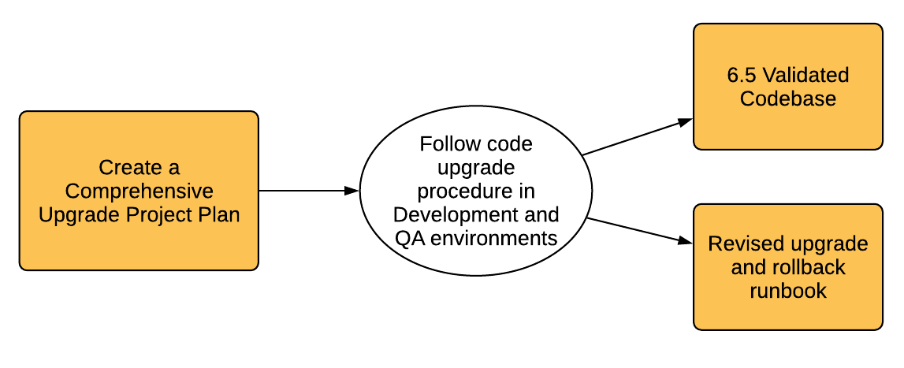

# 规划升级{#planning-your-upgrade}

## AEM项目概述 {#aem-project-overview}

AEM通常用于高影响力的部署，这些部署可能会为数百万用户提供服务。 通常，实例上会部署自定义应用程序，这会增加复杂性。 任何升级此类部署的工作都需要有条不紊地加以处理。

本指南有助于在规划升级时制定明确的目标、阶段和交付项。 它侧重于项目的整体执行和准则。 虽然它提供了实际升级步骤的概述，但它会在适当的时候参考可用的技术资源。 它应当与文件中提到的现有技术资源一起使用。

AEM升级过程需要精心处理规划、分析和执行阶段，并为每个阶段定义关键交付项。

可以直接从AEM版本6.0升级到6.5。运行5.6.x及更低版本的客户需要首先升级到版本6.0或更高版本，建议使用6.0 (SP3)。 此外，从6.3开始，新的Oak区段Tar格式现在用于区段节点存储，即使对于6.0、6.1和6.2，存储库迁移到此新格式也是强制性的。

>[!CAUTION]
>
>如果您要从AEM 6.2升级到6.3，您应该从各个版本(**6.2-SP1-CFP1 —6.2 SP1-CFP12.1**)或 **6.2 SP1-CFP15** 自此以后。 否则，如果您要从 **6.2 SP1-CFP13/6.2 SP1CFP14** 到AEM 6.3，您还必须至少升级到版本 **6.3.2.2**. 否则，AEM Sites将在升级后失败。

## 升级范围和要求 {#upgrade-scope-requirements}

在下方，您将找到在典型的AEM升级项目中受影响的区域列表：

<table>
 <tbody>
  <tr>
   <td><strong>组件</strong></td>
   <td><strong>影响</strong></td>
   <td><strong>描述</strong></td>
  </tr>
  <tr>
   <td>操作系统</td>
   <td>不确定，但影响微小</td>
   <td>在AEM升级时，也可能需要升级操作系统，这可能会产生一些影响。</td>
  </tr>
  <tr>
   <td>Java™运行时</td>
   <td>中等影响</td>
   <td>AEM 6.3需要JRE 1.7.x（64位）或更高版本。 JRE 1.8是Oracle当前支持的唯一版本。</td>
  </tr>
  <tr>
   <td>硬件</td>
   <td>中等影响</td>
   <td>联机修订版清理需要免费  磁盘空间等于存储库大小的25%和15%的可用栈空间  以成功完成。 您可能需要将硬件升级到  确保有足够的资源进行联机修订清理，以完全  运行。 此外，如果从AEM 6之前的版本升级，则  可能是额外的存储要求。</td>
  </tr>
  <tr>
   <td>内容存储库（CRX或Oak）</td>
   <td>高影响力</td>
   <td>从版本6.1开始，AEM不支持CRX2，因此迁移到  如果从旧版本升级，则需要Oak (CRX3)。 AEM 6.3具有  实施了一个新的区段节点存储，该存储也需要迁移。 此  crx2oak工具用于此目的。</td>
  </tr>
  <tr>
   <td>AEM组件/内容</td>
   <td>中等影响</td>
   <td><code>/libs</code> 和 <code>/apps</code> 可以通过升级轻松处理，但是 <code>/etc</code> 通常需要手动重新应用一些自定义设置。</td>
  </tr>
  <tr>
   <td>AEM服务</td>
   <td>低影响</td>
   <td>大多数AEM核心服务都进行了升级测试。 这是一个影响很小的区域。</td>
  </tr>
  <tr>
   <td>自定义应用程序服务</td>
   <td>从低到高影响</td>
   <td>根据应用程序和自定义，可能存在  依赖于JVM、操作系统版本和一些相关的索引  更改，因为索引不会在Oak中自动生成。</td>
  </tr>
  <tr>
   <td>自定义应用程序内容</td>
   <td>从低到高影响</td>
   <td>无法通过升级处理的内容可以备份  ，然后移回存储库。  大多数内容都可以通过迁移工具进行处理。</td>
  </tr>
 </tbody>
</table>

务必确保您运行的是受支持的操作系统、Java™运行时、httpd和Dispatcher版本。 欲了解更多信息，请参见 [AEM 6.5技术要求页面](/help/sites-deploying/technical-requirements.md). 需要在项目计划中考虑升级这些组件，并且应在升级AEM之前进行升级。

## 项目阶段 {#project-phases}

规划和运行AEM升级需要做很多工作。 为了阐明在此过程中所做的各种努力，Adobe将规划和执行工作划分为不同的阶段。 在以下部分中，每个阶段都会产生一个交付项，通常由项目的未来阶段使用。

### 规划作者培训 {#planning-for-author-training}

对于任何新版本，可能会引入对UI和用户工作流的潜在更改。 此外，新版本引入了可能有利于企业使用的新功能。 Adobe建议审查已引入的功能更改并组织计划来培训用户有效使用这些更改。

AEM 6.5中的新增功能可在中找到 [adobe.com的AEM部分](/help/release-notes/release-notes.md). 请务必注意对组织中常用的UI或产品功能所做的任何更改。 浏览新功能时，请注意对您的组织有价值的任何功能。 查看AEM 6.5中的更改后，为作者制定培训计划。 这可能涉及使用免费提供的资源，例如帮助功能视频或提供的正式培训 [Adobe数字学习服务](https://learning.adobe.com/).

### 创建测试计划 {#creating-a-test-plan}

每个客户的AEM实施都是独一无二的，并且已经过定制以满足其业务需求。 因此，必须确定对系统所做的所有自定义设置，以便将其包含在测试计划中。 此测试计划将支持Adobe在已升级实例上执行的QA过程。

需要复制确切的生产环境，并且应在升级后对其执行测试，以确保所有应用程序和自定义代码仍按需要运行。 回归所有自定义设置并运行性能、加载和安全测试。 在组织测试计划时，除了现成的UI和日常操作中使用的工作流之外，请确保涵盖针对系统所做的所有自定义设置。 这些可以包括自定义OSGI服务和Servlet、与Adobe Experience Cloud的集成、通过AEM连接器与第三方集成、自定义第三方集成、自定义组件和模板、AEM中的自定义UI叠加以及自定义工作流。 对于从AEM 6之前的版本迁移的客户，应分析任何自定义查询，因为这些查询可能需要编制索引。 对于已使用AEM 6.x版本的客户，仍应测试这些查询，以确保其索引在升级后继续有效工作。

### 确定所需的架构和基础架构更改 {#determining-architectural-and-infrastructure-changes-needed}

升级时，可能还需要升级技术栈栈中的其他组件，例如操作系统或JVM。 此外，由于存储库组成发生变化，可能需要额外的硬件。 这仅适用于从6.x以前的实例迁移的客户，但必须考虑。 最后，您的操作做法可能需要改变，包括监控、维护以及备份和灾难恢复过程。

查看AEM 6.5的技术要求，并确保您当前的硬件和软件足够。 有关对操作流程的可能更改，请参阅以下文档：

**监控和维护：**

[操作功能板](/help/sites-administering/operations-dashboard.md)

[Assets 监控最佳实践](/help/assets/assets-monitoring-best-practices.md)

[使用JMX控制台监控服务器资源](/help/sites-administering/jmx-console.md)

[修订版清理](/help/sites-deploying/revision-cleanup.md)

**备份/恢复和灾难恢复：**

[备份和恢复](/help/sites-administering/backup-and-restore.md)

[性能和可扩展性](/help/sites-deploying/performance.md)

[如何在TarMK冷备用模式下运行AEM](/help/sites-deploying/tarmk-cold-standby.md)

#### 内容重构注意事项 {#content-restructuring-considerations}

AEM已对存储库结构进行了更改，这有助于使升级更加顺畅。 这些更改涉及根据Adobe或客户是否拥有内容，将内容从/etc文件夹移出到/libs、/apps和/content等文件夹，从而限制在发布期间覆盖内容的几率。 存储库重组已经完成，因此在6.5版升级时不需要更改代码，但建议查看以下位置的详细信息： [AEM中的存储库重组](/help/sites-deploying/repository-restructuring.md) 在计划升级时。

### 评估升级复杂性 {#assessing-upgrade-complexity}

由于Adobe客户应用于其AEM环境的自定义设置的数量和性质多种多样，因此请务必提前一些时间来确定升级时应花费的总工作量。

您可以使用两种方法来评估升级的复杂性，一种是初步阶段可以使用新引入的模式检测器，该检测器可在AEM 6.1、6.2和6.3实例上运行。 模式检测器是使用报告的模式来评估预期升级的整体复杂性的最简单方法。 模式检测器报表包括用于识别自定义代码库正在使用的不可用API的模式（这是使用6.3中的升级前兼容性检查完成的）。

在初始评估后，更全面的下一步可能是对测试实例执行升级并执行一些基本的烟雾测试。 Adobe还提供了一些。 此外，此列表还包含 [已弃用和已删除的功能](/help/release-notes/deprecated-removed-features.md) 不仅要检查要升级到的版本，还要检查源版本和目标版本之间的任何版本。 例如，如果从AEM 6.2升级到6.5，除了已弃用和已删除的AEM 6.5功能外，请务必查看AEM 6.3已弃用和已删除的功能。

最近推出的模式检测器将为您提供非常准确的估计，在大多数情况下，升级过程中会出现什么情况。 但是，对于具有不兼容更改的更复杂的自定义和部署，您可以根据中的说明将开发实例升级到AEM 6.5 [执行就地升级](/help/sites-deploying/in-place-upgrade.md). 完成后，在此环境中执行一些高级烟雾测试。 本练习的目标不是详尽地完成测试用例清单并生成正式的缺陷清单，而是粗略地估计升级代码以实现6.5兼容性所需的工作量。 当与 [模式检测](/help/sites-deploying/pattern-detector.md) 以及上一节确定的架构变化，可以向项目管理小组提供粗略的估计，以规划升级。

### 构建升级和回滚Runbook {#building-the-upgrade-and-rollback-runbook}

虽然Adobe已记录升级AEM实例的流程，但每个客户的网络布局、部署架构和自定义都需要对此方法进行微调和定制。 因此，Adobe建议您查看提供的所有文档，并将其用于告知特定项目的Runbook，其中概述了将在环境中遵循的特定升级和回滚过程。 如果从CRX2升级，请确保评估从CRX2迁移到Oak时内容迁移将花费的时长。 对于大型存储库而言，它可能是巨大的。

Adobe已在中提供了升级和回滚过程 [升级过程](/help/sites-deploying/upgrade-procedure.md) 以及在执行升级时应用升级的分步说明 [就地升级](/help/sites-deploying/in-place-upgrade.md). 您应该查看这些说明，并根据您的系统体系结构、定制和停机容忍度来考虑这些说明，以确定在升级期间将执行的适当的切换和回滚过程。 在起草您的自定义Runbook时，应包括对体系结构或服务器大小所做的任何更改。 必须指出，这应作为第一稿处理。 当您的团队完成其QA和开发周期并将升级部署到暂存环境时，可能需要执行一些其他步骤。 理想情况下，该文件应包含足够的信息，这样，如果将其交给您的业务人员，他们将能够完全根据文件中所包含的信息完成升级。

### 制定项目计划 {#developing-a-project-plan}

先前练习的输出可用于构建项目计划，涵盖测试或开发工作、培训和实际升级执行的预期时间线。

全面的项目计划应包括：

* 最终确定开发和测试计划
* 升级开发和QA环境
* 更新AEM 6.5的自定义代码库
* QA测试和修复周期
* 升级暂存环境
* 集成、性能和负载测试
* 环境认证
* 上线

### 执行开发和QA {#performing-development-and-qa}

Adobe为以下各项提供了相关程序： [升级代码和自定义项](/help/sites-deploying/upgrading-code-and-customizations.md) 以与AEM 6.5兼容。在运行此迭代流程时，应根据需要对Runbook进行更改。 另请参阅 [AEM 6.5中的向后兼容性](/help/sites-deploying/backward-compatibility.md) 此信息介绍了自定义项如何保持向后兼容，通常不需要在升级后立即进行开发。

开发和测试过程通常是迭代的。 由于进行自定义设置，在升级期间所做的更改可能会导致产品的整个部分不可用。 一旦开发人员解决了问题的根本原因，并且测试团队有权测试这些功能，就有可能发现其他问题。 在发现需要调整升级过程的问题后，请确保将它们添加到您的自定义升级Runbook中。 经过多次反复测试和修复后，代码库应完全验证并准备好部署到暂存环境。

### 最终测试 {#final-testing}

Adobe建议在代码库获得贵组织的QA团队的认证后进行最后一轮测试。 此轮测试将涉及在暂存环境中验证您的Runbook，然后进行多轮用户验收、性能和安全性测试。

此步骤至关重要，因为这是您唯一一次能够针对类似于生产环境的环境验证Runbook中的步骤。 升级环境后，请务必留出一些时间让最终用户登录并完成他们在日常活动中使用系统时执行的活动。 用户使用系统以前未考虑过的一部分的情况也很常见。 在上线之前发现并纠正这些区域的问题，有助于防止代价高昂的生产中断。 由于新版本的AEM包含对基础平台的重大更改，因此同样重要的是，要在系统上执行性能、负载和安全测试，就像您首次启动它一样。

### 执行升级 {#performing-the-upgrade}

一旦从所有利益相关者处获得最终批准，就应该按照定义的Runbook过程执行。 Adobe提供了升级和回滚步骤 [升级过程](/help/sites-deploying/upgrade-procedure.md) 和安装步骤执行 [就地升级](/help/sites-deploying/in-place-upgrade.md) 作为参考点。

Adobe在环境验证的升级说明中提供了一些步骤。 这些检查包括一些基本检查，如扫描升级日志和验证所有OSGi捆绑包是否已正确启动，但Adobe建议也根据您的业务流程使用您自己的测试用例进行验证。 Adobe还建议检查AEM联机修订清理计划及相关例程，以确保在您的公司安静时段执行这些操作。 这些例程对于AEM的长期性能至关重要。
