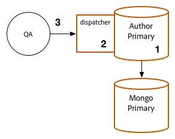

# 升级过程 {#upgrade-procedure}

>[!NOTE]
>
>由于大多数AEM升级都是就地执行的，因此升级过程将需要作者层停机。 通过遵循这些最佳实践，可以最小化或消除发布层停机时间。

升级AEM环境时，您需要考虑升级作者环境或发布环境之间的方法差异，以最大限度地减少作者和最终用户的停机时间。 本页概述了升级AEM 6.x版本上当前运行的AEM拓扑的高级过程。由于创作层和发布层以及基于Mongo和TarMK的部署之间的流程不同，因此每个层和微内核都列在单独的部分中。 执行部署时，我们建议先升级您的创作环境，确定成功与否，然后继续访问发布环境。

<!--
>[!IMPORTANT]
>
>The downtime during the upgrade can be significally reduced by indexing the repository before performing the upgrade. For more information, see [Using Offline Reindexing To Reduce Downtime During an Upgrade](/help/sites-deploying/upgrade-offline-reindexing.md)
-->

## TarMK作者层 {#tarmk-author-tier}

### 启动拓扑 {#starting-topology}

此部分假定的拓扑由在TarMK上运行的具有冷备用的作者服务器组成。 从作者服务器复制到TarMK发布场。 虽然此处未说明，但此方法也可用于使用卸载的部署。 在作者实例上禁用复制代理后以及重新启用它们之前，请确保在新版本上升级或重新构建卸载实例。

### 升级准备 {#upgrade-preparation}

1. 停止内容创作

1. 停止备用实例

1. 在作者上禁用复制代理

1. 运行 [升级前维护任务](/help/sites-deploying/pre-upgrade-maintenance-tasks.md)。

### 升级执行 {#upgrade-execution}

1. 运行 [就地升级](/help/sites-deploying/in-place-upgrade.md)
1. 根据需要更新调 *度程序模块*

1. QA验证升级

1. 关闭作者实例。

### 如果成功 {#if-successful}

1. 复制升级的实例以创建新的Cold Standby

1. 开始创作实例

1. 开始待机实例。

### 如果失败（回滚） {#if-unsuccessful-rollback}

1. 开始Cold Standby实例作为新的主实例

1. 从Cold Standby重建作者环境。

## MongoMK作者群集 {#mongomk-author-cluster}

### 启动拓扑 {#starting-topology-1}

此部分假定的拓扑由至少包含两个AEM作者实例的MongoMK作者群集组成，该实例由至少两个MongoMK数据库支持。 所有作者实例共享一个数据存储。 这些步骤应同时适用于S3和文件数据存储。 从作者服务器复制到TarMK发布场。

### 升级准备 {#upgrade-preparation-1}

1. 停止内容创作
1. 克隆数据存储以进行备份
1. 停止除一个AEM作者实例外的所有实例，即您的主作者
1. 从副本集（主Mongo实例）中删除除一个MongoDB节点外的所有节点
1. 更新主 `DocumentNodeStoreService.cfg` 作者上的文件以反映您的单个成员副本集
1. 重新启动主作者，以确保它正确重新启动
1. 禁用主作者上的复制代理
1. 在 [主Author实例上运行](/help/sites-deploying/pre-upgrade-maintenance-tasks.md) “升级前维护”任务
1. 如有必要，使用WiredTiger将主Mongo实例上的MongoDB升级到版本3.2

### 升级执行 {#Upgrade-execution-1}

1. 在主 [作者上运行](/help/sites-deploying/in-place-upgrade.md) 就地升级
1. 根据需要更新调度程序或 *Web模块*
1. QA验证升级

### 如果成功 {#if-successful-1}

1. 创建新的6.5作者实例，它们与升级的Mongo实例连接

1. 重建从群集中删除的MongoDB节点

1. 更新文 `DocumentNodeStoreService.cfg` 件以反映完整的复制副本集

1. 重新启动作者实例，一次一个

1. 删除克隆的数据存储。

### 如果失败（回滚）  {#if-unsuccessful-rollback-2}

1. 重新配置辅助作者实例以连接到克隆的数据存储

1. 关闭升级的作者主实例

1. 关闭升级的Mongo主实例。

1. 开始辅助Mongo实例，其中一个实例作为新的主实例

1. 在辅助 `DocumentNodeStoreService.cfg` 作者实例上配置文件，以指向尚未升级的Mongo实例的副本集

1. 开始辅助作者实例

1. 清理升级的作者实例、Mongo节点和数据存储。

## TarMK发布场 {#tarmk-publish-farm}

### TarMK发布场 {#tarmk-publish-farm-1}

此部分的假定拓扑由两个TarMK发布实例组成，前面是Dispatcher，后面是负载平衡器。 从作者服务器复制到TarMK发布场。

### 升级执行 {#upgrade-execution-2}

1. 在负载平衡器上停止Publish 2实例的通信
1. 在 [Publish 2上运行](/help/sites-deploying/pre-upgrade-maintenance-tasks.md) 升级前维护
1. 在Publish [2上运行就地](/help/sites-deploying/in-place-upgrade.md) 升级
1. 根据需要更新调度程序或 *Web模块*
1. 刷新调度程序缓存
1. QA通过防火墙后的调度程序验证Publish 2
1. 关闭发布2
1. 复制Publish 2实例
1. 开始发布2

### 如果成功 {#if-successful-2}

1. 启用通信以发布2
1. 停止发布1的流量
1. 停止Publish 1实例
1. 将Publish 1实例替换为Publish 2的副本
1. 根据需要更新调度程序或 *Web模块*
1. 刷新Publish 1的调度程序缓存
1. 开始发布1
1. QA通过防火墙后的调度程序验证Publish 1

### 如果失败（回滚） {#if-unsuccessful-rollback-1}

1. 创建发布1的副本
1. 将Publish 2实例替换为Publish 1的副本
1. 刷新Publish 2的调度程序缓存
1. 开始发布2
1. QA通过防火墙后的调度程序验证Publish 2
1. 启用通信以发布2

## 最终升级步骤 {#final-upgrade-steps}

1. 启用通信以发布1
1. QA通过公共URL执行最终验证
1. 从“作者”环境启用复制代理
1. 恢复内容创作
1. 执 [行升级后检查](/help/sites-deploying/post-upgrade-checks-and-troubleshooting.md)。

