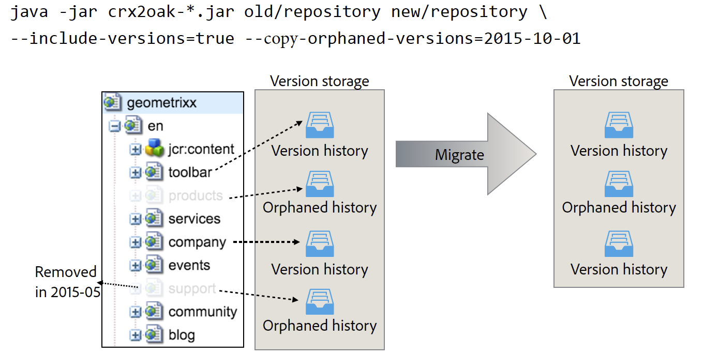

# 使用CRX2Oak迁移工具{#using-the-crx-oak-migration-tool}

## 简介 {#introduction}

CRX2Oak是一种用于在不同存储库之间迁移数据的工具。

此插件可用于将数据从基于Apache Jackrabbit 2的较旧CQ版本迁移到Oak，也可用于在Oak存储库之间复制数据。

您可以从公共Adobe存储库下载最新版本的crx2oak，网址为：
[https://repo1.maven.org/maven2/com/adobe/granite/crx2oak/](https://repo1.maven.org/maven2/com/adobe/granite/crx2oak/)

>[!NOTE]
>
>有关Apache Oak以及Adobe Experience Manager (AEM)持久性的关键概念的更多信息，请参阅[AEM平台简介](/help/sites-deploying/platform.md)。

## 迁移用例 {#migration-use-cases}

该工具可用于：

* 从旧版CQ 5迁移到AEM 6
* 在多个Oak存储库之间复制数据
* 在不同的Oak MicroKernel实现之间转换数据。

支持使用外部Blob存储（通常称为数据存储）迁移存储库，但支持使用不同的组合。 一个可能的迁移路径是从使用外部`FileDataStore`的CRX2存储库到使用`S3DataStore`的Oak存储库。

下图说明了CRX2Oak支持的所有可能的迁移组合：


## 功能 {#features}

在AEM升级期间以某种方式调用CRX2Oak，即用户可以指定预定义的迁移配置文件，以自动重新配置持久性模式。 这称为快速启动模式。

如果需要进行更多自定义，它也可以单独运行。 但是，在此模式下，只能对存储库进行更改，并且必须手动对AEM执行任何其他重新配置。 这称为独立模式。

另外要注意的是，在独立模式下使用默认设置时，只会迁移节点存储，而新存储库会重用旧的二进制存储。

### 自动快速启动模式 {#automated-quickstart-mode}

自AEM 6.3起，CRX2Oak就能够处理用户定义的迁移配置文件，配置文件可使用所有可用的迁移选项进行配置。 这样既提高了灵活性，又能够自动配置AEM，在独立模式下使用该工具时，这些功能将不可用。

要将CRX2Oak切换到快速启动模式，请通过此操作系统环境变量在AEM安装目录中定义crx-quickstart文件夹的路径：

**对于基于UNIX的系统和macOS：**

```shell
export SLING_HOME="/path/to/crx-quickstart"
```

用于Windows的&#x200B;**：**

```shell
SET "SLING_HOME=/path/to/crx-quickstart"
```

#### 恢复支持 {#resume-support}

迁移可以在任何时候中断，并且以后可以恢复。

#### 可自定义的升级逻辑 {#customizable-upgrade-logic}

可以使用`CommitHooks`实现自定义Java™逻辑。 可以实施自定义`RepositoryInitializer`类以使用自定义值初始化存储库。

#### 支持内存映射操作 {#support-for-memory-mapped-operations}

默认情况下，CRX2Oak还支持内存映射操作。 内存映射可大大提高性能，应尽可能使用。

>[!CAUTION]
>
>但请注意，Windows平台不支持内存映射操作。 因此，建议在Windows上执行迁移时添加&#x200B;**—disable-mmap**&#x200B;参数。

#### 选择性迁移内容 {#selective-migration-of-content}

默认情况下，该工具会迁移`"/"`路径下的整个存储库。 但是，您可以完全控制应该迁移哪些内容。

如果新实例上有不需要的内容的任何部分，则可以使用`--exclude-path`参数排除该内容并优化升级过程。

#### 路径合并 {#path-merging}

如果必须在两个存储库之间复制数据，并且您的内容路径在两个实例上均不同，则可以在`--merge-path`参数中定义该路径。 在执行此操作时，CRX2Oak只会将新节点复制到目标存储库中，并将旧节点保持不变。


#### 版本支持 {#version-support}

默认情况下，AEM会为每个要修改的节点或页面创建一个版本，并将其存储在存储库中。 然后，可以使用这些版本将页面还原到以前的状态。

但是，即使删除了原始页面，也不会清除这些版本。 在处理已运行很长时间的存储库时，迁移可能会重新处理由孤立版本导致的冗余数据。

对于这些类型的情况，一个有用的功能是添加`--copy-versions`参数。 它用于在迁移或复制存储库期间跳过版本节点。

您还可以通过添加`--copy-orphaned-versions=true`来选择是否复制孤立版本。

如果您希望在不晚于特定日期的情况下复制版本，则这两个参数还支持`YYYY-MM-DD`日期格式。



#### 打开Source版本 {#open-source-version}

CRX2Oak的开源版本以oak-upgrade的形式提供。 它支持所有功能，但以下功能除外：

* CRX2支持
* 迁移配置文件支持
* 支持自动AEM重新配置

有关详细信息，请参阅[Apache文档](https://jackrabbit.apache.org/oak/docs/migration.html)。

## 参数 {#parameters}

### 节点存储选项 {#node-store-options}

* `--cache`：缓存大小（以MB为单位，默认值为`256`）

* `--mmap`：为区段存储启用内存映射文件访问
* 源RDB数据库的`--src-password:`密码

* 源RDB的`--src-user:`用户

* `--user`：目标数据库用户

* `--password`：目标RDB密码。

### 迁移选项 {#migration-options}

* `--early-shutdown`：在复制节点之后以及在应用提交挂接之前关闭源JCR2存储库
* `--fail-on-error`：如果无法从源存储库读取节点，强制迁移失败。
* `--ldap`：将LDAP用户从CQ 5.x实例迁移到基于Oak的实例。 要使此功能正常工作，必须将Oak配置中的身份提供程序命名为ldap。 有关详细信息，请参阅[LDAP文档](/help/sites-administering/ldap-config.md)。

* `--ldap-config:`将此项与使用多个LDAP服务器进行身份验证的CQ 5.x存储库的`--ldap`参数一起使用。 您可以使用它指向CQ 5.x `ldap_login.conf`或`jaas.conf`配置文件。 格式为`--ldapconfig=path/to/ldap_login.conf`。

### 版本存储选项 {#version-store-options}

* `--copy-orphaned-versions`：跳过复制孤立版本。 支持的参数包括： `true`、`false`和`yyyy-mm-dd`。 默认为`true`。

* `--copy-versions:`复制版本存储。 参数： `true`、`false`、`yyyy-mm-dd`。 默认为`true`。

#### 路径选项 {#path-options}

* `--include-paths:`在复制期间要包括的以逗号分隔的路径列表
* `--merge-paths`：复制期间要合并的以逗号分隔的路径列表
* `--exclude-paths:`在复制期间要排除的以逗号分隔的路径列表。

### Source Blob Store选项 {#source-blob-store-options}

* `--src-datastore:`要用作源的数据存储目录`FileDataStore`

* `--src-fileblobstore`：要用作源`FileBlobStore`的数据存储目录

* `--src-s3datastore`：要用于源`S3DataStore`的数据存储目录

* `--src-s3config`：源`S3DataStore`的配置文件。

### 目标BlobStore选项 {#destination-blobstore-options}

* `--datastore:`要用作目标`FileDataStore`的数据存储目录

* `--fileblobstore:`要用作目标`FileBlobStore`的数据存储目录

* `--s3datastore`：要用于目标`S3DataStore`的数据存储目录

* `--s3config`：目标`S3DataStore`的配置文件。

### 帮助选项 {#help-options}

* `-?, -h, --help:`显示帮助信息。

## 调试 {#debugging}

您还可以启用迁移过程的调试信息，以解决迁移过程中可能出现的任何问题。 根据您希望在其中运行工具的模式，您可以采用不同的方式执行此操作：

<table>
 <tbody>
  <tr>
   <td><strong>CRX2Oak模式</strong></td>
   <td><strong>操作</strong></td>
  </tr>
  <tr>
   <td>快速入门模式</td>
   <td>运行CRX2Oak时，可以将<strong>(日志级TRACE</strong>或<strong>)日志级DEBUG </strong>选项添加到命令行。 在此模式下，日志会自动重定向到<strong>upgrade.log文件</strong>。</td>
  </tr>
  <tr>
   <td>独立模式</td>
   <td><p>将<strong>—trace</strong>选项添加到CRX2Oak命令行，以便在标准输出中显示TRACE事件（您必须使用重定向字符“&gt;”或“T形”命令自己重定向日志，以供以后检查）。</p> </td>
  </tr>
 </tbody>
</table>

## 其他注意事项 {#other-considerations}

迁移到MongoDB副本集时，请确保在与Mongo数据库的所有连接上将`WriteConcern`参数设置为`2`。

为此，您可以在连接字符串的末尾添加`w=2`参数，如下所示：

```xml
java -Xmx4092m -jar crx2oak.jar crx-quickstart/repository/ mongodb://localhost:27017/aem-author?replicaset=replica1&w=2
```

>[!NOTE]
>
>有关详细信息，请参阅[写问题](https://docs.mongodb.org/manual/reference/connection-string/#write-concern-options)上的MongoDB连接字符串文档。
