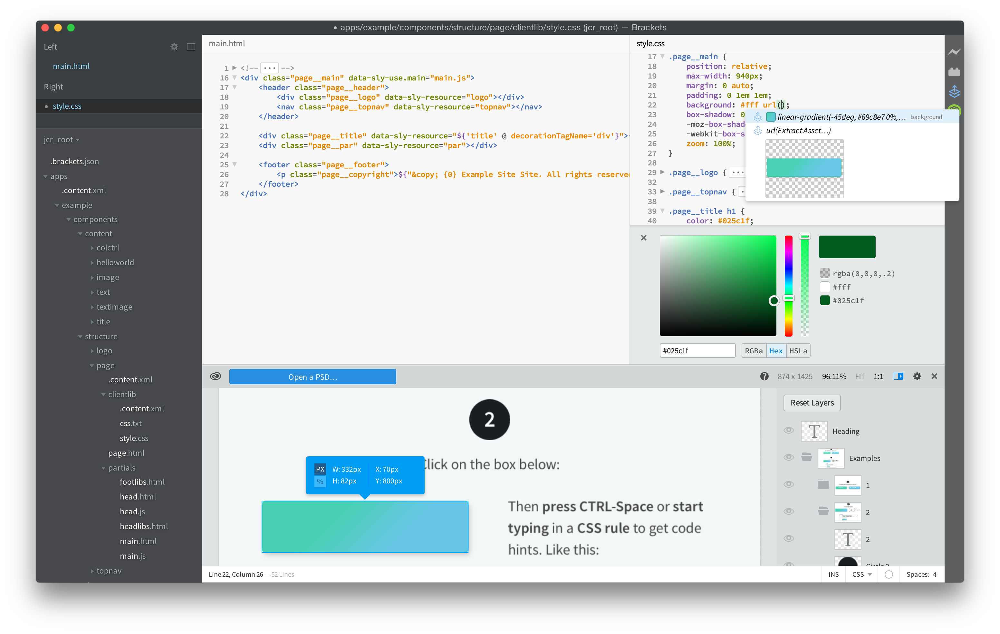

# AEM Brackets扩展{#aem-brackets-extension}

## 概述 {#overview}

AEM Brackets扩展提供了用于编辑AEM组件和客户端库的流畅工作流程，并且使用了[Brackets](https://brackets.io/)代码编辑器的强大功能，该编辑器提供了从代码编辑器访问Photoshop文件和图层的权限。 扩展提供的轻松同步（不需要Maven或File Vault）提高了开发人员效率，并且还有助于掌握有限AEM知识的前端开发人员参与项目。 此扩展还为[HTML模板语言(HTL)](https://experienceleague.adobe.com/docs/experience-manager-htl/content/overview.html)提供了一些支持，这消除了JSP的复杂性，使组件开发更容易、更安全。

### 功能 {#features}

AEM Brackets扩展的主要功能包括：

* 将更改的文件自动同步到AEM开发实例。
* 手动双向同步文件和文件夹。
* 项目的完整内容包同步。
* 表达式和`data-sly-*`块语句的HTL代码完成。

此外，Brackets还为AEM前端开发人员提供了许多有用的功能：

* Photoshop文件支持从PSD文件中提取信息，如图层、测量、颜色、字体、文本等。
* 来自PSD的代码提示，可轻松地在代码中重用此提取的信息。
* CSS预处理程序支持，如LESS和SCSS。
* 以及数百种其他扩展，可满足更具体的需求。

## 安装 {#installation}

### 括号 {#brackets}

AEM Brackets扩展支持Brackets版本1.0或更高版本。

从[brackets.io](https://brackets.io/)下载最新的Brackets版本。

### 扩展 {#the-extension}

要安装扩展，请按照以下步骤操作：

1. 打开方括号。 在菜单&#x200B;**文件**&#x200B;中，选择&#x200B;**Extension Manager...**
1. 在搜索栏中输入&#x200B;**AEM**&#x200B;并查找&#x200B;**AEM Brackets扩展**。

   

1. 单击&#x200B;**安装**。
1. 关闭对话框，并在安装完成后Extension Manager。

## 快速入门 {#getting-started}

### 内容包项目 {#the-content-package-project}

安装扩展后，您可以通过使用Brackets从文件系统打开content-package文件夹来开始开发AEM组件。

项目必须至少包含：

1. `jcr_root`文件夹（例如，`myproject/jcr_root`）

1. `filter.xml`文件（例如，`myproject/META-INF/vault/filter.xml`）；有关`filter.xml`文件结构的更多详细信息，请参阅[Workspace筛选器定义](https://jackrabbit.apache.org/filevault/filter.html)。

在Brackets的&#x200B;**文件**&#x200B;菜单中，选择&#x200B;**打开文件夹……**，然后选择`jcr_root`文件夹或父项目文件夹。

>[!NOTE]
>
>如果您没有自己的包含内容包的项目，则可以尝试[HTL TodoMVC示例](https://github.com/Adobe-Marketing-Cloud/aem-sightly-sample-todomvc)。 在GitHub上，单击&#x200B;**下载ZIP**，在本地提取文件，并按照以上说明在Brackets中打开`jcr_root`文件夹。 然后按照以下步骤设置&#x200B;**项目设置**，最后按照完整内容包同步部分中的进一步说明，执行&#x200B;**导出内容包**，将整个包上载到您的AEM开发实例。
>
>执行这些步骤后，您应该能够访问AEM开发实例上的`/content/todo.html` URL，并且可以在Brackets中开始修改代码，并了解在Web浏览器中刷新后，更改如何立即同步到AEM服务器。

### 项目设置 {#project-settings}

要将内容与AEM开发实例同步以及从中同步内容，您需要定义项目设置。 可以通过转到&#x200B;**AEM**&#x200B;菜单并选择&#x200B;**项目设置……**&#x200B;来完成此操作

通过“项目设置”，可定义以下内容：

1. 服务器URL（例如，`http://localhost:4502`）
1. 是否容忍没有有效HTTPS证书的服务器（除非需要，否则保持未选中状态）
1. 用于同步内容的用户名（例如，`admin`）
1. 用户的密码（例如，`admin`）

## 同步内容 {#synchronizing-content}

AEM Brackets Extension为`filter.xml`中定义的筛选规则允许的文件和文件夹提供了以下类型的内容同步：

### 已更改文件的自动同步 {#automated-synchronization-of-changed-files}

这只能将更改从Brackets同步到AEM实例，反之则不行。

### 手动双向同步 {#manual-bidirectional-synchronization}

在项目资源管理器中，通过右键单击任何文件或文件夹打开上下文菜单，并且可以访问&#x200B;**导出到服务器**&#x200B;或&#x200B;**从服务器导入**&#x200B;选项。

>[!NOTE]
>
>如果所选条目在`jcr_root`文件夹之外，将禁用&#x200B;**导出到服务器**&#x200B;和&#x200B;**从服务器导入**&#x200B;上下文菜单条目。

### 完整内容包同步 {#full-content-package-synchronization}

在&#x200B;**AEM**&#x200B;菜单中，**导出内容包**&#x200B;或&#x200B;**导入内容包**&#x200B;选项允许您将整个项目与服务器同步。

### 同步状态 {#synchronization-status}

AEM Brackets扩展的Brackets窗口右侧的工具栏中提供了一个通知图标，用于指示上次同步的状态：

* 绿色 — 已成功同步所有文件
* 蓝色 — 正在进行同步操作
* 黄色 — 某些文件未同步
* 红色 — 未同步任何文件

单击通知图标会打开“同步状态报告”对话框，其中列出了每个已同步文件的所有状态。

>[!NOTE]
>
>无论使用的同步方法如何，将只同步由`filter.xml`中的筛选规则标记为包含的内容。
>
>此外，还支持`.vltignore`个文件以阻止内容与存储库进行同步以及从存储库进行同步。

## 编辑HTL代码 {#editing-htl-code}

AEM Brackets扩展还提供了一些自动完成功能，以便于HTL属性和表达式的编写。

### 属性自动完成 {#attribute-auto-completion}

1. 在HTML特性中，键入`sly`。 该属性已自动完成到`data-sly-`。
1. 在下拉列表中选择HTL属性。

### 表达式自动完成 {#expression-auto-completion}

在表达式`${}`中，公用变量名称是自动完成的。

## 更多信息 {#more-information}

AEM Brackets扩展是一个开源项目，由[Adobe Marketing Cloud](https://github.com/Adobe-Marketing-Cloud)组织在GitHub上托管，使用Apache许可证版本2.0：

* 代码存储库： [https://github.com/Adobe-Marketing-Cloud/aem-sightly-brackets-extension](https://github.com/Adobe-Marketing-Cloud/aem-sightly-brackets-extension)
* Apache许可证，版本2.0： [https://www.apache.org/licenses/LICENSE-2.0.html](https://www.apache.org/licenses/LICENSE-2.0.html)

Brackets代码编辑器也是一个开源项目，由[Adobe Systems Incorporated](https://github.com/adobe)组织在GitHub上托管：

* 代码存储库： [https://github.com/adobe/brackets](https://github.com/adobe/brackets)

欢迎您投稿！
