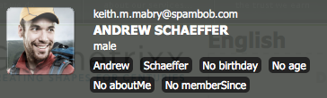
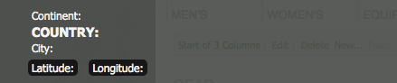

# 客户端上下文详细信息{#client-context-in-detail}

>[!NOTE]
>
>ContextHub已取代客户端上下文。 有关详细信息，请参阅[相关文档](/help/sites-developing/contexthub.md)。

Client Context表示动态组合的用户数据集合。 您可以使用数据来确定在给定情况（内容定位）下要在网页上显示的内容。 这些数据还可用于网站分析，以及页面上的任何JavaScript。

Client Context主要包括以下几个方面：

* 包含用户数据的会话存储。
* 显示用户数据并提供用于模拟用户体验的工具的UI。
* 用于与会话存储区交互的[JavaScript API](/help/sites-developing/ccjsapi.md)。

创建独立会话存储并将其添加到Client Context，或创建与上下文存储组件绑定的会话存储。 Adobe Experience Manager (AEM)安装了多个可以立即使用的上下文存储组件。 您可以使用这些组件作为组件的基础。

有关打开Client Context、配置其显示的信息以及模拟用户体验的信息，请参阅[Client Context](/help/sites-administering/client-context.md)。

## 会话存储 {#session-stores}

Client Context包括包含用户数据的各种会话存储。 存储数据来自以下源：

* 客户端Web浏览器。
* 服务器（请参阅[JSONP存储](/help/sites-administering/client-context.md#main-pars-variable-8)，用于存储来自第三方源的信息）

Client Context Framework提供了一个[JavaScript API](/help/sites-developing/ccjsapi.md)，您可以使用该API与会话存储进行交互以读取和写入用户数据，以及侦听和响应存储事件。 您还可以为用于内容定位或其他目的的用户数据创建会话存储。

会话存储数据保留在客户端上。 Client Context不会将数据写回服务器。 要向服务器发送数据，请使用表单或开发自定义JavaScript。

每个会话存储都是属性值对的集合。 会话存储表示（任何类型的）数据集合，其概念含义可由设计人员、开发人员或两者决定。 以下示例JavaScript代码定义了一个对象，该对象表示会话存储可能包含的配置文件数据：

```
{
  age: 20,
  authorizableId: "aparker@geometrixx.info",
  birthday: "27 Feb 1992",
  email: "aparker@geometrixx.info",
  formattedName: "Alison Parker",
  gender: "female",
  path: "/home/users/geometrixx/aparker@geometrixx.info/profile"
}
```

会话存储可以在浏览器会话间保留，也可以仅针对在其中创建会话的浏览器会话保留。

>[!NOTE]
>
>存储持久性使用浏览器存储或Cookie(`SessionPersistence` Cookie)。 浏览器存储更常见。
>
>当浏览器关闭并重新打开时，可以使用来自持久存储的值加载会话存储。 需要清除浏览器缓存才能删除旧值。

### 上下文存储组件 {#context-store-components}

上下文存储组件是可以添加到客户端上下文的CQ组件。 通常，上下文存储组件显示与其关联的会话存储中的数据。 但是，上下文存储组件显示的信息并不限于会话存储数据。

上下文存储组件可以包括以下项目：

* 在客户端上下文中定义外观的JSP脚本。
* 用于在Sidekick中列出组件的属性。
* 用于配置组件实例的编辑对话框。
* 初始化会话存储的JavaScript。

有关可以添加到上下文存储的已安装上下文存储组件的说明，请参阅[可用的客户端上下文组件](/help/sites-administering/client-context.md#available-client-context-components)。

>[!NOTE]
>
>页面数据不再作为默认组件存在于客户端上下文中。 如果需要，您可以通过编辑客户端上下文，添加&#x200B;**通用存储属性**&#x200B;组件，然后将其配置为将&#x200B;**存储**&#x200B;定义为`pagedata`来添加它。

### 目标内容投放 {#targeted-content-delivery}

配置文件信息还用于传递[目标内容](/help/sites-authoring/content-targeting-touch.md)。

 

## 向页面添加客户端上下文 {#adding-client-context-to-a-page}

将Client Context组件包括在网页的正文部分以启用Client Context。 客户端上下文组件节点的路径是`/libs/cq/personalization/components/clientcontext`。 要包含该组件，请将以下代码添加到页面组件的JSP文件中，该文件位于页面的`body`元素正下方：

```java
<cq:include path="clientcontext" resourceType="cq/personalization/components/clientcontext"/>
```

clientcontext组件使页面加载实施Client Context的客户端库。

* Client Context JavaScript API。
* Client Context框架支持会话存储、事件管理等。
* 已定义的区段。
* 为已添加到客户端上下文的每个上下文存储组件生成的init.js脚本。
* （仅限创作实例）客户端上下文UI。

客户端上下文UI仅在创作实例上可用。

## 扩展客户端上下文 {#extending-client-context}

要扩展Client Context，请创建一个会话存储区，并选择性地显示存储区数据：

* 为内容定位和网站分析所需的用户数据创建会话存储。
* 创建上下文存储组件，使管理员能够配置关联的会话存储，并在Client Context中显示存储数据以进行测试。

>[!NOTE]
>
>如果您拥有（或创建）可以提供数据的`JSONP`服务，则只需使用`JSONP`上下文存储组件并将其映射到JSONP服务即可。 这将处理会话存储。

### 创建会话存储 {#creating-a-session-store}

为必须添加到的数据创建会话存储，并从Client Context中检索。 通常，使用以下过程创建会话存储：

1. 创建具有`categories`属性值`personalization.stores.kernel`的客户端库文件夹。 Client Context会自动加载此类别的客户端库。

1. 配置客户端库文件夹，使其依赖于`personalization.core.kernel`客户端库文件夹。 `personalization.core.kernel`客户端库提供了客户端上下文JavaScript API。

1. 添加创建和初始化会话存储的JavaScript。

在personalization.stores.kernel客户端库中包含JavaScript会导致在加载Client Context Framework时创建存储。

>[!NOTE]
>
>如果要创建作为上下文存储组件一部分的会话存储，则可以将JavaScript放置在组件的init.js.jsp文件中。 在这种情况下，仅当将组件添加到Client Context时，才会创建会话存储。

#### 会话存储的类型 {#types-of-session-stores}

会话存储是在浏览器会话期间创建并可用的，或者保留在浏览器存储或Cookie中。 Client Context JavaScript API定义了多个类，这些类表示两种类型的数据存储：

* ` [CQ_Analytics.SessionStore](/help/sites-developing/ccjsapi.md#cq-analytics-sessionstore)`：这些对象仅驻留在页面DOM中。 数据在页面的生命周期内创建和保留。
* ` [CQ_Analytics.PerstistedSessionStore](/help/sites-developing/ccjsapi.md#cq-analytics-persistedsessionstore)`：这些对象驻留在页面DOM中，并保留在浏览器存储或Cookie中。 数据可在页面和用户会话间使用。

API还提供了专门用于存储JSON数据或JSONP数据的这些类的扩展：

* 仅用于会话的对象：[CQ_Analytics.JSONStore](/help/sites-developing/ccjsapi.md#cq-analytics-jsonstore)和[CQ_Analytics.JSONPStore](/help/sites-developing/ccjsapi.md#cq-analytics-jsonpstore)。

* 持久化对象： [CQ_Analytics.PersistedJSONStore](/help/sites-developing/ccjsapi.md#cq-analytics-persistedjsonstore)和[CQ_Analytics.PersistedJSONPStore](/help/sites-developing/ccjsapi.md#cq-analyics-persistedjsonpstore)。

#### 创建会话存储对象 {#creating-the-session-store-object}

客户端库文件夹的JavaScript将创建和初始化会话存储。 必须使用上下文存储管理器注册会话存储。 以下示例创建并注册[CQ_Analytics.SessionStore](/help/sites-developing/ccjsapi.md#cq-analytics-sessionstore)对象。

```
//Create the session store
if (!CQ_Analytics.MyStore) {
    CQ_Analytics.MyStore = new CQ_Analytics.SessionStore();
    CQ_Analytics.MyStore.STOREKEY = "MYSTORE";
    CQ_Analytics.MyStore.STORENAME = "mystore";
    CQ_Analytics.MyStore.data={};
}
//register the session store
if (CQ_Analytics.ClientContextMgr){
    CQ_Analytics.ClientContextMgr.register(CQ_Analytics.MyStore)
}
```

为了存储JSON数据，以下示例创建并注册一个[CQ_Analytics.JSONStore](/help/sites-developing/ccjsapi.md#cq-analytics-sessionstore)对象。

```
if (!CQ_Analytics.myJSONStore) {
    CQ_Analytics.myJSONStore = CQ_Analytics.JSONStore.registerNewInstance("myjsonstore",{});
}
```

### 创建上下文存储组件 {#creating-a-context-store-component}

创建上下文存储组件以在Client Context中呈现会话存储数据。 创建后，您可以将上下文存储组件拖动到Client Context上以呈现会话存储中的数据。 上下文存储组件由以下项目组成：

* 用于呈现数据的JSP脚本。
* 编辑对话框。
* 用于初始化会话存储的JSP脚本。
* （可选）创建会话存储的客户端库文件夹。 如果组件使用现有会话存储，则无需包含客户端库文件夹。

#### 扩展提供的上下文存储组件 {#extending-the-provided-context-store-components}

AEM提供了可以扩展的genericstore和genericstoreproperties上下文存储组件。 存储数据的结构决定了要扩展的组件：

* 属性值对：扩展`GenericStoreProperties`组件。 此组件自动呈现属性值对的存储。 提供了几个交互点：

   * `prolog.jsp`和`epilog.jsp`：组件交互，允许您在组件呈现之前或之后添加服务器端逻辑。

* 复杂数据：扩展`GenericStore`组件。 您的会话存储需要每当必须呈现组件时都调用的“renderer”方法。 使用以下两个参数调用渲染器函数：

   * `@param {String} store`
要呈现的存储

   * `@param {String} divId`
必须将存储呈现到的div的ID。

>[!NOTE]
>
>所有客户端上下文组件都是通用存储或通用存储属性组件的扩展。 `/libs/cq/personalization/components/contextstores`文件夹中安装了多个示例。

#### 配置Sidekick中的外观 {#configuring-the-appearance-in-sidekick}

编辑Client Context时，上下文存储组件以Sidekick显示。 与所有组件一样，客户端上下文组件的`componentGroup`和`jcr:title`属性决定了组件的组和名称。

默认情况下，`componentGroup`属性值为`Client Context`的所有组件都会出现在Sidekick中。 如果为`componentGroup`属性使用其他值，则必须使用“设计”模式手动将组件添加到Sidekick。

#### 上下文存储组件实例 {#context-store-component-instances}

将上下文存储组件添加到Client Context时，将在`/etc/clientcontext/default/content/jcr:content/stores`下创建一个表示该组件实例的节点。 此节点包含使用组件的编辑对话框配置的属性值。

初始化Client Context时，将处理这些节点。

#### 初始化关联的会话存储 {#initializing-the-associated-session-store}

将init.js.jsp文件添加到组件中以生成JavaScript代码，该代码初始化您的上下文存储组件使用的会话存储。 例如，使用初始化脚本检索组件的配置属性，并使用这些属性填充会话存储。

在创作实例和发布实例上的页面加载上初始化客户端上下文时，生成的JavaScript会添加到页面中。 此JSP在上下文存储组件实例加载和渲染之前执行。

代码必须将文件的mime类型设置为`text/javascript`，否则不会执行。

>[!CAUTION]
>
>init.js.jsp脚本在创作和发布实例上运行，但前提是已将上下文存储组件添加到客户端上下文。

以下过程创建init.js.jsp脚本文件并添加用于设置正确mime类型的代码。 随后是执行存储初始化的代码。

1. 右键单击上下文存储组件节点，然后单击“创建”>“创建文件”。
1. 在“名称”字段中，键入`init.js.jsp`，然后单击“确定”。
1. 在页面顶部，添加以下代码，然后单击“全部保存”。

   ```java
   <%@page contentType="text/javascript" %>
   ```

### 呈现用于genericstoreproperties组件的会话存储数据 {#rendering-session-store-data-for-genericstoreproperties-components}

使用一致的格式在Client Context中显示会话存储数据。

#### 显示属性数据 {#displaying-property-data}

个性化taglib提供了`personalization:storePropertyTag`标记，该标记显示会话存储中的属性值。 要使用标记，请在JSP文件中包含以下代码行：

```xml
<%@taglib prefix="personalization" uri="https://www.day.com/taglibs/cq/personalization/1.0" %>
```

标记具有以下格式：

```xml
<personalization:storePropertyTag propertyName="property_name" store="session_store_name"/>
```

`propertyName`属性是要显示的存储属性的名称。 `store`属性是已注册的存储的名称。 以下示例标记显示`profile`存储的`authorizableId`属性的值：

```xml
<personalization:storePropertyTag propertyName="authorizableId" store="profile"/>
```

#### HTML 结构 {#html-structure}

personalization.ui客户端库文件夹(/etc/clientlibs/foundation/personalization/ui/themes/default)提供了客户端上下文用于设置HTML代码格式的CSS样式。 以下代码说明了用于显示存储数据的建议结构：

```xml
<div class="cq-cc-store">
   <div class="cq-cc-thumbnail">
      <div class="cq-cc-store-property">
           <!-- personalization:storePropertyTag for the store thumbnail image goes here -->
      </div>
   </div>
   <div class="cq-cc-content">
       <div class="cq-cc-store-property cq-cc-store-property-level0">
           <!-- personalization:storePropertyTag for a store property goes here -->
       </div>
       <div class="cq-cc-store-property cq-cc-store-property-level1">
           <!-- personalization:storePropertyTag for a store property goes here -->
       </div>
       <div class="cq-cc-store-property cq-cc-store-property-level2">
           <!-- personalization:storePropertyTag for a store property goes here -->
       </div>
       <div class="cq-cc-store-property cq-cc-store-property-level3">
           <!-- personalization:storePropertyTag for a store property goes here -->
       </div>
   </div>
   <div class="cq-cc-clear"></div>
</div>
```

`/libs/cq/personalization/components/contextstores/profiledata`上下文存储组件使用此结构来显示配置文件会话存储中的数据。 `cq-cc-thumbnail`类放置缩略图图像。 `cq-cc-store-property-level*x*`类将字母数字数据格式化：

* level0、level1和level2是垂直分布的，使用白字体。
* 级别3和任何其他级别水平分布，并使用带有较深背景的白字体。



### 渲染泛型存储组件的会话存储数据 {#rendering-session-store-data-for-genericstore-components}

要使用genericstore组件呈现存储数据，您必须执行以下操作：

* 将personalization：storeRendererTag标记添加到组件JSP脚本中，以标识会话存储的名称。
* 对会话存储类实施渲染方法。

#### 标识泛型存储会话存储 {#identifying-the-genericstore-session-store}

个性化taglib提供了`personalization:storePropertyTag`标记，该标记显示会话存储中的属性值。 要使用标记，请在JSP文件中包含以下代码行：

```xml
<%@taglib prefix="personalization" uri="https://www.day.com/taglibs/cq/personalization/1.0" %>
```

标记具有以下格式：

```java
<personalization:storeRendererTag store="store_name"/>
```

#### 实现会话存储渲染方法 {#implementing-the-session-store-renderer-method}

您的会话存储需要每当必须呈现组件时都调用的“renderer”方法。 使用以下两个参数调用渲染器函数：

* @param{String}存储
要呈现的存储
* @param{String} divId
必须将存储呈现到的div的ID。

## 与会话存储区交互 {#interacting-with-session-stores}

使用JavaScript与会话存储交互。

### 访问会话存储 {#accessing-session-stores}

获取会话存储对象以将数据读取或写入存储。 [CQ_Analytics.ClientContextMgr](/help/sites-developing/ccjsapi.md#cq-analytics-clientcontextmgr)根据存储名称提供对存储的访问权限。 获取后，使用[CQ_Analytics.SessionStore](/help/sites-developing/ccjsapi.md#cq-analytics-sessionstore)或[CQ_Analytics.PersistedSessionStore](/help/sites-developing/ccjsapi.md#cq-analytics-persistedsessionstore)的方法与存储数据进行交互。

以下示例获取`profile`存储，然后从存储中检索`formattedName`属性。

```
function getName(){
   var profilestore = CQ_Analytics.ClientContextMgr.getRegisteredStore("profile");
   if(profilestore){
      return profilestore.getProperty("formattedName", false);
   } else {
      return null;
   }
}
```

### 创建侦听器以响应会话存储更新 {#creating-a-listener-to-react-to-a-session-store-update}

会话会存储触发事件，因此可以添加侦听器并根据这些事件触发事件。

会话存储基于`Observable`模式构建。 它们扩展了提供` [addListener](/help/sites-developing/ccjsapi.md#addlistener-event-fct-scope)`方法的[`CQ_Analytics.Observable`](/help/sites-developing/ccjsapi.md#cq-analytics-observable)。

以下示例将侦听器添加到`profile`会话存储的`update`事件。

```
var profileStore = ClientContextMgr.getRegisteredStore("profile");
if( profileStore ) {
  //callback execution context
  var executionContext = this;

  //add "update" event listener to store
  profileStore.addListener("update",function(store, property) {
    //do something on store update

  },executionContext);
}
```

### 检查是否已定义和初始化会话存储 {#checking-that-a-session-store-is-defined-and-initialized}

在加载会话存储并使用数据初始化会话存储之前，会话存储不可用。 以下因素可能会影响会话存储可用性的时间：

* 页面正在加载
* JavaScript正在加载
* JavaScript执行时间
* XHR请求的响应时间
* 对会话存储区进行动态更改

使用[CQ_Analytics.ClientContextUtils](/help/sites-developing/ccjsapi.md#cq-analytics-clientcontextutils)对象的[onStoreRegistered](/help/sites-developing/ccjsapi.md#onstoreregistered-storename-callback)和[onStoreInitialized](/help/sites-developing/ccjsapi.md#onstoreinitialized-storename-callback-delay)方法，仅在会话存储可用时访问它们。 这些方法使您能够注册对会话注册和初始化事件做出反应的事件侦听器。

>[!CAUTION]
>
>如果您依赖于其他商店，则必须满足从未注册该商店的情况。

以下示例使用`profile`会话存储区的`onStoreRegistered`事件。 注册存储后，侦听器将添加到会话存储的`update`事件。 更新存储后，页面上`<div class="welcome">`元素的内容将使用`profile`存储中的名称进行更新。

```
//listen for the store registration
CQ_Analytics.ClientContextUtils.onStoreRegistered("profile", listen);

//listen for the store's update event
function listen(){
 var profilestore = CQ_Analytics.ClientContextMgr.getRegisteredStore("profile");
    profilestore.addListener("update",insertName);
}

//insert the welcome message
function insertName(){
 $("div.welcome").text("Welcome "+getName());
}

//obtain the name from the profile store
function getName(){
 var profilestore = CQ_Analytics.ClientContextMgr.getRegisteredStore("profile");
 if(profilestore){
  return profilestore.getProperty("formattedName", false);
    } else {
        return null;
    }
}
```

### 从sessionpersistence Cookie排除属性 {#excluding-a-property-from-the-sessionpersistence-cookie}

要阻止保留`PersistedSessionStore`的属性（即从`sessionpersistence` Cookie中将其排除），请将该属性添加到保留会话存储的非保留属性列表中。

查看` [CQ_Analytics.PersistedSessionStore.setNonPersisted(propertyName)](/help/sites-developing/ccjsapi.md#setnonpersisted-name)`

```
CQ_Analytics.ClientContextUtils.onStoreRegistered("surferinfo", function(store) {
  //this will exclude the browser, OS and resolution properties of the surferinfo session store from the
  store.setNonPersisted("browser");
  store.setNonPersisted("OS");
  store.setNonPersisted("resolution");
});
```

## 配置设备滑块 {#configuring-the-device-slider}

### 条件 {#conditions}

当前页面必须具有对应的移动设备页面；仅当页面具有配置了移动设备转出配置的LiveCopy时（`rolloutconfig.path.toLowerCase`包含`mobile`）才会确定此情况。

#### 配置 {#configuration}

从桌面页面切换到移动设备等效页面时：

* 加载移动设备页面的DOM。
* 包含内容的主`div`（必需）将被提取并插入到当前桌面页面。

* 必须手动配置加载的CSS和正文类。

例如：

```
window.CQMobileSlider["geometrixx-outdoors"] = {
  //CSS used by desktop that need to be removed when mobile
  DESKTOP_CSS: [
    "/etc/designs/${app}/clientlibs_desktop_v1.css"
  ],

  //CSS used by mobile that need to be removed when desktop
  MOBILE_CSS: [
    "/etc/designs/${app}/clientlibs_mobile_v1.css"
  ],

  //id of the content that needs to be removed when mobile
  DESKTOP_MAIN_ID: "main",

  //id of the content that needs to be removed when desktop
  MOBILE_MAIN_ID: "main",

  //body classes used by desktop that need to be removed when mobile
  DESKTOP_BODY_CLASS: [
    "page"
  ],

  //body classes used by mobile that need to be removed when desktop
  MOBILE_BODY_CLASS: [
    "page-mobile"
  ]
};
```

## 示例：创建自定义上下文存储组件 {#example-creating-a-custom-context-store-component}

在此示例中，您将创建一个上下文存储组件，该组件从外部服务检索数据并将其存储在会话存储中：

* 扩展genericstoreproperties组件。
* 使用CQ_Analytics.JSONPStore JavaScript对象初始化存储。
* 调用JSONP服务以检索数据并将其添加到存储中。
* 在Client Context中呈现数据。

### 添加地理位置组件 {#add-the-geoloc-component}

创建CQ应用程序并添加geoloc组件。

1. 在Web浏览器([https://localhost:4502/crx/de](https://localhost:4502/crx/de))中打开CRXDE Lite。
1. 右键单击`/apps`文件夹，然后单击“创建”>“创建文件夹”。 指定`myapp`的名称，然后单击“确定”。
1. 同样，在`myapp`下创建名为`contextstores`的文件夹。 ”
1. 右键单击`/apps/myapp/contextstores`文件夹，然后单击“创建”>“创建组件”。 指定以下属性值，然后单击“下一步”：

   * 标签： geoloc
   * 标题：位置存储
   * 超级类型：cq/personalization/components/contextstores/genericstoreproperties
   * 组：客户端上下文

1. 在“创建组件”对话框中，单击每一页上的“下一步”，直到启用“确定”按钮，然后单击“确定”。
1. 单击“全部保存”。

### 创建“地理位置编辑”对话框 {#create-the-geoloc-edit-dialog}

上下文存储组件需要一个“编辑”对话框。 地理位置编辑对话框包含一条静态消息，指示没有要配置的属性。

1. 右键单击`/libs/cq/personalization/components/contextstores/genericstoreproperties/dialog`节点，然后单击“复制”。
1. 右键单击`/apps/myapp/contextstores/geoloc`节点，然后单击“粘贴”。
1. 删除/apps/myapp/contextstores/geoloc/dialog/items/items/tab1/items节点下的所有子节点：

   * 存储
   * 属性
   * 缩略图

1. 右键单击`/apps/myapp/contextstores/geoloc/dialog/items/items/tab1/items`节点，然后单击“创建”>“创建节点”。 指定以下属性值，然后单击“确定”：

   * 名称：静态
   * 类型：cq：Widget

1. 将以下属性添加到节点：

   | 名称 | 类型 | 价值 |
   |---|---|---|
   | cls | 字符串 | x-form-fieldset-description |
   | text | 字符串 | geoloc组件无需配置。 |
   | xtype | 字符串 | 静态 |

1. 单击“全部保存”。

   

### 创建初始化脚本 {#create-the-initialization-script}

将init.js.jsp文件添加到geoloc组件中，并使用它来创建会话存储、检索位置数据并将其添加到存储中。

init.js.jsp文件在页面加载Client Context时执行。 此时，已加载Client Context JavaScript API并且可供您的脚本使用。

1. 右键单击/apps/myapp/contextstores/geoloc节点，然后单击“创建”>“创建文件”。 指定init.js.jsp的名称，然后单击“确定”。
1. 将以下代码添加到页面顶部，然后单击“全部保存”。

   ```java
   <%@page contentType="text/javascript;charset=utf-8" %><%
   %><%@include file="/libs/foundation/global.jsp"%><%
   log.info("***** initializing geolocstore ****");
   String store = "locstore";
   String jsonpurl = "https://api.wipmania.com/jsonp?callback=${callback}";
   
   %>
   var locstore = CQ_Analytics.StoreRegistry.getStore("<%= store %>");
   if(!locstore){
    locstore = CQ_Analytics.JSONPStore.registerNewInstance("<%= store %>", "<%= jsonpurl %>",{});
   }
   <% log.info(" ***** done initializing geoloc ************"); %>
   ```

### 呈现geoloc会话存储数据 {#render-the-geoloc-session-store-data}

将代码添加到geoloc组件的JSP文件中，以在Client Context中呈现存储数据。



1. 在CRXDE Lite中，打开`/apps/myapp/contextstores/geoloc/geoloc.jsp`文件。
1. 在存根代码下添加以下HTML代码：

   ```xml
   <%@taglib prefix="personalization" uri="https://www.day.com/taglibs/cq/personalization/1.0" %>
   <div class="cq-cc-store">
      <div class="cq-cc-content">
          <div class="cq-cc-store-property cq-cc-store-property-level0">
              Continent: <personalization:storePropertyTag propertyName="address/continent" store="locstore"/>
          </div>
          <div class="cq-cc-store-property cq-cc-store-property-level1">
              Country: <personalization:storePropertyTag propertyName="address/country" store="locstore"/>
          </div>
          <div class="cq-cc-store-property cq-cc-store-property-level2">
              City: <personalization:storePropertyTag propertyName="address/city" store="locstore"/>
          </div>
          <div class="cq-cc-store-property cq-cc-store-property-level3">
              Latitude: <personalization:storePropertyTag propertyName="latitude" store="locstore"/>
          </div>
          <div class="cq-cc-store-property cq-cc-store-property-level4">
              Longitude: <personalization:storePropertyTag propertyName="longitude" store="locstore"/>
          </div>
      </div>
       <div class="cq-cc-clear"></div>
   </div>
   ```

1. 单击“全部保存”。

### 将组件添加到客户端上下文 {#add-the-component-to-client-context}

将位置存储组件添加到客户端上下文，以便在页面加载时进行初始化。

1. 在创作实例([https://localhost:4502/content/geometrixx-outdoors/en.html](https://localhost:4502/content/geometrixx-outdoors/en.html))上打开Geometrixx Outdoors主页。
1. 单击Ctrl-Alt-c (windows)或control-option-c (Mac)以打开客户端上下文。
1. 单击Client Context顶部的编辑图标以打开Client Context Designer。

   

1. 将位置存储组件拖动到客户端上下文。

### 请参阅客户端上下文中的位置信息 {#see-the-location-information-in-client-context}

在编辑模式下打开Geometrixx Outdoors主页，然后打开Client Context以查看位置存储组件中的数据。

1. 打开Geometrixx Outdoors网站的英文页面。 ([https://localhost:4502/content/geometrixx-outdoors/en.html](https://localhost:4502/content/geometrixx-outdoors/en.html))
1. 要打开Client Context，请按Ctrl-Alt-c (windows)或control-option-c (Mac)。

## 创建自定义的客户端上下文 {#creating-a-customized-client-context}

要创建第二个客户端上下文，请复制分支：

`/etc/clientcontext/default`

* 子文件夹：
  `/content`
包含自定义客户端上下文的内容。

* 文件夹：
  `/contextstores`
允许您为上下文存储定义不同的配置。

要使用自定义的客户端上下文，请编辑属性
`path`
客户端上下文组件的设计样式中（如页面模板中所示）。 例如，作为标准位置：
`/libs/cq/personalization/components/clientcontext/design_dialog/items/path`
