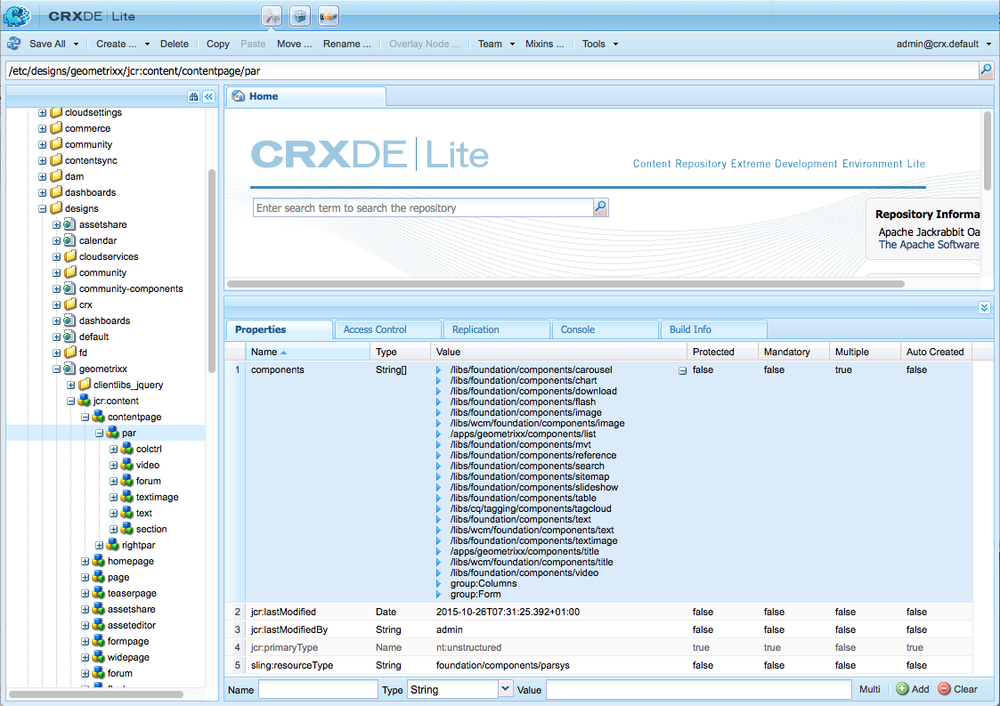
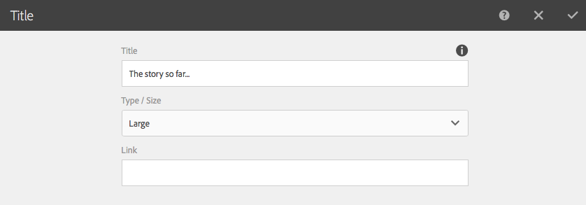

# Adobe Experience Manager (AEM)组件 — 基础知识{#aem-components-the-basics}

开始开发新组件时，您需要了解其结构和配置的基础知识。

此过程包括阅读相关理论，并查看标准AEM实例中的各种组件实现。 尽管AEM已转移到新的标准、现代、触屏优化UI，但它继续支持经典UI，这个事实使得后一种方法略微复杂化。

## 概述 {#overview}

本节将介绍关键概念和问题，并介绍开发您自己的组件时所需的详细信息。

### 规划 {#planning}

在开始实际配置组件或对其进行编码之前，您应该询问：

* 您到底需要新组件做什么？
   * 明确的规范有助于开发、测试和移交的所有阶段。 详细信息可能会随着时间的推移而更改，但规范可以更新（尽管更改也应记录在案）。
* 您是需要从头开始创建组件，还是可以从现有组件继承基础知识？
   * 不需要重新发明轮子。
   * AEM提供了多种机制，可让您从其他组件定义继承和扩展详细信息，包括覆盖、叠加和[Sling资源合并器](/help/sites-developing/sling-resource-merger.md)。
* 您的组件是否需要逻辑才能选择或处理内容？
   * 逻辑应该与用户界面层分开。 HTL旨在帮助确保做到这一点。
* 您的组件是否需要CSS格式？
   * CSS格式应与组件定义分开。 定义命名HTML元素的约定，以便您可以通过外部CSS文件修改这些约定。
* 我应该考虑哪些安全方面？
   * 有关更多详细信息，请参阅[安全核对清单 — 开发最佳实践](/help/sites-administering/security-checklist.md#development-best-practices)。

### 触屏优化vs经典UI {#touch-enabled-vs-classic-ui}

在有关开发组件的任何严肃讨论开始之前，您必须知道作者使用的是哪种UI：

* **触屏优化UI**
  [标准用户界面](/help/sites-developing/touch-ui-concepts.md)基于Adobe Experience Cloud的统一用户体验，使用[Coral UI](/help/sites-developing/touch-ui-concepts.md#coral-ui)和[Granite UI](/help/sites-developing/touch-ui-concepts.md#granite-ui)的基础技术。
* **经典UI**
基于ExtJS技术的用户界面，AEM 6.4已弃用该技术。

有关更多详细信息，请参阅[客户的UI界面建议](/help/sites-deploying/ui-recommendations.md)。

可以实施组件来支持触屏UI和/或经典UI。 在查看标准实例时，您还会看到最初为经典UI或触屏UI或两者设计的现成组件。

本页介绍了这两个函数的基本知识以及如何识别它们。

>[!NOTE]
>
>Adobe建议使用触屏优化UI以从最新技术中获益。 [AEM现代化工具](modernization-tools.md)可以简化迁移。

### 内容逻辑和渲染标记  {#content-logic-and-rendering-markup}

Adobe建议将负责标记和呈现的代码与控制用于选择组件内容的逻辑的代码分开。

[HTL](https://experienceleague.adobe.com/docs/experience-manager-htl/content/overview.html)支持此理念，这是一种模板化语言，旨在确保使用真正的编程语言来定义基础业务逻辑。 此（可选）逻辑可通过特定命令从HTL调用。 此机制会突出显示为给定视图调用的代码，如有必要，还允许为同一组件的不同视图使用特定逻辑。

### HTL与JSP {#htl-vs-jsp}

HTL是随AEM 6.0引入的HTML模板语言。

由于在开发您自己的组件时应该使用[HTL](https://experienceleague.adobe.com/docs/experience-manager-htl/content/overview.html)还是JSP (Java™ Server Pages)，因此对于HTL的讨论应该非常直接，因为HTL现在是AEM推荐的脚本语言。

HTL和JSP都可用于为经典用户界面和触屏优化UI开发组件。 尽管可能会倾向于认为HTL仅适用于经典UI的触屏UI和JSP，但这是一个误解，并且更多是由于时间的原因。 大约在同一时期，触屏优化UI和HTL合并到了AEM中。 由于HTL现在是推荐语言，因此它被用于新组件，这些组件倾向于用于触屏优化UI。

>[!NOTE]
>
>Granite UI Foundation表单字段除外（在对话框中使用）。 这些仍需要使用JSP。

### 开发您自己的组件 {#developing-your-own-components}

要为相应的UI创建自己的组件，请参阅（阅读本页后）：

* [触屏UI的AEM组件](/help/sites-developing/developing-components.md)
* [经典UI的AEM组件](/help/sites-developing/developing-components-classic.md)

快速入门方法是复制现有组件，然后进行所需的更改。 要了解如何创建自己的组件并将它们添加到段落系统，请参阅：

* [正在开发组件](/help/sites-developing/developing-components-samples.md)（侧重于支持触摸的UI）

### 将组件移动到发布实例 {#moving-components-to-the-publish-instance}

呈现内容的组件必须部署在与内容相同的AEM实例上。 因此，必须在发布实例上部署所有用于在创作实例上创作和渲染页面的组件。 部署后，组件可用于呈现激活的页面。

使用以下工具将组件移至发布实例：

* [使用包管理器](/help/sites-administering/package-manager.md)将组件添加到包并将它们移动到另一个AEM实例。
* [使用激活树复制工具](/help/sites-authoring/publishing-pages.md#manage-publication)复制组件。

>[!NOTE]
>
>这些机制还可用于在其他实例之间传输组件，例如，从开发实例传输到测试实例。

### 从开始起要识别的组件 {#components-to-be-aware-of-from-the-start}

* 页面:

   * AEM具有&#x200B;*page*&#x200B;组件(`cq:Page`)。
   * 这是对内容管理很重要的一种特定类型的资源。
      * 页面对应于包含您网站内容的网页。

* 段落系统：

   * 段落系统是网站的一个关键部分，因为它管理着一系列段落。 用于保存和构建保存实际内容的各个组件。
   * 您可以在段落系统中创建、移动、复制和删除段落。
   * 您还可以选择可在特定段落系统中使用的组件。
   * 标准实例中有各种可用的段落系统（例如，`parsys`、` [responsivegrid](/help/sites-authoring/responsive-layout.md)`）。

## 结构 {#structure}

AEM组件的结构强大而灵活，主要考虑因素包括：

* 资源类型
* 组件定义
* 组件的属性和子节点
* 对话框
* 设计对话框
* 组件可用性
* 组件及其创建的内容

### 资源类型 {#resource-type}

结构的一个关键元素是资源类型。

* 内容结构声明意图。
* 资源类型实现它们。

这是一个抽象，有助于确保即使当外观和感觉随时间变化时，意图仍会随时间而改变。

### 组件定义 {#component-definition}

#### 组件基础知识 {#component-basics}

组件的定义可细分如下：

* AEM组件基于[Sling](https://sling.apache.org/documentation.html)。
* AEM组件（通常）位于以下位置：

   * HTL： `/libs/wcm/foundation/components`
   * JSP： `/libs/foundation/components`

* 项目/站点特定的组件（通常）位于以下位置：

   * `/apps/<myApp>/components`

* AEM标准组件定义为`cq:Component`并具有关键元素：

   * jcr属性：

     jcr属性的列表；这些是变量的，有些可能是可选的，但组件节点的基本结构、其属性和子节点由`cq:Component`定义定义

   * 资源：

     这些定义组件使用的静态元素。

   * 脚本：

  用于实施组件结果实例的行为。

* **根节点**：

   * `<mycomponent> (cq:Component)` — 组件的层次结构节点。

* **重要属性**：

   * `jcr:title` — 组件标题；例如，在组件浏览器或Sidekick中列出组件时用作标签。
   * `jcr:description` — 组件的描述；可用作组件浏览器或Sidekick中的鼠标悬停提示。
   * 经典UI：

      * `icon.png` — 此组件的图标。
      * `thumbnail.png` — 此组件在段落系统中列出时显示的图像。

   * 触屏 UI

      * 有关详细信息，请参阅触屏UI中的[组件图标](/help/sites-developing/components-basics.md#component-icon-in-touch-ui)。

* **重要子节点**：

   * `cq:editConfig (cq:EditConfig)` — 定义组件的编辑属性，并使组件显示在组件浏览器或Sidekick中。

     注意：如果组件有对话框，它会自动显示在组件浏览器或Sidekick中，即使cq：editConfig不存在也是如此。

   * `cq:childEditConfig (cq:EditConfig)` — 控制未定义自身`cq:editConfig`的子组件的作者UI方面。
   * 触屏优化UI：

      * `cq:dialog` (`nt:unstructured`) — 此组件的对话框。 定义允许用户配置组件和/或编辑内容的界面。
      * `cq:design_dialog` (`nt:unstructured`) — 正在编辑此组件的设计

   * 经典UI：

      * `dialog` (`cq:Dialog`) — 此组件的对话框。 定义允许用户配置组件和/或编辑内容的界面。
      * `design_dialog` (`cq:Dialog`) — 正在编辑此组件的设计。

#### 触屏UI中的组件图标 {#component-icon-in-touch-ui}

组件的图标或缩写在开发人员创建组件时通过组件的JCR属性定义。 这些属性的计算顺序如下，并且使用找到的第一个有效属性。

1. `cq:icon` — 字符串属性，指向要在组件浏览器中显示的[Coral UI库](https://developer.adobe.com/experience-manager/reference-materials/6-5/coral-ui/coralui3/Coral.Icon.html)中的标准图标
   * 使用Coral图标的HTML属性的值。
1. `abbreviation` — 用于自定义组件浏览器中组件名称的缩写的字符串属性
   * 缩写应限制为两个字符。
   * 提供空字符串将生成`jcr:title`属性的前两个字符的缩写。
      * 例如，“Im”表示“图像”
      * 本地化的标题用于构建缩写。
   * 仅在该组件具有`abbreviation_commentI18n`属性（随后用作翻译提示）时才翻译缩写。
1. `cq:icon.png`或`cq:icon.svg` — 此组件的图标，显示在组件浏览器中
   * 20 x 20像素是标准组件的图标大小。
      * 较大的图标会被缩小（客户端）。
   * 推荐的颜色为rgb(112， 112， 112) > #707070
   * 标准组件图标的背景透明。
   * 仅支持`.png`和`.svg`文件。
   * 如果通过Eclipse插件从文件系统导入，则文件名必须以`_cq_icon.png`或`_cq_icon.svg`形式转义。
   * 如果同时存在`.png`和`.svg`，则前导词将优先于

如果在组件中未找到以上任何属性（`cq:icon`、`abbreviation`、`cq:icon.png`或`cq:icon.svg`）：

* 系统在`sling:resourceSuperType`属性之后的超级组件上搜索相同的属性。
* 如果在超级组件级别上未找到任何内容或发现空缩写，则系统将根据当前组件的`jcr:title`属性的第一个字母构建缩写。

要取消从超级组件继承图标，在组件上设置空`abbreviation`属性将还原为默认行为。

[组件控制台](/help/sites-authoring/default-components-console.md#component-details)显示如何定义特定组件的图标。

#### SVG图标示例 {#svg-icon-example}

```xml
<?xml version="1.0" encoding="utf-8"?>
<!DOCTYPE svg PUBLIC "-//W3C//DTD SVG 1.1//EN" "https://www.w3.org/Graphics/SVG/1.1/DTD/svg11.dtd">
<svg version="1.1" id="Layer_1" xmlns="https://www.w3.org/2000/svg" xmlns:xlink="https://www.w3.org/1999/xlink" x="0px" y="0px"
     width="20px" height="20px" viewBox="0 0 20 20" enable-background="new 0 0 20 20" xml:space="preserve">
    <ellipse cx="5" cy="5" rx="3" ry="3" fill="#707070"/>
    <ellipse cx="15" cy="5" rx="4" ry="4" fill="#707070"/>
    <ellipse cx="5" cy="15" rx="5" ry="5" fill="#707070"/>
    <ellipse cx="15" cy="15" rx="4" ry="4" fill="#707070"/>
</svg>
```

### 组件的属性和子节点 {#properties-and-child-nodes-of-a-component}

定义组件所需的许多节点/属性对这两个UI都是通用的，并且这些节点/属性之间的差异保持独立，以便您的组件可以在两个环境中工作。

组件是`cq:Component`类型的节点，具有以下属性和子节点：

<table>
 <tbody>
  <tr>
   <td><strong>名称 <br /> </strong></td>
   <td><strong>类型 <br /> </strong></td>
   <td><strong>描述 <br /> </strong></td>
  </tr>
  <tr>
   <td>.<br /> </td>
   <td><code>cq:Component</code></td>
   <td>当前组件。 组件为节点类型<code>cq:Component</code>.<br /> </td>
  </tr>
  <tr>
   <td><code>componentGroup</code></td>
   <td><code>String</code></td>
   <td>在组件浏览器（触屏UI）或Sidekick（经典UI）中可选择组件的组。<br />值<code>.hidden</code>用于无法从UI选择的组件，例如实际的段落系统。</td>
  </tr>
  <tr>
   <td><code>cq:isContainer</code></td>
   <td><code>Boolean</code></td>
   <td>指示组件是否为容器组件，因此可以包含其他组件，例如段落系统。</td>
  </tr>
  <tr>
   <td> </td>
   <td> </td>
   <td> </td>
  </tr>
  <tr>
   <td><code>cq:dialog</code></td>
   <td><code>nt:unstructured</code><br /> </td>
   <td>触屏UI的“编辑”对话框定义。</td>
  </tr>
  <tr>
   <td><code>dialog</code></td>
   <td><code>cq:Dialog</code></td>
   <td>经典UI的“编辑”对话框的定义。</td>
  </tr>
  <tr>
   <td><code>cq:design_dialog</code></td>
   <td><code>nt:unstructured</code></td>
   <td>触屏UI的“设计”对话框定义。</td>
  </tr>
  <tr>
   <td><code>design_dialog</code></td>
   <td><code>cq:Dialog </code></td>
   <td>经典UI的设计对话框定义。<br /> </td>
  </tr>
  <tr>
   <td><code>dialogPath</code></td>
   <td><code>String</code></td>
   <td>在组件没有对话框节点时用于覆盖此情况的对话框的路径。<br /> </td>
  </tr>
  <tr>
   <td> </td>
   <td> </td>
   <td> </td>
  </tr>
  <tr>
   <td><code>cq:cellName</code></td>
   <td><code>String</code></td>
   <td>如果设置，此属性将被视为单元格ID。<br /> </td>
  </tr>
  <tr>
   <td><code>cq:childEditConfig</code></td>
   <td><code>cq:EditConfig</code></td>
   <td>当组件是容器（例如，段落系统）时，它会驱动子节点的编辑配置。<br /> </td>
  </tr>
  <tr>
   <td><code>cq:editConfig</code></td>
   <td><code>cq:EditConfig</code></td>
   <td><a href="#edit-behavior">编辑组件</a>的配置。<br /> </td>
  </tr>
  <tr>
   <td><code>cq:htmlTag</code></td>
   <td><code>nt:unstructured </code></td>
   <td>返回添加到周围html标记的其他标记属性。 允许向自动生成的div添加属性。</td>
  </tr>
  <tr>
   <td><code>cq:noDecoration</code></td>
   <td><code>Boolean</code></td>
   <td>如果为true，则组件不会使用自动生成的div和css类渲染。<br /> </td>
  </tr>
  <tr>
   <td><code>cq:template</code></td>
   <td><code>nt:unstructured</code></td>
   <td>如果找到，则在从组件浏览器或Sidekick添加组件时，此节点将用作内容模板。</td>
  </tr>
  <tr>
   <td><code>cq:templatePath</code></td>
   <td><code>String</code></td>
   <td>从组件浏览器或Sidekick添加组件时用作内容模板的节点的路径。 这必须是绝对路径，而不是相对于组件节点的路径。<br />除非您希望重复使用在其他位置已提供的内容，否则不是必需的，<code>cq:template</code>就足够了（请参阅下文）。</td>
  </tr>
  <tr>
   <td><code>jcr:created</code></td>
   <td><code>Date</code></td>
   <td>创建组件的日期。<br /> </td>
  </tr>
  <tr>
   <td><code>jcr:description</code></td>
   <td><code>String</code></td>
   <td>组件的说明。<br /> </td>
  </tr>
  <tr>
   <td><code>jcr:title</code></td>
   <td><code>String</code></td>
   <td>组件的标题。<br /> </td>
  </tr>
  <tr>
   <td><code>sling:resourceSuperType</code></td>
   <td><code>String</code></td>
   <td>设置后，该组件将继承该组件。<br /> </td>
  </tr>
  <tr>
   <td><code>virtual</code></td>
   <td><code>sling:Folder</code></td>
   <td>允许创建虚拟组件。 要查看示例，请查看联系人组件：<br /> <code>/libs/foundation/components/profile/form/contact</code></td>
  </tr>
  <tr>
   <td><code>&lt;breadcrumb.jsp&gt;</code></td>
   <td><code>nt:file</code><br /> </td>
   <td>脚本文件。<br /> </td>
  </tr>
  <tr>
   <td><code>icon.png</code></td>
   <td><code>nt:file</code></td>
   <td>组件图标，显示在Sidekick中的标题旁边。<br /> </td>
  </tr>
  <tr>
   <td><code>thumbnail.png</code></td>
   <td><code>nt:file</code></td>
   <td>将组件从Sidekick拖放到适当位置时显示的可选缩略图。<br /> </td>
  </tr>
 </tbody>
</table>

如果查看&#x200B;**Text**&#x200B;组件（任一版本），您可以看到以下元素：

* HTL (`/libs/wcm/foundation/components/text`)

  

* JSP (`/libs/foundation/components/text`)

  

特别感兴趣的物业包括：

* `jcr:title` — 组件的标题；这可用于识别组件，例如，它显示在组件浏览器或sidekick内的组件列表中
* `jcr:description` — 组件的描述；可以用作sidekick中组件列表的鼠标悬停提示
* `sling:resourceSuperType`：这表示扩展组件时的继承路径（通过覆盖定义）

特别感兴趣的子节点包括：

* `cq:editConfig` (`cq:EditConfig`) — 这控制视觉方面；例如，它可以定义条形图或小部件的外观，或者可以添加自定义控件
* `cq:childEditConfig` (`cq:EditConfig`) — 这控制没有自己的定义的子组件的可视方面
* 触屏优化UI：
   * `cq:dialog` (`nt:unstructured`) — 定义用于编辑此组件内容的对话框
   * `cq:design_dialog` (`nt:unstructured`) — 指定此组件的设计编辑选项
* 经典UI：
   * `dialog` (`cq:Dialog`) — 定义用于编辑此组件内容的对话框（特定于经典UI）
   * `design_dialog` (`cq:Dialog`) — 指定此组件的设计编辑选项
   * `icon.png` — 在Sidekick中用作组件图标的图形文件
   * `thumbnail.png` — 从Sidekick拖动组件时用作组件缩略图的图形文件

### 对话框 {#dialogs}

对话框是组件的关键元素，因为它们为作者提供了一个界面来配置该组件并提供输入内容。

根据组件的复杂性，您的对话框可能需要一个或多个选项卡 — 缩短对话框并对输入字段进行排序。

对话框定义特定于UI：

>[!NOTE]
>
>* 为兼容起见，当没有为触控式UI定义对话框时，触控式UI可以使用经典UI对话框的定义。
>* 还提供了[AEM现代化工具](/help/sites-developing/modernization-tools.md)，以帮助您扩展/转换仅具有为经典UI定义的对话框的组件。
>

* 触屏优化UI
   * `cq:dialog` (`nt:unstructured`)节点：
      * 定义用于编辑此组件内容的对话框
      * 特定于触屏UI
      * 是使用Granite UI组件定义的
      * 具有属性`sling:resourceType`，作为标准Sling内容结构
      * 可以具有属性`helpPath`来定义在选择“帮助”图标（`?`图标）时访问的上下文相关帮助资源（绝对路径或相对路径）。
         * 对于开箱即用的组件，这通常会引用文档中的页面。
         * 如果未指定`helpPath`，则会显示默认URL（文档概述页面）。

  

  在该对话框中，将定义各个字段：

  

* 经典 UI
   * `dialog` (`cq:Dialog`)节点
      * 定义用于编辑此组件内容的对话框
      * 特定于经典UI
      * 使用ExtJS构件定义
      * 具有引用ExtJS的属性`xtype`
      * 可以具有属性`helpPath`来定义在选择&#x200B;**帮助**&#x200B;按钮时访问的上下文相关帮助资源（绝对或相对路径）。
         * 对于开箱即用的组件，这通常会引用文档中的页面。
         * 如果未指定`helpPath`，则会显示默认URL（文档概述页面）。

  

  在该对话框中，将定义各个字段：

  

  在Classic对话框中：

   * 您可以将该对话框创建为`cq:Dialog`，这将提供单个选项卡 — 就像在文本组件中一样；或者，如果您需要多个选项卡（就像在文本时间组件中一样），则可以将该对话框定义为`cq:TabPanel`。
   * `cq:WidgetCollection` (`items`)用于为输入字段(`cq:Widget`)或其他选项卡(`cq:Widget`)提供基数。 此层次结构可以扩展。

### 设计对话框 {#design-dialogs}

“设计”对话框与用于编辑和配置内容的对话框类似，但它们为作者提供了用于配置和提供该组件的设计详细信息的界面。

[设计对话框在设计模式](/help/sites-authoring/default-components-designmode.md)下可用，但并非所有组件都需要它们，例如，**标题**&#x200B;和&#x200B;**图像**&#x200B;都具有设计对话框，而&#x200B;**文本**&#x200B;没有。

段落系统的“设计”对话框（例如，parsys）是一种特殊情况，因为它允许用户在页面上选择特定的其他组件（从组件浏览器或sidekick）。

### 将组件添加到段落系统 {#adding-your-component-to-the-paragraph-system}

定义组件后，必须使其可用。 要使组件可在段落系统中使用，您可以：

1. 为页面打开[设计模式](/help/sites-authoring/default-components-designmode.md)并启用所需的组件。
1. 将所需的组件添加到模板定义的`components`属性中：

   `/etc/designs/<*yourProject*>/jcr:content/<*yourTemplate*>/par`

   例如，请参阅：

   `/etc/designs/geometrixx/jcr:content/contentpage/par`

   

### 组件及其创建的内容 {#components-and-the-content-they-create}

如果您在页面上创建和配置&#x200B;**标题**&#x200B;组件的实例： `<content-path>/Prototype.html`

* 触屏优化UI

  

* 经典 UI

  

然后，您可以查看在存储库中创建的内容的结构：


特别是，如果您查看&#x200B;**标题**&#x200B;的实际文本：

* 定义（适用于两个UI）具有属性`name`= `./jcr:title`

   * `/libs/foundation/components/title/cq:dialog/content/items/column/items/title`
   * `/libs/foundation/components/title/dialog/items/title`

* 在内容中，这将生成包含作者内容的属性`jcr:title`。

定义的属性取决于各个定义。 尽管它们可能比上述情况更加复杂，但它们仍然遵循同样的基本原则。

## 组件层次结构和继承 {#component-hierarchy-and-inheritance}

AEM中的组件遵循三个不同的层次结构：

* **资源类型层次结构**

  用于使用属性`sling:resourceSuperType`扩展组件。 这将使组件能够继承。 例如，文本组件继承标准组件的各种属性。

   * 脚本（由Sling解析）
   * 对话框
   * 描述（包括缩略图图像和图标）

* **容器层次结构**

  这用于向子组件填充配置设置，并且最常用于Parsys场景。

  例如，可以在父组件上定义编辑栏按钮、控件集布局（编辑栏、变换）和对话框布局（内联、浮动）的配置设置并传播到子组件。

  `cq:editConfig`和`cq:childEditConfig`中的配置设置（与编辑功能相关）已传播。

* **包含层次结构**

  这是在运行时由include序列强制实施的。

  Designer使用此层级，该层级反过来充当呈现的各个设计方面的基础；包括布局信息、css信息、parsys中的可用组件等。

## 编辑行为 {#edit-behavior}

本节介绍如何配置组件的编辑行为。 这包括各种属性，例如组件可用的操作、就地编辑器的特征以及与组件上的事件相关的侦听器。

尽管存在某些特定差异，但配置对于触屏优化UI和经典UI都是通用的。

组件的编辑行为是通过在组件节点（类型为`cq:Component`）下添加类型为`cq:EditConfig`的`cq:editConfig`节点以及添加特定属性和子节点来配置的。 以下属性和子节点可用：

* [`cq:editConfig`节点属性](#configuring-with-cq-editconfig-properties)：

   * `cq:actions` (`String array`)：定义可以对组件执行的操作。
   * `cq:layout` (`String`)：定义如何在经典UI中编辑组件。
   * `cq:dialogMode` (`String`)：定义如何在经典UI中打开组件对话框

      * 在触屏优化UI中，对话框在桌面模式下始终处于浮动状态，并在移动设备中自动作为全屏打开。

   * `cq:emptyText` (`String`)：定义不存在可视内容时显示的文本。
   * `cq:inherit` (`Boolean`)：定义缺少的值是否从它继承的组件继承。
   * `dialogLayout` （字符串）：定义对话框应如何打开。

* [`cq:editConfig`子节点](#configuring-with-cq-editconfig-child-nodes)：

   * `cq:dropTargets` （节点类型`nt:unstructured`）：定义可以从内容查找器的资源中接受放置的放置目标的列表

      * 多个放置目标仅在经典UI中可用。
      * 在触屏优化UI中，允许使用单个放置目标。

   * `cq:actionConfigs` （节点类型`nt:unstructured`）：定义附加到cq：actions列表的新操作列表。
   * `cq:formParameters` （节点类型`nt:unstructured`）：定义添加到对话框表单的其他参数。
   * `cq:inplaceEditing` （节点类型`cq:InplaceEditingConfig`）：为组件定义就地编辑配置。
   * `cq:listeners` （节点类型`cq:EditListenersConfig`）：定义在组件上发生操作之前或之后发生的情况。

>[!NOTE]
>
>在此页中，节点（属性和子节点）表示为XML，如以下示例所示。

```
<jcr:root xmlns:cq="https://www.day.com/jcr/cq/1.0" xmlns:jcr="https://www.jcp.org/jcr/1.0"
    cq:actions="[edit]"
    cq:dialogMode="floating"
    cq:layout="editbar"
    jcr:primaryType="cq:EditConfig">
    <cq:listeners
        jcr:primaryType="cq:EditListenersConfig"
        afteredit="REFRESH_PAGE"/>
</jcr:root>
```

存储库中有许多现有配置。 您可以轻松搜索特定属性或子节点：

* 要查找`cq:editConfig`节点的属性，例如`cq:actions`，您可以在&#x200B;**CRXDE Lite**&#x200B;中使用查询工具，并使用以下XPath查询字符串进行搜索：

  `//element(cq:editConfig, cq:EditConfig)[@cq:actions]`

* 例如，要查找`cq:editConfig`的子节点，可以搜索`cq:DropTargetConfig`类型的`cq:dropTargets`；可以在CRXDE Lite**中使用查询工具**并使用以下XPath查询字符串进行搜索：

  `//element(cq:dropTargets, cq:DropTargetConfig)`

### 组件占位符 {#component-placeholders}

组件必须始终渲染某些对作者可见的HTML，即使组件没有内容也是如此。 否则，它可能会从编辑器的界面中消失，从技术上讲，它会在页面上和编辑器中呈现但不可见。 在这种情况下，作者无法选择空组件并与之交互。

因此，组件应呈现占位符，只要它们在页面编辑器中呈现页面时（当WCM模式为`edit`或`preview`时）不呈现任何可见输出。
占位符的典型HTML标记如下：

```HTML
<div class="cq-placeholder" data-emptytext="Component Name"></div>
```

呈现上述占位符HTML的典型HTL脚本如下：

```HTML
<div class="cq-placeholder" data-emptytext="${component.properties.jcr:title}"
     data-sly-test="${(wcmmode.edit || wcmmode.preview) && isEmpty}"></div>
```

在上一个示例中，`isEmpty`是一个变量，仅当组件没有内容并且作者不可见时才会为真。

为避免重复，Adobe建议组件的实施者为这些占位符使用HTL模板，[类似于核心组件提供的占位符。](https://github.com/adobe/aem-core-wcm-components/blob/master/content/src/content/jcr_root/apps/core/wcm/components/commons/v1/templates.html)

然后，通过下面的HTL行完成上一个链接中的模板使用：

```HTML
<sly data-sly-use.template="core/wcm/components/commons/v1/templates.html"
     data-sly-call="${template.placeholder @ isEmpty=!model.text}"></sly>
```

在上一个示例中，`model.text`是变量，仅当内容包含内容且可见时才会为真。

可在核心组件[中看到此模板的示例用法，例如在标题组件中。](https://github.com/adobe/aem-core-wcm-components/blob/master/content/src/content/jcr_root/apps/core/wcm/components/title/v2/title/title.html#L27)

### 使用cq：EditConfig属性进行配置 {#configuring-with-cq-editconfig-properties}

### cq：actions {#cq-actions}

`cq:actions`属性(`String array`)定义了一个或多个可对组件执行的操作。 以下值可用于配置：

<table>
 <tbody>
  <tr>
   <td><strong>属性值</strong></td>
   <td><strong>描述</strong></td>
  </tr>
  <tr>
   <td><code>text:&lt;some text&gt;</code></td>
   <td>显示仅在经典UI中可见的静态文本值&lt;some text&gt;<br />。 触屏优化UI不会在上下文菜单中显示操作，因此该操作不适用。</td>
  </tr>
  <tr>
   <td>-</td>
   <td>添加分隔条。<br />仅在经典UI中可见。 触屏优化UI不会在上下文菜单中显示操作，因此该操作不适用。</td>
  </tr>
  <tr>
   <td><code>edit</code></td>
   <td>添加按钮以编辑组件。</td>
  </tr>
      <tr>
    <td><code>editannotate</code></td>
    <td>添加按钮以编辑该组件并允许<a href="/help/sites-authoring/annotations.md">注释</a>。</td>
   </tr>
  <tr>
   <td><code>delete</code></td>
   <td>添加按钮以删除组件。</td>
  </tr>
  <tr>
   <td><code>insert</code></td>
   <td>添加按钮以在当前组件之前插入新组件。</td>
  </tr>
  <tr>
   <td><code>copymove</code></td>
   <td>添加按钮以复制和剪切组件。</td>
  </tr>
 </tbody>
</table>

以下配置将编辑按钮、分隔符、删除和插入按钮添加到组件编辑栏：

```
<jcr:root xmlns:cq="https://www.day.com/jcr/cq/1.0" xmlns:jcr="https://www.jcp.org/jcr/1.0"
    cq:actions="[edit,-,delete,insert]"
    cq:layout="editbar"
    jcr:primaryType="cq:EditConfig"/>
```

以下配置将文本“从基本框架继承的配置”添加到组件编辑栏：

```
<jcr:root xmlns:cq="https://www.day.com/jcr/cq/1.0" xmlns:jcr="https://www.jcp.org/jcr/1.0"
    cq:actions="[text:Inherited Configurations from Base Framework]"
    cq:layout="editbar"
    jcr:primaryType="cq:EditConfig"/>
```

### cq：layout（仅限经典UI） {#cq-layout-classic-ui-only}

`cq:layout`属性(`String`)定义如何在经典UI中编辑该组件。 可以使用以下值：

<table>
 <tbody>
  <tr>
   <td><strong>属性值</strong></td>
   <td><strong>描述</strong></td>
  </tr>
  <tr>
   <td><code>rollover</code></td>
   <td>默认值。 组件版本可通过单击和/或上下文菜单“在鼠标悬停时”访问。<br />对于高级使用，相应的客户端对象为： <code>CQ.wcm.EditRollover</code>。</td>
  </tr>
  <tr>
   <td><code>editbar</code></td>
   <td>可通过工具栏访问组件版本。<br />对于高级使用，相应的客户端对象为： <code>CQ.wcm.EditBar</code>。</td>
  </tr>
  <tr>
   <td><code>auto</code></td>
   <td>选项将保留在客户端代码中。</td>
  </tr>
 </tbody>
</table>

>[!NOTE]
>
>变换和编辑栏的概念不适用于触屏优化UI。

以下配置会将编辑按钮添加到组件编辑栏：

```
<jcr:root xmlns:cq="https://www.day.com/jcr/cq/1.0" xmlns:jcr="https://www.jcp.org/jcr/1.0"
    cq:actions="[edit]"
    cq:layout="editbar"
    jcr:primaryType="cq:EditConfig">
</jcr:root>
```

### cq：dialogMode（仅限经典UI） {#cq-dialogmode-classic-ui-only}

该组件可以链接到“编辑”对话框。 `cq:dialogMode`属性(`String`)定义如何在经典UI中打开组件对话框。 可以使用以下值：

<table>
 <tbody>
  <tr>
   <td><strong>属性值</strong></td>
   <td><strong>描述</strong></td>
  </tr>
  <tr>
   <td><code>floating</code></td>
   <td>对话框浮动。<br /> </td>
  </tr>
  <tr>
   <td><code>inline</code></td>
   <td>（默认值）。 该对话框锚定在该组件上。<br /> </td>
  </tr>
  <tr>
   <td><code>auto</code></td>
   <td>如果组件宽度小于客户端<code>CQ.themes.wcm.EditBase.INLINE_MINIMUM_WIDTH</code>值，则该对话框为浮点型，否则为内联型。</td>
  </tr>
 </tbody>
</table>

>[!NOTE]
>
>在触屏优化UI中，对话框在桌面模式下始终处于浮动状态，并在移动设备中自动作为全屏打开。

以下配置定义了一个带有编辑按钮的编辑栏和一个浮动对话框：

```
<jcr:root xmlns:cq="https://www.day.com/jcr/cq/1.0" xmlns:jcr="https://www.jcp.org/jcr/1.0"
    cq:actions="[edit]"
    cq:dialogMode="floating"
    cq:layout="editbar"
    jcr:primaryType="cq:EditConfig">
</jcr:root>
```

### cq：emptyText {#cq-emptytext}

`cq:emptyText`属性(`String`)定义不存在可视内容时显示的文本。 默认为： `Drag components or assets here`。

### cq：inherit {#cq-inherit}

`cq:inherit`属性(`boolean`)定义缺少的值是否继承自它继承的组件。 默认为`false`。

### 对话框布局 {#dialoglayout}

`dialogLayout`属性定义默认情况下应如何打开对话框。

* 值为`fullscreen`会在全屏中打开对话框。
* 如果属性为空值或缺失，则默认正常打开对话框。
* 用户始终可以在对话框中切换全屏模式。
* 不适用于经典UI

### 使用cq：EditConfig子节点进行配置 {#configuring-with-cq-editconfig-child-nodes}

### cq：dropTargets {#cq-droptargets}

`cq:dropTargets`节点（节点类型`nt:unstructured`）定义了一个放置目标列表，该列表可以接受从内容查找器拖动的资产中的放置。 它用作`cq:DropTargetConfig`类型的节点的集合。

>[!NOTE]
>
>多个放置目标仅在经典UI中可用。
>
>在触屏优化UI中，仅使用第一个目标。

`cq:DropTargetConfig`类型的每个子节点在组件中定义一个放置目标。 节点名称非常重要，因为它必须在JSP中使用，才能生成分配给作为有效放置目标的DOM元素的CSS类名称，如下所示：

```
<drop target css class> = <drag and drop prefix> +
 <node name of the drop target in the edit configuration>
```

`<drag and drop prefix>`由Java™属性定义：

`com.day.cq.wcm.api.components.DropTarget.CSS_CLASS_PREFIX`。

例如，类名在下载组件的JSP中定义如下
( `/libs/foundation/components/download/download.jsp`)，其中`file`是下载组件的编辑配置中的放置目标的节点名称：

`String ddClassName = DropTarget.CSS_CLASS_PREFIX + "file";`

`cq:DropTargetConfig`类型的节点必须具有以下属性：

<table>
 <tbody>
  <tr>
   <td><strong>属性名称</strong></td>
   <td><strong>属性值<br /> </strong></td>
  </tr>
  <tr>
   <td><code>accept</code></td>
   <td>对资源mime类型应用正则表达式，以验证是否允许删除。</td>
  </tr>
  <tr>
   <td><code>groups</code></td>
   <td>放置目标组的数组。 每个组都必须与内容查找器扩展中定义的组类型匹配，并且组类型应附加到资产。</td>
  </tr>
  <tr>
   <td><code>propertyName</code></td>
   <td>有效放置后将更新的属性的名称。</td>
  </tr>
 </tbody>
</table>

以下配置是从下载组件中获取的。 它允许将`media`组中的任何资产（mime类型可以是任何字符串）从内容查找器拖放到组件中。 放置后，正在更新组件属性`fileReference`：

```
    <cq:dropTargets jcr:primaryType="nt:unstructured">
        <file
            jcr:primaryType="cq:DropTargetConfig"
            accept="[.*]"
            groups="[media]"
            propertyName="./fileReference"/>
    </cq:dropTargets>
```

### cq：actionConfigs（仅限经典UI） {#cq-actionconfigs-classic-ui-only}

`cq:actionConfigs`节点（节点类型`nt:unstructured`）定义了一个新操作列表，这些操作将附加到`cq:actions`属性定义的列表。 `cq:actionConfigs`的每个子节点通过定义构件来定义新操作。

以下示例配置定义了一个新按钮（带有用于经典UI的分隔符）：

* 分隔符，由xtype `tbseparator`定义；

   * 此变量仅供经典UI使用。
   * 触屏UI会忽略此定义，因为xtype会被忽略（并且不需要使用分隔符，因为操作工具栏在触屏UI中的构造方式有所不同）。

* 名为&#x200B;**管理注释**&#x200B;的按钮，该按钮运行处理程序函数`CQ_collab_forum_openCollabAdmin()`。

```
<jcr:root xmlns:cq="https://www.day.com/jcr/cq/1.0" xmlns:jcr="https://www.jcp.org/jcr/1.0" xmlns:nt="https://www.jcp.org/jcr/nt/1.0"
    cq:actions="[EDIT,COPYMOVE,DELETE,INSERT]"
    jcr:primaryType="cq:EditConfig">
    <cq:actionConfigs jcr:primaryType="nt:unstructured">
        <separator0
            jcr:primaryType="nt:unstructured"
            xtype="tbseparator"/>
        <manage
            jcr:primaryType="nt:unstructured"
            handler="function(){CQ_collab_forum_openCollabAdmin();}"
            text="Manage comments"/>
    </cq:actionConfigs>
</jcr:root>
```

>[!NOTE]
>
>请参阅组件工具栏[添加新操作](/help/sites-developing/customizing-page-authoring-touch.md#add-new-action-to-a-component-toolbar)，作为支持触摸的UI的示例。

### cq：formParameters {#cq-formparameters}

`cq:formParameters`节点（节点类型`nt:unstructured`）定义了添加到对话框表单的其他参数。 每个属性都映射到一个表单参数。

以下配置将名为`name`的参数（用值`photos/primary`设置）添加到对话框表单：

```
    <cq:formParameters
        jcr:primaryType="nt:unstructured"
        name="photos/primary"/>
```

### cq：inplaceEditing {#cq-inplaceediting}

`cq:inplaceEditing`节点（节点类型`cq:InplaceEditingConfig`）定义组件的就地编辑配置。 它可以具有以下属性：

<table>
 <tbody>
  <tr>
   <td><strong>属性名称</strong></td>
   <td><strong>属性值<br /> </strong></td>
  </tr>
  <tr>
   <td><code>active</code></td>
   <td>(<code>boolean</code>) True表示启用组件的就地编辑。</td>
  </tr>
  <tr>
   <td><code>configPath</code></td>
   <td>(<code>String</code>)编辑器配置的路径。 配置可由配置节点指定。</td>
  </tr>
  <tr>
   <td><code>editorType</code></td>
   <td><p>(<code>String</code>)编辑器类型。 可用的类型包括：</p>
    <ul>
     <li>纯文本：用于非HTML内容。<br /> </li>
     <li>标题：是一种增强的纯文本编辑器，可在编辑开始之前将图形标题转换为纯文本。 由Geometrixx标题组件使用。<br /> </li>
     <li>文本：用于HTML内容（使用富文本编辑器）。<br /> </li>
    </ul> </td>
  </tr>
 </tbody>
</table>

以下配置启用组件的就地编辑并将`plaintext`定义为编辑器类型：

```
    <cq:inplaceEditing
        jcr:primaryType="cq:InplaceEditingConfig"
        active="{Boolean}true"
        editorType="plaintext"/>
```

### cq：listeners {#cq-listeners}

`cq:listeners`节点（节点类型`cq:EditListenersConfig`）定义在对该组件执行操作之前或之后发生的情况。 下表定义了它可能的属性。

<table>
 <tbody>
  <tr>
   <td><strong>属性名称</strong></td>
   <td><strong>属性值<br /> </strong></td>
   <td><p><strong>默认值</strong></p> <p>（仅限经典UI）</p> </td>
  </tr>
  <tr>
   <td><code>beforedelete</code></td>
   <td>该处理程序在组件移除之前触发。<br /> </td>
   <td> </td>
  </tr>
  <tr>
   <td><code>beforeedit</code></td>
   <td>处理程序在编辑组件之前触发。</td>
   <td> </td>
  </tr>
  <tr>
   <td><code>beforecopy</code></td>
   <td>处理程序在复制组件之前触发。</td>
   <td> </td>
  </tr>
  <tr>
   <td><code>beforemove</code></td>
   <td>处理程序会在移动组件之前触发。</td>
   <td> </td>
  </tr>
  <tr>
   <td><code>beforeinsert</code></td>
   <td>处理程序会在插入组件之前触发。<br />仅针对触屏UI运行。</td>
   <td> </td>
  </tr>
  <tr>
   <td><code>beforechildinsert</code></td>
   <td>处理程序在组件插入另一个组件（仅限容器）之前触发。</td>
   <td> </td>
  </tr>
  <tr>
   <td><code>afterdelete</code></td>
   <td>在删除组件后，将触发该处理程序。</td>
   <td><code>REFRESH_SELF</code></td>
  </tr>
  <tr>
   <td><code>afteredit</code></td>
   <td>处理程序在编辑组件后触发。</td>
   <td><code>REFRESH_SELF</code></td>
  </tr>
  <tr>
   <td><code>aftercopy</code></td>
   <td>在复制组件后，将触发处理程序。</td>
   <td><code>REFRESH_SELF</code></td>
  </tr>
  <tr>
   <td><code>afterinsert</code></td>
   <td>在插入组件后，将触发处理程序。</td>
   <td><code>REFRESH_INSERTED</code></td>
  </tr>
  <tr>
   <td><code>aftermove</code></td>
   <td>处理程序在组件移动后触发。</td>
   <td><code>REFRESH_SELFMOVED</code></td>
  </tr>
  <tr>
   <td><code>afterchildinsert</code></td>
   <td>将组件插入另一个组件（仅限容器）后，将触发处理程序。</td>
   <td> </td>
  </tr>
 </tbody>
</table>

>[!NOTE]
>
>`REFRESH_INSERTED`和`REFRESH_SELFMOVED`处理程序仅在经典UI中可用。

>[!NOTE]
>
>监听器的默认值仅在经典UI中设置。

>[!NOTE]
>
>如果有嵌套组件，则对`cq:listeners`节点上定义为属性的操作存在某些限制：
>
>* 对于嵌套组件，以下属性&#x200B;*的值必须*&#x200B;为`REFRESH_PAGE`： >
>  * `aftermove`
>  * `aftercopy`

事件处理程序可以通过自定义实施实施。 例如，其中`project.customerAction`是静态方法：

`afteredit = "project.customerAction"`

以下示例等效于`REFRESH_INSERTED`配置：

`afterinsert="function(path, definition) { this.refreshCreated(path, definition); }"`

>[!NOTE]
>
>对于经典UI，要查看哪些参数可以在处理程序中使用，请参阅[`CQ.wcm.EditBar`](https://developer.adobe.com/experience-manager/reference-materials/6-5/widgets-api/index.html?class=CQ.wcm.EditBar)和[`CQ.wcm.EditRollover`](https://developer.adobe.com/experience-manager/reference-materials/6-5/widgets-api/index.html?class=CQ.wcm.EditRollover)构件文档的`before<action>`和`after<action>`事件部分。

使用下列配置，在删除、编辑、插入或移动组件后刷新页面：

```
    <cq:listeners
        jcr:primaryType="cq:EditListenersConfig"
        afterdelete="REFRESH_PAGE"
        afteredit="REFRESH_PAGE"
        afterinsert="REFRESH_PAGE"
        afterMove="REFRESH_PAGE"/>
```
