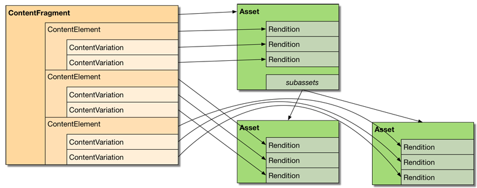

# 自定义和扩展内容片段{#customizing-and-extending-content-fragments}

内容片段扩展了标准资产；请参阅：

* [创建和管理内容片段](/help/assets/content-fragments/content-fragments.md) 和 [使用内容片段进行页面创作](/help/sites-authoring/content-fragments.md) 有关内容片段的更多信息。

* [管理资产](/help/assets/manage-assets.md) 和 [自定义和扩展资产](/help/assets/extending-assets.md) 以进一步了解标准资产。

## 架构 {#architecture}

基本 [组成部分](/help/assets/content-fragments/content-fragments.md#constituent-parts-of-a-content-fragment) 内容片段的以下内容：

* A *内容片段、*
* 包含一个或多个 *内容元素* s，
* 可以拥有一个或多个 *内容变体* s.

根据片段类型，还会使用模型或模板：

>[!CAUTION]
>
>[内容片段模型](/help/assets/content-fragments/content-fragments-models.md) 建议创建所有新片段。
>
>内容片段模型用于WKND中的所有示例。

>[!NOTE]
>
>在AEM 6.3之前，内容片段是基于模板而不是模型创建的。
>
>内容片段模板现已弃用。 它们仍可用于创建片段，但建议改用内容片段模型。 不会向片段模板添加任何新功能，它们将在将来版本中删除。

* 内容片段模型:

   * 用于定义包含结构化内容的内容片段。
   * 内容片段模型在创建内容片段时定义其结构。
   * 片段引用模型；因此，对模型所做的更改可能会/将会影响任何依赖的片段。
   * 模型是数据类型的构建。
   * 用于添加新变量等的函数必须相应地更新片段。

   >[!CAUTION]
   >
   >对现有内容片段模型所做的任何更改都可能影响依赖的片段；这可能会导致这些片段中的孤立属性。

* 内容片段模板：

   * 用于定义简单内容片段。
   * 模板可定义内容片段在创建时的（基本、仅文本）结构。
   * 模板在创建时会复制到片段中；因此，对模板的进一步更改将不会反映在现有片段中。
   * 用于添加新变量等的函数必须相应地更新片段。
   * [内容片段模板](/help/sites-developing/content-fragment-templates.md) 以不同于AEM生态系统中其他模板机制（如页面模板等）的方式运行。 因此，应单独考虑这些问题。
   * 基于模板时，根据实际内容管理内容的MIME类型；这意味着每个元素和变量可以具有不同的MIME类型。

### 与资产集成 {#integration-with-assets}

内容片段管理(CFM)是AEM Assets的一部分，其格式为：

* 内容片段是资产。
* 它们使用现有的资产功能。
* 它们与资产（管理控制台等）完全集成。

#### 将结构化内容片段映射到资产 {#mapping-structured-content-fragments-to-assets}


具有结构化内容的内容片段（即，基于内容片段模型）会映射到单个资产：

* 所有内容都存储在 `jcr:content/data` 资产的节点：

   * 元素数据存储在主控子节点下：
      `jcr:content/data/master`

   * 变体存储在带有变体名称的子节点下：例如 `jcr:content/data/myvariation`

   * 每个元素的数据作为具有元素名称的属性存储在相应的子节点中：例如，元素的内容 `text` 存储为属性 `text` on `jcr:content/data/master`

* 元数据和关联内容存储在下面 `jcr:content/metadata`
除标题和描述之外，这些标题和描述不被视为传统元数据并存储在 
`jcr:content`

#### 将简单内容片段映射到资产 {#mapping-simple-content-fragments-to-assets}



简单内容片段（基于模板）会映射到由主资产和（可选）子资产组成的组合：

* 片段的所有非内容信息（如标题、描述、元数据、结构）都仅在主资产上进行管理。
* 片段第一个元素的内容会映射到主资产的原始演绎版。

   * 第一个元素的变体（如果有）会映射到主资产的其他演绎版。

* 其他元素（如果现有）会映射到主资产的子资产。

   * 这些附加元素的主要内容映射到相应子资产的原始演绎版。
   * 任何其他元素的其他变体（如果适用）都映射到相应子资产的其他演绎版。

#### 资产位置 {#asset-location}

与标准资产一样，内容片段位于以下位置：

`/content/dam`

#### 资产权限 {#asset-permissions}

有关更多详细信息，请参阅 [内容片段 — 删除注意事项](/help/assets/content-fragments/content-fragments-delete.md).

#### 功能集成 {#feature-integration}

* 内容片段管理(CFM)功能以资产核心为基础，但应当尽可能独立于该功能。
* CFM为卡片/列/列表视图中的项目提供了自己的实施；这些插件可插入现有资产内容渲染实施。
* 已扩展多个资产组件，以满足内容片段的需求。

### 在页面中使用内容片段 {#using-content-fragments-in-pages}

>[!CAUTION]
>
>的 [内容片段核心组件](https://helpx.adobe.com/experience-manager/core-components/using/content-fragment-component.html) 现在建议。 请参阅 [开发核心组件](https://helpx.adobe.com/experience-manager/core-components/using/developing.html) 以了解更多详细信息。

可以像任何其他资产类型一样，从AEM页面引用内容片段。 AEM提供 [**内容片段** 核心组件](https://helpx.adobe.com/experience-manager/core-components/using/content-fragment-component.html) - a [用于在页面上包含内容片段的组件](/help/sites-authoring/content-fragments.md#adding-a-content-fragment-to-your-page). 您也可以扩展，此 **内容片段** 核心组件。

* 组件使用 `fragmentPath` 属性来引用实际的内容片段。 的 `fragmentPath` 资产的处理方式与其他资产类型的类似资产相同；例如，当内容片段被移动到其他位置时。

* 组件允许您选择要显示的变量。
* 此外，还可以选择一系列段落以限制输出；例如，它可用于多列输出。
* 组件允许 [中间内容](/help/sites-developing/components-content-fragments.md#in-between-content):

   * 在此，组件允许您放置其他资产（图像等） 在引用片段的段落之间。
   * 对于中间内容，您需要：

      * 注意可能出现不稳定的引用；中间内容（在创作页面时添加）与它位于旁边的段落没有固定的关系，在中间内容的位置可能丢失相对位置之前插入新段落（在内容片段编辑器中）
      * 请考虑其他参数（如变量和段落过滤器），以避免搜索结果出现误报

>[!NOTE]
>
>**内容片段模型:**
>
>在页面上使用基于内容片段模型的内容片段时，会引用模型。 这意味着，如果发布页面时尚未发布模型，则会标记该模型，并将模型添加到要随页面一起发布的资源中。
>
>**内容片段模板：**
>
>在页面上使用基于内容片段模板的内容片段时，没有引用，因为创建片段时复制了模板。

#### 使用OSGi控制台进行配置 {#configuration-using-osgi-console}

例如，内容片段的后端实施负责使页面上使用的片段的实例可搜索，或管理混合媒体内容。 此实施需要了解用于渲染片段的组件以及如何对渲染进行参数化。

此参数的参数可以在 [Web控制台](/help/sites-deploying/configuring-osgi.md#osgi-configuration-with-the-web-console)，用于OSGi包 **内容片段组件配置**.

* **资源类型**
列表 
`sling:resourceTypes` 可用于定义用于渲染内容片段的组件，以及应将后台处理应用于的位置。

* **引用属性**
属性列表可以配置为指定对片段的引用存储到相应组件的位置。

>[!NOTE]
>
>属性和组件类型之间没有直接映射。
>
>AEM只会获取可在段落中找到的第一个属性。 因此，您应该仔细选择这些资产。


您仍必须遵循一些准则，以确保组件与内容片段后台处理兼容：

* 定义要呈现的元素的属性名称必须是 `element` 或 `elementNames`.

* 定义要呈现的变体的属性名称必须是 `variation` 或 `variationName`.

* 如果支持多个元素的输出(使用 `elementNames` 指定多个元素)，则实际显示模式由属性定义 `displayMode`:

   * 如果值为 `singleText` （只配置了一个元素），则该元素将呈现为具有中间内容、布局支持等的文本。 对于仅渲染一个元素的片段，这是默认设置。
   * 否则，将使用更简单的方法（可称为“表单视图”），其中不支持中间内容，并且片段内容将“原样”呈现。

* 如果片段是为 `displayMode` == `singleText` （隐式或显式）起作用的其他属性如下：

   * `paragraphScope` 定义是否应渲染所有段落或仅渲染一段段落(值： `all` 与 `range`)

   * if `paragraphScope` == `range` 然后是属性 `paragraphRange` 定义要呈现的段落范围

### 与其他框架集成 {#integration-with-other-frameworks}

内容片段可以与以下内容集成：

* **翻译**

   内容片段与 [AEM翻译工作流](/help/sites-administering/tc-manage.md). 在建筑层面，这意味着：

   * 内容片段的个别翻译实际上是单独的片段；例如：

      * 它们位于不同的语言根下：

         `/content/dam/<path>/en/<to>/<fragment>`

         与

         `/content/dam/<path>/de/<to>/<fragment>`

      * 但它们在语言根下完全相同的相对路径：

         `/content/dam/<path>/en/<to>/<fragment>`

         与

         `/content/dam/<path>/de/<to>/<fragment>`
   * 除了基于规则的路径之外，内容片段的不同语言版本之间没有进一步的连接；虽然UI提供了在语言变体之间导航的方法，但它们将作为两个单独的片段进行处理。
   >[!NOTE]
   >
   >AEM翻译工作流可与 `/content`:
   >
   >    * 由于内容片段模型位于 `/conf`，则此类翻译中不包含这些内容。 您可以 [国际化UI字符串](/help/sites-developing/i18n-dev.md).
   >
   >    * 模板将被复制以创建片段，因此这是隐式的。


* **元数据架构**

   * 内容片段（重用）使用 [元数据架构](/help/assets/metadata-schemas.md)，可使用标准资产定义。
   * CFM提供了自己的特定架构：

      `/libs/dam/content/schemaeditors/forms/contentfragment`

      如果需要，可以扩展此功能。

   * 相应的架构表单与片段编辑器集成。

## 内容片段管理API — 服务器端 {#the-content-fragment-management-api-server-side}

您可以使用服务器端API访问您的内容片段；请参阅：

[com.adobe.cq.dam.cfm](https://helpx.adobe.com/experience-manager/6-5/sites/developing/using/reference-materials/javadoc/com/adobe/cq/dam/cfm/package-summary.html)

>[!CAUTION]
>
>强烈建议使用服务器端API，而不是直接访问内容结构。

### 关键界面 {#key-interfaces}

以下三个界面可用作入口点：

* **片段模板** ([片段模板](https://helpx.adobe.com/experience-manager/6-5/sites/developing/using/reference-materials/javadoc/com/adobe/cq/dam/cfm/FragmentTemplate.html))

   使用 `FragmentTemplate.createFragment()` 用于创建新片段。

   ```
   Resource templateOrModelRsc = resourceResolver.getResource("...");
   FragmentTemplate tpl = templateOrModelRsc.adaptTo(FragmentTemplate.class);
   ContentFragment newFragment = tpl.createFragment(parentRsc, "A fragment name", "A fragment description.");
   ```

   此界面表示：

   * 从中创建内容片段的内容片段模型或内容片段模板，
   * 和（创建后）该片段的结构信息

   此信息可包括：

   * 访问基本数据（标题、描述）
   * 访问片段元素的模板/模型：

      * 列表元素模板
      * 获取给定元素的结构信息
      * 访问元素模板(请参阅 `ElementTemplate`)
   * 片段变体的访问模板：

      * 列表变体模板
      * 获取给定变体的结构信息
      * 访问变体模板(请参阅 `VariationTemplate`)
   * 获取初始关联内容

   表示重要信息的界面：

   * `ElementTemplate`

      * 获取基本数据（名称、标题）
      * 获取初始元素内容
   * `VariationTemplate`

      * 获取基本数据（名称、标题、描述）


* **内容片段** ([内容片段](https://helpx.adobe.com/experience-manager/6-5/sites/developing/using/reference-materials/javadoc/com/adobe/cq/dam/cfm/ContentFragment.html))

   此界面允许您以抽象方式处理内容片段。

   >[!CAUTION]
   >
   >强烈建议通过此界面访问片段。 应避免直接更改内容结构。

   该界面为您提供了以下方法：

   * 管理基本数据(例如，获取名称；get/set title/description)
   * 访问元数据
   * 访问元素：

      * 列表元素
      * 按名称获取元素
      * 创建新元素(请参阅 [注意事项](#caveats))

      * 访问元素数据(请参阅 `ContentElement`)
   * 为片段定义的列表变量
   * 全局创建新变量
   * 管理关联内容：

      * 列出集合
      * 添加收藏集
      * 删除收藏集
   * 访问片段的模型或模板

   表示片段主要元素的界面包括：

   * **内容元素** ([ContentElement](https://helpx.adobe.com/experience-manager/6-5/sites/developing/using/reference-materials/javadoc/com/adobe/cq/dam/cfm/ContentElement.html))

      * 获取基本数据（名称、标题、描述）
      * 获取/设置内容
      * 访问元素的变体：

         * 列表变体
         * 按名称获取变体
         * 创建新变量(请参阅 [注意事项](#caveats))
         * 删除变量(请参阅 [注意事项](#caveats))
         * 访问变量数据(请参阅 `ContentVariation`)
      * 解析变量的快捷方式（如果指定的变量不适用于元素，则应用一些其他特定于实施的回退逻辑）
   * **内容变体** ([ContentVariation](https://helpx.adobe.com/experience-manager/6-5/sites/developing/using/reference-materials/javadoc/com/adobe/cq/dam/cfm/ContentVariation.html))

      * 获取基本数据（名称、标题、描述）
      * 获取/设置内容
      * 简单同步，基于上次修改的信息

   所有三个界面( `ContentFragment`, `ContentElement`, `ContentVariation`)扩展 `Versionable` 界面，它添加了内容片段所需的版本控制功能：

   * 创建元素的新版本
   * 元素的列表版本
   * 获取版本控制元素的特定版本的内容


### 适应 — 使用adaptTo() {#adapting-using-adaptto}

可以修改以下内容：

* `ContentFragment` 可适用于：

   * `Resource`  — 基础Sling资源；请注意，更新基础 `Resource` 直接需要重建 `ContentFragment` 对象。

   * `Asset` - DAM `Asset` 表示内容片段的抽象；请注意， `Asset` 直接需要重建 `ContentFragment` 对象。

* `ContentElement` 可适用于：

   * `ElementTemplate`  — 访问元素的结构信息。

* `FragmentTemplate` 可适用于：

   * `Resource` - `Resource` 确定被引用的模型或复制的原始模板；

      * 通过 `Resource` 不会自动反映在 `FragmentTemplate`.

* `Resource` 可适用于：

   * `ContentFragment`
   * `FragmentTemplate`

### 注意事项 {#caveats}

应当指出：

* 实施API是为了提供UI支持的功能。
* 整个API的设计目的 **not** 自动保留更改（除非API JavaDoc中另有说明）。 因此，您将始终必须提交相应请求的资源解析程序（或您实际使用的解析程序）。
* 可能需要额外努力的任务：

   * 创建/删除新元素将不会更新简单片段的数据结构（基于片段模板）。
   * 从创建新变体 `ContentElement` 不会更新数据结构(但会从 `ContentFragment` )。

   * 删除现有变量不会更新数据结构。

## 内容片段管理API — 客户端 {#the-content-fragment-management-api-client-side}

>[!CAUTION]
>
>对于AEM 6.5，客户端API是内部API。

### 附加信息 {#additional-information}

请参阅以下内容：

* `filter.xml`

   的 `filter.xml` 对于内容片段管理，进行了配置，以便它不会与资产核心内容包重叠。

## 编辑会话 {#edit-sessions}

当用户在其中一个编辑器页面中打开内容片段时，将启动编辑会话。 当用户通过选择 **保存** 或 **取消**.

### 要求 {#requirements}

控制编辑会话的要求包括：

* 编辑内容片段(可以跨多个视图(=HTML页面))应当是原子的。
* 此外，还应该 *事务性*;在编辑会话结束时，必须提交（保存）或回滚（取消）更改。
* 应妥善处理边缘案件；这些情况包括用户手动输入URL或使用全局导航离开页面的情况。
* 应提供定期自动保存（每x分钟）功能，以防止数据丢失。
* 如果两个用户同时编辑内容片段，则他们不应覆盖彼此的更改。

#### 进程 {#processes}

涉及的流程包括：

* 启动会话

   * 将创建内容片段的新版本。
   * 自动保存已启动。
   * 设置Cookie;这些定义了当前编辑的片段，并且打开了编辑会话。

* 完成会话

   * 自动保存已停止。
   * 提交后：

      * 最后修改的信息会更新。
      * Cookie已删除。
   * 回滚时：

      * 将还原在启动编辑会话时创建的内容片段的版本。
      * Cookie已删除。


* 编辑

   * 所有更改（包括自动保存）都在活动内容片段上完成，而不是在分隔的受保护区域内完成。
   * 因此，这些更改会立即反映在引用相应内容片段的AEM页面上

#### 操作 {#actions}

可能的操作包括：

* 输入页面

   * 检查编辑会话是否已存在；检查相应的Cookie。

      * 如果存在，请验证是否已为当前正在编辑的内容片段启动编辑会话

         * 如果当前片段，则重新建立会话。
         * 如果没有，请尝试取消对之前编辑的内容片段的编辑，并删除Cookie（之后不会出现编辑会话）。
      * 如果不存在编辑会话，请等待用户进行的首次更改（请参阅下文）。
   * 检查页面上是否已引用内容片段，如果已引用，则显示相应的信息。


* 内容更改

   * 每当用户更改内容并且不存在编辑会话时，都会创建一个新的编辑会话(请参阅 [启动会话](#processes))。

* 离开页面

   * 如果存在编辑会话且更改未持久，则会显示一个模式确认对话框，告知用户可能丢失的内容并允许他们停留在页面上。

## 示例 {#examples}

### 示例：访问现有内容片段 {#example-accessing-an-existing-content-fragment}

要实现此目的，您可以调整表示API的资源以：

`com.adobe.cq.dam.cfm.ContentFragment`

例如：

```java
// first, get the resource
Resource fragmentResource = resourceResolver.getResource("/content/dam/fragments/my-fragment");
// then adapt it
if (fragmentResource != null) {
    ContentFragment fragment = fragmentResource.adaptTo(ContentFragment.class);
    // the resource is now accessible through the API
}
```

### 示例：创建新内容片段 {#example-creating-a-new-content-fragment}

要以编程方式创建新内容片段，您需要使用：

`com.adobe.cq.dam.cfm.ContentFragmentManager#create`

例如：

```java
Resource templateOrModelRsc = resourceResolver.getResource("...");
FragmentTemplate tpl = templateOrModelRsc.adaptTo(FragmentTemplate.class);
ContentFragment newFragment = tpl.createFragment(parentRsc, "A fragment name", "A fragment description.");
```

### 示例：指定自动保存间隔 {#example-specifying-the-auto-save-interval}

使用配置管理器(ConfMgr)可以定义自动保存间隔（以秒为单位）：

* 节点： `<*conf-root*>/settings/dam/cfm/jcr:content`
* 属性名称: `autoSaveInterval`
* 类型: `Long`

* 默认： `600` （10分钟）；这是在 `/libs/settings/dam/cfm/jcr:content`

如果要设置5分钟的自动保存间隔，则需要在节点上定义属性；例如：

* 节点： `/conf/global/settings/dam/cfm/jcr:content`
* 属性名称: `autoSaveInterval`

* 类型: `Long`

* 值： `300` （5分钟等于300秒）

## 内容片段模板 {#content-fragment-templates}

请参阅 [内容片段模板](/help/sites-developing/content-fragment-templates.md) 以了解完整信息。

## 用于创作页面的组件 {#components-for-page-authoring}

有关详细信息，请参阅

* [核心组件 — 内容片段组件](https://helpx.adobe.com/experience-manager/core-components/using/content-fragment-component.html) （推荐）
* [内容片段组件 — 用于页面创作的组件](/help/sites-developing/components-content-fragments.md#components-for-page-authoring)
