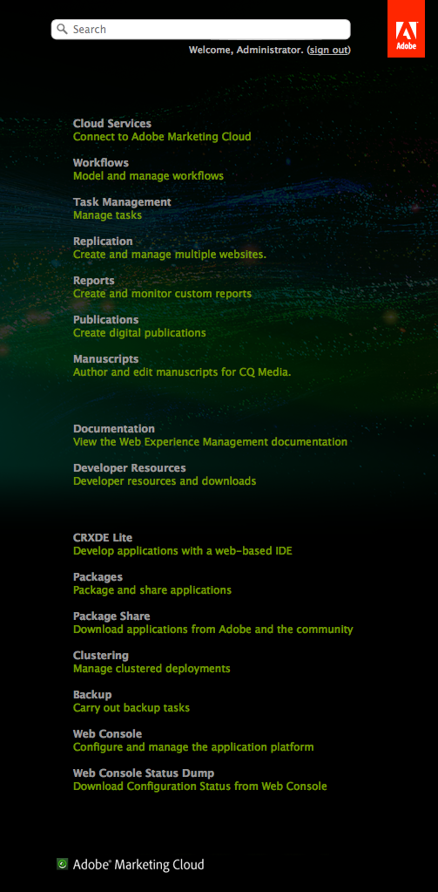

# 自定义欢迎控制台（经典UI）{#customizing-the-welcome-console-classic-ui}

>[!CAUTION]
>
>本页介绍经典UI。
>
>有关支持触屏操作的标准用户界面的详细信息，请参阅[自定义控制台](/help/sites-developing/customizing-consoles-touch.md)。

“欢迎”控制台提供了指向AEM中各种控制台和功能的链接列表。

可以配置可见的链接。 这可以为特定用户和/或组定义。 要执行的操作取决于目标类型（这与它们所在的控制台部分相关）：

* [主控制台](#links-in-main-console-left-pane) — 主控制台（左窗格）中的链接
* [资源、文档和引用、功能](#links-in-sidebar-right-pane) — 侧栏（右窗格）中的链接

## 主控制台（左窗格）中的链接 {#links-in-main-console-left-pane}

这将列出AEM的主要控制台。

### 配置主控制台链接是否可见 {#configuring-whether-main-console-links-are-visible}

节点级别权限确定是否可以看到链接。 有问题的节点包括：

* **网站：** `/libs/wcm/core/content/siteadmin`

* **数字Assets：** `/libs/wcm/core/content/damadmin`

* **社区：** `/libs/collab/core/content/admin`

* **营销活动：** `/libs/mcm/content/admin`

* **收件箱：** `/libs/cq/workflow/content/inbox`

* **用户：** `/libs/cq/security/content/admin`

* **工具：** `/libs/wcm/core/content/misc`

* **标记：** `/libs/cq/tagging/content/tagadmin`

例如：

* 若要限制对&#x200B;**工具**&#x200B;的访问，请移除读取权限

  `/libs/wcm/core/content/misc`

有关如何设置所需权限的更多信息，请参阅[安全部分](/help/sites-administering/security.md)。

### 侧栏中的链接（右窗格） {#links-in-sidebar-right-pane}

这些链接基于对以下路径下的节点存在&#x200B;*和*&#x200B;读取访问权限这一情况：

`/libs/cq/core/content/welcome`

默认情况下，提供了三个部分（稍微相距）：

<table>
 <tbody>
  <tr>
   <td><strong>资源</strong></td>
   <td> </td>
  </tr>
  <tr>
   <td> Cloud Service</td>
   <td><code>/libs/cq/core/content/welcome/resources/cloudservices</code></td>
  </tr>
  <tr>
   <td> 工作流</td>
   <td><code>/libs/cq/core/content/welcome/resources/workflows</code></td>
  </tr>
  <tr>
   <td> 任务管理</td>
   <td><code>/libs/cq/core/content/welcome/resources/taskmanager</code></td>
  </tr>
  <tr>
   <td> 复制</td>
   <td><code>/libs/cq/core/content/welcome/resources/replication</code></td>
  </tr>
  <tr>
   <td> 报告</td>
   <td><code>/libs/cq/core/content/welcome/resources/reports</code></td>
  </tr>
  <tr>
   <td> 出版物</td>
   <td><code>/libs/cq/core/content/welcome/resources/publishingadmin</code></td>
  </tr>
  <tr>
   <td> 手稿</td>
   <td><code>/libs/cq/core/content/welcome/resources/manuscriptsadmin</code></td>
  </tr>
  <tr>
   <td><strong>文档和参考</strong></td>
   <td> </td>
  </tr>
  <tr>
   <td> 文档</td>
   <td><code>/libs/cq/core/content/welcome/docs/docs</code></td>
  </tr>
  <tr>
   <td> 开发人员资源</td>
   <td><code>/libs/cq/core/content/welcome/docs/dev</code></td>
  </tr>
  <tr>
   <td><strong>功能</strong></td>
   <td> </td>
  </tr>
  <tr>
   <td> CRXDE Lite</td>
   <td><code>/libs/cq/core/content/welcome/features/crxde</code></td>
  </tr>
  <tr>
   <td> 包</td>
   <td><code>/libs/cq/core/content/welcome/features/packages</code></td>
  </tr>
  <tr>
   <td> 包共享</td>
   <td><code>/libs/cq/core/content/welcome/features/share</code></td>
  </tr>
  <tr>
   <td> 聚类</td>
   <td><code>/libs/cq/core/content/welcome/features/cluster</code></td>
  </tr>
  <tr>
   <td> 备份</td>
   <td><code>/libs/cq/core/content/welcome/features/backup</code></td>
  </tr>
  <tr>
   <td> Web 控制台  </td>
   <td><code>/libs/cq/core/content/welcome/features/config</code></td>
  </tr>
  <tr>
   <td> Web控制台状态转储  </td>
   <td><code>/libs/cq/core/content/welcome/features/statusdump</code></td>
  </tr>
 </tbody>
</table>

#### 配置侧栏链接是否可见 {#configuring-whether-sidebar-links-are-visible}

可以通过删除对表示链接的节点的读取访问权限来对特定用户或组隐藏链接。

* 资源 — 移除对以下项的访问：

  `/libs/cq/core/content/welcome/resources/<link-target>`

* 文档 — 移除对以下项的访问权限：

  `/libs/cq/core/content/welcome/docs/<link-target>`

* 功能 — 删除对以下项的访问：

  `/libs/cq/core/content/welcome/features/<link-target>`

例如：

* 要删除指向&#x200B;**报表**&#x200B;的链接，请从删除读取权限

  `/libs/cq/core/content/welcome/resources/reports`

* 要删除指向&#x200B;**包**&#x200B;的链接，请从删除读取权限

  `/libs/cq/core/content/welcome/features/packages`

有关如何设置所需权限的更多信息，请参阅[安全部分](/help/sites-administering/security.md)。

### 链接选择机制 {#link-selection-mechanism}

在`/libs/cq/core/components/welcome/welcome.jsp`中，使用[ConsoleUtil](https://helpx.adobe.com/experience-manager/6-5/sites/developing/using/reference-materials/javadoc/com/day/cq/commons/ConsoleUtil.html)，该程序对具有下列属性的节点执行查询：

* 值为`cq:Console`的`jcr:mixinTypes`

>[!NOTE]
>
>执行以下查询以查看现有列表：
>
>* `select * from cq:Console`
>

当用户或组对具有mixin `cq:Console`的节点没有读取权限时，`ConsoleUtil`搜索不会检索该节点，因此它不会列在控制台上。

### 添加自定义项目 {#adding-a-custom-item}

[链接选择机制](#link-selection-mechanism)可用于将您自己的自定义项添加到链接列表。

通过将`cq:Console` mixin添加到您的小部件或资源，将您的自定义项目添加到列表。 这可以通过定义属性来完成：

* 值为`cq:Console`的`jcr:mixinTypes`
