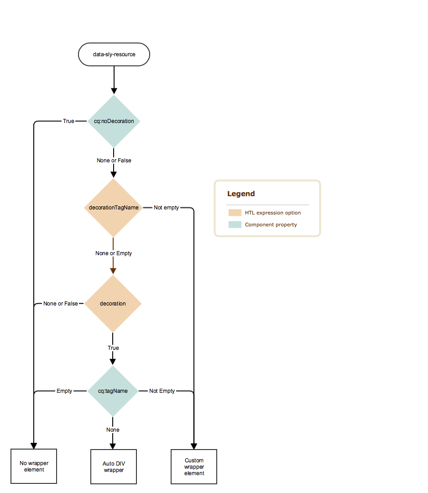

# 修饰标记{#decoration-tag}

呈现网页中的组件后，可以生成一个 HTML 元素，以将呈现的组件封装在其中。这主要有两个目的：

* 仅当组件使用HTML元素封装时，才能对其进行编辑。
* 包装元素用于应用提供以下内容的HTML类：

   * 布局信息
   * 样式信息

对于开发人员而言，AEM 可提供清晰而简单的逻辑来控制用于封装所包含组件的修饰标记。是否以及如何呈现修饰标记取决于两个因素的组合，本页将深入探讨这两个因素：

* 组件本身可以使用一组属性配置其修饰标记。
* 包含组件（HTL、JSP、Dispatcher等）的脚本可以使用包含参数定义修饰标记的方面。

## 推荐 {#recommendations}

以下是有关何时包含包装器元素的一些常规建议，这些建议应有助于避免遇到意外问题：

* WCMModes（编辑或预览模式）、实例（创作或发布）或环境（暂存或生产）之间不存在包装器元素，因此页面的CSS和JavaScripts在所有情况下都工作相同。
* 应将包装元素添加到所有可编辑的组件中，以便页面编辑器可以正确初始化并更新它们。
* 对于不可编辑的组件，如果包装元素不提供特定功能，则可以避免使用包装元素，以便生成的标记不会不必要地膨胀。

## 组件控件 {#component-controls}

可将以下属性和节点应用于组件以控制其修饰标记的行为：

* **`cq:noDecoration {boolean}`：** 此属性可以添加到组件中，true值会强制AEM不在该组件上生成任何包装元素。

* **`cq:htmlTag`节点：** 此节点可以添加到组件下，并且可以具有以下属性：

   * **`cq:tagName {String}`：** 这可用于指定用于封装组件的自定义HTML标记，而不是默认DIV元素。
   * **`class {String}`：** 这可用于指定要添加到包装器中的css类名。
   * 其他属性名称将添加为HTML属性，其字符串值与提供的值相同。

## 脚本控件 {#script-controls}

但包装器行为有所不同，具体取决于 [HTL](/help/sites-developing/decoration-tag.md#htl) 或 [JSP](/help/sites-developing/decoration-tag.md#jsp) 用于包含元素。

### HTL {#htl}

通常，HTL中的包装器行为可以概括如下：

* 默认情况下，不呈现包装器DIV(仅在执行 `data-sly-resource="foo"`)。
* 所有wcm模式（已禁用、预览、编辑创作和发布）的渲染方式相同。

也可以完全控制包装器的行为。

* HTL脚本可以完全控制包装器标记的结果行为。
* 组件属性(如 `cq:noDecoration` 和 `cq:tagName`)也可以定义包装器标记。

可以从HTL脚本及其相关逻辑完全控制包装标记的行为。

有关在HTL中进行开发的更多信息，请参阅 [HTL文档](https://experienceleague.adobe.com/docs/experience-manager-htl/content/overview.html).

#### 决策树 {#decision-tree}

此决策树汇总了确定包装器标记行为的逻辑。



#### 用例 {#use-cases}

以下三个用例提供了如何处理包装器标记的示例，并说明了控制包装器标记的所需行为是何等简单。

以下所有示例都假定以下内容结构和组件：

```
/content/test/
  @resourceType = "test/components/one"
  child/
    @resourceType = "test/components/two"
```

```
/apps/test/components/
  one/
    one.html
  two/
    two.html
    cq:htmlTag/
      @cq:tagName = "article"
      @class = "component-two"
```

#### 用例1：包含用于代码重用的组件 {#use-case-include-a-component-for-code-reuse}

最典型的用例是当组件出于代码重用原因包含另一个组件时。 在这种情况下，包含的组件不需要使用自己的工具栏和对话框进行编辑，因此无需包装器，也无需组件的 `cq:htmlTag` 将被忽略。 可将此视为默认行为。

`one.html: <sly data-sly-resource="child"></sly>`

`two.html: Hello World!`

结果输出于 `/content/test.html`：

**`Hello World!`**

例如，某个组件包含用于显示图像的核心图像组件，通常在该情况下通过使用合成资源来显示，其中包括一个虚拟子组件，方法是向数据智能资源传递一个表示该组件将拥有的所有属性的Map对象。

#### 用例2：包含可编辑组件 {#use-case-include-an-editable-component}

另一个常见用例是当容器组件包含可编辑的子组件（如布局容器）时。 在这种情况下，每个包含的子级都迫切需要一个包装器才能让编辑器工作(除非使用 `cq:noDecoration` 属性)。

由于包含的组件在本例中是一个独立组件，因此它需要一个包装元素以便编辑器工作，并定义其要应用的布局和样式。 要触发此行为，可以 `decoration=true` 选项。

`one.html: <sly data-sly-resource="${'child' @ decoration=true}"></sly>`

`two.html: Hello World!`

结果输出于 `/content/test.html`：

**`<article class="component-two">Hello World!</article>`**

#### 用例3：自定义行为 {#use-case-custom-behavior}

复杂情况可以有任意数量，利用HTL明确提供的方法可以轻松实现：

* **`decorationTagName='ELEMENT_NAME'`** 要定义包装的元素名称，请执行以下操作：
* **`cssClassName='CLASS_NAME'`** 定义要在其中设置的CSS类名。

`one.html: <sly data-sly-resource="${'child' @ decorationTagName='aside', cssClassName='child'}"></sly>`

`two.html: Hello World!`

结果输出 `/content/test.html`：

**`<aside class="child">Hello World!</aside>`**

## JSP {#jsp}

当使用包含组件时 `cq:includ`或 `sling:include`，AEM中的默认行为是使用DIV来封装元素。 但是，可以通过两种方式自定义此包装：

* 明确告知AEM不要使用将组件换行 `cq:noDecoration`.
* 使用自定义HTML标记来封装组件，使用 `cq:htmlTag`/ `cq:tagName` 或 `decorationTagName`.

### 决策树 {#decision-tree-1}

以下决策树说明了如何执行以下操作 `cq:noDecoration`， `cq:htmlTag`， `cq:tagName`、和 `decorationTagName` 会影响包装器行为。


