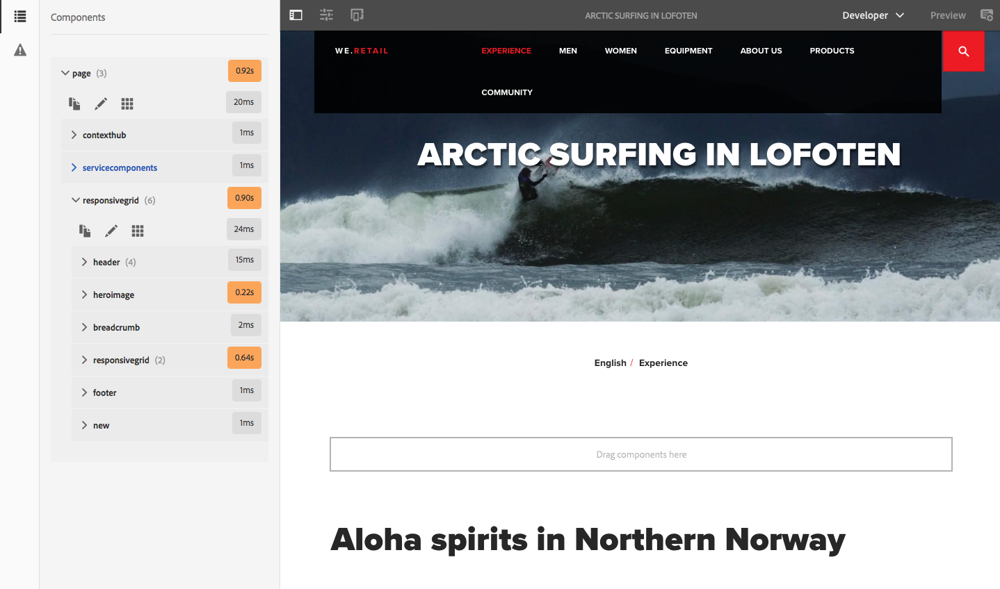
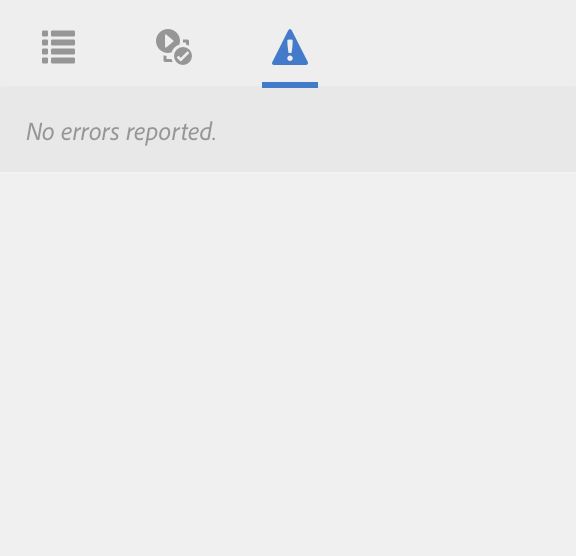

# 开发人员模式{#developer-mode}

在Adobe Experience Manager (AEM)中编辑页面时，有多种[模式](/help/sites-authoring/author-environment-tools.md#modestouchoptimizedui)可用，包括开发人员模式。 这将打开一个侧面板，其中包含多个选项卡，为开发人员提供有关当前页面的信息。 三个选项卡包括：

* 用于查看结构和性能信息的&#x200B;**[组件](#components)**。
* **[测试](#tests)**，用于运行测试和分析结果。
* **[错误](#errors)**，查看发生的任何问题。

这些功能可帮助开发人员：

* 发现：由哪些页面组成。
* 调试：在哪里以及何时发生什么情况，这反过来有助于解决问题。
* 测试：应用程序是否按预期运行。

>[!CAUTION]
>
>开发人员模式：
>
>* 仅在触屏UI中可用（编辑页面时）。
>* 在移动设备或桌面上的小窗口中不可用（由于空间限制）。
>
>   * 当宽度小于1024像素时，会发生这种情况。
>* 仅适用于属于`administrators`组的用户。

>[!CAUTION]
>
>开发人员模式仅适用于未使用nosamplecontent运行模式的标准创作实例。
>
>如有必要，可以将其配置为使用：
>
>* 在使用nosamplecontent运行模式的创作实例上
>* 发布实例
>
>使用后应再次禁用它。

>[!NOTE]
>
>请参阅：
>
>* 知识库文章[AEM TouchUI问题疑难解答](https://experienceleague.adobe.com/en/docs/experience-cloud-kcs/kbarticles/ka-16935)，提供了更多提示和工具。
>* 关于[AEM 6.0开发人员模式](https://experienceleague.adobe.com/docs/events/experience-manager-gems-recordings/gems2014/aem-developer-mode.html)的AEM Gems会话。
>

## 打开开发人员模式 {#opening-developer-mode}

开发人员模式作为页面编辑器的侧面板实施。 要打开面板，请从页面编辑器工具栏的模式选择器中选择&#x200B;**开发人员**：

该面板分为两个选项卡：

* **[组件](/help/sites-developing/developer-mode.md#components)** — 这将显示组件树，类似于作者的[内容树](/help/sites-authoring/author-environment-tools.md#content-tree)

* **[错误](/help/sites-developing/developer-mode.md#errors)** — 出现问题时，将显示每个组件的详细信息。

### 组件 {#components}

这显示了一个组件树，该组件树：

* 概述页面上渲染的组件和模板链（SLY、JSP等）。 可以展开树以显示层次结构中的上下文。
* 显示呈现组件的服务器端计算时间。
* 允许您展开树并选择树中的特定组件。 选择提供对组件详细信息的访问；例如：

   * 存储库路径
   * 脚本链接(在CRXDE Lite中访问)

* 选定的组件（在内容流中，由蓝色边框指示）将在内容树中突出显示（反之亦然）。

这有助于：

* 确定并比较每个组件的渲染时间。
* 查看并了解层级。
* 通过查找较慢的组件，了解并缩短页面加载时间。

每个组件条目可以显示（例如）：

* **查看详细信息**：显示以下内容的列表链接：

   * 用于呈现组件的所有组件脚本。
   * 此特定组件的存储库内容路径。

  

* **编辑脚本**：链接：

   * 在CRXDE Lite中打开组件脚本。

* 展开组件条目（箭头头）也可显示：

   * 选定组件中的层次结构。
   * 所选组件、嵌套在其中的任何单个组件以及组合总计的呈现时间。

  

>[!CAUTION]
>
>某些链接指向`/libs`下的脚本。 但是，这些仅供参考，您&#x200B;**不得**&#x200B;编辑`/libs`下的任何内容，因为您所做的任何更改可能会丢失。 这是因为每当您升级或应用修补程序或功能包时，此分支都可能会发生更改。 进行您在`/apps`下所需的任何更改。 查看[叠加和覆盖](/help/sites-developing/overlays.md)。

### 错误数 {#errors}

希望&#x200B;**错误**&#x200B;选项卡始终为空（如上所述），但在出现问题时，将显示每个组件的以下详细信息：

* 如果组件将条目写入错误日志，同时记录错误详细信息并直接链接到CRXDE Lite中的相应代码，则会发出警告。
* 如果组件打开管理会话，会出现警告。

例如，在调用未定义的方法的情况下，产生的错误显示在&#x200B;**错误**&#x200B;选项卡中：

在出现错误时，“组件”选项卡的树中的组件条目也将标有指示符。

### 测试 {#tests}

>[!CAUTION]
>
>在AEM 6.2中，开发人员模式的测试功能已重新实现为独立的工具应用程序。
>
>有关完整的详细信息，请参阅[测试您的用户界面](/help/sites-developing/hobbes.md)。
