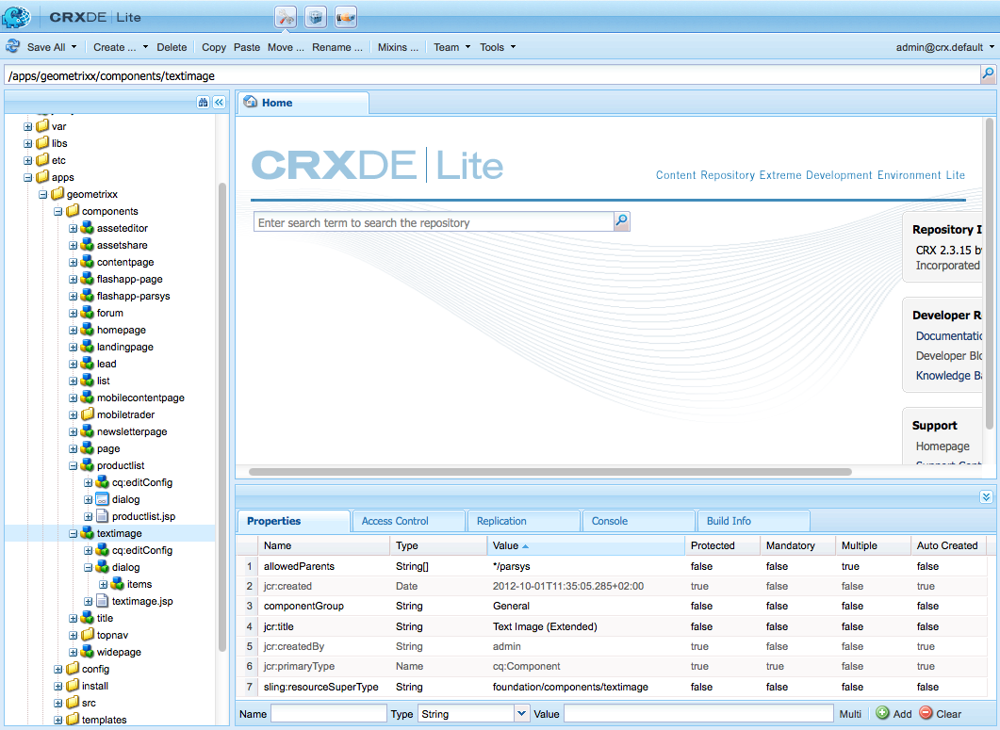

# 开发Adobe Experience Manager (AEM)组件（经典UI）{#developing-aem-components-classic-ui}

经典UI使用ExtJS创建提供组件外观的小部件。 由于这些构件的性质，组件与经典UI的交互方式与[触屏启用UI](/help/sites-developing/developing-components.md)存在一些差异。

>[!NOTE]
>
>组件开发的许多方面对于经典UI和触屏UI都是通用的，因此&#x200B;**您必须先阅读[AEM组件 — 基础知识](/help/sites-developing/components-basics.md)，然后再阅读**，该页面介绍经典UI的具体内容。

>[!NOTE]
>
>虽然HTML模板语言(HTL)和JSP都可以用于开发经典UI的组件，但此页说明了使用JSP进行开发。 这完全是因为在经典UI中使用JSP的历史记录。
>
>HTL现在是适用于AEM的推荐脚本语言。 请参阅[HTL](https://experienceleague.adobe.com/docs/experience-manager-htl/content/overview.html?lang=zh-Hans)和[开发AEM组件](/help/sites-developing/developing-components.md)以比较方法。

## 结构 {#structure}

[AEM Components - The Basics](/help/sites-developing/components-basics.md#structure)页面上介绍了组件的基本结构，该页面同时应用了touch-eanbeld和经典UI。 即使您不需要在新组件中使用触屏UI的设置，也可以在继承现有组件时了解这些设置。

## JSP脚本 {#jsp-scripts}

JSP脚本或Servlet可用于呈现组件。 根据Sling的请求处理规则，默认脚本的名称为：

`<*componentname*>.jsp`

## global.jsp {#global-jsp}

JSP脚本文件`global.jsp`用于为任何用于呈现组件的JSP脚本提供对特定对象（即访问内容）的快速访问。

因此，每个组件渲染JSP脚本中都应包含`global.jsp`，其中使用了`global.jsp`中提供的一个或多个对象。

默认`global.jsp`的位置为：

`/libs/foundation/global.jsp`

>[!NOTE]
>
>CQ 5.3及更早版本使用的路径`/libs/wcm/global.jsp`现已过时。

### global.jsp、使用的API和Taglibs的功能 {#function-of-global-jsp-used-apis-and-taglibs}

下面列出了从默认`global.jsp`提供的最重要的对象：

摘要:

* `<cq:defineObjects />`

   * `slingRequest` — 包装的请求对象( `SlingHttpServletRequest`)。
   * `slingResponse` — 包装的响应对象( `SlingHttpServletResponse`)。
   * `resource` - Sling资源对象( `slingRequest.getResource();`)。
   * `resourceResolver` - Sling资源解析程序对象( `slingRequest.getResoucreResolver();`)。
   * `currentNode` — 请求的已解析JCR节点。
   * `log` — 默认记录器()。
   * `sling` - Sling脚本帮助程序。
   * `properties` — 寻址的资源(`resource.adaptTo(ValueMap.class);`)的属性。
   * `pageProperties` — 已寻址资源的页面的属性。
   * `pageManager` — 用于访问AEM内容页面的页面管理器( `resourceResolver.adaptTo(PageManager.class);`)。
   * `component` — 当前AEM组件的组件对象。
   * `designer` — 用于检索设计信息的Designer对象(`resourceResolver.adaptTo(Designer.class);`)。
   * `currentDesign` — 已寻址资源的设计。
   * `currentStyle` — 已寻址资源的样式。

### 访问内容 {#accessing-content}

访问AEM WCM中的内容有三种方法：

* 通过`global.jsp`中引入的属性对象：

  属性对象是ValueMap的实例（请参阅[Sling API](https://sling.apache.org/apidocs/sling5/org/apache/sling/api/resource/ValueMap.html)），包含当前资源的所有属性。

  示例：在页面组件的呈现脚本中使用了`String pageTitle = properties.get("jcr:title", "no title");`。

  示例：在标准段落组件的呈现脚本中使用了`String paragraphTitle = properties.get("jcr:title", "no title");`。

* 通过`global.jsp`中引入的`currentPage`对象：

  `currentPage`对象是页面的实例(请参阅[AEM API](https://helpx.adobe.com/experience-manager/6-5/sites/developing/using/reference-materials/javadoc/com/day/cq/wcm/api/Page.html))。 page类提供了一些访问内容的方法。

  示例： `String pageTitle = currentPage.getTitle();`

* 通过`global.jsp`中引入的`currentNode`对象：

  `currentNode`对象是节点的实例（请参阅[JCR API](https://jackrabbit.apache.org/api/2.16/org/apache/jackrabbit/standalone/cli/core/CurrentNode.html)）。 `getProperty()`方法可以访问节点的属性。

  示例： `String pageTitle = currentNode.getProperty("jcr:title");`

## JSP标记库 {#jsp-tag-libraries}

利用CQ和Sling标记库，可访问在模板和组件的JSP脚本中使用的特定函数。

有关详细信息，请参阅文档[标记库](/help/sites-developing/taglib.md)。

## 使用客户端HTML库 {#using-client-side-html-libraries}

现代网站在很大程度上依赖于由复杂的JavaScript和CSS代码驱动的客户端处理。 组织和优化此代码的服务可能是一个复杂的问题。

为了帮助解决此问题，AEM提供了&#x200B;**客户端库文件夹**，可让您将客户端代码存储在存储库中，将其组织为不同类别并定义何时以及如何向客户端提供每种类别的代码。 然后，客户端库系统负责在最终网页中产生正确的链接，以加载正确的代码。

有关详细信息，请参阅文档[使用客户端HTML库](/help/sites-developing/clientlibs.md)。

## 对话框 {#dialog}

您的组件需要一个对话框供作者添加和配置内容。

有关详细信息，请参阅[AEM组件 — 基础知识](/help/sites-developing/components-basics.md#dialogs)。

## 配置编辑行为 {#configuring-the-edit-behavior}

您可以配置组件的编辑行为。 这包括各种属性，例如组件可用的操作、就地编辑器的特征以及与组件上的事件相关的侦听器。 尽管存在某些特定差异，但配置对于触屏优化UI和经典UI都是通用的。

通过在组件节点（类型为`cq:Component`）下添加类型为`cq:EditConfig`的`cq:editConfig`节点以及添加特定属性和子节点来配置组件的[编辑行为](/help/sites-developing/components-basics.md#edit-behavior)。

## 使用和扩展ExtJS小组件 {#using-and-extending-extjs-widgets}

有关更多详细信息，请参阅[使用和扩展ExtJS小组件](/help/sites-developing/widgets.md)。

## 为ExtJS构件使用xtype {#using-xtypes-for-extjs-widgets}

有关详细信息，请参阅[使用xtypes](/help/sites-developing/xtypes.md)。

## 开发新组件 {#developing-new-components}

本节介绍如何创建自己的组件并将它们添加到段落系统中。

快速入门方法是复制现有组件，然后进行所需的更改。

有关如何开发组件的示例，请参见[扩展文本和图像组件 — 示例。](#extending-the-text-and-image-component-an-example)

### 开发新组件（调整现有组件） {#develop-a-new-component-adapt-existing-component}

要基于现有组件为AEM开发新组件，可以复制该组件，为新组件创建一个JavaScript文件，并将其存储在AEM可访问的位置（另请参阅[自定义组件和其他元素](/help/sites-developing/dev-guidelines-bestpractices.md#customizing-components-and-other-elements)）：

1. 使用CRXDE Lite在下列位置创建一个组件文件夹：

   / `apps/<myProject>/components/<myComponent>`

   按照库中的方式重新创建节点结构，然后复制现有组件（如文本组件）的定义。 例如，要自定义文本组件复制，请执行以下操作：

   * 从 `/libs/foundation/components/text`
   * 至`/apps/myProject/components/text`

1. 修改`jcr:title`以反映其新名称。
1. 打开新的组件文件夹，然后进行所需的更改。 另外，删除文件夹中任何无关的信息。

   您可以进行如下更改：

   * 在对话框中添加字段

      * `cq:dialog` — 触屏UI的对话框
      * `dialog` — 经典UI的对话框

   * 替换`.jsp`文件（将其命名为新组件）
   * 或者完全重新处理整个组件（如果需要）

   例如，如果您复制了标准文本组件，则可以在对话框中添加一个额外的字段，然后更新`.jsp`以处理在该处输入的内容。

   >[!NOTE]
   >
   >的组件：
   >
   >* 触屏优化UI使用[Granite](https://developer.adobe.com/experience-manager/reference-materials/6-5/granite-ui/api/jcr_root/libs/granite/ui/index.html)组件
   >* 经典UI使用[ExtJS小组件](https://developer.adobe.com/experience-manager/reference-materials/6-5/widgets-api/index.html)

   >[!NOTE]
   >
   >为经典UI定义的对话框在触屏UI中运行。
   >
   >为触控式UI定义的对话框不会在经典UI中运行。
   >
   >根据您的实例和创作环境，您可能需要为组件定义这两种类型的对话框。

1. 应存在以下节点之一并已正确初始化，才能显示新组件：

   * `cq:dialog` — 触屏UI的对话框
   * `dialog` — 经典UI的对话框
   * `cq:editConfig` — 组件在编辑环境中的行为（例如，拖放）
   * `design_dialog` — 用于设计模式的对话框（仅限经典UI）

1. 通过以下任一方式激活段落系统中的新组件：

   * 使用CRXDE Lite将值`<path-to-component>`（例如`/apps/geometrixx/components/myComponent`）添加到节点`/etc/designs/geometrixx/jcr:content/contentpage/par`的属性组件
   * 按照[向段落系统添加新组件](#adding-a-new-component-to-the-paragraph-system-design-mode)中的说明操作

1. 在AEM WCM中，打开网站中的页面，并插入您创建的类型的段落，以确保组件正常工作。

>[!NOTE]
>
>要查看页面加载的时间统计信息，可以在URL中设置了`?debugClientLibs=true`的情况下使用Ctrl-Shift-U。

### 向段落系统添加新组件（设计模式） {#adding-a-new-component-to-the-paragraph-system-design-mode}

开发组件后，您可以将其添加到段落系统，这样作者就可以在编辑页面时选择并使用组件。

1. 访问创作环境中使用段落系统的页面，例如`<contentPath>/Test.html`。
1. 通过以下任一方式切换到设计模式：

   * 将`?wcmmode=design`添加到URL的结尾并再次访问，例如：

     `<contextPath>/ Test.html?wcmmode=design`

   * 在Sidekick中单击设计

   您现在处于设计模式，可以编辑段落系统。

1. 单击编辑。

   此时将显示属于段落系统的组件列表。 您的新组件也会列出。

   可以激活（或停用）组件以确定在编辑页面时将哪些组件提供给作者。

1. 激活组件，然后返回正常编辑模式以确认该组件可用。

### 扩展文本和图像组件 — 示例 {#extending-the-text-and-image-component-an-example}

本节提供了一个示例，说明如何使用可配置的图像放置功能扩展广泛使用的文本和图像标准组件。

文本和图像组件的扩展允许编辑器使用组件的所有现有功能，并且还有一个额外的选项来指定图像的放置：

* 在文本的左侧（当前行为和新的默认值）
* 在右边

扩展此元件后，可通过元件的对话框配置图像放置。

本练习将介绍以下技术：

* 复制现有组件节点并修改其元数据
* 修改组件的对话框，包括从父对话框继承构件
* 修改组件的脚本以实施新功能

>[!NOTE]
>
>此示例针对经典UI。

>[!NOTE]
>
>此示例基于Geometrixx示例内容，该内容不再随AEM一起提供，已被We.Retail取代。 有关如何下载和安装Geometrixx，请参阅文档[We.Retail参考实施](/help/sites-developing/we-retail.md#we-retail-geometrixx)。

#### 扩展现有文本时间组件 {#extending-the-existing-textimage-component}

要创建组件，可使用标准文本页面组件作为基础并对其进行修改。 将新组件存储在GeometrixxAEM WCM示例应用程序中。

1. 将标准文本时间组件从`/libs/foundation/components/textimage`复制到Geometrixx组件文件夹`/apps/geometrixx/components`中，使用文本时间作为目标节点名称。 （导航到组件，右键单击并选择复制，然后浏览到目标目录来复制组件。）

   

1. 要使此示例保持简单，请导航到您复制的组件，并删除新文本时间节点的所有子节点，以下子节点除外：

   * 对话框定义： `textimage/dialog`
   * 组件脚本： `textimage/textimage.jsp`
   * 编辑配置节点（允许拖放资产）： `textimage/cq:editConfig`

   >[!NOTE]
   >
   >对话框定义取决于UI：
   >
   >* 触屏优化UI： `textimage/cq:dialog`
   >* 经典UI： `textimage/dialog`

1. 编辑组件元数据：

   * 组件名称

      * 将`jcr:description`设置为`Text Image Component (Extended)`
      * 将`jcr:title`设置为`Text Image (Extended)`

   * 组，其中组件在Sidekick中列出（保持原样）

      * 将`componentGroup`保留设置为`General`

   * 新组件的父组件（标准文本时间组件）

      * 将`sling:resourceSuperType`设置为`foundation/components/textimage`

   执行此步骤后，组件节点将如下所示：

   

1. 将映像的编辑配置节点的`sling:resourceType`属性（属性： `textimage/cq:editConfig/cq:dropTargets/image/parameters/sling:resourceType`）更改为`geometrixx/components/textimage.`

   这样，当图像被拖放到页面上的组件中时，扩展文本时间组件的`sling:resourceType`属性将设置为： `geometrixx/components/textimage.`

1. 修改组件的对话框以包含新选项。 新元件继承对话框中与原始元件相同的部分。 您所做的唯一添加是扩展&#x200B;**高级**&#x200B;选项卡，添加&#x200B;**图像位置**&#x200B;下拉列表，其中包含选项&#x200B;**左**&#x200B;和&#x200B;**右**：

   * 保留`textimage/dialog`属性不变。

   请注意`textimage/dialog/items`具有四个子节点的方式，即tab1到tab4，表示文本时间对话框的四个选项卡。

   * 对于前两个选项卡（tab1和tab2）：

      * 将xtype更改为cqinclude（以继承自标准组件）。
      * 分别添加值为`/libs/foundation/components/textimage/dialog/items/tab1.infinity.json`和`/libs/foundation/components/textimage/dialog/items/tab2.infinity.json`的路径属性。
      * 删除所有其他属性或子节点。

   * 对于选项卡3：

      * 不更改属性和子节点
      * 将字段定义添加到`tab3/items`，节点位置类型为`cq:Widget`
      * 为新`tab3/items/position`节点设置以下属性（类型为String）：

         * `name`：`./imagePosition`
         * `xtype`：`selection`
         * `fieldLabel`：`Image Position`
         * `type`：`select`

      * 添加类型为`cq:WidgetCollection`的子节点`position/options`以表示两个图像放置选项，并在其下创建两个类型为`nt:unstructured`的节点o1和o2。
      * 对于节点`position/options/o1`，将属性`text`设置为`Left`并将`value`设置为`left.`
      * 对于节点`position/options/o2`，将属性`text`设置为`Right`并将`value`设置为`right`。

   * 删除Tab4。

   图像位置作为表示`textimage`段落的节点的`imagePosition`属性保留在内容中。 执行这些步骤后，组件对话框将如下所示：

   

1. 扩展组件脚本`textimage.jsp`，并额外处理新参数：

   ```xml
   Image image = new Image(resource, "image");
   
   if (image.hasContent() || WCMMode.fromRequest(request) == WCMMode.EDIT) {
        image.loadStyleData(currentStyle);
   ```

   您即将用生成此标记的自定义样式的新代码替换强调的代码片段&#x200B;*%>&lt;div class=&quot;image&quot;>&lt;%*。

   ```xml
   // todo: add new CSS class for the 'right image' instead of using
   // the style attribute
   String style="";
        if (properties.get("imagePosition", "left").equals("right")) {
             style = "style=\"float:right\"";
        }
        %><div <%= style %> class="image"><%
   ```

1. 将组件保存到存储库。 该组件已准备好进行测试。

#### 检查新组件 {#checking-the-new-component}

开发组件后，您可以将其添加到段落系统，这样作者就可以在编辑页面时选择并使用组件。 这些步骤允许您测试组件。

1. 以Geometrixx（如英语/公司）打开页面。
1. 单击Sidekick中的设计切换到设计模式。
1. 通过单击页面中间段落系统上的编辑来编辑段落系统设计。 此时将显示一个组件列表，该列表可放置在段落系统中，并且应包含新开发的组件文本图像（扩展） 。 选择段落系统并单击确定，以将其激活。
1. 切换回编辑模式。
1. 将文本图像（扩展）段落添加到段落系统中，使用示例内容初始化文本和图像。 保存更改。
1. 打开文本和图像段落的对话框，将高级选项卡上的图像位置更改为右侧，然后单击确定以保存更改。
1. 段落在右侧呈现图像。
1. 该组件现已准备就绪，可供使用。

组件将其内容存储在公司页面上的段落中。

### 禁用图像组件的上载功能 {#disable-upload-capability-of-the-image-component}

要禁用此功能，可使用标准图像组件作为基础并对其进行修改。 将新组件存储在Geometrixx示例应用程序中。

1. 将标准图像组件从`/libs/foundation/components/image`复制到Geometrixx组件文件夹`/apps/geometrixx/components`中，使用图像作为目标节点名称。

   

1. 编辑组件元数据：

   * 将&#x200B;**jcr：title**&#x200B;设置为`Image (Extended)`

1. 导航到 `/apps/geometrixx/components/image/dialog/items/image`。
1. 添加属性：

   * **名称**：`allowUpload`
   * **类型**：`String`
   * **值**：`false`

   

1. 单击&#x200B;**全部保存**。 该组件已准备好进行测试。
1. 以Geometrixx（如英语/公司）打开页面。
1. 切换到设计模式并激活图像（扩展）。
1. 切换回编辑模式并将其添加到段落系统。 在下一张图片中，您可以看到原始图像组件与您创建的组件之间的差异。

   原始图像组件：

   

   您的新图像组件：

   

1. 该组件现已准备就绪，可供使用。
