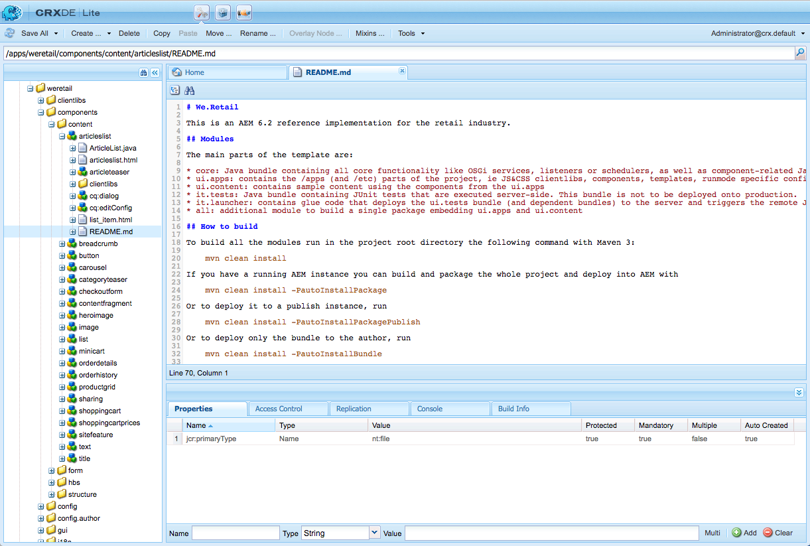

# 开发AEM组件{#developing-aem-components}

AEM组件用于保留、格式化和呈现网页上可用的内容。

* 在[创作页面](/help/sites-authoring/default-components.md)时，组件允许作者编辑和配置内容。

   * 在构建[Commerce](/help/commerce/cif-classic/administering/ecommerce.md)站点时，组件可以从目录中收集和呈现信息。
有关详细信息，请参阅[开发电子商务](/help/commerce/cif-classic/developing/ecommerce.md)。

   * 在构建[社区](/help/communities/author-communities.md)站点时，组件可以为访客提供信息并从中收集信息。
有关详细信息，请参阅[开发社区](/help/communities/communities.md)。

* 在发布实例上，组件渲染您的内容，根据需要向网站访客呈现内容。

>[!NOTE]
>
>此页面是文档[AEM组件 — 基础知识](/help/sites-developing/components-basics.md)的延续。

>[!CAUTION]
>
>`/libs/cq/gui/components/authoring/dialog`下的组件只能在编辑器（创作中的组件对话框）中使用。 如果在其他位置（例如，在向导对话框中）使用它们，它们可能无法按预期运行。

## 代码示例 {#code-samples}

本页提供了为AEM开发新组件所需的参考文档（或参考文档的链接）。 有关一些实际示例，请参阅[开发AEM组件 — 代码示例](/help/sites-developing/developing-components-samples.md)。

## 结构 {#structure}

组件基本结构在[AEM组件 — 基础知识](/help/sites-developing/components-basics.md#structure)页面上介绍。 该文档涵盖了触屏界面和经典UI。 即使您不需要在新组件中使用经典设置，也可以在继承现有组件时了解这些设置。

## 扩展现有组件和对话框 {#extending-existing-components-and-dialogs}

根据您要实施的组件，可能会扩展或自定义现有实例，而不是从头开始定义和开发整个[结构](#structure)。

扩展或自定义现有组件或对话框时，您可以在进行更改之前复制或复制整个结构或对话框所需的结构。

### 扩展现有组件 {#extending-an-existing-component}

可以使用[资源类型层次结构](/help/sites-developing/components-basics.md#component-hierarchy-and-inheritance)和相关继承机制扩展现有组件。

>[!NOTE]
>
>组件还可以通过基于搜索路径逻辑的覆盖来重新定义。 但是，在这种情况下，不会触发[Sling资源合并器](/help/sites-developing/sling-resource-merger.md)，并且`/apps`必须定义整个叠加。

>[!NOTE]
>
>[内容片段组件](/help/sites-developing/customizing-content-fragments.md)也可以自定义和扩展，但必须考虑完整结构和与Assets的关系。

### 自定义现有组件对话框 {#customizing-a-existing-component-dialog}

也可以使用[Sling资源合并器](/help/sites-developing/sling-resource-merger.md)并定义属性`sling:resourceSuperType`来覆盖&#x200B;*组件对话框*。

这意味着您只需要重新定义所需的差异，而不是重新定义整个对话框（使用`sling:resourceSuperType`）。 现在，推荐使用此方法来扩展组件对话框

有关详细信息，请参阅[Sling资源合并器](/help/sites-developing/sling-resource-merger.md)。

## 定义标记 {#defining-the-markup}

您的组件将使用[HTML](https://www.w3schools.com/htmL/html_intro.asp)呈现。 您的组件需要定义所需的HTML，以便在创作和发布环境中获取所需的内容，然后根据需要进行渲染。

### 使用HTML模板语言 {#using-the-html-template-language}

随AEM 6.0引入的[HTML模板语言(HTL)](https://experienceleague.adobe.com/docs/experience-manager-htl/content/overview.html?lang=zh-Hans)取代了JSP (JavaServer Pages)，成为适用于HTML的首选和推荐的服务器端模板系统。 对于需要构建强大企业网站的Web开发人员，HTL有助于提高安全性和开发效率。

>[!NOTE]
>
>尽管HTL和JSP都可以用于开发组件，但我们在此页面上将演示使用HTL进行开发，因为它是适用于AEM的推荐脚本语言。

## 开发内容逻辑 {#developing-the-content-logic}

此可选逻辑选择和/或计算要呈现的内容。 它通过适当的Use-API模式从HTL表达式调用。

从外观中分离逻辑的机制有助于阐明对给定视图的调用。 它还允许对同一资源的不同视图使用不同的逻辑。

### 使用Java {#using-java}

[HTL Java Use-API允许HTL文件访问自定义Java类中的Helper方法](https://experienceleague.adobe.com/docs/experience-manager-htl/content/java-use-api.html?lang=zh-Hans)。 这使您能够使用Java代码实施用于选择和配置组件内容的逻辑。

### 使用JavaScript {#using-javascript}

[HTL JavaScript Use-API允许HTL文件访问使用JavaScript](https://experienceleague.adobe.com/docs/experience-manager-htl/content/java-use-api.html?lang=zh-Hans)编写的帮助程序代码。 这使您能够使用JavaScript代码实施用于选择和配置组件内容的逻辑。

### 使用客户端HTML库 {#using-client-side-html-libraries}

现代网站在很大程度上依赖于由复杂的JavaScript和CSS代码驱动的客户端处理。 组织和优化此代码的服务可能是一个复杂的问题。

为了帮助解决此问题，AEM提供了&#x200B;**客户端库文件夹**，可让您将客户端代码存储在存储库中，将其组织为不同类别并定义何时以及如何向客户端提供每种类别的代码。 然后，客户端库系统负责在最终网页中产生正确的链接，以加载正确的代码。

有关详细信息，请阅读[使用客户端HTML库](/help/sites-developing/clientlibs.md)。

## 配置编辑行为 {#configuring-the-edit-behavior}

您可以配置组件的编辑行为，包括组件可用的操作、就地编辑器的特征以及与组件上的事件相关的侦听器等属性。 尽管存在某些特定差异，但配置对于触屏优化UI和经典UI都是通用的。

通过在组件节点（类型为`cq:Component`）下添加类型为`cq:EditConfig`的`cq:editConfig`节点以及添加特定属性和子节点来配置组件的[编辑行为](/help/sites-developing/components-basics.md#edit-behavior)。

## 配置预览行为 {#configuring-the-preview-behavior}

在切换到&#x200B;**预览**&#x200B;模式时，即使页面未刷新，也会设置[WCM模式](https://developer.adobe.com/experience-manager/reference-materials/6-5/javadoc/com/day/cq/wcm/api/WCMMode.html) Cookie。

对于呈现时对WCM模式敏感的组件，需要定义它们以专门刷新自身，然后依赖Cookie的值。

>[!NOTE]
>
>在支持touch的UI中，[WCM模式](https://developer.adobe.com/experience-manager/reference-materials/6-5/javadoc/com/day/cq/wcm/api/WCMMode.html) Cookie仅使用值`EDIT`和`PREVIEW`。

## 创建和配置对话框 {#creating-and-configuring-a-dialog}

对话框用于允许作者与组件交互。 使用对话框，作者和/或管理员可以编辑内容、配置组件或定义设计参数（使用[设计对话框](#creating-and-configuring-a-design-dialog)）

### Coral用户界面和Granite用户界面 {#coral-ui-and-granite-ui}

[Coral UI](https://developer.adobe.com/experience-manager/reference-materials/6-5/coral-ui/coralui3/index.html)和[Granite UI](https://developer.adobe.com/experience-manager/reference-materials/6-5/granite-ui/api/jcr_root/libs/granite/ui/index.html)定义AEM的现代外观。

[Granite UI提供了在创作环境中创建对话框所需的大量基本组件（小组件）](https://developer.adobe.com/experience-manager/reference-materials/6-5/granite-ui/api/jcr_root/libs/granite/ui/index.html)。 如有必要，您可以扩展此选择并[创建您自己的小组件](#creatinganewwidget)。

有关完整的详细信息，请参阅：

* Coral UI

   * 在所有云解决方案中提供一致的UI
   * [AEM触屏优化UI的概念 — Coral UI](/help/sites-developing/touch-ui-concepts.md#coral-ui)
   * [Coral UI指南](https://developer.adobe.com/experience-manager/reference-materials/6-5/coral-ui/coralui3/index.html)

* Granite UI

   * 提供封装在Sling组件中的Coral UI标记，用于构建UI控制台和对话框
   * [AEM触屏优化UI的概念 — Granite UI](/help/sites-developing/touch-ui-concepts.md#coral-ui)
   * [Granite UI文档](https://developer.adobe.com/experience-manager/reference-materials/6-5/granite-ui/api/jcr_root/libs/granite/ui/index.html)

>[!NOTE]
>
>由于Granite UI组件的性质（以及ExtJS小部件的差异），组件与支持触摸的UI和[经典UI](/help/sites-developing/developing-components-classic.md)的交互方式有一些差异。

### 创建新对话框 {#creating-a-new-dialog}

触屏优化UI的对话框：

* 名为`cq:dialog`。
* 定义为设置了`sling:resourceType`属性的`nt:unstructured`节点。

* 位于其`cq:Component`节点下且位于其组件定义旁边。
* 在服务器端（作为Sling组件）根据其内容结构和`sling:resourceType`属性进行渲染。
* 使用Granite UI框架。
* 包含描述对话框中的字段的节点结构。

   * 这些节点是`nt:unstructured`，具有所需的`sling:resourceType`属性。

示例节点结构可能是：

```xml
newComponent (cq:Component)
  cq:dialog (nt:unstructured)
    content
      layout
      items
        column
          items
            file
            description
```

自定义对话框与开发组件类似，因为对话框本身是一个组件（即组件脚本渲染的标记以及客户端库提供的行为/样式）。

有关示例，请参阅：

* `/libs/foundation/components/text/cq:dialog`
* `/libs/foundation/components/download/cq:dialog`

>[!NOTE]
>
>如果组件没有为触控式UI定义对话框，则经典UI对话框会用作兼容性层中的回退。 要自定义此类对话框，您需要自定义经典UI对话框。 查看经典UI的[AEM组件](/help/sites-developing/developing-components-classic.md)。

### 自定义对话框字段 {#customizing-dialog-fields}

>[!NOTE]
>
>请参阅：
>
>* [自定义对话框字段](https://experienceleague.adobe.com/docs/experience-manager-gems-events/gems/gems2015/aem-customizing-dialog-fields-in-touch-ui.html?lang=zh-Hans)上的AEM Gems会话。
>* [代码示例 — 如何自定义对话框字段](/help/sites-developing/developing-components-samples.md#code-sample-how-to-customize-dialog-fields)中涵盖的相关示例代码。
>

#### 创建新字段 {#creating-a-new-field}

触屏UI的构件实施为Granite UI组件。

要创建用于触控式UI的组件对话框中的小组件，需要[创建Granite UI字段组件](/help/sites-developing/granite-ui-component.md)。

>[!NOTE]
>
>有关Granite UI的完整详细信息，请参阅[Granite UI文档](https://developer.adobe.com/experience-manager/reference-materials/6-5/granite-ui/api/jcr_root/libs/granite/ui/index.html)。

如果将对话框视为表单元素的简单容器，则还可以将对话框内容的主要内容视为表单字段。 创建表单字段要求您创建资源类型；这等同于创建组件。 为了帮助您完成该任务，Granite UI提供了一个通用字段组件以作为继承来源（使用`sling:resourceSuperType`）：

`/libs/granite/ui/components/coral/foundation/form/field`

更具体地说，Granite UI提供了一系列适合在对话框中使用的字段组件（或者，更一般地说，在[表单](https://developer.adobe.com/experience-manager/reference-materials/6-5/granite-ui/api/jcr_root/libs/granite/ui/components/foundation/form/index.html)中）。

>[!NOTE]
>
>这与经典UI不同，在经典UI中，构件由`cq:Widgets`个节点表示，每个节点均具有特定`xtype`以建立与其相应ExtJS构件的关系。 从实施角度来看，这些构件通过ExtJS框架在客户端呈现。

创建资源类型后，可以通过在对话框中添加新节点来实例化字段，其中属性`sling:resourceType`引用您刚刚引入的资源类型。

#### 创建用于样式和行为的客户端库 {#creating-a-client-library-for-style-and-behavior}

如果要为组件定义样式和行为，可创建一个专用的[客户端库](/help/sites-developing/clientlibs.md)来定义您的自定义CSS/LESS和JS。

若要仅为组件对话框加载客户端库（即，不会为其他组件加载该库），需要将对话框的属性`extraClientlibs`设置为您已创建的客户端库的类别名称。 如果您的客户端库非常大和/或您的字段特定于此对话框，并且其他对话框不需要执行此操作，则建议您执行此操作。

要为所有对话框加载客户端库，请将客户端库的类别属性设置为`cq.authoring.dialog`。 这是渲染所有对话框时默认包括的客户端库的类别名称。 如果客户端库较小和/或字段是通用的，并且可在其他对话框中重复使用，则需要执行此操作。

有关示例，请参阅：

* `cqgems/customizingfield/components/colorpicker/clientlibs`

   * 由[代码示例](/help/sites-developing/developing-components-samples.md#code-sample-how-to-customize-dialog-fields)提供

#### 扩展（继承）字段 {#extending-inheriting-from-a-field}

根据您的要求，您可以：

* 通过组件继承(`sling:resourceSuperType`)扩展给定的Granite UI字段
* 通过遵循构件库API（JS/CSS继承），从基础构件库（如果有Granite UI，则为Coral UI）扩展给定的构件

#### 对对话框字段的访问权限 {#access-to-dialog-fields}

您还可以使用渲染条件(`rendercondition`)来控制谁有权访问对话框中的特定选项卡/字段；例如：

```xml
+ mybutton
  - sling:resourceType = granite/ui/components/coral/foundation/button
  + rendercondition
    - sling:resourceType = myapp/components/renderconditions/group
    - groups = ["administrators"]
```

### 处理字段事件 {#handling-field-events}

在自定义客户端库[&#128279;](#listeners-in-a-custom-client-library)中通过[侦听器完成处理对话框字段上的事件的方法。 这是在内容结构](#listenersinthecontentstructureclassicui)中具有侦听器的旧方法的更改。

#### 自定义客户端库中的监听器 {#listeners-in-a-custom-client-library}

要将逻辑注入到字段中，您应：

1. 将您的字段标记为给定的CSS类（*挂钩*）。
1. 在客户端库中定义一个挂接在该CSS类名称上的JS侦听器（这可确保您的自定义逻辑仅限定在字段的范围内，而不影响同一类型的其他字段）。

要实现此目的，您需要了解要与之交互的底层构件库。 请参阅[Coral UI文档](https://developer.adobe.com/experience-manager/reference-materials/6-5/coral-ui/coralui3/index.html)，以识别您要对哪个事件做出反应。 这非常类似于过去使用ExtJS执行的流程：查找给定小部件的文档页面，然后检查其事件API的详细信息。

有关示例，请参阅：

* `cqgems/customizingfield/components/clientlibs/customizingfield`

   * 由[代码示例](/help/sites-developing/developing-components-samples.md#code-sample-how-to-customize-dialog-fields)提供

#### 内容结构中的侦听器 {#listeners-in-the-content-structure}

在使用ExtJS的经典UI中，通常内容结构中给定小组件具有侦听器。 在触屏UI中实现相同操作与内容中不再定义JS侦听器代码（或根本没有任何代码）不同。

内容结构描述了语义结构；它应该（必须）不暗示底层构件的性质。 通过在内容结构中不具有JS代码，您可以更改实施详细信息，而不必更改内容结构。 换言之，无需接触内容结构即可更改构件库。

#### 检测对话框的可用性 {#dialog-ready}

如果您有一个自定义JavaScript，只有在对话框可用并准备就绪时才需要执行，则应监听`dialog-ready`事件。

只要对话框加载（或重新加载）并准备就绪，即表示只要对话框的DOM中存在更改（创建/更新），就会触发此事件。

`dialog-ready`可用于挂接JavaScript自定义代码，该代码对对话框或类似任务中的字段执行自定义。

### 字段验证 {#field-validation}

#### 必填字段 {#mandatory-field}

要将给定字段标记为必填字段，请在字段的内容节点上设置以下属性：

* 名称：`required`
* 类型：`Boolean`

有关示例，请参阅：

```xml
/libs/foundation/components/page/cq:dialog/content/items/tabs/items/basic/items/column/items/title/items/title
```

#### 字段验证(Granite UI) {#field-validation-granite-ui}

Granite UI和Granite UI组件（等效于小组件）中的字段验证通过使用`foundation-validation` API来完成。 [有关详细信息，请参阅`foundation-valdiation` Granite文档。](https://developer.adobe.com/experience-manager/reference-materials/6-5/granite-ui/api/jcr_root/libs/granite/ui/components/coral/foundation/clientlibs/foundation/js/validation/index.html)

有关示例，请参阅：

* `cqgems/customizingfield/components/clientlibs/customizingfield/js/validations.js`

   * 由[代码示例](/help/sites-developing/developing-components-samples.md#code-sample-how-to-customize-dialog-fields)提供

* `/libs/cq/gui/components/authoring/dialog/clientlibs/dialog/js/validations.js`

## 创建和配置设计对话框 {#creating-and-configuring-a-design-dialog}

当组件具有可在[设计模式](/help/sites-authoring/default-components-designmode.md)中编辑的设计详细信息时，会提供“设计”对话框。

该定义与用于编辑内容[&#128279;](#creating-a-new-dialog)的对话框的定义非常相似，不同之处在于它被定义为节点：

* 节点名称： `cq:design_dialog`
* 类型：`nt:unstructured`

## 创建和配置就地编辑器 {#creating-and-configuring-an-inplace-editor}

就地编辑器允许用户直接在段落流中编辑内容，而无需打开对话框。 例如，标准的“文本”和“标题”组件都有一个就地编辑器。

并非每个组件类型都需要/有意义的就地编辑器。

有关详细信息，请参阅[扩展页面创作 — 添加新的就地编辑器](/help/sites-developing/customizing-page-authoring-touch.md#add-new-in-place-editor)。

## 自定义组件工具栏 {#customizing-the-component-toolbar}

通过[组件工具栏](/help/sites-developing/touch-ui-structure.md#component-toolbar)，用户可以访问组件的一系列操作，如编辑、配置、复制和删除。

有关详细信息，请参阅[扩展页面创作 — 将新操作添加到组件工具栏](/help/sites-developing/customizing-page-authoring-touch.md#add-new-action-to-a-component-toolbar)。

## 为引用边栏配置组件（借入/借出） {#configuring-a-component-for-the-references-rail-borrowed-lent}

如果新组件引用其他页面中的内容，则可以考虑是否希望它影响&#x200B;[**引用**](/help/sites-authoring/basic-handling.md#references)&#x200B;边栏的&#x200B;**借用的内容**&#x200B;和&#x200B;**借出的内容**&#x200B;部分。

现成的AEM仅检查“参照”组件。 要添加组件，您需要配置OSGi包&#x200B;**WCM创作内容引用配置**。

在定义中创建一个条目，指定组件以及要检查的属性。 例如：

`/apps/<*your-Project*>/components/reference@parentPath`

>[!NOTE]
>
>使用AEM时，可通过多种方法管理此类服务的配置设置。 有关更多详细信息和建议的做法，请参阅[配置OSGi](/help/sites-deploying/configuring-osgi.md)。

## 启用组件并将组件添加到段落系统 {#enabling-and-adding-your-component-to-the-paragraph-system}

开发组件后，需要启用该组件，以便在适当的段落系统中使用，以便在所需的页面上使用。

可以通过以下任一方式完成此操作：

* 编辑特定页面时使用[设计模式](/help/sites-authoring/default-components-designmode.md)。
* [在模板](/help/sites-developing/components-basics.md#adding-your-component-to-the-paragraph-system)的段落系统上定义`components`属性。

## 配置段落系统以便拖动资产可创建组件实例 {#configuring-a-paragraph-system-so-that-dragging-an-asset-creates-a-component-instance}

AEM提供了在页面上配置段落系统的功能，以便当用户将某个（合适的）资源拖到页面[&#128279;](/help/sites-authoring/editing-content.md#insertingacomponenttouchoptimizedui)的实例上时，可以自动创建新组件的实例（而不必始终将空组件拖到页面上）。

此行为以及所需的资产到组件关系可以配置：

1. 在页面设计的段落定义下。 例如：

   * `/etc/designs/<myApp>/page/par`

   创建节点：

   * 名称：`cq:authoring`
   * 类型：`nt:unstructured`

1. 在此下，创建一个节点以保存所有资产到组件映射：

   * 名称：`assetToComponentMapping`
   * 类型：`nt:unstructured`

1. 对于每个资产到组件的映射，请创建一个节点：

   * 名称：文本；建议名称指示资产和相关组件类型；例如，图像
   * 类型：`nt:unstructured`

   每个配置文件均具有以下属性：

   * `assetGroup`：

      * 类型：`String`
      * 值：相关资产所属的组；例如，`media`

   * `assetMimetype`：

      * 类型：`String`
      * 值：相关资产的mime类型；例如，`image/*`

   * `droptarget`：

      * 类型：`String`
      * 值：放置目标；例如，`image`

   * `resourceType`：

      * 类型：`String`
      * 值：相关的组件资源；例如，`foundation/components/image`

   * `type`：

      * 类型：`String`
      * 值：类型，例如`Images`

有关示例，请参阅：

* `/etc/designs/geometrixx/jcr:content/page/par/cq:authoring`
* `/etc/designs/geometrixx-outdoors/jcr:content/page/par/cq:authoring`
* `/etc/designs/geometrixx-media/jcr:content/article/article-content-par/cq:authoring`

GITHUB上的代码

您可以在GitHub上找到此页面的代码

* 在GitHub上[打开aem-project-archetype项目](https://github.com/adobe/aem-project-archetype)
* 将项目下载为[ZIP文件](https://github.com/adobe/aem-project-archetype/archive/master.zip)

>[!NOTE]
>
>在使用[核心组件](https://experienceleague.adobe.com/docs/experience-manager-core-components/using/introduction.html?lang=zh-Hans)和可编辑模板时，现在可以在UI中轻松配置组件实例的自动创建。 有关定义哪些组件自动与给定媒体类型关联的更多信息，请参阅[创建页面模板](/help/sites-authoring/templates.md#editing-a-template-structure-template-author)。

## 使用AEM Brackets扩展 {#using-the-aem-brackets-extension}

[AEM Brackets扩展](/help/sites-developing/aem-brackets.md)为编辑AEM组件和客户端库提供了流畅的工作流。 它基于[Brackets](https://brackets.io/)代码编辑器。

扩展：

* 简化同步（不需要Maven或File Vault）以帮助提高开发人员效率，并帮助具有有限AEM知识的前端开发人员参与项目。
* 提供一些[HTL](https://experienceleague.adobe.com/docs/experience-manager-htl/content/overview.html?lang=zh-Hans)支持，该模板语言旨在简化组件开发并提高安全性。

>[!NOTE]
>
>建议使用托架来创建元件。 它取代了为经典UI设计的“CRXDE Lite — 创建组件”功能。

## 从经典组件迁移 {#migrating-from-a-classic-component}

将设计为与经典UI一起使用的组件迁移到可与触屏UI一起使用的组件时（单独或联合），应考虑以下问题：

* HTL

   * 不强制使用[HTL](https://experienceleague.adobe.com/docs/experience-manager-htl/content/overview.html?lang=zh-Hans)，但是如果您的组件需要更新，则最好考虑将[从JSP迁移到HTL](/help/sites-developing/components-basics.md#htl-vs-jsp)。

* 组件

   * 迁移使用经典用户界面特定函数的[`cq:listener`](/help/sites-developing/developing-components.md#migrating-cq-listener-code)代码
   * RTE插件，有关详细信息，请参阅[配置富文本编辑器](/help/sites-administering/rich-text-editor.md)。
   * [迁移使用经典UI特定函数的`cq:listener`代码](#migrating-cq-listener-code)

* 对话框

   * 创建要在触屏UI中使用的对话框。 但是，出于兼容性目的，如果没有为触控式UI定义对话框，则触控式UI可以使用经典UI对话框的定义。
   * 提供[AEM现代化工具](/help/sites-developing/modernization-tools.md)是为了帮助您扩展现有组件。
   * [将ExtJS映射到Granite UI组件](/help/sites-developing/touch-ui-concepts.md#extjs-and-corresponding-granite-ui-components)可以方便地概述ExtJS xtype和节点类型及其等效的Granite UI资源类型。
   * 自定义字段，有关详细信息，请参阅[自定义对话框字段](https://experienceleague.adobe.com/docs/experience-manager-gems-events/gems/gems2015/aem-customizing-dialog-fields-in-touch-ui.html?lang=zh-Hans)上的AEM Gems会话。
   * 从vtypes迁移到[Granite UI验证](https://developer.adobe.com/experience-manager/reference-materials/6-5/granite-ui/api/jcr_root/libs/granite/ui/components/foundation/clientlibs/foundation/js/validation/index.html)
   * 使用JS侦听器，有关详细信息，请参阅[处理字段事件](#handling-field-events)和[自定义对话框字段](https://experienceleague.adobe.com/docs/experience-manager-gems-events/gems/gems2015/aem-customizing-dialog-fields-in-touch-ui.html?lang=zh-Hans)上的AEM Gems会话。

### 迁移cq：listener代码 {#migrating-cq-listener-code}

如果要迁移为经典UI设计的项目，则`cq:listener`代码（和组件相关的clientlibs）可能使用特定于经典UI的函数（如`CQ.wcm.*`）。 对于迁移，您必须使用触屏UI中的等效对象/函数更新此类代码。

如果您的项目完全迁移到触屏UI，则需要替换此类代码，才能使用与触屏UI相关的对象和函数。

但是，如果您的项目必须在迁移期间（通常情况下）同时满足经典UI和触屏UI要求，则必须实施切换以区分引用相应对象的单独代码。

此切换机制可以按如下方式实现：

```
if (Granite.author) {
    // touch UI
} else {
    // classic UI
}
```

## 记录组件 {#documenting-your-component}

作为开发人员，您希望能够轻松访问组件文档，以便快速了解：

* 描述
* 预期用途
* 内容结构和属性
* 公开的API和扩展点
* 等等

因此，您可以轻松地在组件本身中使用任何现有的文档标记。

在组件结构中放置`README.md`文件。 此标记显示在[组件控制台](/help/sites-authoring/default-components-console.md)中。



支持的Markdown与[内容片段](/help/assets/content-fragments/content-fragments-markdown.md)相同。
