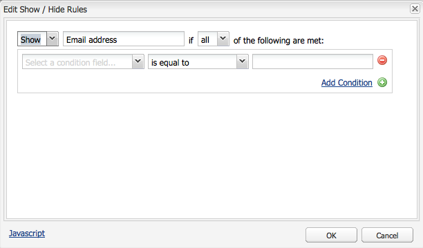

# 开发Forms（经典UI）{#developing-forms-classic-ui}

表单的基本结构为：

* 表单开始
* 表单元素
* 表单结尾

所有这些都是通过一系列默认[表单组件](/help/sites-authoring/default-components.md#form)实现的，这些组件在标准AEM安装中可用。

除了[开发新组件](/help/sites-developing/developing-components-samples.md)以在表单上使用外，您还可以：

* [使用值预加载表单](#preloading-form-values)
* [预加载（某些）具有多个值的字段](#preloading-form-fields-with-multiple-values)
* [开发新操作](#developing-your-own-form-actions)
* [制定新的限制](#developing-your-own-form-constraints)
* [显示或隐藏特定表单字段](#showing-and-hiding-form-components)

[在必要时使用脚本](#developing-scripts-for-use-with-forms)扩展功能。

>[!NOTE]
>
>本文档重点介绍如何在经典UI中使用[Foundation组件](/help/sites-authoring/default-components-foundation.md)来开发表单。 Adobe建议在触屏UI中使用新的[核心组件](https://experienceleague.adobe.com/docs/experience-manager-core-components/using/introduction.html?lang=zh-Hans)和[隐藏条件](/help/sites-developing/hide-conditions.md)进行表单开发。

## 预载表单值 {#preloading-form-values}

表单开始组件为&#x200B;**加载路径**&#x200B;提供了一个字段，该路径是指向存储库中的节点的可选路径。

加载路径是指向节点属性的路径，节点属性用于将预定义值加载到表单上的多个字段中。

这是一个可选字段，用于指定存储库中节点的路径。 当此节点具有匹配字段名称的属性时，表单上的相应字段将预加载这些属性的值。 如果不存在匹配项，则字段包含默认值。

>[!NOTE]
>
>[表单操作](#developing-your-own-form-actions)还可以设置从中加载初始值的资源。 使用`init.jsp`中的`FormsHelper#setFormLoadResource`完成此操作。
>
>仅当未设置时，作者才会从开始表单组件中设置的路径填充表单。

### 预载具有多个值的表单字段 {#preloading-form-fields-with-multiple-values}

各种表单字段也具有&#x200B;**项加载路径**，同样是指向存储库中节点的可选路径。

**项加载路径**&#x200B;是节点属性的路径，用于将预定义值加载到表单上的该特定字段中，例如[下拉列表](/help/sites-authoring/default-components-foundation.md#dropdown-list)、[复选框组](/help/sites-authoring/default-components-foundation.md#checkbox-group)或[单选按钮组](/help/sites-authoring/default-components-foundation.md#radio-group)。

#### 示例 — 预载具有多个值的下拉列表 {#example-preloading-a-dropdown-list-with-multiple-values}

可以使用您选择的值范围配置下拉列表。

**项目加载路径**&#x200B;可用于访问存储库中文件夹的列表，并将这些文件夹预加载到字段中：

1. 创建sling文件夹(`sling:Folder`)
例如，`/etc/designs/<myDesign>/formlistvalues`

1. 添加多值字符串(`String[]`)类型的新属性（例如`myList`）以包含下拉项列表。 内容也可以使用脚本导入，例如通过JSP脚本或shell脚本中的cURL导入。

1. 在&#x200B;**项加载路径**字段中使用完整路径：
例如，`/etc/designs/geometrixx/formlistvalues/myList`

请注意，如果`String[]`中的值采用如下格式：

* `AL=Alabama`
* `AK=Alaska`

依此类推，AEM将生成以下列表：

* `<option value="AL">Alabama</option>`
* `<option value="AK">Alaska</option>`

例如，可以在多语言设置中很好地使用此功能。

### 开发自己的表单操作 {#developing-your-own-form-actions}

表单需要操作。 操作定义随用户数据提交表单时执行的操作。

标准AEM安装中提供了各种操作，可在以下位置查看：

`/libs/foundation/components/form/actions`

在&#x200B;**表单**&#x200B;组件的&#x200B;**操作类型**&#x200B;列表中：

本节介绍如何开发您自己的表单操作以包含在此列表中。

您可以在`/apps`下添加自己的操作，如下所示：

1. 创建类型为`sling:Folder`的节点。 指定可反映要实施的操作的名称。

   例如：

   `/apps/myProject/components/customFormAction`

1. 在此节点上定义以下属性，然后单击&#x200B;**全部保存**&#x200B;以保留更改：

   * `sling:resourceType` — 设置为`foundation/components/form/action`

   * `componentGroup` — 定义为`.hidden`

   * 可选：

      * `jcr:title` — 指定您选择的标题，该标题将显示在下拉选择列表中。 如果未设置，则会显示节点名称

      * `jcr:description` — 输入您选择的描述

1. 在文件夹中创建对话框节点：

   1. 添加字段，以便在选择操作后，作者可以编辑表单对话框。

1. 在文件夹中，创建：

   1. 后脚本。
脚本的名称为`post.POST.<extension>`，例如`post.POST.jsp`
在提交表单以处理表单时调用后脚本，该后脚本包含用于处理表单`POST`中到达的数据的代码。

   1. 添加在提交表单时调用的转发脚本。
脚本的名称为`forward.<extension`>，例如`forward.jsp`
此脚本可以定义路径。 然后，当前请求将转发到指定的路径。

   必要的调用是`FormsHelper#setForwardPath`（2个变量）。 典型的情况是执行一些验证或逻辑以查找目标路径，然后转发到该路径，让默认的SlingPOSTservlet实际在JCR中存储。

   可能还会有另一个servlet执行实际处理，在这种情况下，表单操作和`forward.jsp`将仅用作“粘贴”代码。 `/libs/foundation/components/form/actions/mail`上的邮件操作就是这方面的例子，该操作将详细信息转发到邮件servlet所在的`<currentpath>.mail.html`。

   因此：

   * `post.POST.jsp`对于完全由操作本身完成的小型操作非常有用
   * 而`forward.jsp`在只需要委派时很有用。

   脚本的执行顺序为：

   * 在呈现表单(`GET`)时：

      1. `init.jsp`
      1. 对于所有字段的约束： `clientvalidation.jsp`
      1. 表单的validationRT： `clientvalidation.jsp`
      1. 表单通过加载资源加载（如果设置）
      1. 在渲染`<form></form>`内部时`addfields.jsp`

   * 处理表单`POST`时：

      1. `init.jsp`
      1. 对于所有字段的约束： `servervalidation.jsp`
      1. 表单的validationRT： `servervalidation.jsp`
      1. `forward.jsp`
      1. 如果设置了转发路径(`FormsHelper.setForwardPath`)，则转发请求，然后调用`cleanup.jsp`

      1. 如果未设置转发路径，则调用`post.POST.jsp`（在此结束，未调用`cleanup.jsp`）

1. 再次在文件夹中（可选）添加：

   1. 用于添加字段的脚本。
脚本的名称为`addfields.<extension>`，例如`addfields.jsp`
在写入表单起始HTML后立即调用`addfields`脚本。 这允许操作在表单中添加自定义输入字段或其他此类HTML。

   1. 初始化脚本。
脚本的名称为`init.<extension>`，例如`init.jsp`
此脚本在渲染表单时调用。 它可用于初始化操作细节。

   1. 清理脚本。
脚本的名称为`cleanup.<extension>`，例如`cleanup.jsp`
此脚本可用于执行清理。

1. 在Parsys中使用&#x200B;**Forms**&#x200B;组件。 **操作类型**&#x200B;下拉列表现在将包含您的新操作。

   >[!NOTE]
   >
   >要查看属于产品一部分的默认操作，请执行以下操作：
   >
   >
   >`/libs/foundation/components/form/actions`

### 开发您自己的表单限制 {#developing-your-own-form-constraints}

可在两个级别施加约束：

* 对于[单个字段（请参阅以下过程）](#constraints-for-individual-fields)
* 作为[表单全局验证](#form-global-constraints)

#### 单个字段的约束 {#constraints-for-individual-fields}

您可以为单个字段（`/apps`下）添加自己的约束，如下所示：

1. 创建类型为`sling:Folder`的节点。 指定反映要实施的约束的名称。

   例如：

   `/apps/myProject/components/customFormConstraint`

1. 在此节点上定义以下属性，然后单击&#x200B;**全部保存**&#x200B;以保留更改：

   * `sling:resourceType` — 设置为`foundation/components/form/constraint`

   * `constraintMessage` — 在提交表单时，如果字段无效，根据约束，将显示自定义消息

   * 可选：

      * `jcr:title` — 指定您选择的标题，该标题将显示在选择列表中。 如果未设置，则会显示节点名称
      * `hint` — 用户有关如何使用字段的其他信息

1. 在此文件夹内，可能需要以下脚本：

   * 客户端验证脚本：
脚本的名称为`clientvalidation.<extension>`，例如`clientvalidation.jsp`
在渲染表单字段时会调用此项。 它可用于创建客户端javascript，以验证客户端上的字段。

   * 服务器验证脚本：
脚本的名称为`servervalidation.<extension>`，例如`servervalidation.jsp`
在提交表单时会调用此方法。 提交字段后，可使用该字段验证服务器上的字段。

>[!NOTE]
>
>示例约束可见于：
>
>`/libs/foundation/components/form/constraints`

#### 表单全局约束 {#form-global-constraints}

通过在起始表单组件(`validationRT`)中配置资源类型来指定表单全局验证。 例如：

`apps/myProject/components/form/validation`

然后，您可以定义：

* `clientvalidation.jsp` — 插入到字段的客户端验证脚本之后
* 和`servervalidation.jsp` — 也在`POST`上的各个字段服务器验证后调用。

### 显示和隐藏表单组件 {#showing-and-hiding-form-components}

您可以根据表单中其他字段的值配置表单以显示或隐藏表单组件。

仅在特定条件下需要表单字段时，更改该字段的可见性很有用。 例如，在反馈表单上，系统会询问客户是否希望通过电子邮件将产品信息发送给他们。 选择“是”后，系统将显示一个文本字段，以便客户键入其电子邮件地址。

使用&#x200B;**编辑显示/隐藏规则**&#x200B;对话框指定显示或隐藏表单组件的条件。

使用对话框顶部的字段指定以下信息：

* 指定隐藏或显示组件的条件。
* 显示或隐藏组件时，需要为任意或全部条件是否为true。

一个或多个条件将显示在这些字段下方。 条件会将另一个表单组件（位于同一表单上）的值与一个值进行比较。 如果字段中的实际值满足条件，则条件的计算结果为true。 条件包括以下信息：

* 测试的表单字段的标题。
* 运算符。
* 将对照值与字段值进行比较。

例如，标题为`Receive email notifications?`* *的单选按钮组组件包含`Yes`和`No`单选按钮。 标题为`Email Address`的文本字段组件使用以下条件，以便在选择`Yes`时可见：

在JavaScript中，条件使用元素名称属性的值来引用字段。 在上一个示例中，单选按钮组组件的Element Name属性是`contact`。 以下代码与该示例中的等效JavaScript代码：

`((contact == "Yes"))`

**显示或隐藏表单组件：**

1. 编辑特定的表单组件。

1. 选择&#x200B;**显示/隐藏**&#x200B;以打开&#x200B;**编辑显示/隐藏规则**&#x200B;对话框：

   * 在第一个下拉列表中，选择&#x200B;**显示**&#x200B;或&#x200B;**隐藏**，以指定您的条件决定是显示还是隐藏组件。

   * 在顶行末尾的下拉列表中，选择：

      * **all** — 如果所有条件都必须为true才能显示或隐藏组件
      * **any** — 如果只有一个或多个条件必须为true才能显示或隐藏组件

   * 在条件行（默认显示一个）中，选择组件、运算符，然后指定一个值。
   * 如果需要，通过单击&#x200B;**添加条件**&#x200B;添加更多条件。

   例如：

   

1. 单击&#x200B;**确定**&#x200B;保存定义。

1. 保存定义后，表单组件属性中的&#x200B;**显示/隐藏**&#x200B;选项旁边将显示&#x200B;**编辑规则**&#x200B;链接。 单击此链接可打开&#x200B;**编辑显示/隐藏规则**&#x200B;对话框以进行更改。

   单击&#x200B;**确定**&#x200B;以保存所有更改。

   

   >[!CAUTION]
   >
   >“显示/隐藏”定义的效果可以显示和测试：
   >
   >* 在创作环境的&#x200B;**预览**&#x200B;模式下（首次切换到预览时需要重新加载页面）
   >
   >* 在发布环境中

#### 处理损坏的组件引用 {#handling-broken-component-references}

显示/隐藏条件使用Element Name属性的值引用表单中的其他组件。 当任何条件引用的组件被删除或元素名称属性被更改时，显示/隐藏配置无效。 发生这种情况时，您需要手动更新条件，否则在加载表单时出现错误。

当显示/隐藏配置无效时，该配置仅作为JavaScript代码提供。 编辑代码以更正问题。该代码使用最初用于引用组件的Element Name属性。

### 开发脚本以用于Forms {#developing-scripts-for-use-with-forms}

有关编写脚本时可以使用的API元素的更多信息，请参阅与表单相关的[javadocs](https://helpx.adobe.com/experience-manager/6-5/sites/developing/using/reference-materials/javadoc/com/day/cq/wcm/foundation/forms/package-summary.html)。

您可以将此用于操作，例如在提交表单之前调用服务，并在服务失败时取消服务：

* 定义验证资源类型
* 包含用于验证的脚本：

   * 在JSP中，调用Web服务并创建包含错误消息的`com.day.cq.wcm.foundation.forms.ValidationInfo`对象。 如果出现错误，将不会发布表单数据。
