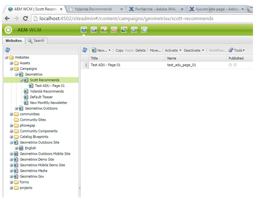

# 创建自定义扩展{#creating-custom-extensions}

通常，在实施项目时，您在AEM和Adobe Campaign中都有自定义代码。 通过使用现有API，您可以在Adobe Campaign中从AEM或从AEM调用自定义代码至Adobe Campaign。 本文档介绍了如何做到这一点。

## 前提条件 {#prerequisites}

您需要安装以下软件：

* Adobe Experience Manager
* Adobe Campaign 6.1

See [Integrating AEM with Adobe Campaign 6.1](/help/sites-administering/campaignonpremise.md) for more information.

## 示例1:AEM到Adobe Campaign {#example-aem-to-adobe-campaign}

AEM与Campaign之间的标准集成基于JSON和JSSP（JavaScript服务器页）。 这些JSSP文件位于“营销活动”控制台中，所有JSSP文件都以 **amc** (Adobe Marketing Cloud)开头。


>[!NOTE]
>
>[有关此示例，请参阅Geometrixx](/help/sites-developing/we-retail.md)，可从“包共享”中获取该示例。

在此示例中，我们创建一个新的自定义JSSP文件，并从AEM端调用该文件以检索结果。 例如，这可用于从Adobe Campaign检索数据或将数据保存到Adobe Campaign中。

1. 在Adobe Campaign中，要创建新的JSSP文件，请单击“新 **建** ”图标。

   

1. 输入此JSSP文件的名称。 在此示例中，我们使 **用cus:custom.jssp** (这意味着它将位于 **cus命名空间中** )。

   

1. 将以下代码放入jssp-file中：

   ```
   <%
   var origin = request.getParameter("origin");
   document.write("Hello from Adobe Campaign, origin : " + origin);
   %>
   ```

1. 保存您的作品。 其余工作在AEM中。
1. 在AEM端创建一个简单的servlet以调用此JSSP。 在本例中，我们假定：

   * 您的AEM与Campaign之间的连接正常工作
   * 系列活动云服务在 **/content/geometrixx-outdoors上配置**
   此示例中最重要的对象是 **GenericCampaignConnector**，它允许您在Adobe Campaign端调用（获取和发布）jssp文件。

   以下是一个小的代码片断：

   ```
   @Reference
   private GenericCampaignConnector campaignConnector;
   ...
   Map<String, String> params = new HashMap<String, String>();
   params.put("origin", "AEM");
   CallResults results = campaignConnector.callGeneric("/jssp/cus/custom.jssp", params, credentials);
   return results.bodyAsString();
   ```

1. 正如您在本例中看到的，您需要将凭据传入调用。 您可以通过getCredentials()方法获取此信息，在该方法中，您可以传递已配置Campaign云服务的页面。

   ```xml
   // page containing the cloudservice for Adobe Campaign
   Configuration config = campaignConnector.getWebserviceConfig(page.getContentResource().getParent());
   CampaignCredentials credentials = campaignConnector.retrieveCredentials(config);
   ```

完整代码如下：

```java
import java.io.IOException;
import java.io.PrintWriter;
import java.util.HashMap;
import java.util.Map;

import javax.servlet.ServletException;

import org.apache.felix.scr.annotations.Reference;
import org.apache.felix.scr.annotations.sling.SlingServlet;
import org.apache.sling.api.SlingHttpServletRequest;
import org.apache.sling.api.SlingHttpServletResponse;
import org.apache.sling.api.servlets.SlingSafeMethodsServlet;
import org.slf4j.Logger;
import org.slf4j.LoggerFactory;

import com.day.cq.mcm.campaign.CallResults;
import com.day.cq.mcm.campaign.CampaignCredentials;
import com.day.cq.mcm.campaign.GenericCampaignConnector;
import com.day.cq.wcm.api.Page;
import com.day.cq.wcm.api.PageManager;
import com.day.cq.wcm.api.PageManagerFactory;
import com.day.cq.wcm.webservicesupport.Configuration;

@SlingServlet(paths="/bin/campaign", methods="GET")
public class CustomServlet extends SlingSafeMethodsServlet {

 private final Logger log = LoggerFactory.getLogger(this.getClass());

 @Reference
 private GenericCampaignConnector campaignConnector;

 @Reference
 private PageManagerFactory pageManagerFactory;

 @Override
 protected void doGet(SlingHttpServletRequest request,
   SlingHttpServletResponse response) throws ServletException,
   IOException {

  PageManager pm = pageManagerFactory.getPageManager(request.getResourceResolver());

  Page page = pm.getPage("/content/geometrixx-outdoors");

  String result = null;
  if ( page != null) {
   result = callCustomFunction(page);
  }
  if ( result != null ) {
   PrintWriter pw = response.getWriter();
   pw.print(result);
  }
 }

 private String callCustomFunction(Page page ) {
  try {
   Configuration config = campaignConnector.getWebserviceConfig(page.getContentResource().getParent());
   CampaignCredentials credentials = campaignConnector.retrieveCredentials(config);

   Map<String, String> params = new HashMap<String, String>();
   params.put("origin", "AEM");
   CallResults results = campaignConnector.callGeneric("/jssp/cus/custom.jssp", params, credentials);
   return results.bodyAsString();
  } catch (Exception e ) {
   log.error("Something went wrong during the connection", e);
  }
  return null;

 }

}
```

## 示例2:Adobe Campaign到AEM {#example-adobe-campaign-to-aem}

AEM提供开箱即用的API，用于检索siteadmin explorer视图中任意位置的可用对象。



>[!NOTE]
>
>[有关此示例，请参阅Geometrixx](/help/sites-developing/we-retail.md)，可从“包共享”中获取该示例。

对于资源管理器中的每个节点，都有一个与其链接的API。 例如，节点：

* [http://localhost:4502/siteadmin#/content/campaigns/geometrixx/scott-recommends](http://localhost:4502/siteadmin#/content/campaigns/geometrixx/scott-recommends)

api是：

* [http://localhost:4502/content/campaigns/geometrixx/scott-recommends.1.json](http://localhost:4502/content/campaigns/geometrixx/scott-recommends.2.json)

URL **.1.** .json的结尾可以替换为 **.2.json**、 **.3.json**，具体取决于您想获取的所有子级数。要获取这些子级数，可以使用关键字 **** infinityJson:

* [http://localhost:4502/content/campaigns/geometrixx/scott-recommends.infinity.json](http://localhost:4502/content/campaigns/geometrixx/scott-recommends.2.json)

现在，要使用API，我们必须知道，默认情况下，AEM使用基本身份验证。

名为amcIntegration.js **** 的JS库在6.1.1（内部版本8624及更高版本）中可用，可在其他几个库中实现该逻辑。

### AEM API调用 {#aem-api-call}

```java
loadLibrary("nms:amcIntegration.js");

var cmsAccountId = sqlGetInt("select iExtAccountId from NmsExtAccount where sName=$(sz)","aemInstance")
var cmsAccount = nms.extAccount.load(String(cmsAccountId));
var cmsServer = cmsAccount.server;

var request = new HttpClientRequest(cmsServer+"/content/campaigns/geometrixx.infinity.json")
aemAddBasicAuthentication(cmsAccount, request);
request.method = "GET"
request.header["Content-Type"] = "application/json; charset=UTF-8";
request.execute();
var response = request.response;
```

